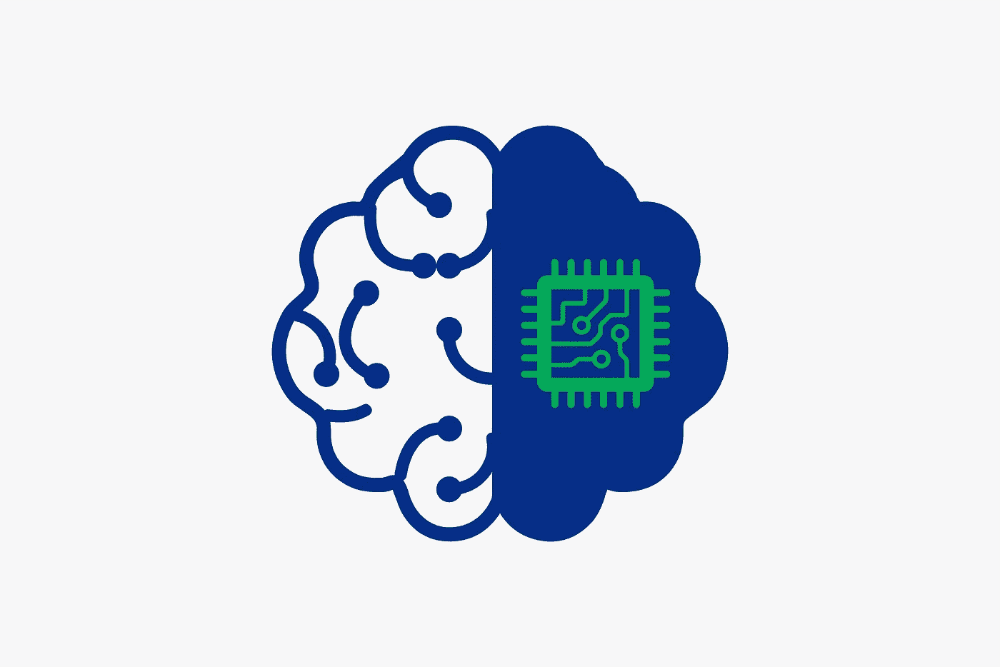
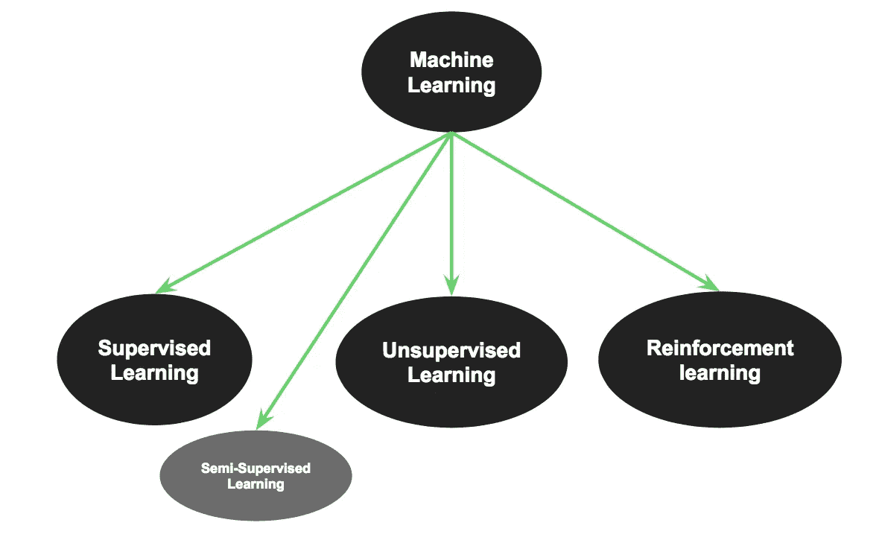
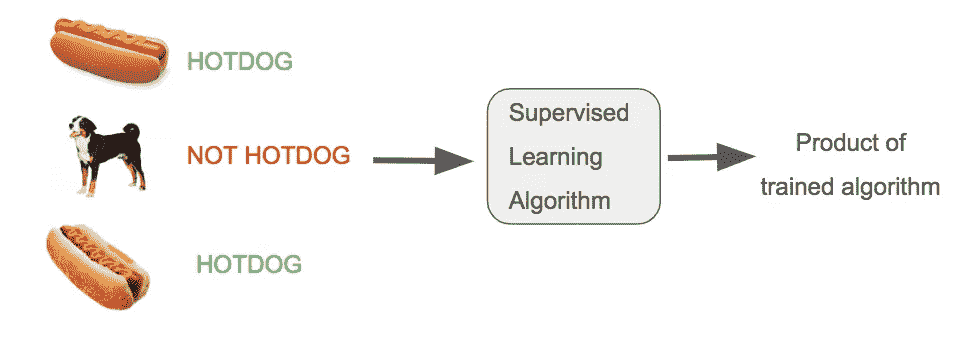
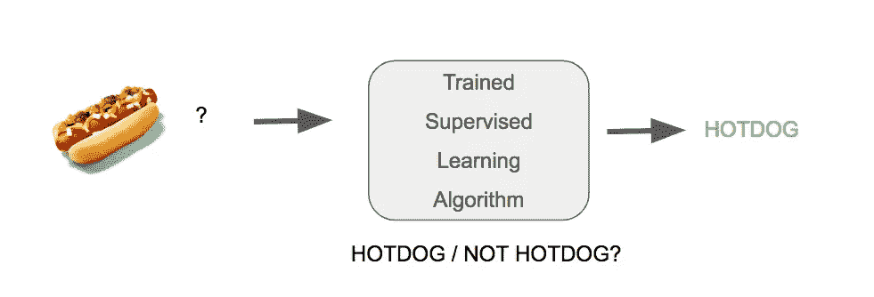

# 机器学习简介—第 1 课

> 原文：<https://medium.datadriveninvestor.com/introduction-to-machine-learning-session-1-375a40458da7?source=collection_archive---------19----------------------->

在这节课中，我将向你们介绍机器学习的概念。我们会学习机器学习的背景，会看到一些浅层学习 ML (machine learning)的浅层学习，会深入去窥视深度学习。

# 那么，什么是机器学习呢？

> 机器学习是一种人工智能(AI)，它为计算机提供了学习能力，而无需显式编程。机器学习专注于开发当暴露于新数据时可以改变的计算机程序。
> ——维基皮拉

基本上，机器学习是指程序根据它得到的输入(训练)而不是编写的代码进行改变。过去，我们使用基于规则的编程，当这种情况发生时，使用规则库系统，代码保持静态不变，但程序保持静态，也不需要机器学习所需的“训练”阶段。

# 术语

*   **特征—** 被观察现象的个体可测量属性。
*   **样本—** 样本是要处理的项目(例如分类)。它可以是一个文档、一张图片、一个声音、一段视频、数据库中的一行或 CSV 文件，或者任何你可以用一组固定的数量特征来描述的东西。
*   **特征向量—** 表示某个对象(CSV 文件中的一行)的 n 维数字特征向量。
*   **特征提取—
    1 .**特征向量的准备。
    2。将高维空间中的数据转换到一个维数较少的空间。
*   **训练/进化集—** 发现潜在预测关系的数据集。

# 使用案例

1.  垃圾邮件检测
2.  语言翻译
3.  拼写检查器

4.图像搜索

5.亚马逊推荐(聚类)

6.人脸检测

7.欺诈检测

8.决策制定(例如:银行/保险部门)

越来越多越来越多。

The Machine Learning “Tree”

# 监督学习

从**标记的训练数据**推断函数的机器学习任务

假设我们有这种狗和热狗的图片数据，每个图片数据都有一个标签，标明它是不是热狗。(图片数据可以是从图片中提取的特征，如颜色、形状、速度等等)

我们用标记的所有输入数据训练我们的监督模型，该模型正在学习什么最好地定义热狗，什么特征和什么“水平”的组合是热狗，什么不是。

当我们完成训练阶段时，我们的模型就可以预测数据是否是热狗的数据。

我们没有向模型发送与标签数据(没有标签)具有相同特征的未标签数据，并询问机器这是否是热狗？

# 下次

在第二节课中，我们将从无监督学习，强化学习开始，我将向你展示一些机器学习的框架和技术。

直到下次，享受阅读:)并且不要忘记鼓掌…它是免费的:)