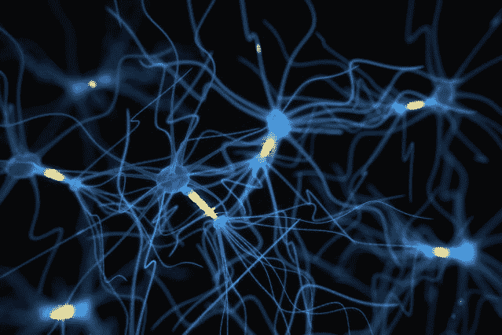
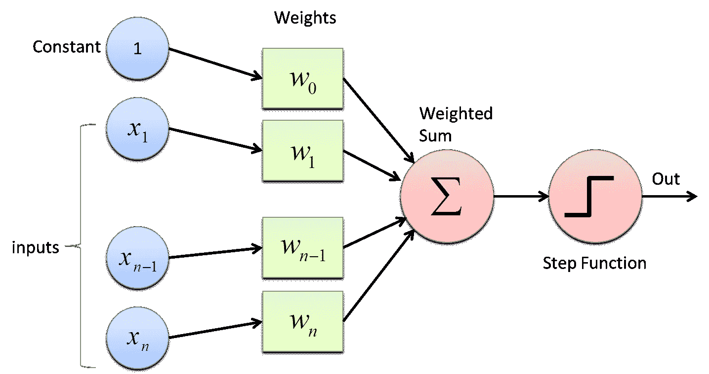
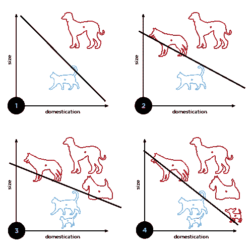
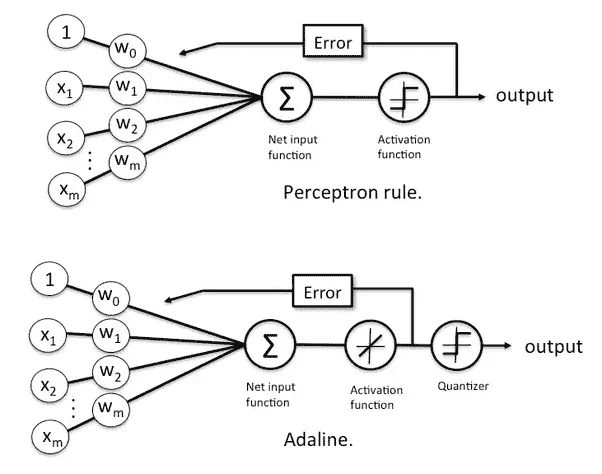
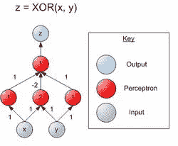

# 神经网络导论

> 原文：<https://medium.datadriveninvestor.com/introduction-to-neural-networks-a0fe9ec0a947?source=collection_archive---------2----------------------->

首先，神经元是大脑的基本单位，它帮助将信息从一个神经细胞传递到另一个神经细胞。

主要零件:

*   突触:一种允许神经元(或神经细胞)将电信号或化学信号传递给另一个神经元的结构
*   轴突:神经细胞或神经元的细长突起，通常传导电脉冲
*   树突:神经细胞的延伸，将从其他神经细胞接收的电化学刺激传播到细胞体

Basic structure of a neuron

它是怎么做到的？神经元是可兴奋的，并产生称为动作电位或神经冲动或尖峰的事件。现在，这些神经冲动是大脑的基本流通，有几个原因，

1.  让神经元能够互相交流
2.  对于要执行的计算
3.  对于要传输的信息

神经元从发出电信号开始，引发连锁反应。路径上的每一个神经元都接收信号，并将其传递给下一个神经元。然后，树突接收到脉冲，并将信息发送给轴突，轴突再将信息传递给下一个神经元

Multiple neurons transmitting message or nerve impulses to each other.

一旦信息击中目标(如肌肉)，神经递质就会受到刺激，并导致信息所发送的动作。

上述过程中最有趣的部分是，所有这一切发生在大约 7 毫秒内。

# **人工神经元**

1957 年，随着技术的出现，美国心理学家弗兰克·罗森布拉特博士致力于研究 [**感知器**](https://en.wikipedia.org/wiki/Perceptron) **，**一种电子大脑，它根据实际大脑的生物学原理工作，并显示出学习能力。它最初是在康奈尔航空实验室的 IBM 704 计算机上模拟的。

如果举起一个三角形，感知器的眼睛会拾取图像，并沿着一系列随机的线将其传送到反应单元，图像在那里被记录。它能区分猫和狗，尽管它不能分辨狗是在猫的左边还是右边。

单层感知器被发现在将一组连续值的输入分类为两类中的一类时是有用的。感知器计算输入的加权和，减去一个阈值，并将两个可能值中的一个作为结果输出。然而，感知器无法解决不是线性可分的问题。Minsky 和 Papert 在 1969 年发现了感知器的这种局限性。

1959 年，斯坦福大学的伯纳德·维德罗和马尔西安·霍夫开发了他们称之为 **ADALINE** 和 **MADALINE** 的模型。这些模型因使用多种 *ADA* 感受性 *LIN* 耳朵元素而得名。MADALINE 是第一个应用于现实世界问题的神经网络。这是一种自适应滤波器，可以消除电话线上的回声。这种神经网络仍在商业使用。学习过程基于通过比较网络响应和最佳(正确)响应产生的误差信号。如果误差(计算为加法器和参考开关之间的差值)大于零，则所有增益都将朝着降低误差幅度的方向修改

**多层感知器**

可以通过引入多层感知器来克服所识别的线性可分性限制。

two-layer neural network capable of calculating XOR

神经元内的数字代表每个神经元的显式阈值(可以将其分解，以便所有神经元具有相同的阈值，通常为 1)。标注箭头的数字代表输入的权重。这个网络假设如果没有达到阈值，则输出零(不是-1)。注意，输入的底层并不总是被认为是真正的神经网络层。

# **参考文献:**

1.  [http://www.cs.ucc.ie/~adrian/cs5201/NeuralComputingI.htm](http://www.cs.ucc.ie/~adrian/cs5201/NeuralComputingI.htm)
2.  [https://www.newyorker.com/magazine/1958/12/06/rival-2](https://www.newyorker.com/magazine/1958/12/06/rival-2)
3.  [http://www . psych . utoronto . ca/users/rein gold/courses/ai/cache/neural 4 . html](http://www.psych.utoronto.ca/users/reingold/courses/ai/cache/neural4.html)