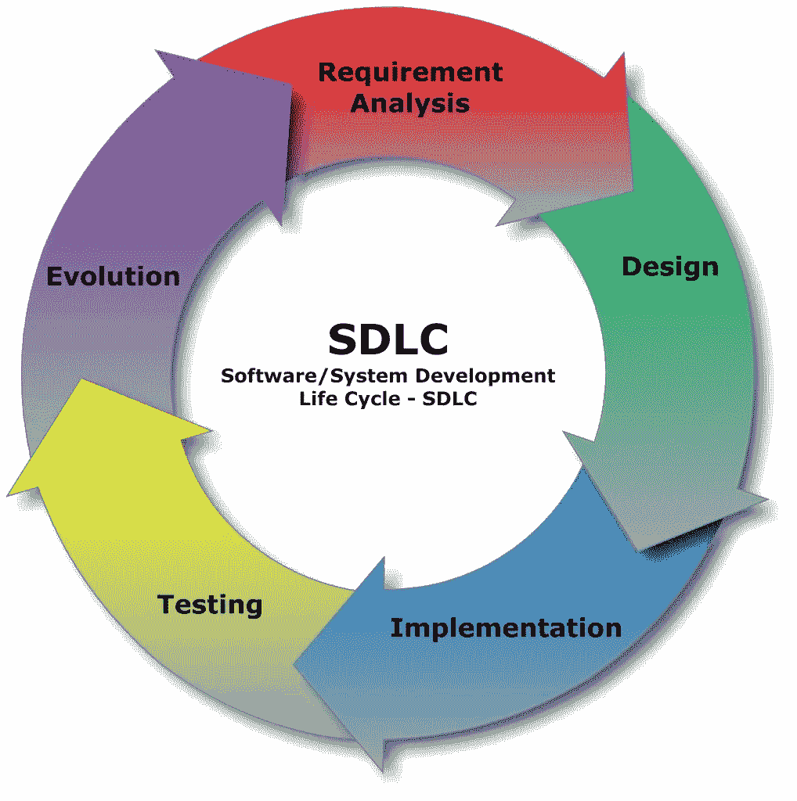

# 技术角色介绍

> 原文：<https://medium.datadriveninvestor.com/introduction-to-technology-roles-ac544a1f6a36?source=collection_archive---------61----------------------->

> 只有 17000 个三个字母的缩写。保罗·鲍丁

我女儿最近说，她妈妈用很多首字母缩写词来描述她在金融服务业的工作。她说，对于不在那个行业工作的人来说，这非常令人困惑。我说大部分行业都是这样的。当我们讨论技术角色和实际的技术本身时，技术也没有什么不同。当我与刚开始从事技术人员工作的人一起工作时，他们似乎不得不喝消防水管里的水。许多公司把它们扔进去，希望它们能马上变得有效率。

为了澄清这一点，让我们试着勾勒出高层次上正在发生的事情。首先，我想从软件开发生命周期开始讨论开发方面。然后，我们可以回顾属于该领域的开发角色。最后，我想谈谈运营角色以及他们如何支持组织。

# SDLC

我喜欢从软件开发生命周期开始，帮助人们理解团队如何一起工作来生产软件。在这个过程中，每个角色都很重要，并且在每一步都要完成不同的任务。这五个单独步骤的大纲显示了每个步骤需要什么。

需求分析——收集需求并与利益相关者交流

设计—设置初始设计并讨论因素和限制

实施—开发满足需求和设计的解决方案

测试—评估缺陷的变化

进化—安装和监控解决方案

# 发展角色

软件开发团队由许多角色组成。正如我们在软件开发生命周期(SDLC)中所描述的，它们与步骤相匹配。

# 分析员

根据公司和团队的不同，我们有许多不同类型的分析师。系统分析师专注于一个系统，而业务分析师专注于业务。这个角色可以根据他们对技术的要求而有所不同。

# 设计

设计功能的用户界面(UI)和用户体验(UX)可以拆分或合并。这取决于正在开发的软件的类型。网站设计不同于 app 设计或其他系统。

# 履行

作为一名软件开发人员，我认为实现或开发步骤是最重要的！软件开发人员、程序员、移动开发人员、Web 开发人员、全栈以及更多类型的实现角色。

# 测试

软件测试已经发生了很大的变化。手工测试是第一次进化，今天我们有许多自动化的软件工具可以使用。测试已经转移到包括从质量保证到质量工程的更多发展。

最初发布于[MyITCareerCoach.com](https://myitcareercoach.com/introduction-into-technology-roles/)