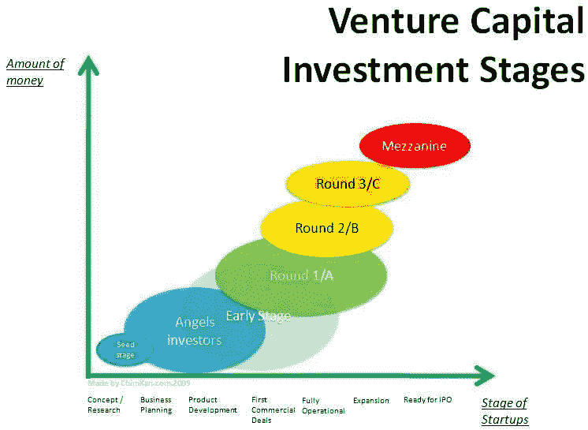

# 投资于那些投资于你的人

> 原文：<https://medium.datadriveninvestor.com/invest-in-those-investing-in-you-53bbc8f89bb8?source=collection_archive---------21----------------------->

企业家，不管他们正处于旅程的哪个阶段，总是在寻找投资他们的人。

我可以听到争论已经开始在你们的头脑中形成；所以让我把我所说的放在上下文中。

 [## 算法交易的机器学习|数据驱动的投资者

### 当你的一个朋友在脸书上传你的新海滩照，平台建议给你的脸加上标签，这是…

www.datadriveninvestor.com](https://www.datadriveninvestor.com/2019/01/30/machine-learning-for-stock-market-investing/) 

# 我生意中的金融

第一件事是第一。钱。当你说“投资”时，大多数人都会想到这个。

我们都熟悉初创企业投资的各个阶段。

它通常以种子投资轮开始，然后可以发展到包括额外的融资轮，通常可以以创始人退出企业而告终；一些并购活动或成功的首次公开募股。

但这不是我们在这里谈论的“投资”。

# 从经验中投资

最近我有幸被邀请参加[奋进号](https://endeavor.co.za/)与[大卫·弗兰科尔](https://en.wikipedia.org/wiki/David_Frankel_(entrepreneur))的火力边聊天。大卫可以说是企业家的定义。他基本上将自己描述为足够幸运，能够通过他投资的企业家继续替代生活；分享一些高潮和低谷，但仍然暴露在整个激动人心的旅程中。

在这次极具吸引力的聊天中，David 说的一件重要事情是，当他考虑投资一个组织时，业务的“内容”很重要，但并不重要。“谁”至关重要。这就是促使他投资的原因。

为了更好地理解这一点，我认为他的意思是这样的:

一个企业需要有趣，或者至少能够提供一些不同的东西。这并不意味着与众不同会让你受到足够的关注，从而成为投资对象。

正是人的魅力让他对初创企业感兴趣。这个人是否有一种神奇的品质，能够激励这个企业变得更大；不管他们的业务是什么？

同样，是你周围的人让你变得值得投资。

# 投资于你身边的人

我最近一直在思考的一个想法是:“你的员工每天都在投资你”，听了大卫的话后，这个想法变得清晰起来。

想想吧。作为雇主，你在推销你的商业愿景。明天的承诺。你每天共同建设的未来的回报！

员工的投资可能不是有形的现金。但这无疑是他们的时间投资；他们的想法，他们的激情，他们的生活，以及他们家庭的幸福。

这是你的企业可以获得的最大投资。

对企业家来说:你需要像对待投资者一样对待你的雇员。你应该感谢他们不断地为他们的投资提供价值。

**对新员工:**询问业务。问他们对你来说重要的问题。不要羞于认为这是单向对话。你每天都在把有限的资源{time}投入到明天的承诺中。

“有一份工作”和“挣一份工资”同样重要，也许这是一个崇高的理想，但我坚信，如果你正在寻找一份职业而不是一份工作，那么你需要像一个对投资有信心并准备为确保回报做出贡献的投资者那样思考！

*原载于 2019 年 8 月 29 日*[*http://jonathanhouston.co.za*](http://jonathanhouston.co.za/invest-in-those-investing-in-you/)*。*