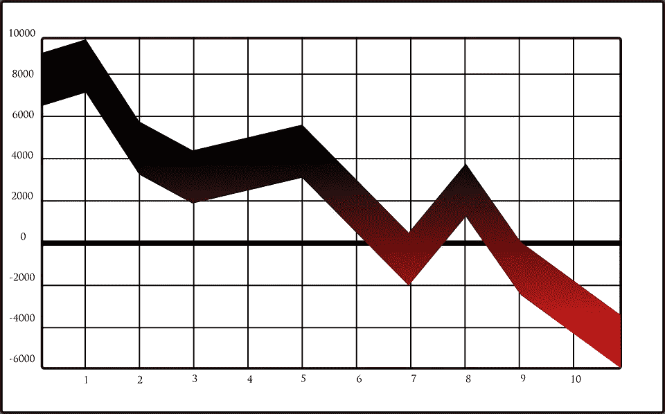
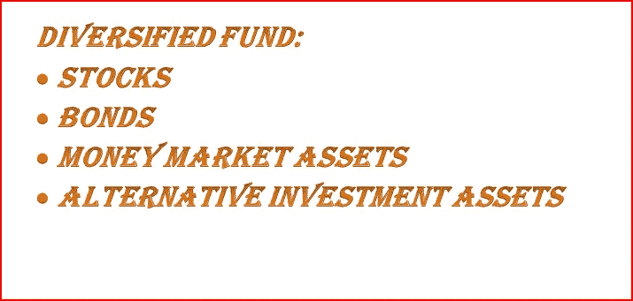
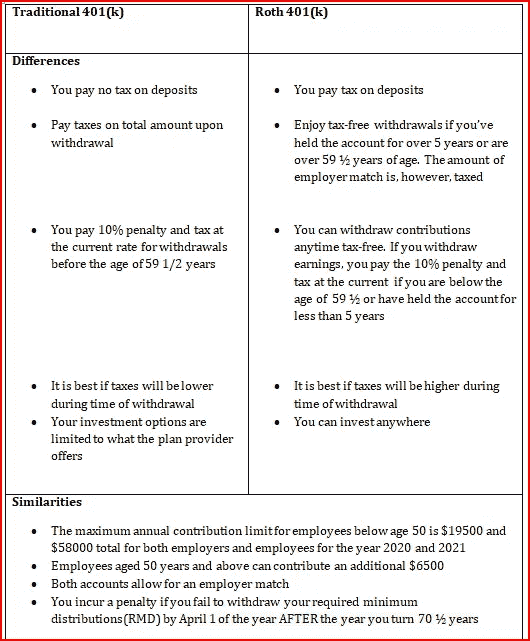

# 投资新手——开始投资时你需要知道的 12 种投资类型

> 原文：<https://medium.datadriveninvestor.com/investing-for-beginners-a-simple-guide-to-get-you-started-5a7281fafd65?source=collection_archive---------1----------------------->

孩子的大学基金、应急基金、被动收入、孩子的遗产、舒适的退休生活……你知道你需要投资来确保你的财务未来。但是投资的世界似乎太广太复杂，你无法决定从哪里开始——所以你还没有开始。

从股票到债券、商品和退休基金；这一定是你从未上过的 10 分钟新手投资速成班！

Investing for beginners: It is easy to get confused by the many types of investments available

在本指南中，我将帮助你了解 12 种投资类型，这样你就可以开始增加你的财富，实现你的梦想！

以下是我将介绍的内容:

## A.传统投资

1.  ***货币市场投资***

***2。资本市场投资***

***3。共同基金***

***4。ETF***

***5。指数基金***

***6。平衡基金/多元化投资组合***

## B.另类投资

**7*7。房地产***

***8。点对点(P2P)借贷***

*9。* ***加密货币***

**10*。*商品**

## **C .退休计划选项**

**11*。IRA***

**12*。*401(k)**

让我们开始吧，好吗？

# 传统投资

传统投资包括众所周知的投资，如债券、股票和现金。

# 1.货币市场投资

如果你希望短期投资，比如一年或更短时间，货币市场投资适合你。

货币市场投资是指持续时间不超过 12 个月的投资。它也被称为对现金和现金等价物的投资，因为它具有很高的流动性(很容易兑换成货币)。

Money market investments are also known as cash or cash equivalents as they are highly liquid

货币市场投资是低风险的。

货币市场工具[种类繁多](https://www.thebalance.com/money-market-instruments-types-role-in-financial-crisis-3305528)。最受欢迎的是政府国库券、短期存单和银行的高收益储蓄账户。

国库券是政府用来为短期发展项目筹集资金的短期债务工具。

[**存单**](https://www.whereareyouinvesting.com/2021/09/17/certificate-of-deposit/) **(CD)** 是一种可通过银行和信用社存取的储蓄账户。有了定期存单，你可以在一段时间内存入最低指定金额的钱，之后你可以按照约定的条款获得利息。

# 2.资本市场投资

如果你在寻找长期交易，考虑资本市场投资。资本市场处理 2 年以上的长期投资，如股票和债券。

**债券**

债券是一种长期债务工具，被企业和政府用来为项目筹集资金。债券有两大类:**政府或国库债券和公司债券。**

国债没有违约风险，因为(你猜对了)它们是由政府发行的。如果你是一个寻求以最小风险投资的初学者，他们是一个很好的选择。

Governments borrow money from citizens in the form of bonds to carry out long-term projects like building infrastructure

然而，政府债券支付的利率比公司债券低，如果公司亏损或破产，公司债券就有违约的风险。

**b .股票**

虽然有些人交替使用股票和股份这两个词，但还是略有不同。股票是对一家公司所有权的投资，而股票是不同公司股票的组合。

***当你购买了一家公司的股份，你就成为了它的所有者之一*** 。你买的股票越多，你的股权就越大。如果你持有股份的公司盈利，你会得到红利。如果公司亏损，你就没有收入。

债券和股票哪个更好？

一般来说，债券的利率较低，因为与股票相比，债券的风险较低。如果一家公司破产，债券持有人和其他公司债权人将先于股东获得偿付。

# 3.共同基金

“共同基金”这个名字听起来可能有点专业，但事实并非如此。

共同基金是不同人作为一个整体投资的资金集合。事情是这样的，共同基金公司(如 Vanguard 或 Fidelity)从像你这样的投资者那里汇集资金，代表他们投资，收取费用。共同基金将其所有权分成股份。如果一股是 100 美元，你投资 200 美元在一个共同基金，你有两个股票。

基金经理决定将存款人的钱投资到哪里(这被称为积极管理)以获得回报。根据所选投资的表现，你可以盈利，也可以亏损。共同基金被认为是高成本投资，因为它们是积极管理的。

Mutual funds pool funds from investors and actively invest the money using their investment expertise for a return

共有两种类型的共同基金——开放式和封闭式共同基金。

**开放式共同基金**

在开放式共同基金中，人们可以在每天结束时直接从基金中投资和赎回基金。例如，如果你想赎回你的股票，开放式共同基金会把你的现金加上利息(或减去损失)减去适用的管理费还给你。

**封闭式共同基金**

在封闭式共同基金中，投资是锁定的，你不能直接从基金中存款或提款。如果你想赎回你的股份或购买股份，你必须**在二级市场**找到一个买家或卖家，比如在证券交易所。

如果你不能自己交易，你可以付钱给经纪人，让他在二级市场为你买卖共同基金股票。

# 4.交易所交易基金

交易所交易基金(ETF)遵循与封闭式共同基金相同的原则。唯一的两个区别是:

a.在 ETF 中，只有获得批准的人(通常是大型机构)才能买入该基金。通过这种方式，大量的股票被一次买入或赎回，消除了维持数百万小股的需要。

如果你是一个想投资 ETF 的个人，你可以从一个想投资 ETF 的被批准的机构购买你的份额。

b.**大多数 ETF 都不是主动管理的**。他们投资于某种类型的资产，使其成为低成本投资。

# 5.指数基金

大多数专家都认为指数基金是新手的最佳投资。

**什么是指数基金？**

指数基金是指投资组合密切监控和跟踪特定市场指数(作为市场特定部分表现基准的一组投资资产)特征的任何基金。)这些市场指数可以由一组股票、债券、商品、共同基金、ETF 基金或任何其他资产组成。

An index fund tracks the performance of a specific market index

例如，股票指数基金将持有一组特定类型的股票。一只受欢迎的股票指数基金是标准普尔 500，它跟踪美国 500 家最大的上市公司的表现。比方说，如果你投资于一个监控标准普尔 500 表现的指数基金，你的投资表现将取决于标准普尔 500 的表现。

**作为初学者，指数基金为什么对你有好处？**原因有二。

**答:它们是被动管理的，因此成本较低**

由于指数基金跟踪特定市场指数的表现，你需要做的就是观察该市场指数的表现。这消除了主动管理的需要和相关费用。

b.**你享受** **全市场多元化**

指数基金是多样化的，全市场的。有了指数基金，你可以持有分布在整个市场的不同公司的资产，这比持有单个股票要安全得多。

c.他们通常有

# **6。混合/平衡基金(多元化基金)**

作为初学者，你需要学习的一个重要概念是**分散投资。**虽然指数基金和交易所交易基金等投资提供了一定程度的多样化，但它们往往只持有一种类型的资产，例如只持有股票、债券或大宗商品，这仍然会带来严重的风险。

**真正的多样化意味着将多种类型的资产组合在一起进行投资。**

平衡基金是一种传统的投资类型，试图通过结合股票和债券(股票和债券)来分散投资。混合股票(被认为是高风险投资)和债券(被认为是低风险投资)可以帮助你更好地管理风险。

**保守型与进取型平衡基金**

保守的平衡型基金投资于债务多于股票，而激进型基金投资于股票多于债务。

您可以通过购买平衡 ETF、平衡指数基金或任何其他平衡共同基金来投资平衡基金。

**现代平衡/多元化基金**

Diversified investments include various types of assets in one

然而，现代平衡基金已经不再仅仅持有股票和债券。一个适当的多元化投资还应该包括一个投资组合中的替代投资组合，如房地产、P2P 等(将在下面讨论)，以进一步降低风险。

# 另类投资

另类投资是指不包括债券、现金或股票的任何投资。

# 7.房地产或物业投资

[90%的百万富翁](https://www.cnbc.com/2019/10/01/real-estate-is-still-the-best-investment-you-can-make-today-millionaires-say.html)都有房产要感谢。

房地产所有者收到的持续租金或抵押贷款利息付款使房地产投资成为热门商品。

## 通过房地产交易基金(REITs)投资房地产

房地产投资信托基金是拥有、融资或经营房地产的公司，它们从中获得租金或利息收入。

When you invest in real estate, you get a share of the rent, lease, or interest income

**房地产投资信托基金的种类**

你可以投资一种房地产投资信托基金，比如医疗保健或办公房地产投资信托基金。你也可以通过投资房地产投资信托基金来分散投资，这是一种将不同类型的房地产投资信托基金合二为一的基金。房地产投资信托基金的类型包括:

a.股票基金(支付租金收入)

b.抵押基金(支付利息收入)

c.混合基金(股票基金和抵押贷款基金的组合)

**交易型与非交易型 REITs**

房地产投资信托基金可以是公开交易的，也可以是非交易的。作为初学者，最好购买公开交易的房地产投资信托基金，因为它们容易出售，而且很容易确定其价值。你可以从网上经纪人那里获得公开交易的房地产投资信托基金。选择新手友好的经纪人，他们不要求最低余额和费用。

## 通过众筹投资房地产

众筹是指通过某个平台聚集很多人的资金来资助一个项目。这是一个策略，许多小企业更喜欢使用时，他们想筹集资金的房地产业务项目。

例如，一家缺乏资金购买一块土地或开发商业用地的公司可以使用众筹来获得资金。

然而，众筹可能有风险，因为大多数寻找资金来源的公司还没有成立。如果你想通过众筹投资房地产，那就去看看[最好的房地产众筹平台](https://www.investingsimple.com/best-crowdfunding-real-estate-platforms/)。

# 8.点对点(P2P)贷款

P2p 借贷平台正在迅速普及。在这些平台上，你可以通过直接借给借款人来增加资金，并享受比银行等传统平台高得多的利率。

P2P platforms allow borrowers to get loans directly from lenders eliminating traditional intermediaries like banks

有了 P2P 贷款，你就有违约的风险。你可以通过提供抵押贷款的平台(借款人必须用某种抵押品来获得贷款)来保护自己免受风险。

# 9.加密货币

投资加密货币有可能给你带来可观的收益。加密是一种虚拟或数字货币的分散网络，其运行不受政府控制。它使用区块链来确保数据的安全性和完整性。

加密银行不能像银行一样生产货币。它们通过提供高达 9%或更高的回报率来弥补这一缺陷，相比之下，银行高收益储蓄账户提供的回报率为 2%。

有几种方法可以投资加密。其中包括:

**答:下注你的硬币**

你可以通过持有或锁定你的硬币(赌注)一段时间来赚取你的密码利息。下注 PoS 币让您有权验证网络交易，这有助于保持系统安全并获得年度奖励。

Some platforms let you earn annual interest by locking up (staking) PoS coins for a specific period of time

您可以下注的硬币类型称为赌注凭证(PoS)硬币。您持有的硬币越多，您验证交易的权利越高，您的奖励也越高。

有几个平台可以让你把硬币投入到它们的节点中。其中包括 Trust 和 Kranken，根据你投资的 PoS 币，你每年可以获得高达 12%的利息。PoS 硬币的例子有 Cosmos 和 Tezos。

**b .赚取加密存款利息**

你也可以把你的密码存放在 P2P 平台上，这样你就可以获得存款利息。赚取加密存款利息和赌注的区别在于，加密存款不会锁定你的资金，你可以随时提取。

**c .借出加密贷款**

一些 P2P2 平台让你借出加密贷款并赚取利息。贷款期限从 1 个月到 3 年或更长时间不等。

**d .来自加密交易的收益**

你可以在交易所交易密码，就像你交易股票或外汇一样。加密的问题在于它高度不稳定和缺乏流动性(由于供求不匹配，不容易交易)。

分散的流动性交易所池有助于解决流动性问题，因为它持有一群人的密码，这使得交易更容易，并有助于稳定价格。

当你把你的密码放入流动性池时，你就可以分享交易利润。

# 10.商品

商品是商业中使用的基本商品。一些例子是煤和天然气等天然燃料，金和铜等金属，农产品，酒和牲畜。

Alternative investments: Wine is an example of an agricultural commodity that investors can invest in

商品投资是所有资产中最不稳定的。价格根据供求关系波动很大。例如，在干旱期间，食品供应很少，因此需求超过供应，价格上涨。当食品供应非常高而需求较低时，价格就会下降。

投资大宗商品有几种方式。其中包括:

1.  找到一个经销商(你可以在网上这样做)，购买一件商品，保存它，并在未来出售获利。储存和运输商品的整个过程可能很费力，所以你可以选择…
2.  购买大宗商品交易所交易基金、股票或共同基金，帮助你投资大宗商品，而无需付出所有努力

# 退休计划选项

我把退休放在它自己的类中的原因是退休计划不是实际的投资。它们只是让你为退休存钱的平台。你如何投资和成长取决于你自己。如果你不投资，这些钱就放在那里，过几年就会贬值。

**Retirement plan options like 401 (k) and IRA help you save money and invest it for retirement**

有许多退休计划，但我将讨论两个主要的——401(k)和个人退休账户(IRA)。

# **11。401K 退休计划**

401 (k)是由雇主发起的退休计划。并不是所有的雇主都提供 401(k)计划，所以你在接受工作邀请之前可能需要核实一下(因为这是目前为止，作为一个初学者开始为退休投资的最好方式！).

**401(k)如何运作**

在 401 (k)中，你和你的雇主都向账户中缴款。雇主贡献的金额(雇主匹配)取决于你投入的多少。

雇主最多能支付你工资的 3%。为了充分利用你的 401k，你应该把至少 6%的工资投入 401k。这些资金然后投资于金融资产以赚取回报。你将把资金投资到哪里取决于 401 (k)账户的类型。

**401(k)账户类型:传统与罗斯 401(k)**

401k 有两种类型——传统型和罗斯型。下面是一个汇总表，可以帮助您了解它们的异同:

**Similarities and differences between traditional and Roth 401 (k)**

提示:如果你是自雇人士，你可以开一个 401 (k)账户，以雇主和雇员的身份向账户注资，这样你可以存更多的钱！

# **12。个人退休账户(IRA)退休计划**

401 (k)和个人退休帐户的一个主要区别是:401(k)包括雇主的贡献，而在个人退休帐户中，你只能靠自己。

就像 401(k)一样，有两种类型的个人退休帐户——传统和罗斯个人退休帐户。传统和罗斯个人退休帐户之间的差异和相似之处与传统和罗斯 401 (k)相同。

然而，A **401(k)优于任何类型的 IRA，因为:**

1.  **个人退休帐户的年度供款限额要低得多**

如果你在 2020 年和 2021 年年满 50 岁，个人退休帐户的年度限额是 6000 美元或 7000 美元。对于 401 (k)计划，雇员的年度缴款限额为 19500 美元，到 2021 年，雇主和雇员的总额为 58000 美元。

50 岁或以上的人可以额外获得 6500 美元，在 2020 年和 2021 年达到每年 64500 美元的最高限额。

因此，如果你挣得更多，你可以用 401 (k)计划存更多的钱。

2.**你可以从 401 (k)贷款**

如果你手头拮据，只要你支付利息(这会增加你的储蓄)，你就可以从 401 (k)计划中贷款，而且没有罚款。你不能从爱尔兰共和军那里借钱。

3.**个人退休帐户非常灵活**

有了个人退休帐户，你可以选择投资方向。当你有一个传统的 401 (k)账户时，你的员工会为你管理账户并决定你的资金投向。

# 作为初学者开始投资吧！

保持所有这些信息可能很难，但是你可以从小处着手，即使资金很少。

从你的额外储蓄开始，投资于风险最小的投资，如国债、高息储蓄账户和定期存款，看着你的钱慢慢增值。

如果你想承担一些中等风险并获得更高的收益，尝试抵押 P2P 贷款平台和让你获得加密和稳定硬币利息的平台。

如果你想在有严重风险的情况下赚大钱，你可以扩大投资风险，比如个人股票、垃圾债券和股票。

记得现在开一个退休账户。越早开始为退休储蓄越好！

现在你有 12 种投资可供选择，你开始考虑把钱投资到哪里了吗？

我是查里蒂，一名商科毕业生，一名投资作家。作为 4 年多的 2X 认证内容营销人员和 SEO 作者，我几乎看到和听到了所有关于内容创作的内容。

我很乐意帮助您的金融业务创建吸引现有和潜在客户的营销内容。今天就和我聊聊你在 charitynwrites@gmail.com 的内容需求吧。