# 用机器人兔子投资高增长经济体

> 原文：<https://medium.datadriveninvestor.com/investing-in-high-growth-economies-with-robo-bunnies-f5ac8a7f97d2?source=collection_archive---------5----------------------->

我们能从你大声朗读这些台词给你的宠物听开始吗？

*“投资受到市场风险的影响。布比金是个骗子。他对投资一窍不通，甚至都不会打自己的真名。还有，我穷死了也不能怪他或者任何人，因为我要对自己的投资负责。还有，我的声音听起来很糟糕，我可能得了喉癌。顺便说一句，在投资方面，我也是个专家，就像我认识的所有人一样。”*

真的吗？自从你开始投资以来，你的回报率是多少？

*“嗯……别评判了，好吗？你有什么？”*

嗯，我有一个无聊的方法，似乎已经工作了几十年。感兴趣吗？

*“嗯……我可能会中途停止阅读”*

你说了算，我会把性感的部分留到最后。

How much Bubbykin has saved so far? (Photo by [Vladislav Nikonov](https://unsplash.com/photos/13lLAWadKwU?utm_source=unsplash&utm_medium=referral&utm_content=creditCopyText) on [Unsplash](https://unsplash.com/search/photos/peanuts?utm_source=unsplash&utm_medium=referral&utm_content=creditCopyText))

既然我们已经知道了我存了多少钱，那就让我们来评估一下我的资历吧。我没有，我不是 CFA，好吗？我可能不会去追求。我刚刚获得了工商管理硕士学位，来自一所顶级商学院，来自“全球最伟大的国家”。而 ***n*** 可能小于 50，也可能不是，看是哪一年了。我也有一个科学硕士学位，你可以把它扔到另一张纸旁边。为什么？因为它不在金融领域，而是在科技领域。:/ kmn。然而，我可以告诉你，我只花了几个月的时间就付清了这两笔钱，我的本科也是如此。我没有债务，从来没有，你听到了我和我的破烂。你知道为什么吗？因为我租房。你知道为什么吗？因为我住在湾区。既然你已经对我、我的净资产、我糟糕的地区选择和我不相关的资历做出了评判，让我们来看看一些数字…

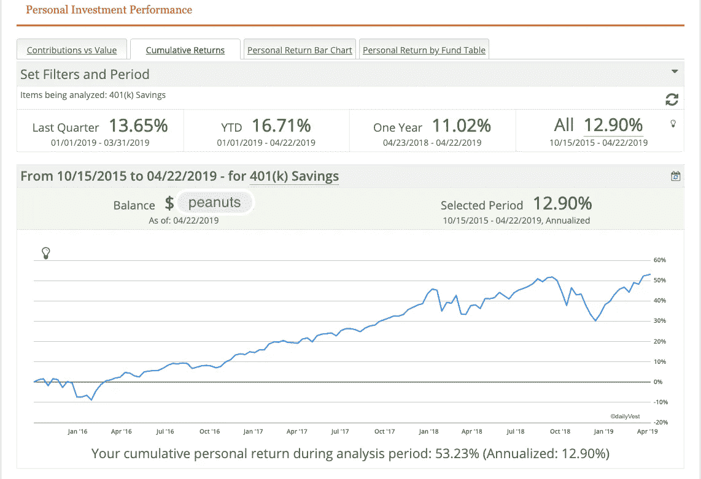

Rate of return for bubbykin, USA — 401k, ~13%

*“13%太烂了！我可以做得更好，让我玩股票市场，更好的是让我们玩扑克。在过去的十年里，我对市场的时间把握非常好，当我给你看我的交易时，你会嫉妒得流下眼泪。我最近好像没有时间。”*

也许你是对的。也许你是妄想。在我让你自己决定之前，你能猜出我们这个时代最受尊敬的投资者之一的平均回报率吗？

下面的报告有 50 年的数据，略高于普通人的平均收入寿命。多年来，你可能已经注意到，市场是非常不可预测的，当伯克希尔股票上涨时(1974 年，2002 年)，人们愿意支付更低的价格。在另一种情况下，尽管人类很愚蠢，但当股票实际上出现罕见的亏损时，他们却支付了更多。我们说的是，大多数人对最佳投资者和最佳投资的看法是错误的，不是一天、一周或一个月，而是一年。你认为你能战胜市场吗？难怪你的猫不在乎你的感受。

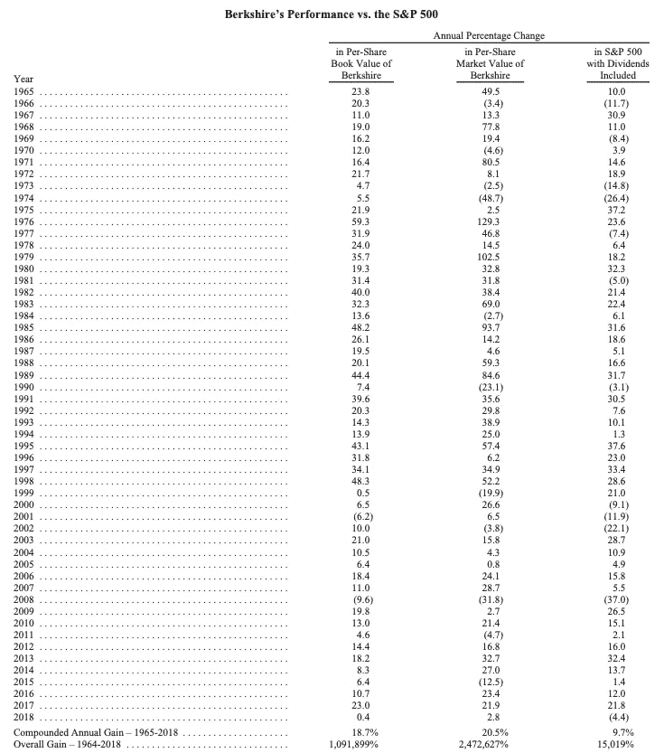

Source: Berkshire Hathaway 2018 annual report, ~21% compounded annual return for 5 decades.

*“好吧，你扔了一些数字。那又怎样？这对我成为百万富翁没有帮助。”*

嗯，也许你不能把握市场时机，但如果你定期投资股票市场，你肯定可以靠秘书的薪水成为百万富翁。这里是[关于几个普通人如何赚取和捐赠数百万的一个例子。然后，他们死了。](https://www.nytimes.com/2018/05/06/nyregion/secretary-fortune-donates.html)

大多数人忽略的一个神奇的事情是复利。让我们回到上面图表的最后两行。1964 年投资的 1 万美元，在 50 年多一点的时间里以 9.7%的复合年收益将会是今天的 150 万美元。前提是你只在 S&P500 投资(稍后会有更多相关内容)。如果你把那笔钱留给巴菲特先生，那 1 万美元在 2018 年将是 2.47 亿美元。如果青少年版的你每个周末都不喝酒，复利可能会帮助你的祖父版买一艘游艇。

One of these each week could cost you a yacht at your deathbed. Or a kidney. Photo by [Adam Jaime](https://unsplash.com/photos/YeH5EIRFCIs?utm_source=unsplash&utm_medium=referral&utm_content=creditCopyText) on [Unsplash](https://unsplash.com/@arobj?utm_source=unsplash&utm_medium=referral&utm_content=creditCopyText)

*“但在我的一生中，我很少知道什么是好的投资，什么是买入的好时机。巴菲特先生是伟大的，但你知道，他和芒格可能是 umnn..快退休了。”*

下注的一个好方法是在一个经济体中，你可以很好地自动化这个过程。事实上，如果你只是定期购买 S&P 指数基金，你就可以击败该领域的所谓专家。巴菲特先生[实际上赢得了 100 万美元的赌注](https://www.fool.com/investing/2018/01/03/warren-buffett-just-officially-won-his-million-dol.aspx)，其中一位对冲基金经理证明，标准普尔可以在“合理的时间内”击败业内任何最聪明的基金经理。

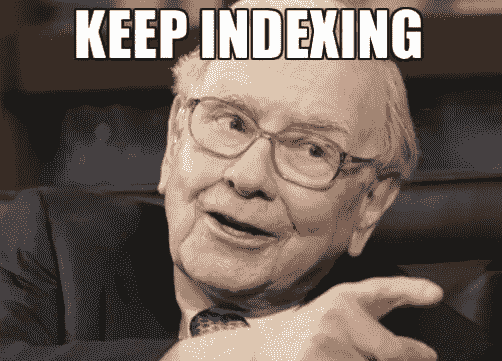

Source: Shamelessly borrowed from the internet. Most likely this meme created for Tyler Durden’s Zerohedge post

*“这是什么 S & P500，哥们？”*

150 多年前，一个叫亨利·普尔(Henry Poor)的家伙开始写关于投资评级的评论文章，然后通过赢得最好的信用评级机构的信誉来使自己的判断合法化。大约一个世纪前的某个时候，早在数据科学出现之前，另一个讨厌鬼路德·布莱克(Luther Blake)就来分享他令人恼火的精确统计发现。他的公司有一个无聊的名字，标准统计局，这是大多数统计学家缺乏创造力的典型代表。就这样，经过几次曲折的剧情，S&P 出生了。不严格地说，S&P500 是多年来美国 500 强企业平均增长的基准。任何对冲基金经理，我们都称他为韦纳，他在美国投资的成功是根据他的投资与 S&P500 的对比来衡量的。如果韦纳的表现低于标准普尔，他就是输家。如果韦纳的表现优于标准普尔，他就是赢家。但从长期来看，几乎没有韦纳的表现优于 S&P500 指数。巴菲特先生押了 100 万美元在那项索赔上，并赢得了赌注。

总之，每个月在 S&P500 存点钱，你会在有生之年打败华尔街大多数保守的家伙。

Wall Street, I am comin’ for ya! Photo by [Chris Li](https://unsplash.com/photos/6Y6OnwBKk-o?utm_source=unsplash&utm_medium=referral&utm_content=creditCopyText) on [Unsplash](https://unsplash.com/search/photos/wall-street?utm_source=unsplash&utm_medium=referral&utm_content=creditCopyText)

所有投资都有运营成本，大部分收入来自税收。我说大多数是因为有几家科技公司这些年来总共交了 0 美元的税，他们的首席执行官和所有者都是亿万富翁。当你痛苦地消化机会是如何对你不利时，让我告诉你，如果你是千禧一代，当你将税收和成本与你的收入能力和你父母的收入能力进行比较时，你很可能在有生之年买不起房子，或者你可能会为它付出过多。可怜你，可怜我。因此，税收和成本…以及如何节省这些。

**方案一** —现在投入大量资金，以后交税！在 S & P500 中输入 401k 索引。你可以大致避免，而不是推迟每人每年 10000 美元投资的 3000 美元税收。在 30 年的时间里，大约有 10 万美元的税收可以投资。如果他们达到最大限度，一对夫妇可以推迟大约 50 万的税收。缺点是你会忘记这些钱，直到你的头发和牙齿都掉光。(截至 2019 年，你可以将 19k 美元存入你的 401k 账户。你的个人退休帐户里有 55000 美元。你的 HSA(健康储蓄账户)中有 35000 美元，每年避免或推迟大约 10000 美元的税收。)

**选择二**——今天交税，把钱忘了，把牙掉了再去取。但好的一面是，千万不要为资本收益交税！你的无牙咧嘴将伴随着眼睛的闪烁！

很少有其他方法可以通过结合这两种选择来减少税收，即通过你的 HSA 进行投资，以及通过投资 529 计划来为你可能未出生的孩子的教育规划巨额费用，从而避免一些税收。你只是有一些家庭作业！

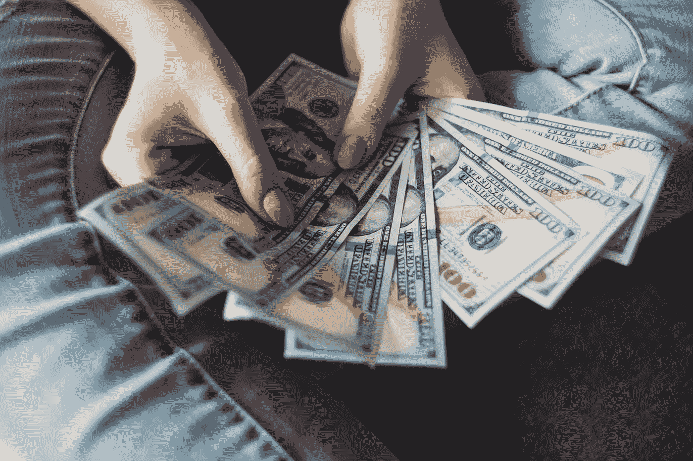

Franklins! My granddaughter will have all of them when I die! Yay!?! Photo by [Alexander Mils](https://unsplash.com/photos/lCPhGxs7pww?utm_source=unsplash&utm_medium=referral&utm_content=creditCopyText) on [Unsplash](https://unsplash.com/search/photos/costs?utm_source=unsplash&utm_medium=referral&utm_content=creditCopyText)

“嘿，但我根本不住在美国！这些税收优惠不适用于我"

这些概念适用于所有地理区域。指数化、避税和规避成本以及其他政策利益很少有例外。规则可能不同，但是不管你叫它英式足球还是美式足球，在 T2 大美洲之外都是一样的。所以，除非你在日本，否则请继续读下去。

接下来，我们将讨论避免费用和隐性成本。任何一个 roboinvestor 或者理财规划师，不管他有没有为你赚钱，都会拿走为你理财的钱。换句话说，这就好比一个医生，不管你是否去看他，他每年都会让你觉得有点不舒服。此外，你的医生不会对他的建议对你健康的影响负责。即使你和他在一起几十年，他也不会保证让你更健康或更年轻。生活糟透了！处理好它。但是为了你自己，去评估一下你所有的幽灵成本。你可以从查看你的信用卡账单开始(问问你自己，你是否需要 HBO、网飞和 Prime 订阅，或者你可以冒险 torrenting？你需要 Spotify 和 Apple music 吗？或者你可以用一个优雅的广告拦截器看 YouTube 吗？).我们从个人成本开始，不是为了离题，但与投资相关成本相比，这些成本更容易发现和联系起来。

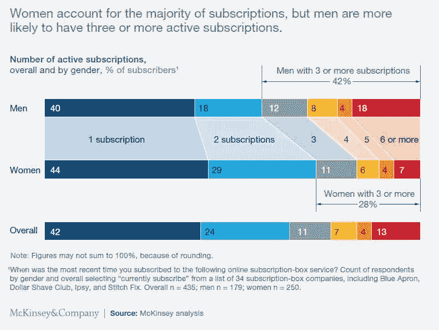

Do you need all your subscriptions? Source: McKinsey analysis

你没必要在谈话中提到我的信用卡。不酷！”

啊，呸，接下来让我们继续你的投资。在你列出所有糟糕的投资后，准备好进一步失望吧。直接看费用比率，你会注意到大部分费用都是按 10%收取的.这可以让任何投资在几十年内化为乌有，你不会意识到这一点，直到你失去了所有的牙齿。用医生的比喻来说，这就像每年卖掉你身体的 1 %,试图变得健康(？)每个经纪账户都会向你收取费用。每个 ETF 都会向你收取费用。基金经理会向你收取更高的费用。机器人兔子会向你收费。甚至 Robinhood 和 Zerodha，著名的零佣金经纪人，取决于你来自哪里，成本你哥们。投资没有免费的午餐。这不是什么语言，你这个吸血鬼！

这里有一个例子，说明如果忽视费用，你一生中会损失 50 多万美元。所以，去寻找你的电视机、扬声器、房子，当然还有所有投资的费用比率吧。即使是那些你做的，因为你的“朋友要求你做的”。费用是固有的，但是你的投资和订阅有意义吗？

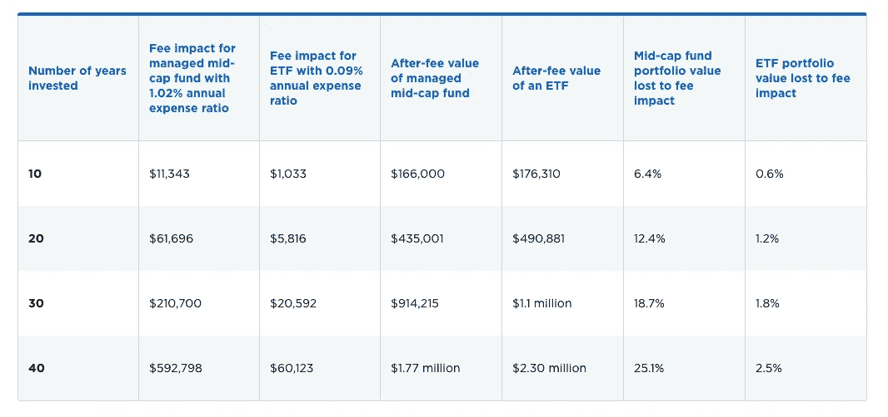

Assumption: $25,000 initial investment, $10,000 added annually and a 7% average annual return over 40 years

*“按月投资复利指数基金，避税，免手续费，过着枯燥的生活。还有别的吗？”*

当然啦！将 S&P500 指数化是一种无聊的方法，在上个世纪对美国婴儿潮一代有效，但可能不是本世纪的最佳策略。法老、罗马皇帝、成吉思汗、日本和欧洲经济超级大国都曾在全球经济中占据主导地位，但基于他们的历史，不多元化是不明智的。我们将讨论另一个经济体，因为美国可能会也可能不会再次伟大。或许当我们审视经济时，我们可以将讨论转移到更积极策略上，或许可以召唤一只机器兔子或大象。你选吧。

让我带你去印度这块充满异国情调的土地，这块土地被每个美国人称为老虎、耍蛇人的土地，最近，它还拥有 IT 支持和呼叫中心。正是在这里，我收集了第一批*皮查*的第一批花生。然后我的教育和责任带走了大部分。然后我没有自杀，而是存了更多的钱。后来我失业了，写了这篇博客，因为没有比没钱的时候更适合写钱的话题了。稍后将详细介绍这个令人沮丧的故事。现在，让我们再看一些图表。

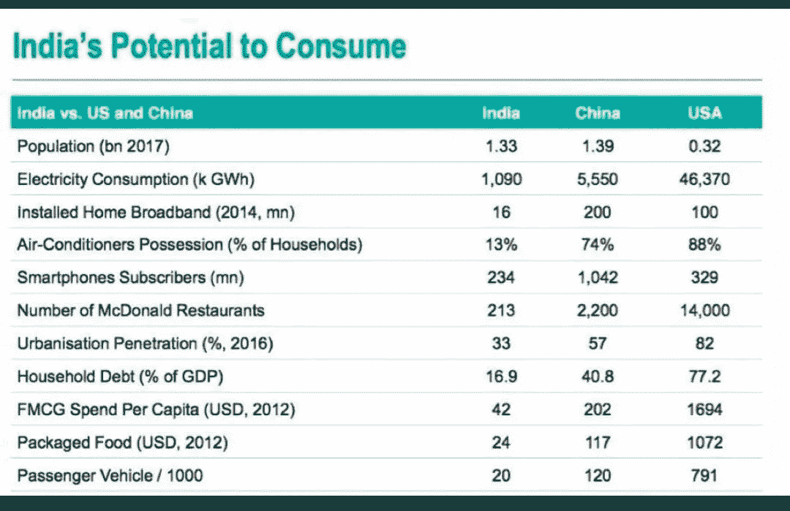

Source: Some whatsapp group Bubbykin subscribes to, shall be left unnamed since he has vehemently left or was kicked out from others. Also, reverse image search was not able to identify the source for credits.

在这个国家，性教育是禁忌，父母，有时是亲戚和邻居，未经宣布就可以随意走进公开场合后的青少年和已婚人士的房间，令人惊讶的是，我们是世界上人口最稠密的国家。印度人是有趣的消费者，他们会去拉斯维加斯看脱衣舞俱乐部，从完美平衡他们腹部的玻璃杯中啜饮免费的皮娜可乐，默默地评判脱衣舞者，不会给一分钱小费，最终会在社交媒体上分享大峡谷的照片。他们会忽视《爱经》或联合国教科文组织的世界遗产如[卡茹拉霍寺庙](https://en.wikipedia.org/wiki/Khajuraho_Group_of_Monuments)中展示的色情自由主义，因为他们宣扬民族主义，为了土地而互相残杀以建造更多的寺庙，并且虚伪地以某种方式在人口上击败世界，使印度成为增长最快、多样化、需求不断变化的未开发市场。这种不断增长的人口，无论多么不理性和古怪，对大多数企业来说都是一个绝佳的机会，因此对大多数投资者来说也是如此。

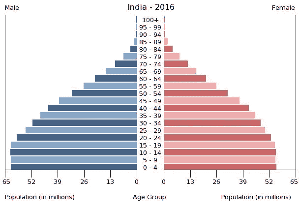

Anybody notice the gender gap? Magic of female foeticide, ya’ll. Source: Gene Chan’s article on Seeking Alpha

作为一名国际投资者，在印度投资有几种方式，但我现在把我的注意力转移到我的同伴身上。NRIs，希望你所有的账户都是 NRI 兼容的(？)法律上不允许我们在任何地方持有任何其他东西。莫迪亲自召唤裸体同性恋妖精，如果我们不遵守，就把我们拿下。#良好治理。还记得你在国外时的去货币化吗？同样的事情，除了*更痛苦。不过，与堕除女胎相比，这要少得多。我的朋友，这是传统。无与伦比的荣誉。顺便说一句，我写讽刺作品是为了那些至今没有理解它的人。*

对散户投资者来说，三种常见的投资形式当然是股票、债券和房地产。我错过什么了吗？你可以在下面的评论区指出我的错误。这就是它们的用途。

让我们从共同基金开始，因为房地产价格过高，最近停滞不前，好吧，让我们诚实地说，对我们大多数人来说遥不可及。

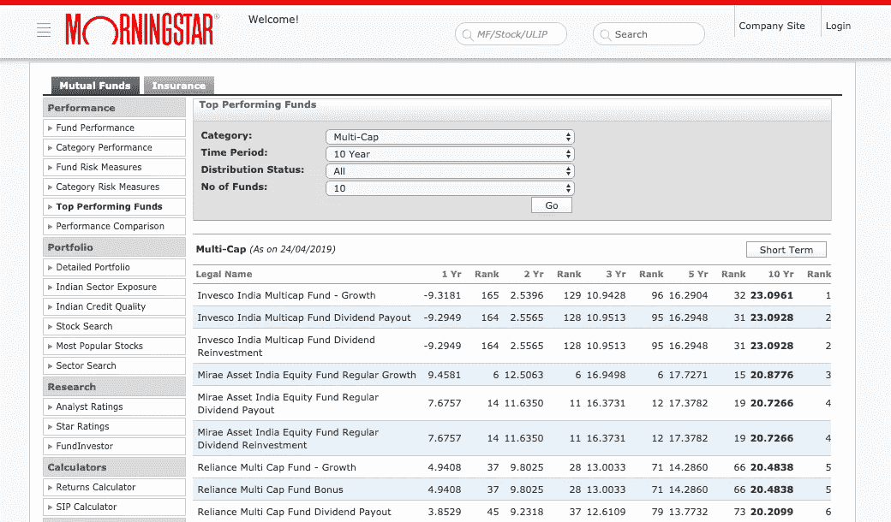

Mirae guys seem consistent, with >20% returns, for a decade, in the Multi-cap sector. Source: [www.morningstar.in](http://www.morningstar.in) Also, your pet reminds you that this NOT an investment advise.

你可以使用晨星公司免费提供的[工具](https://morningstar.in/tools/default.aspx),但是在你决定购买之前，请注意美国和加拿大的 nri 可以投资有限的基金公司。在撰写本文时，这些内容包括:

*   SBI 共同基金
*   Birla 太阳人寿共同基金
*   UTI 共同基金
*   ICICI 审慎共同基金
*   DHFL 保德信互惠基金
*   L&T 共同基金
*   PPFAS 共同基金
*   孙达拉姆共同基金

大多数银行家和投资专家可能会告诉你，你不能买任何东西。事情是这样的，他们不知道自己在说什么。美国让跨国银行和报告变得极其困难，只有 8 家印度基金公司有时间取悦舞会皇后。这个讽刺视频解释了 FATCA，一个由白痴写给白痴的法律。不过，这不应该阻止你投资印度共同基金。寻找十年的成功指标，强有力的领导，类别中的低风险，类别中的高回报，一致性，类别增长的空间，你失败的机会可能会很低。(当你在印度投资时，请注意印度指数基金的费用率往往更高。到目前为止，它们对我来说是值得的。还有，我还没走多远。)

Source: The wisdom that sits in Dilbert’s head

如果你相信伏都教、数字学、占星术或任何形式的算命，你可能会相信市场专家和你不那么迷人的股票经纪人的每日评论。我们已经看到了你如何能在更早的时候击败华尔街的大多数公司，仅仅是通过不去试图把握市场时机。但如果你真的想要在拉斯维加斯赌博带来的肾上腺素激增，也许是因为你仍然幻想破灭，认为你的直觉比你的理性更聪明，那么我会建议采取一些措施来帮助你摆脱这种疯狂。首先也是最重要的是，找出几家有着辉煌成功历史、诚实领导(如果你能找到今天)和强大经济护城河的公司，耐心等待围绕这样一个品牌的短暂危机。给你的宠物再读一遍最后一行。让你的宠物读一遍。现在让我们召唤一只机器兔子，这样你就不必坐在股票代码屏幕前了。你可以坐在沙滩边滚动 Instagram，忽略身边真实的人。

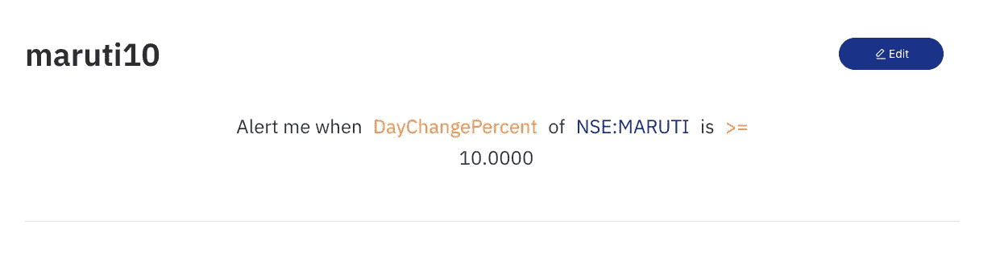

Set alerts, stop losses, trailing stop losses, buy/sell triggers using features provided in your product platforms.

它有助于根据上述基本原理确定 10 余家公司，并定义一些进入和退出标准。进去，你必须谦虚地知道你的标准可能永远不会被触发，这可能是一件好事或坏事，取决于你的机器人兔子权力。你的判断可能大错特错。更糟的是，你可能是对的，但已经死了。谁在乎呢。只要你知道你很好地利用了你所拥有的信息。谈到投资，枯燥、被动、懒散的一致性以及偶尔的战略性会有所帮助。

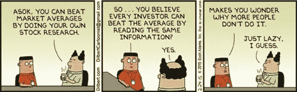

Source: Dilbert’s wisdon ofcource

哦，我的 NRI 朋友们，如果你认为投资共同基金是一件痛苦的事，那就试着建立投资印度股票所必需的账户。这个人[详述了过程](https://www.youtube.com/watch?v=NGl4s3mw4Uw)。最起码肯定能治好你的失眠。改天，我们将讨论与房屋所有权相关的虚拟成本。别忘了给你的宠物读最后一句话，最后一次。

*“投资受制于市场风险。布比金是个骗子。他对投资一窍不通，甚至都不会打自己的真名。还有，我穷死了也不能怪他或者任何人，因为我要对自己的投资负责。还有，我的声音听起来像废话，我可能得了喉癌。”*

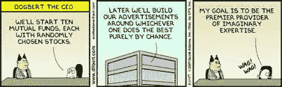

Source: Your pet’s thoughts

**TL；DR / Summary**

*   考虑尽早定期投资你选择的高增长区域的指数基金。
*   评估您所在地区的税前、递延税和税后选择。寻找健康，教育，退休和其他补贴和福利。
*   保持各种成本低。这些费用通常隐藏为维护费、交易费、订阅费，可能会也可能不会计入个人和金融投资的费用比率。
*   看看你周围的地理环境。
*   试着根据各种产品的数据来做决定
*   尽量不要为市场计时，而是为你计划寻找的预定义指标配置自动警报。
*   知道你仍然可能是错的。
*   我们都会死。我们的宠物也会死去，日本出现了负增长。

你可能还会喜欢一些即将到来的批评家们认为可以接受的帖子:

[什么造就了艺术家？](https://medium.com/@bubbykin/what-makes-an-artist-48752ae7699)

[那个妖孽司机。](https://medium.com/@bubbykin/the-uber-driver-2f4f2902faf0)

家在哪里？