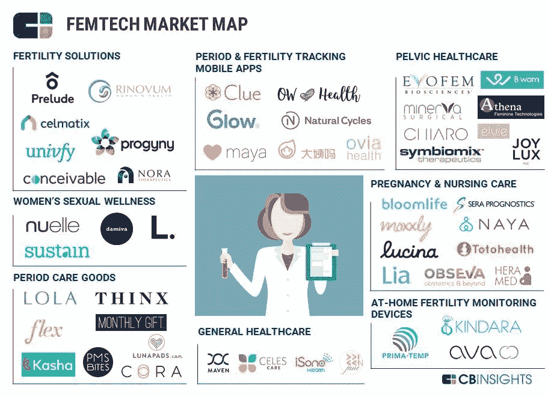

# 投资女性是明智的经济学

> 原文：<https://medium.datadriveninvestor.com/investing-in-women-is-smart-economics-97f3ee6446ef?source=collection_archive---------11----------------------->

> 理解性别在人类、企业和投资生命周期中的价值

Photo credit: [Bloomberg](http://fortune.com/2016/05/03/bloomberg-gender-equality-index/)

尽管[女性控制着全球大约 20 万亿美元的年度消费者支出](https://hbr.org/2009/09/the-female-economy)，[占消费者购买总额的 70-80%，](https://www.forbes.com/sites/michelleking/2017/05/24/want-a-piece-of-the-18-trillion-dollar-female-economy-start-with-gender-bias/#6fa937866123)但从历史上看，企业未能充分创造和营销满足女性特殊需求和痛点的产品。

在美国，不仅女性首席执行官的数量比男性多，而且[叫约翰的男性首席执行官比女性多。妇女面临的挑战是多种多样的:从有限的生态系统到培育创业努力，接触女企业家的渠道薄弱，以及获得投资方面的系统性挑战。女性经营的企业约占所有风险资本投资的 2%。说到真正负责分配资本的人，只有 13%是女性。仅在英国，就有三分之二的风险投资公司根本没有女性参与投资决策。在英国风险投资领域工作的所有人(包括管理和营销角色)中，只有 27%是女性。性别偏见是存在的，而且数学可以证明这一点。](https://www.nytimes.com/interactive/2018/04/24/upshot/women-and-men-named-john.html)

> 女性的支出推动了世界经济的发展，制度控制、创新和投资仍然决定性地掌握在男性手中。

正如这些数字所表明的那样，在整个经济中，现有的创业结构和体系对女性的代表性和服务仍然严重不足。大量证据表明，性别偏见和以男性为中心的立场已经被编入创业生态系统本身，新一代的创业女性正在通过被称为[女性资本](https://www.femininecapital.com/the-book)或[性别资本主义](https://ssir.org/articles/entry/the_rise_of_gender_capitalism)的崛起进行反击。

# F **女性创业者和以女性为中心的设计**

从全球来看，我们正在见证女性企业家和投资者的崛起和扩散，她们正在调动自己的性别或女权主义原则，作为经济“女性化”的一种手段。

[女性科技产业](https://ww2.frost.com/frost-perspectives/femtechtime-digital-revolution-womens-health-market/)的出现和日益流行就是这样一个例子，创新者正在超越男性身体作为标准，通过以女性为中心的设计来满足女性身体和生活的各种需求。以女性为中心的设计是承认以人为中心的设计不可避免地将男性等同于人类的占位符。以女性为中心的创新要求[根据女性在日常生活中经历的真实痛点，为女性设计产品和服务。](http://www.refinery29.uk/2017/12/185994/rise-of-female-driven-economy-feminist-economics)

> **女性的身体需要针对其生理和社会现实的性别创新。**

研究表明，就健康结果而言，妇女不平等地承受着性别差距的负担。有多种慢性病在女性中更为普遍，需要对女性和男性进行不同的管理。 Femtech 正在打破传统的女性健康教育和服务方式，以弥补这一差距。它直接关注[妇女整个生命周期的健康](https://venturebeat.com/2017/02/05/the-rise-of-femtech-women-technology-and-trump/)。这包括以下问题:生殖健康；生育解决方案；怀孕和护理；骨盆和子宫保健；女性性健康、经期护理用品以及一般保健和健康。

The FemTech Market Map (Image credits: CB Insights)

这个行业正在快速增长，预计到 2025 年 T4 的价值将达到 500 亿美元。考虑到[女性健康仅占医疗保健产品和服务研发总资金的 4%](https://www.forbes.com/)，女性科技产业的出现可谓恰逢其时。对该行业的预测显示了这一领域令人难以置信的财务利润潜力，然而女性技术创新在打破女性健康的文化禁忌和赋予新一代妇女和女孩权力方面也发挥了重要作用。

女性企业家的崛起以及她们建立具有社会影响力的企业的倾向证明了女性通常将创业作为获取财务和社会利润的一种方式。虽然我们并不认为所有为女性制造或由女性开发的产品或方法都是固有的女权主义，但在整个商业价值链中积极培养女性以更广泛地提高女性的地位具有不可思议的价值。

> **#whataboutmen:这真的是平等吗？**

不可避免的是，以女性为中心的设计(以及这篇文章)将会招致各种各样的批评，他们认为为女性设计在某种程度上延续了一种新形式的不平等。但重要的是要记住，虽然我们都应该平等，但我们并不完全相同。无论是生物性的还是社会性的，我们对世界的感受、移动和体验都是不同的。对以女性为中心的设计的呼吁是基于对这一点的认识和设计。

> 许多边缘化群体都是如此，他们往往得不到创新的服务，或者被创新所忽视。

从战略上瞄准传统上和系统上被排除在外的个人，使我们能够创造新产品和创新，解决大量人群的体验、需求和痛点(老实说，也增加了我们的底线)。在投资和创新层面思考平等问题有很强的商业理由。

# **性别的商业案例**

> **作为工人、消费者、创新者和投资者的女性**

慈善事业不一定要与投资分开，但当两者结合起来时，可以成为最大化社会影响的一种手段，并到达新的未开发的市场。[性别视角投资](https://ssir.org/articles/entry/mainstreaming_gender_lens_investing)是一个新的前沿领域，旨在动员性别参与金融资本的配置，从而为女性创造更好的市场(以及相应的社会)机会。[通过创造反映对我们世界性别本质理解的金融产品和工具，性别视角投资领域的创新创造了一系列新的投资机会。](https://indd.adobe.com/view/9b2f9581-74e2-45c9-891b-56a94684365c)

***性别平等作为一种投资策略是聪明的经济学。***

这种做法有助于投资者利用女性的经济力量。使女企业家能够更好地获得资本；2.就工作场所的公平和条件，质疑并改善妇女在整个企业和供应链中的作用；第三。鼓励设计和增加对直接解决妇女问题和需求的产品的投资。在这样的背景下，女性从利基市场转变为市场机遇。

> 总的来说，女性代表着世界第二大经济体！

2014 年，女性收入达到 15 万亿美元，比中国的经济总量大 40%。我们知道**女性工作者**有着难以置信的潜力为世界经济做出贡献。[投资 50%的人才库是一种经济上可持续的战略，可以带来共同繁荣](https://static1.squarespace.com/static/57287c5cab48de9c1e5884b5/t/574d85e7c6fc0859c452f326/1464698345065/GLI-FAQs.pdf)。麦肯锡的一项研究表明，通过提供更好的社会经济机会赋予女性平等参与全球经济的权利，仅到 2025 年就可以增加 12 万亿美元的 GDP 增长。这包括需要改善女性劳动力市场的条件，审查工作场所的结构和政策，并降低女性企业家在与现有价值和供应链连接时面临的障碍。

我们还知道，在性别方面表现良好的企业会获得更高的财务利润。此外，当妇女控制财政资源时，[她们直接和间接地投资于整个家庭的社会和财政福祉。](https://siteresources.worldbank.org/INTGENDER/Resources/GAPNov2.pdf)

消费者的高购买力(每年大约 20 万亿美元)正在推动世界经济。随着[千禧一代女性通过频繁和更大的放纵来更大程度地利用购买力，她们也开始关注道德品牌和公平贸易产品。](https://www.marketingcharts.com/demographics-and-audiences/women-demographics-and-audiences-82773)

> 价值链的“如何”和“谁”比以往任何时候都更重要。

这一代消费者正在“有意识地”消费，这意味着潜在利用性别视角方法的企业可以增加客户的获得和保留。

随着创业女性更有可能进入[商业市场创造财富和社会变革](http://stanfordpress.typepad.com/blog/2015/04/the-feminist-entrepreneur.html)，投资**女性创新者**在经济和社会方面都是明智的。有证据表明[女性企业家以更少的资本](https://www.bcg.com/publications/2018/why-women-owned-startups-are-better-bet.aspx)创造更多的收入，增加该群体可用资本的投资案例是显而易见的。

迄今为止，由女性创立和推动的公司已经引领了革命性产品、品牌和营销活动的发展，这些产品、品牌和营销活动都是由女性为女性打造的。女性科技产业本身就是证据。从这个意义上来说，创新跨越了从产品开发和营销到品牌和销售的整个商业周期。由于女性比男性更受品牌忠诚度的驱动，女性驱动的营销对女性领导的公司的成功至关重要。众所周知，他们利用[更聪明、更真实的活动](https://www.forbes.com/sites/kathleengriffith/2018/02/27/how-to-build-brands-for-and-like-modern-women/#6b43e5143acc)来达到他们的目标市场。

> 最好的投资回报是通过女人。

女性企业家的表现优于男性企业家，新的证据表明，女性领导的公司是一个更便宜、更好的投资机会，女性领导的私营科技公司的投资回报率(ROI)高出 35%，收入增加 12%，资本减少 33%。此外，成功的创业公司通常比不成功的公司有两倍多的女性担任高级职位[。董事会席位或高层领导中有更多](https://www.bloomberg.com/news/articles/2012-10-05/women-help-startups-succeed-dot-when-will-vcs-notice)[女性的公司在销售、盈利能力和投入资本方面表现更好](http://www.catalyst.org/media/companies-more-women-board-directors-experience-higher-financial-performance-according-latest)。

我们知道，权力往往决定性地掌握在那些掌握财权的人手中。不幸的是，这些手大多代表非常富有的白人男性。投资者更有可能投资于长相和思维与他们相似的人。

> **不可避免的，白人富豪投资其他白人富豪。**

在这种情况下，女性创始人和以女性为中心的公司将继续受到无意识性别偏见的阻碍，这些偏见涉及她们的创业能力，或者产品和服务对女性的适销性。

要看到更广泛的系统性变化，增加女性投资者的数量至关重要。通过积极缩小投资者空间中的性别差距，我们将在创始人和产品中观察到更多的多样性。值得注意的是，并非所有女性投资者都希望支持女性创始人，但有证据表明[女性投资合伙人投资管理团队中有女性的公司的可能性是女性的两倍，投资女性首席执行官的可能性是女性的三倍](https://hbr.org/2017/09/the-comprehensive-case-for-investing-more-vc-money-in-women-led-startups)

> 让更多女性参与风险投资和投资将对每个人都产生积极的影响。

# 一个不断增长的生态系统

Photo credit: LISA-BLUE/E+/GETTY IMAGE

在过去几年里，对支持女性创始人感兴趣的网络和投资者迅速增多，更不用说 LBTIQA 和有色人种等其他少数族裔了。这些行为者认识到其投资组合日益多元化的附加值，以及性别(以及更广泛的多元化)的具体商业案例。 [**【邦布尔基金】**](https://techcrunch.com/2018/08/15/bumble-announces-a-fund-to-invest-in-women-led-businesses/) **高盛“推出与 GS、** [**女创始人基金、**](https://femalefoundersfund.com/)**[**Portfolia**](https://www.portfolia.co/)**，** [**案例为她**](http://www.thecaseforher.com/)**[**SheEO、**](https://sheeo.world/) [**管道天使**](http://pipelineangels.com/)**[**BBG 风投**](https://www.bbgventures.com/portfolio/)**[**在位风投**](https://www.reignvc.com/)**[**弹簧加速器**](http://www.springaccelerator.org/) **，C** [**Liisbeth**](https://www.liisbeth.com/)**[**Blooming Founders**](https://www.bloomslondon.com/)**[**Femstreet**](https://www.femstreet.com/)****[**都是募集**](https://www.allraise.org/) (仅举几例)都是寻求支持的倡议 差距正在慢慢缩小。但是我们能做得更多吗？******************

****目前有 10.5 万亿美元的资本由女性控制，我们需要在投资潜力方面超越金字塔的顶端，并通过积极挖掘普通女性这一新的投资者阶层来进一步缩小投资差距。****

> ****想象一下，如果我们开始将普通女性转变为积极的投资者，会怎么样？****

****T 尽管女性无疑是最大的生产性经济力量之一，但在全球范围内，她们作为一种资源一直被系统地[利用不足和未被充分利用。除此之外，还有各种各样的证据表明，投资于妇女和女孩可以产生巨大的社会和经济回报。通过战略性地瞄准那些经常被忽视和得不到现有经济机会服务的人，我们有可能从根本上改变社会模式。](https://ssir.org/articles/entry/the_rise_of_gender_capitalism)****

> ****如果我们开始积极思考，投资女性资本，会发生什么？****

****女性作为工人、消费者、创新者和投资者可以增加公司利润，改善家庭福祉，提高 GDP 增长，并极大地改善其他妇女和女孩的生活。****

****如果这不是一个市场机会，我不知道这是什么。****

****** * *尽管作者在整篇文章中使用了术语“女性”和“妇女”,但她承认并非所有人都认同这一术语，而且有许多身体不属于这一二元范畴。“女性”和“妇女”在这里用来表示对性别的生物和文化理解，以及它们如何需要开发某些类型的产品和解决方案。女性企业家或创始人包括任何自我认同为女性的人。*****