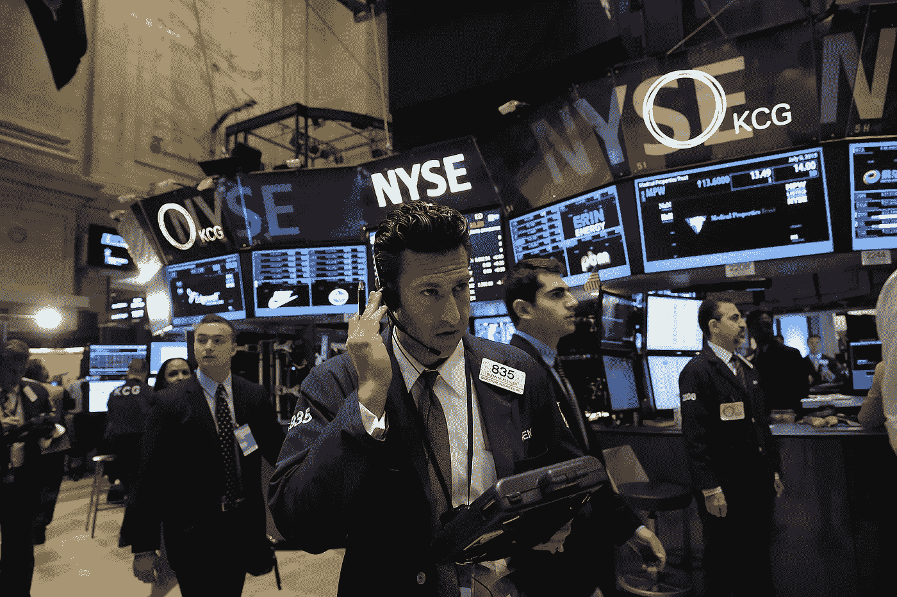
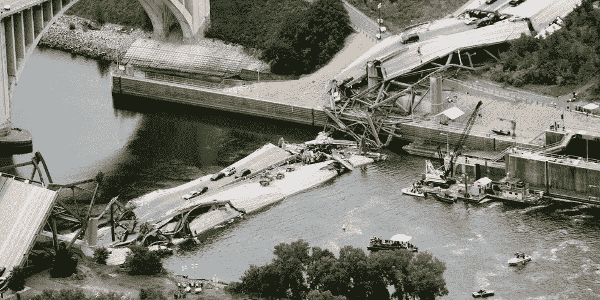
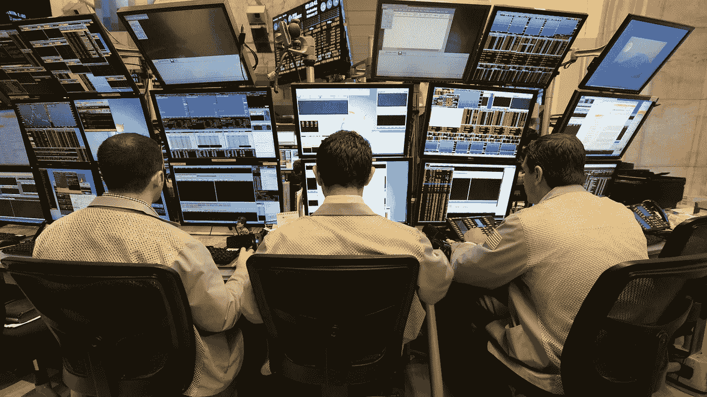
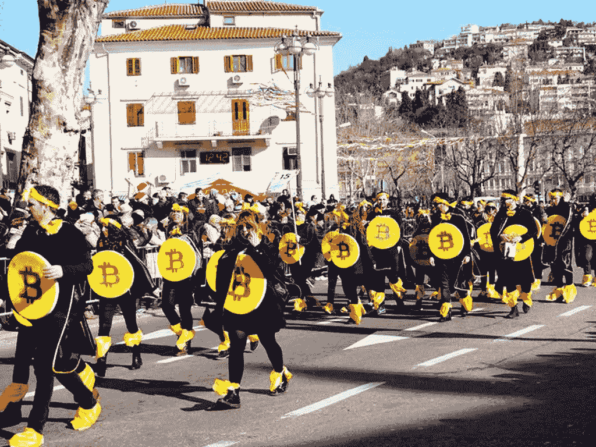
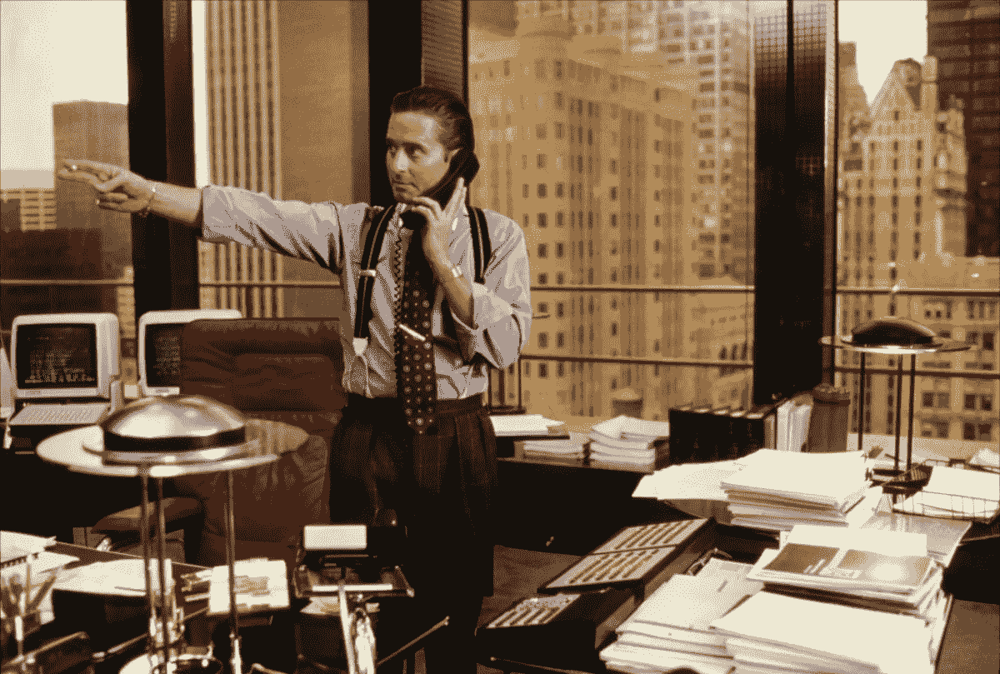

# 投资曾经很简单——一点点加密货币

> 原文：<https://medium.datadriveninvestor.com/investing-used-to-be-simple-the-case-for-a-little-cryptocurrency-d0db88300dca?source=collection_archive---------22----------------------->

“Good morning, welcome to the NYSE, may I take your order?”

根据你的年龄，投资就是把你的 401(k)退休金放在一边，或者委托你的股票经纪人去做剩下的事情，你只需要专注于你的工作，度过每一天。否则，投资就是在债券和股票之间进行分配，并根据你的年龄和风险偏好，相应地调整投资比例。传统智慧会让我们相信，将我们的储蓄配置到像标准普尔& P500 这样的指数工具中，将确保我们退休后有一笔可观的储蓄，不管我们是否知道指数由哪些股票组成，我们的信心是，美国经济将永远增长，在更长的时期内，标准普尔& P500 将跑赢大盘，但这就是这一假设的谬误所在——在更长的时期内，标准普尔& P500 的数据充其量只能令人失望。

据 DataTrek 的 Nicholas Colas 称，过去 20 年，S&P500 的年均复合增长率仅为 11%？可怜的 5.6%，是自 20 世纪 40 年代末以来最糟糕的表现。经过一个世纪的通货膨胀调整后，收益为每年 7%，如果你能活到一百岁以上，这还不错，但对于那些对更近的未来更感兴趣的人来说，S&P500 的实际年回报率仅为 3.3%，勉强与通货膨胀持平，当然也不足以让你辞掉日常工作，或接受你一直推迟的手工艺项目，以获得额外的 Etsy 收入。这就是现代投资的问题所在——我们需要为我们的投资承担更多的个人责任，扮演比我们的祖先过去更积极的角色。前所未有的经济增长几乎已经结束，这再次证明了德国的一句老话:“树木不会长到天上去。”

如果你想知道为什么尽管股市的结果微不足道，但富人似乎越来越富，这是因为他们可以接触到高薪的投资专业人士，他们自 2009 年(金融危机后)以来将客户的投资组合多样化，投资于各种资产，从私募股权到风险资本，从固定收益到另类资产类别，我将很快讨论这些资产。但普通的夫妻店几乎永远不会获得这些风险更高但利润更高的机会，因为它们仅限于合格的投资者——这些投资者拥有足够的净资产，使他们(在某种程度上)更能免受风险资本等投资的内在风险。但监管保护普通民众的结果是，他们无法为体面的退休储蓄，也无法摆脱中等收入陷阱、债务陷阱、贫困陷阱或经济学家喜欢贴上标签的任何其他陷阱。

Valet was understandably nervous about parking this one.

如果你想知道“聪明”的钱去了哪里？不是股票。上周，全球最大的资产管理公司之一贝莱德(BlackRock)公布了一项对 230 家机构客户的调查，这些客户管理的资产总额为 7 万亿美元。调查显示，超过一半的机构客户计划在今年减少股票投资，其中大多数客户位于美国、英国和加拿大。重新分配的目的地？替代实物资产，如基础设施、农田、绘画和其他收藏品，以及私募股权。尽管程度较轻，但基金经理们也在讨论向替代性虚拟资产——加密货币——投入少量资金。

但在我们深入研究加密货币之前，理解为什么经理们现在在其他资产中寻求阿尔法是有帮助的。

## 基础设施

虽然基础设施似乎是政府而不是私人投资者的权限，但历届政府忽视美国摇摇欲坠的基础设施的事实，为私人投资者创造了一个可能一生只有一次的机会，来接触和控制现代生活的一些关键组成部分。从机场到高速公路，从铁路到公共交通，从桥梁到大坝，曾经让世界羡慕的美国基础设施都处于失修状态。

Not good.

根据美国土木工程师协会(ACSE) [2017 年基础设施成绩单](http://www.infrastructurereportcard.org/)每四年发布一次，美国基础设施获得 D+评级，与 2013 年的评级相同。

ACSE 估计，到 2025 年，美国将需要花费约 4.5 万亿美元来改善该国的道路、桥梁、大坝、机场、学校等状况，私人投资的范围或需求比以往任何时候都更加明显。特朗普政府预计地方和州政府将为基础设施买单(联邦预算更有可能包括为边境墙而不是急需的基础设施维护提供资金)，地方和州政府要么破产要么接近破产，私人投资者有史以来第一次抓住了拥有美国关键基础设施的机会。

据 OCO Global 首席执行官马克·奥康奈尔称，

> "国际上对投资美国基础设施并不缺乏兴趣。"

IFM Investors 的基础设施执行董事汤姆奥斯本(Tom Osbourne)在评论中甚至更为乐观。

> “我认为弥合美国基础设施投资缺口的唯一可行途径是涉及多种资金来源，包括适当的私营部门。”

虽然基础设施项目通常需要几十年才能盈利，但在美国基础设施的情况下，因为基础设施投资主要用于急需的维修和升级，所以利润范围更加集中，这意味着投资者可以在比以往更短的时间内看到投资回报并控制美国的关键基础设施。

## 农田

一些分析师认为，下一场战争将围绕食物和水展开，随着全球人口以前所未有的速度增长，以及发展中国家的生活水平不断提高，有更多证据表明，食物和水在短期内将成为越来越有价值的商品。中国日益壮大的中产阶级喜欢吃肉，这已经给农田带来了巨大的压力。

What a blue steak looks like.

牲畜是世界上最大的土地资源使用者，用于生产饲料的牧场和耕地几乎占全部农业用地的 80%。全球三分之一的可耕地用于种植饲料，而地球上 26%的无冰陆地表面用于放牧。随着人口的增长和日益城市化，全球可耕地将面临竞争和压力，不仅是其他土地使用的竞争，也是每英亩生产更多粮食的竞争。合格的投资者和他们的经理们押注这一趋势将持续到下个世纪，因此在农田上下了大赌注。除非这个世界一夜之间对芝士汉堡失去兴趣，否则有足够的理由考虑投资农田。

## 绘画和其他收藏品

几千年来，富人一直在收集绘画和其他收藏品。但油画一直都在富有的投资者觊觎的物品清单上，原因有几个。首先，情人眼里出西施，艺术品的高价经常被用来掩盖不那么清白的交易。由于拍卖人和估价人只能提供艺术品的“指示性”价值，它们在拍卖场上的实际价格可能会有很大差异。随着富裕的中国人的崛起，全球对艺术品，尤其是绘画的需求急剧上升。画作尤其受到青睐(尤其是为了方便资本外逃)，因为它们易于运输(一卷雷诺阿的作品可以小到一份《纽约时报》)和流动性(总会有价格合适的买家)。难怪备受通缉的 Jho Low(拥有 100 万美元的名气)用据称来自马来西亚主权财富基金的非法所得购买了不止一幅画，而是几幅画，并将它们藏在瑞士，以便在他陷入困境时迅速处置。

This is what US$137 million looks like. Money, it seems, does not always afford taste.

但是，经理们越来越多地将客户的资金分配到绘画上，稀有的古董和经典汽车、威士忌和葡萄酒都进入了多才多艺的资产管理公司的视野。尽管并非所有这些另类资产都一定会盈利，但它们的排他性意味着，如果它们盈利了，它们的投资者无疑会将这些资产出售给那些他们最初收购这些资产的社会精英阶层。

## 私募股权

私募股权有多种形式，从不良债务资产收购到收购和风险投资。私人股本让精心挑选的投资者能够接触到投资界一些最独家的交易和机会。尽管私人股本过去仅限于投资于私人控股公司或重组陷入困境的公司，但自那以来，它已扩大到收购越来越奇特的资产，包括驳船，甚至不良债务。

Investment manager’s office left plenty of clues where substantial fees had gone.

传统上，私募股权被用来帮助重组陷入困境的公司(如西尔斯)，并为公司带来价值，然后再以更高的价格出售。私募股权也为一些最热门的初创公司提供了风险资本，以期这些公司随后上市，让投资者获得投资回报。

## 受到冷落的散户投资者

对于独立富裕的人来说，投资选择和机会并不缺乏，但对于散户投资者来说，选择要有限得多，许多退休基金和大学基金都要受股市波动的影响。如果考虑到本世纪实际工资增长乏力，那么过去 20 年普通投资者对股票不再抱有幻想就不足为奇了。相比之下，在 1999 年之前的 20 年里，S&P500 的实际复合名义回报率分别为 17.5%和 13.7%——这就解释了为什么在互联网泡沫到来之前，股票被认为是投资的最佳选择。

“One potato, two potato, three potato…”

但对于设定 2040 年及以后财务目标的散户投资者来说，股票可能不再提供他们曾经提供的回报。市盈率已经处于天文数字的高位。现在纳斯达克市场上有无数股票的市盈率比实际市盈率更高。几乎可以说，市场没有从互联网泡沫中学到任何东西，一旦获得收益，那些除了不断增长的用户群、一个热门创意和一位超级明星创始人之外，几乎没有什么东西的公司可以在 IPO 时“登月”——让四年的利润见鬼去吧。科技公司开始意识到，市场只能吸收这么多的渴望——科技公司已经在更长时间内保持私有，并在没有进入市场的情况下被更大的公司收购。就在最近， [SAP 以 80 亿美元收购了 Qualtrics](https://www.forbes.com/sites/alexkonrad/2018/11/11/sap-swoops-in-to-acquire-qualtrics-for-8-billion-just-before-its-ipo/#2c3f70eb6be1) (一家调查软件公司)，就在该公司即将上市的前几天。虽然人们很容易希望未来几年有一批新的颠覆性科技公司上市，为 IPO 市场注入活力，但不能保证这种情况会发生。经理们已经注意到，股票已经被高估，随着客户撤出股票，公司有充分的理由寻求收购，而不是 IPO，这将使他们的投资受到股市波动的影响。

上周，同样孵化科技公司的日本企业集团软银(Softbank)宣布，将缩减对共享办公提供商 WeWork 的投资，这表明科技和创业领域的泡沫可能开始消退。

## ICO 热

对于散户投资者来说，2016 年至 2018 年年中的首次硬币发行(ICO)热潮最终成为了一个获得一些风险更高的投资的机会，这些投资长期以来一直是合格投资者的权限。突然之间，常常是一夜之间，财富在 ico 中被创造出来，不管它们的价值如何。虽然许多投资者在这些 ico 上损失了很多钱，但也有许多人获得了改变人生的财富。

Halloween costumes took on a whole new meaning.

可以肯定的是，在大多数情况下，ico 的优点和价值至多是可疑的——也许不比网络公司在网络泡沫前夕更可疑。相对于股票而言，在一家公司持有数字代币的法律地位和好处很难确定。但或许整个 ICO 事件的唯一可取之处(如果有任何可取之处的话)是，投资阶层可以参与其中，而迄今为止，这一阶层仅限于非常富有的人。不像 IPO 前的股票，通常只有关系好或富有的少数人才能获得，几乎任何人都可以参与 ICO。散户投资者面临的个人责任是对 ICO 项目以及 ICO 代币的优点和价值(或缺乏)进行尽职调查。

虽然媒体很快突出了散户投资者在 ICOs 上下注并输掉农场的故事，但也有无数散户投资者通过提前退出改变了他们财务生活的故事。可以理解的是，一个金融破产的故事可能比一个白手起家的故事更有助于推动加密货币和 ico 的发展。

## 面向大众的加密货币

随着投资变得越来越具有挑战性，无论是对富人还是不太富裕的人来说，这两类投资者都需要承担更多的个人责任来创造阿尔法，对于散户投资者来说更是如此。对于富人来说，家族理财室已经开始将部分资金储备到加密货币中，特别是比特币和以太坊，一些更具前瞻性的基金经理也开始储备到 Monero 和 ZCash 等注重隐私的加密货币中。但这一趋势的一线希望是，它不仅仅局限于高净值客户。与其他替代资产类别不同，许多替代资产类别只对合格投资者开放，加密货币对所有人都开放。

“Behind that door lies greed and all it brings.”

整个世界正在进入一个未知的发展阶段。由于利率长期处于如此低的水平，从股票到房地产的资产泡沫现在已经增长到可能与其内在价值不相称的水平。很难说当这些泡沫不可避免地破裂时会发生什么，也很难说当泡沫真的发生时，政府有什么可用的货币政策工具来应对它们。低利率也可能助长了 ico、加密货币和区块链公司的投机泡沫，现在这些泡沫已经破裂，长期后果仍有待观察。为了理解加密货币和区块链的长期价值主张，聪明的投资者需要通过查看上次鲜为人知的颠覆性技术——互联网——的出现来消除噪音。

在 21 世纪初互联网泡沫的前夕，许多公司不知道技术有多重要，也不知道如何将它应用到自己的业务中。今天，许多已经开始试验区块链技术的公司现在报告说，他们既不知道如何应用这项技术，也不知道如何利用它来改进他们的流程。让我们不要忘记，这正是公司对互联网的反应。人们是否认为这种情况可能会改变，在很大程度上取决于人们是否认为区块链技术与互联网一样具有破坏性，或者人们是否仅仅将其视为寻找问题的解决方案。严格从技术和社会工程的角度来看，区块链和比特币解决了迄今无法克服的问题——重复支出问题、拜占庭将军的问题，并为维持分散的价值转移系统提供了经济激励。以前从未有过这样的事。因此，基金经理将至少一部分资产配置到加密货币中，或者至少考虑这一举措，也就不足为奇了。