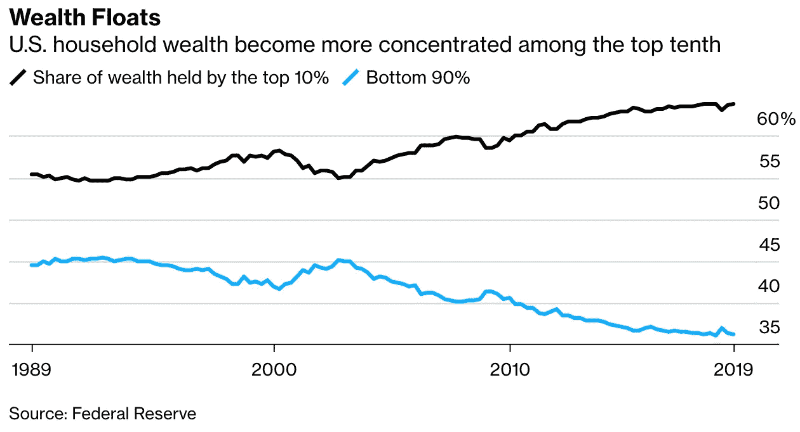
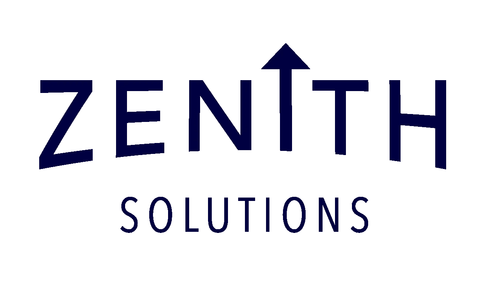

# 有目的的投资

> 原文：<https://medium.datadriveninvestor.com/investing-with-a-purpose-aefc32a7be79?source=collection_archive---------10----------------------->

投资是创造财富和财务自由的重要组成部分。

[彭博最近报道](https://www.bloomberg.com/news/articles/2019-11-09/one-percenters-close-to-surpassing-wealth-of-u-s-middle-class)美国人口中最富有的 1%(“1%”)的财富几乎超过了人口中上层阶级的财富总和。

此外，美国前 10%的人口控制了全国 63%的财富。为什么？主要是因为他们在 T2 的投资。仔细看看下面的图表——自 2008 年至 2009 年的衰退时期以来，财富不平等一直在加速。

有两个因素导致了这种日益加剧的不平等。第一个是报道的事实，第二个是我的观点，有事实支持。

1.  1%的人拥有美国家庭所持股票投资的 50%以上([高盛，2019](https://finance.yahoo.com/news/the-richest-1-own-50-of-stocks-held-by-american-households-150758595.html) )
2.  1%的人比其他人投资于表现更好、目标更明确的投资

虽然第一条是事实，但市场上有很多新的技术工具来帮助人们投资，如 [Robinhood](https://robinhood.com/) 、 [Acorns](https://www.acorns.com/) 和[Betterment](https://www.betterment.com/)——等等。任何人都可以用 1 美元开始投资。

投资的能力和途径与通过投资创造财富并不相关。投资是一项艰巨的任务，需要一个可重复的、不带感情色彩的过程，才有机会表现出色。

1%的人产生更好的投资结果的原因是，他们绝大多数( [75%的高净值个人](https://pressroom.aboutschwab.com/press-release/schwab-investor-services-news/most-americans-dont-have-financial-plan-and-many-think-t))写下他们的财务计划，并与[一位高质量的财务顾问](https://news.na.chubb.com/2018-03-15-Chubb-and-Oliver-Wyman-Release-Research-on-Importance-of-Financial-Advisors-Addressing-Insurance-Needs-for-Holistic-Wealth-Management)合作，以实现计划中概述的目标。他们进行系统投资，以确保产生足够可观的回报来实现这些目标。

这些投资以各种形式和规模出现，专门为他们的目标需求量身定制。了解长期目标成本允许他们承担适当的投资风险来实现目标。

如上所述，有目的的投资可能会比没有目的的投资产生更好的结果。大多数人无法接触到服务于 1%的高质量理财顾问。这让大多数人进退两难，要么自己投资，使用非个人化的技术解决方案，要么为财务顾问支付过高的费用。

这种困境是美国财富不平等持续存在的原因。这种困境正是创立 [Zenith Solutions](http://www.networthzenith.com) 的原因。我们是一家高质量的金融咨询公司，接触 1%的财富创造策略。我们将利用这种风险为我们的客户创造数百万美元的财富。

Zenith 的投资流程从顶级资金经理那里提取最佳实践、当前经济观点和最佳想法，为我们的客户造福。我们处于一个独特的位置，通过财务规划、目标设定和投资来帮助普通人增加他们的净资产。

与我们一起在你的个人投资过程中创造一个目标。

