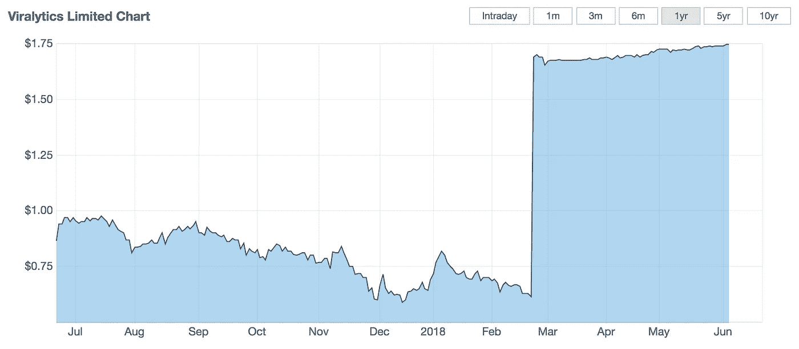

# 投资对生存至关重要。

> 原文：<https://medium.datadriveninvestor.com/investment-will-be-crucial-for-survival-e5178f7ddebb?source=collection_archive---------15----------------------->

## 开始学习，这将是每一个人为自己。

“1 U.S. dollar banknote” by [NeONBRAND](https://unsplash.com/@neonbrand?utm_source=medium&utm_medium=referral) on [Unsplash](https://unsplash.com?utm_source=medium&utm_medium=referral)

除非我们的薪水达到六位数，否则我们很可能攒不下多少钱。

根据经验，我可以告诉你——如果你在澳大利亚悉尼年收入 10 万美元，就别想拥有房子了。

政府正在提供帮助，这很好——但最终还是要每个人开始为自己着想。

退休金基金获取法可能会有所帮助，但即便如此，在我们考虑储蓄之前，还有很多事情要做。

那我们该怎么办？

如果我不能提供一个可行的解决方案，我不会提出问题。

我相信在医疗保健行业，我相信好的研究和优秀的管理会有回报。

奇妙的是，购买这些股票并不昂贵。

它们是低价股——高风险，对吗？

适当的研究告诉我免疫肿瘤学是我的投资方向。

但是有很多选择，所以我们如何选择一些有意义的呢？

我不是科学家，对癌症研究了解不多。

没关系。

看看运营公司的个人的资质，他们投资了多少，他们会损失多少，他们的经验是什么，最重要的是他们的业绩记录。

我选择 ***IMU:ASX，Imugene。***

**原因**:

**管理:**

**Leslie Chong** ，首席执行官——前罗氏基因泰克公司。

一位才华横溢的科学家，有着丰富的经验——试图在她拥有 10 年以上经验的行业中提高自己。

**保罗·a·霍普**，生物技术企业家。

Hopper 在寻找生物技术领域的优秀公司进行投资方面有着出色的背景。他的记录？他把 ***病毒分析*** 的股票送上了天价。

**Viralytics Chart Post Takeover.**

除此之外，在 Imugene 的案例中，他采取了一种更加个人化的方式，他在公司投入了大量资金，并且明智地选择了人才。

**Axel Hoos 博士，**葛兰素史克制药公司(GSK)高级副总裁兼肿瘤研发治疗区负责人。

如果有一个具备上述资质的团队，股票交易低于***【0.022 美元】*，我会抓住机会。**

***为什么我觉得 Imugene 很特别？***

Imugene 在免疫治疗和抗癌方面采取了独特的方法。他们专注于 B 细胞，并希望开发 Her-Vaxx，这是一种利用人体免疫系统对抗癌细胞的疫苗。

这是一门正在被测试和证明的科学，比如基因泰克公司；已经上船了。

Imugene 有机会吗，结果是肯定的——但是和任何投资一样，事情有可能出错。

**—公平免责声明，请做好调查。**

这篇文章是我个人感兴趣的投资系列的一部分。

所表达的观点仅仅是我自己的，因此人们应该做自己的研究。

我会发布更多我感兴趣的投资，但一如既往——它们只是我的观点。

**投资前请做好自己的研究。**

2018 年 10 月 19 日[*www.datadriveninvestor.com*](http://www.datadriveninvestor.com/2018/10/19/investment-will-be-crucial-for-survival/)*发布*。**