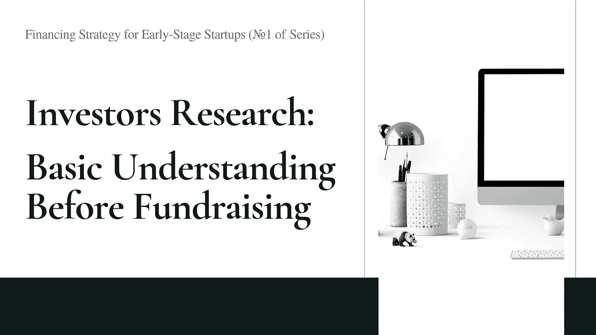

# 投资者研究:筹资前的基本认识——机构投资者

> 原文：<https://medium.datadriveninvestor.com/investors-research-basic-understanding-before-fundraising-c9744436aba4?source=collection_archive---------3----------------------->

## 早期创业公司的融资策略(系列之一)

寻求种子或 A 轮融资的创业公司可能会感到不知所措。与 B 轮或未来的融资不同，创始人可能还不熟悉 VC 圈或融资的流程。根据 Crunchbase 的数据，美国每年有数百家风险基金成立。这还不包括总部在美国以外的美元基金或企业风险资本，但许多人仍然对美国的初创公司感兴趣。

了解风险投资市场和融资动态对于了解谁可能是你的初创企业的潜在投资者至关重要。本文将强调主要因素，并举例说明一些可能区分投资者投资活动的例子。

 [## 风险投资家在给创业公司播种时会考虑什么标准？数据驱动的投资者

### 2017 年，风险投资资金攀升至十年来的最高水平。你的创业公司目前吸引风险投资的机会是…

www.datadriveninvestor.com](https://www.datadriveninvestor.com/2018/04/20/what-criteria-do-venture-capitalists-consider-when-seeding-a-startup/) 

# 1.融资类型:股权、债务或(甚至)代币

种子或 A 轮创业公司的公司融资主要是处理[股权融资](https://www.investopedia.com/terms/e/equityfinancing.asp)，这意味着投资者以创业公司的股份为对价，向你的创业公司投资现金，将投资者变成创业公司的股东。 [SAFE(未来股权简单协议)](https://www.ycombinator.com/documents/#safe)是股权融资的一种，由著名加速器 [YC (Y Combinator)](https://www.ycombinator.com/) 推出，自 2013 年以来被广泛用于早期融资。

在某些情况下，[债务融资](https://www.investopedia.com/terms/d/debtfinancing.asp)可以单独进行，也可以与股权融资同时进行。这意味着债务投资者借钱给你的创业公司，然后他们成为债权人。例如，[SVB](https://www.svb.com/blogs/derek_ridgley/extend_your_startup_s_runway__how_venture_debt_works)[(硅谷银行)](https://www.svb.com/)推出的[风险债务](https://www.svb.com/blogs/derek_ridgley/extend_your_startup_s_runway__how_venture_debt_works)就是初创企业债务融资的一种选择。

2017 年，代币融资 [ICO(首次发行硬币)](https://www.investopedia.com/news/what-ico/)成为区块链项目融资的一种流行方式。与基于公司治理的股权融资不同，ICO 基于[令牌经济](https://en.wikipedia.org/wiki/Token_economy)。有一个短暂的时期，某些初创公司，尤其是那些在区块链领域的初创公司，很难在 ICO 或传统股权融资之间做出选择。ICO 的受欢迎程度已经大大下降，因为许多国家的监管机构警告说，ICO 要么是非法的(如[中国](https://www.bbc.com/news/business-41157249))，要么需要在当前的监管框架下受到监管和密切监控(如[美国](https://www.sec.gov/ICO))。

股权融资是当今大多数创业公司的主流选择，因此本文将不包括对债务和代币融资投资者的讨论。

# 2.投资目标:风险投资与风险投资

投资者不一定是用自己的资金进行投资。事实上，我们在市场上看到的大多数风险投资公司都是由基金投资者(即[LP，或有限合伙人](https://www.investopedia.com/terms/l/limited-partner.asp))出资，并由基金管理公司(即[gp 或普通合伙人](https://www.investopedia.com/terms/g/generalpartner.asp))管理的风险基金。这些机构风投纯粹是为了最大化投资者和自己的财务回报。根据普通合伙人和有限合伙人之间的合同安排，每个基金都有自己的一套授权。每个基金管理公司都在多年的投资实践中发展自己的投资理论和哲学。这些深刻地区分了每家风险投资公司在交易筛选、投资、管理和退出方面的策略。例如， [a16z](https://a16z.com/) 目前在多个基金中管理着 100 亿美元的资产，包括[生物基金](https://a16z.com/2017/12/14/second-bio-fund/)、[加密基金](https://a16zcrypto.com/)和[文化领袖基金](https://a16z.com/2018/08/22/introducing-the-cultural-leadership-fund/)。

有一些，我们已经看到更多成熟的初创公司和企业投入资本投资初创公司。他们被归类为 CVC，或企业风险资本。有些创投公司看似在公司的品牌保护伞下，但它们独立于公司运作，业务目标是追求财务回报，而不是像典型的创投公司那样实现战略协同。Google Ventures 和 [Legend Capital](http://www.legendcapital.com.cn/en/) 就是其中的两个例子。然而，也有许多 CVC 的主要目标是从投资和并购中寻求协同创造，如[阿里](https://www.alibabagroup.com/en/ir/presentations/Investor_Day_2018_Synergy.pdf)。

CVCs 领投种子或 A 轮融资并不常见，因为相当多这类投资者关心战略联盟，并更倾向于影响初创公司的未来业务路线图。但是，如果一些初创公司需要依靠投资者的生态系统来快速发展业务，这可能不是一个坏策略。

# **3。投资阶段:仅早期与所有阶段**

某些风险投资在创业阶段方面是灵活的。他们的投资范围可以从种子阶段到后期阶段。从理论上讲，一家初创公司在早期阶段获得了投资者的资金，可能会在未来寻求他们的后续投资。例如，最近一个硅谷独角兽 [Scale AI](http://www.scale.com/) 已经被 [Accel](https://www.accel.com/) 投资了其[系列 A](https://scale.com/blog/announcing-our-series-a-with-accel) (领投人)[系列 B](https://scale.com/blog/series-b) (联合领投人)[系列 C](https://scale.com/blog/series-c) 。

一些风投可能会严格关注早期投资，他们不太可能领导甚至参与 B 轮或任何后续投资。[加速器](https://en.wikipedia.org/wiki/Startup_accelerator)通常专注于系列种子甚至种子前融资。 [Y Combinator](https://www.ycombinator.com/) 和 [500 Startups](https://500.co/) 仅是早期初创公司的积极投资者。

初创公司在每个阶段都有投资策略，得到投资者支持的优势是显而易见的。在接下来的几轮融资中，投资方可以继续领投或参与。这些投资者也可能更善于在招聘、合伙等方面扩大初创公司的规模。与关注早期阶段(尤其是加速器)的投资者合作的一个好处是，有机会就早期运营问题获得亲自指导。

# 4.投资部门:特定与一般

大多数风投至少会将投资分为两类，企业投资或客户投资。一些风投可能会强调某些领域，因为这是他们团队的优势所在。在那些有特定行业焦点的公司中，某些风险投资公司可能会为该行业设立专项基金。例如，a16z 有一个专门的生物基金，他们在 T2 的生物领域建立了广泛的投资组合。

也有专注于一个领域的垂直风投。 [Ribbit Capital](https://ribbitcap.com/) 致力于金融科技投资，他们已经捕获了知名的投资组合，如[比特币基地](https://www.coinbase.com/about)、 [Gusto](https://gusto.com/about/investors) 、 [Revolut](https://www.revolut.com/en-US/about-revolut) 。此外，鉴于 CVC 来源于公司自身的业务，很可能 CVC 也有特定的行业重点。

与专注于某个行业的投资者合作，将有利于初创公司获得更深入的行业指导，并在同一生态系统中获得商业机会。与拥有广泛投资组合的投资者合作，可能有利于初创公司在不同领域获得合作伙伴关系和客户。

# 5.投资地域:单一区域还是跨区域

地理位置是区分投资者投资策略的另一个重要因素。这是风投使命的一部分。某些风投可能会指出，他们关注的是某些特定的跨区域多样性。例如，[光速](https://lsvp.com/portfolio/)的投资组合位于美国、中国、印度和以色列，[红杉资本](https://www.sequoiacap.com/)也是如此。如果风投没有明确表示他们正在放眼一个地区之外，而且他们在其他地区也没有业务，他们很可能主要专注于一个地区。风投只关注一个地区的情况并不罕见，因为另一个地区的市场动态可能完全不同。

大多数早期创业公司在一个地区开展业务，没有必要考虑跨地区的问题。但对于那些在第一天就面临跨地区问题的人来说，寻找思想开放、能够在跨境层面投入资本和业务资源的投资者可能更具挑战性。理想的情况是，这些初创企业能够得到风投的支持，这些风投遍布全球，或许能够在所有相关市场提供帮助。

****

F 募集资金不应该占用创始人很大一部分时间，但不幸的是，它仍然占用了创始人很大一部分时间。学习更多关于投资者的基础知识有助于创始人研究并以正确的方式向正确的投资者推介。

***

*免责声明*

*本文不应被解释为或以任何方式依赖于融资、投资、法律、税务或其他建议。读者应该向你自己的顾问咨询有关法律、商业、税务和其他与任何融资或投资活动相关的事宜。*