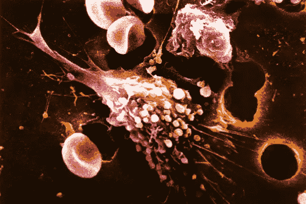
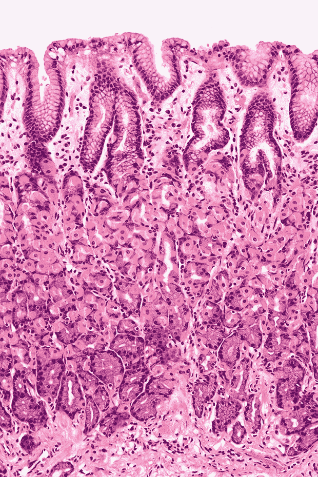
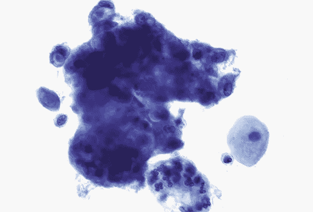
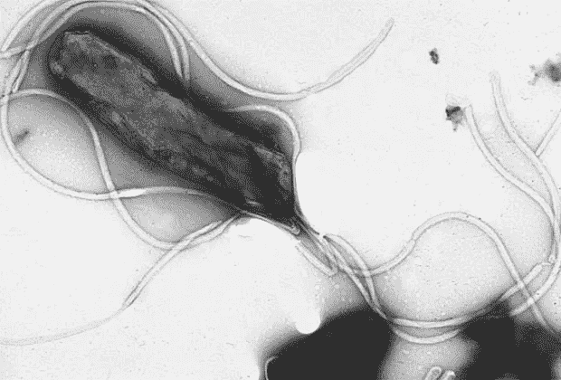
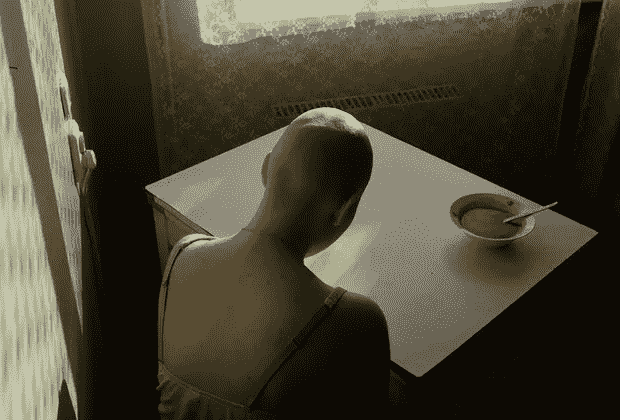

# 隐形杀手。科学家发现了癌症的原因。我们能抵御它吗？

> 原文：<https://medium.datadriveninvestor.com/invisible-killers-scientists-found-the-cause-of-cancer-can-we-protect-against-it-d42c0513670d?source=collection_archive---------5----------------------->

## 夏洛特北卡罗来纳大学的美国科学家在《分子医学趋势》上发表了一篇文章，揭示了细菌和其他感染在癌症发展中的作用。原来，感染与特定的粘膜分子相互作用，激发恶性细胞的出现。

Photo: Phanie / NCI-ARNOLD / Diomedia

# 危险的同居者

众所周知，癌症的主要原因是吸烟、不健康的营养以及接触包括病毒、细菌和寄生虫在内的传染性物质。感染是肿瘤发展的第三个主要因素，占该疾病死亡人数的 10%。同时，人体表面和内部生活着数以百万计的微生物，其成分对每个人来说都是独一无二的，构成了其微生物组。

微生物群影响人类健康，保护它，但在疾病的情况下会引发许多疾病的发展，包括癌症。微生物对癌症的脆弱性、癌症的进展和对治疗的敏感性负有责任。

粘膜在抵御细菌方面的一个重要作用是覆盖消化、呼吸和其他器官的内表面。它含有糖蛋白，一种渗透上皮细胞膜的化合物。

这些分子形成了保护层。粘膜的糖基化程度(即糖蛋白的水平)决定了抗感染的水平。然而，在感染过程中，糖蛋白发生变化，影响细胞内部和外部的部分(结构域)。这可能有助于消灭微生物，也可能导致感染和炎症。

Mucous membrane and epithelial tissue

# 防御者和敌人

肿瘤中通常有过量的粘蛋白。美国国家癌症研究所认为其中一种糖蛋白 MUC1(或 episialin)是抗癌疫苗最有希望的靶点之一。这种化合物本质上是发展炎症和预防炎症之间的开关。MUC1 成为第一个研究该分子结构的粘蛋白。它含有胰腺、乳腺、肺、胃和肝脏的细胞。它的主要特征是一条 200-500 纳米长的糖“尾巴”，带负电荷，对病原体形成物理屏障。分子内部执行信号功能，影响细胞的新陈代谢。

 [## 医疗保健的未来正在被一场大型技术入侵所塑造|数据驱动型投资者

### 过去十年，全球经济的所有部门都经历了大规模的数字颠覆，而卫生部门现在…

www.datadriveninvestor.com](https://www.datadriveninvestor.com/2018/11/02/the-future-of-healthcare-is-being-shaped-by-a-big-tech-invasion/) 

当 MUC1 的外部部分与细菌结合时，内部结构域发生分离。磷酸残余物加入其中，启动了许多不同的过程:促炎因子的合成、笼的外膜粘附(偶联)、它们的分化和被称为凋亡的程序性细胞死亡。

迄今为止，细菌不像同样的病毒那样被认为是癌症的主要原因。只有少数细菌表明，它们可以通过启动炎症过程、释放毒素和其他 DNA 损伤代谢物或破坏细胞信号通路来引发恶性肿瘤的发展。已知两种可导致癌症的广泛细菌感染。这是幽门螺杆菌，与胃癌和淋巴瘤有关，以及伤寒沙门氏菌，与慢性伤寒患者的胆囊癌有关。但是可能还有其他风险增加的感染。

# 主要威胁

*空肠弯曲杆菌*是感染性中毒最常见的原因之一，是弯曲杆菌病的一种病原体。这种细菌穿透粘膜层进入消化道的上皮组织，引发肠胃炎。当微生物与 MUC1 结合时，糖蛋白与微生物一起释放到粘液层中。目前还不知道这是否能阻止癌症的发展。细菌本身通过被污染的食物和水进入人体。儿童、老人、免疫力低下的患者都有风险。预防的方法是适当的烹饪。

Cell with vacuum containing mucins

慢性*幽门螺杆菌*感染导致溃疡和癌症。粘蛋白已被证明是细菌的一个重要障碍。然而，当与细菌结合时，细胞内 MUC1 结构域能够与 NF- kB 相互作用，NF-kB 是一种负责调节凋亡和细胞周期的转录因子。这种信号通路调节的破坏导致炎症、自身免疫性疾病和肿瘤发展。为了预防感染，专家建议保持手部卫生。污染是通过接触被污染的物品和携带感染者而发生的。

*流感嗜血杆菌*导致呼吸道感染，包括肺炎。在慢性阻塞性肺病(COPD)中，气道经常被这种细菌定居。慢性阻塞性肺病也是肺癌的一个危险因素。该微生物与 MUC1 的相互作用已被证明会导致特定受体的调节发生变化，进而参与肺腺癌的进展。

肠道肿瘤的另一个潜在罪魁祸首是大肠杆菌，这是一种肠道疾病的病原体。当微生物与 MUC1 相互作用时，就会发生炎症过程。感染已被证明与结肠直肠癌和膀胱癌有关，但尚不完全清楚它们是否是致癌因素。

# 其他害虫

在致癌病毒中，爱泼斯坦-巴尔病毒(疱疹病毒)和人乳头瘤病毒是众所周知的。前者与极具侵袭性的鼻咽癌(鼻咽癌)、霍奇金淋巴瘤(淋巴系统癌)、伯基特淋巴瘤、T 细胞淋巴瘤和胃癌有关。第二种可能导致宫颈癌，以及生殖器、后通道、喉咙和头部的肿瘤。在没有病毒的情况下，不会发生宫颈癌，也就是说，这种疾病显然与慢性感染有关。

包括流感在内的其他病毒是危险的，但在这种感染中，MUC1 有效地保护粘膜免受病原体的侵害。肝炎病毒经常导致肝癌。

Helicobacter pylori

至于寄生虫，通过泌尿道进入人体的血吸虫感染血液可导致癌症。这种蠕虫引起鳞状细胞膀胱癌的发展，是这种疾病的第二大原因。感染通常发生在地球的热带地区，当在自然水体中洗澡时。游客和卫生条件差的发展中国家的人们经常成为寄生虫的受害者。据估计，全世界有超过 2.07 亿人受到感染。

另一种致癌寄生虫是蠕虫*后睾吸虫*，它感染胆囊并导致胆管癌的发展。这种类型的肿瘤在西方国家很少见，但在东南亚很常见。

# 如何逃脱

不久前，美国癌症协会(ACS)的研究人员得出结论，一半癌症病例的原因是不健康的生活方式。一般来说，外部环境因素是癌症的主要原因，只有遗传因素和简单的 DNA 随机突变仍然不受控制，这是我们无法以任何方式影响的。

许多影响可以消除，其他的可以最小化。这些措施通常包括保持健康体重、体育锻炼、戒烟戒酒、避免长时间暴露在阳光下和接触各种化学污染物。然而，现在可以增加疫苗接种(特别是针对人乳头瘤病毒和肝炎)以及其他类型的传染病和寄生虫病预防措施。

