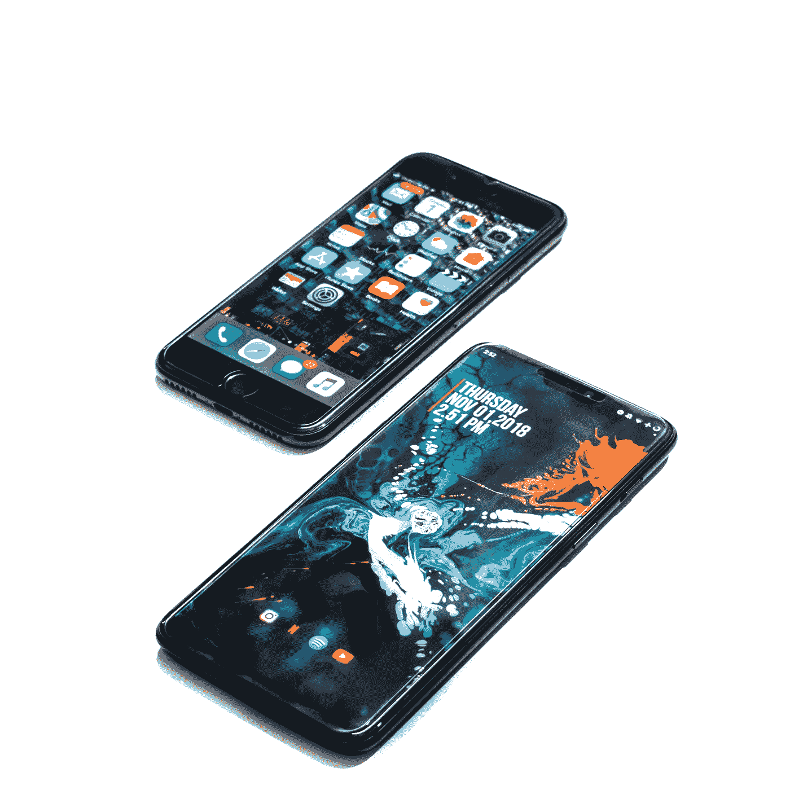

# iOS VS Android

> 原文：<https://medium.datadriveninvestor.com/ios-vs-android-35149e9ad838?source=collection_archive---------1----------------------->

## 基于用户体验的比较

Photo by [Hardik Sharma](https://unsplash.com/@v4ssu?utm_source=medium&utm_medium=referral) on [Unsplash](https://unsplash.com?utm_source=medium&utm_medium=referral)

谈到用户体验，iOS 仍然远远高于 android。尽管习惯了其中一种的人需要一些时间来掌握另一种。

大约一年前，我得到了一部 iPhone。我仍然有一台正在使用的安卓平板电脑，但我需要一部手机。我买 iPhone 的决定受到了几个因素的影响。我在之前的一篇文章中谈到了其中的首席。

现在过了一年(还有几个月)，我后悔买了 iOS 设备吗？老实说，知道手机有一天会过期，我必须换一部新的给我一种怀疑的感觉。我是那种喜欢用很久的东西的人。

最关键的是，新 iPhone 可能没有我喜欢的一些东西。比如我的 iPhone 还有按钮。我见过没有按钮的，我更喜欢按钮仍然存在。但我不认为我现在有这个选择。

打算几个月后把 iPhone 换成更新的。我想到了迄今为止我使用这个设备的经历。作为一个用过 Symbian，Java，还在用 android 的人，我觉得 iOS 太棒了。

 [## 幸福的算法？数据驱动的投资者

### 从一开始，我们就认为技术正在使我们的生活变得更好、更快、更容易和更实用。社交媒体…

www.datadriveninvestor.com](https://www.datadriveninvestor.com/2019/03/08/an-algorithm-for-happiness/) 

最初，当我开始使用 iPhone 时，我不得不问我的朋友如何导航。他们用 iPhones 已经很久了。这个系统非常奇怪。但是过了一段时间，我就习惯了。这让我意识到，iOS 关于 UX 的思想与 android 大相径庭。

以下是主要区别:

# 1.Android 显示了每个目的地的唯一路径。iOS 显示所有目的地的一条路径

机器人相信你可以同时做很多事情。iOS 认为你一次只能专注于一件事。这导致机器人试图满足用户应对许多开放的分心。iOS 只是专注于即时使用。

在 Android 上，如果你想回到你之前在做的事情，你必须离开你正在走的路，走一条独特的路。但是他们把每条独特的路径都做得很短。

在 iOS 上，你所做的每一步都是建立在前一步之上的。所以，如果你在短时间内浏览了很多东西，你可以连续回溯。

# 2.iOS 关闭时，您不能给它充电

这个有点烦。每次我在关机状态下充电，手机就会自动开机。当我意识到这一点时，我只是在关闭时停止充电。

然而，当你的电池没电了，你需要尽快接通电话时，这是很有利的。对于 android 设备，你必须等待一段时间，然后尝试打开手机。对于 iPhone，当电池电量正常时，手机会自动开机。

不过我不喜欢这个功能。我更喜欢掌控一切。

# 3.iOS 启动更快？

在这种情况下，我不太确定。也许这只是我的设备或它发生在每个人身上。我的猜测是后者。iPhone 的启动速度比 android 快得多。这不仅仅是更快，而是明显更快。

它不止于此。打开 iPhone 后，它就可以使用了。我仍然需要等待 android 上的一些东西到位。

我认为这落在设备的 RAM 上。但是 RAM 的差别并不是很大。你注意到像这样的事情了吗？

# 4.iOS 上的应用比 android 上的应用有更平滑的 UX

这是我观察到的另一个标志性差异。这两款设备上都有我的一些应用。android 上的用户体验很好，这一点毋庸置疑。但是 iOS 上的体验要好得多。

这就是我的意思。你在 android 上只需轻点 3 下就能完成的事情，在 iOS 上只需轻点两下或更少。我不知道，也许这是开发者有意为之，或者 iOS 只是让它这样。

这与内置应用无关。这些都是第三方 app。这让我很好奇。他们是偏爱 iOS 还是 iOS 只是给了应用更好的 UX？

# 5.iOS 是一个封闭的生态系统

我仍然使用 android 的主要原因是 iOS 的封闭性。从 iOS 设备向非苹果设备发送任何东西都是一场战争。在我当前的环境中，移动文件的能力对我来说非常重要。

另一方面，我不认为我会建议苹果开放生态系统。让他们的产品独一无二的部分原因是独特性。如果他们决定在这一点上让步，他们失去的顾客会比得到的多。

举个例子，几年前黑莓还是智能手机界的霸主。他们犯了一个荒谬的错误，向 android 开放了他们的独家功能，黑莓信使(BBM)。这一举动扼杀了他们的市场。如今，BBM 和黑莓手机都已失去主导地位。

综上所述，我认为 iOS 给人的用户体验比 android 更好。不过，安卓 UX 也不错。然而，这两个系统都有重要的优势，使它们引人注目。当 android 决定变得像 iOS 一样的时候，它就会遭遇厄运。同样，如果 iOS 变得像 android 一样，这将是其统治地位的终结。

我的苹果粉丝朋友开始担心 iPhone 看起来越来越像安卓手机了。首先是减肥比赛，然后是摆脱纽扣。现在争夺镜头优势。我希望你知道苹果并不是第一个在手机背后放置多个摄像头的公司。事实上，我见过一部背后有 4 个摄像头的手机。

让我们希望苹果不会忘记是什么让它们如此特别。