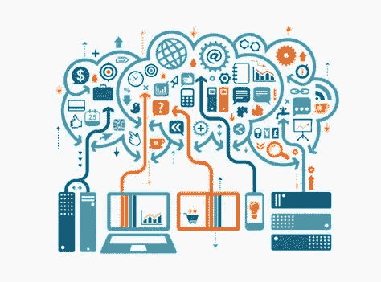

# 物联网和机器学习/深度学习

> 原文：<https://medium.datadriveninvestor.com/iot-and-machine-learning-deep-learning-f102bf578c99?source=collection_archive---------2----------------------->

几个互联网和基于网络的范例都在
万物互联(IoE)的保护伞下，如物联网(IoT)、物联网(IoP)和工业互联网(II)。IoE 被认为是未来技术的主要关键领域之一，并正在获得众多行业的广泛关注。IoE 传感器和设备正在生成大量需要存储和处理的高维异构数据。

在这一部分，我们将探索 IoE 和机器学习之间的一些重要交叉领域。

*   **医疗保健领域的 ML**

人口老龄化给医疗保健预算带来了压力，解决这一问题的方案是物联网，它在监控、诊断甚至通过互联网进行远程手术的可能性方面发挥着促进作用。

主要挑战之一将与节点的识别和安全有关。节点的安全性尤其重要，因为系统可能受到恶意活动的影响，敏感数据可能被操纵或丢失。

 [## 物联网解决方案如何改变供应链中的机遇——数据驱动型投资者

### 物联网(IoT)可能开始时规模很小，但它正在成为世界经济中的一个重要因素。事实上…

www.datadriveninvestor.com](https://www.datadriveninvestor.com/2018/11/14/how-iot-solutions-are-shifting-opportunities-in-the-supply-chain/) 

这一领域的另一个挑战是电信技术的优化组合和最大限度地提高这些技术的可靠性。

另一个挑战是如何开发一个实时位置跟踪系统。一个好主意是将 GPS、物联网和本地定位跟踪系统结合起来。

另一个挑战是从患者处持续获取数据和存储成本。这些方法中的一些是心脏和血氧饱和度检测，以及使用加速度计、陀螺仪和表面电极来记录数据。这里的挑战是大数据的管理。此外，非常需要开发智能算法来区分冗余数据并将其从存储中删除。

*   **智能电网中的 ML**

一般来说，深度学习使用多层神经网络将高层特征提取到低层特征的组合中，以找到分布式数据特征来解决复杂的机器学习问题。智能电网和清洁技术是机器学习技术的早期采用者。

光伏(PV)系统具有非线性特性，因此深度学习是解决这些问题的合适工具。太阳能光伏阵列的故障检测是提高光伏系统可靠性和安全性的关键任务。一个有故障的光伏系统可能会导致安全问题，在某些情况下可能会引起火灾。机器学习技术可以通过基于电压、电流、辐照度和温度的分析来检测故障，从而潜在地解决这个问题。

机器学习在智能电力环境中的其他应用与从零售商角度预测客户用电模式有关。

*   **供应链管理中的 ML**

组织不能孤立行动。他们很大程度上依赖于他们的供应商、客户和合作者的能力和资源。在当前的竞争环境中，供应链专业人员正在努力处理
大量的结构化和非结构化数据。

大数据分析是可以帮助他们克服问题(数据生产、数据捕获、数据组织方式)的最佳技术之一。

SCM 将物联网定义为: ***一个物理对象的网络，这些物理对象以数字方式连接，以在公司内部以及公司与其供应链之间进行感知和交互，从而实现敏捷性、可见性、跟踪和信息共享，以促进供应链流程的及时规划、控制和协调*** 。

在本文的剩余部分，我将探索如何让深度学习架构适合在物联网设备上运行。

物联网设备上的深度学习应用通常具有苛刻的实时要求。例如，基于安全摄像头的物体识别任务通常需要不到 500 毫秒的检测延迟来捕捉和响应目标事件。

然而，在设备端实现深度学习是困难的。的确，移动物联网设备的主要特点是低功耗，这通常意味着计算能力有限和内存大小小，而另一方面，深度学习需要高性能计算，功耗高。所以现有的深度学习库与物联网设备无关。

以下工作流程是卷积神经网络(CNN)的典型架构:

1-卷积层扫描输入图像以生成特征向量

2-激活层确定对于推断中的图像应该激活矢量中的哪个特征

3-池层减小了特征向量的大小

4-全连接层将每个潜在标签连接到汇集层的所有输出

降低功耗的一个有效方法是卸载到云。然而，卸载也导致最小 2 秒的延迟，延迟可能高达 5 秒，这不符合我们 500 毫秒的实时要求。因此，以目前的互联网速度，卸载到云还不是实时深度学习任务的可行解决方案。

在卸载不切实际的情况下，一个选择是将现有的深度学习平台迁移到物联网设备。然而，这是一项非常非常艰巨的任务，它提出了一个问题，即从头构建一个平台是否比移植现有平台更值得。如果没有卷积运算符这样的基本构件，这是非常困难的。此外，从头构建的推理引擎可能不会优于经过良好测试的深度学习框架。

我们回顾了 IoE 在感知、传输和存储数据方面的应用，以及机器学习在处理数据以获取信息含义和有用见解方面的应用。这篇文章表明，在每个商业领域，不同的机器学习技术被用于特定的问题。例如，SVM 方法可用于预测太阳能发电，神经网络可用于消费模式识别。

我们需要一种更便捷的方式来实现物联网设备上的深度学习，而不是从零开始手动构建模型。一种解决方案是实现深度学习模型编译器，该编译器将给定模型优化为目标平台上的可执行代码。由于计算资源的限制，当前的物联网设备通常执行单一任务。然而，我希望在未来拥有能够执行多项任务的低功耗物联网设备。为了支持这些设备，我们需要一个极其轻量级的消息传递协议来连接不同的服务。

感知节点使用经过处理的传感器数据，并对捕获的信息进行解释，例如对象标签和设备位置。

动作节点包含一组规则，这些规则确定当检测到特定事件时如何响应，例如当检测到所有者的脸时打开门。

**资源**:

*   【https://ieeexplore.ieee.org/document/8418156 号
*   【https://ieeexplore.ieee.org/document/8057306/ 
*   [https://ieeexplore.ieee.org/document/8554800/](https://ieeexplore.ieee.org/document/8554800/)
*   [https://ieeexplore.ieee.org/document/8373692/](https://ieeexplore.ieee.org/document/8373692/)
*   [https://ieeexplore.ieee.org/document/8270639/](https://ieeexplore.ieee.org/document/8270639/)