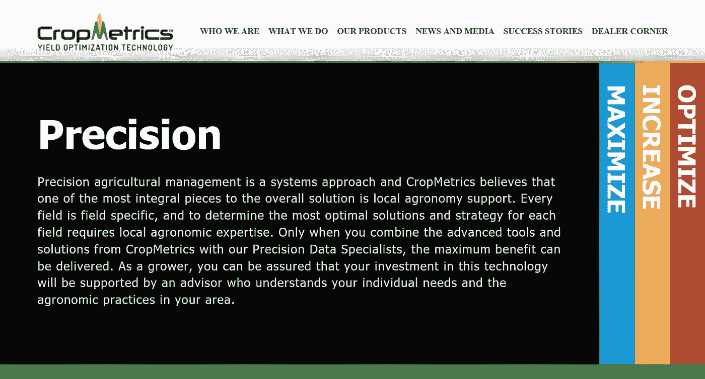
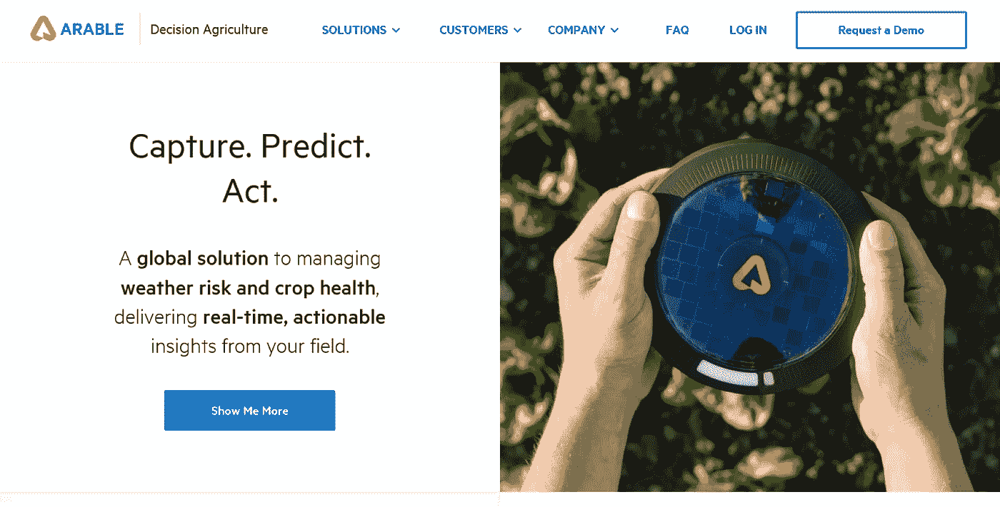
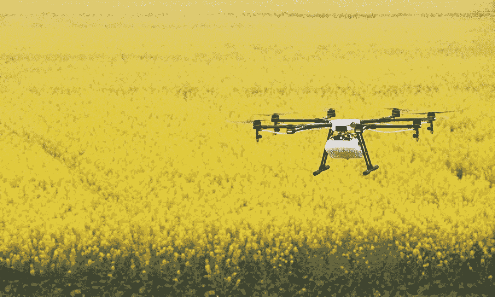
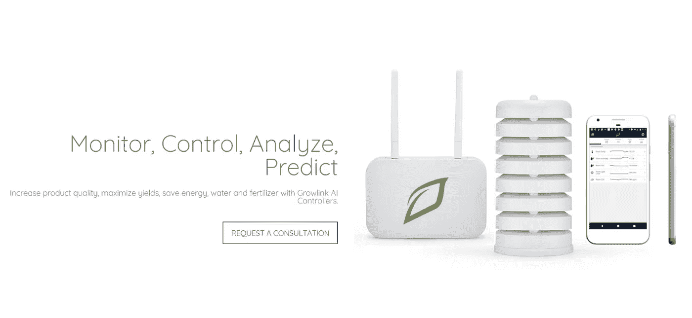
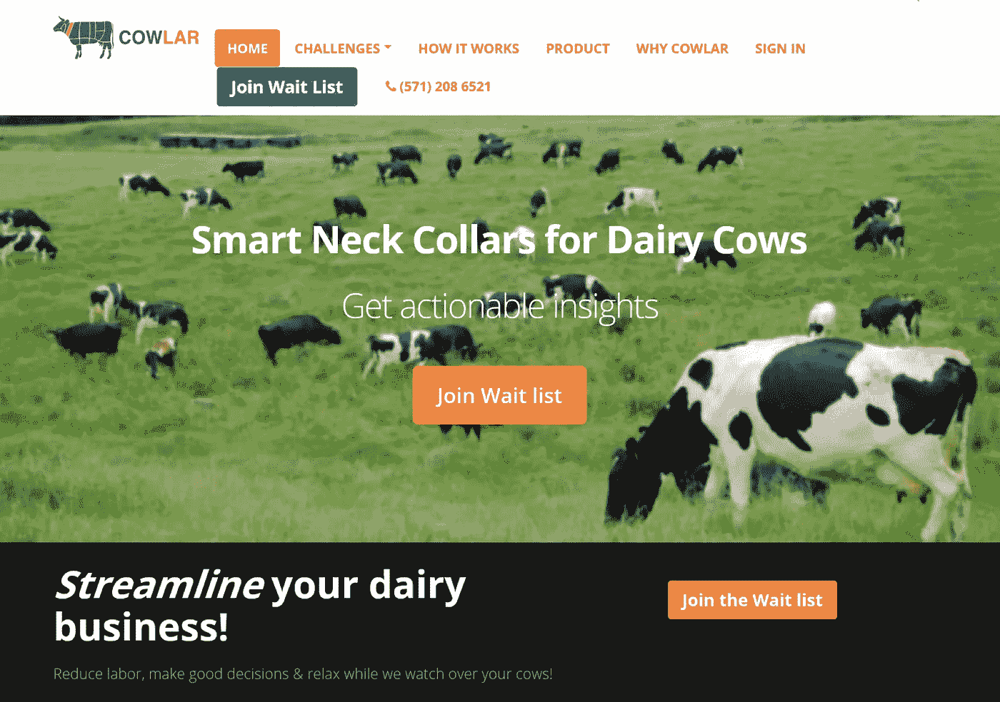

# 物联网在农业中的应用:现阶段智能农业的潜力

> 原文：<https://medium.datadriveninvestor.com/iot-applications-in-agriculture-the-potential-of-smart-farming-on-the-current-stage-275066f946d8?source=collection_archive---------1----------------------->

***智慧农业上的一切(附实例！)在一个地方:精准农业、无人机、温室养殖、牲畜管理、供应链物联网解决方案***

**农业中的物联网:工作原理**

物联网(IoT)胜利地改变了世界，这不是什么秘密。事实上，它已经在各个行业引入了创新，这有助于在不同方面提高效率和降低业务运营成本。农业领域完全符合这一趋势。该公司以前完全依赖人力资源和硬设备，现在也开始应用技术解决方案，实现核心业务的现代化。因此，将农业物联网作为一个整体来讨论是可能的。为了解决这一任务，我们发现了物联网(IoT)应用在农业领域产生重大影响的主要方向。

**物联网农业:最广泛的方向**

作为讨论物联网在农业中应用的热门维度之一，精准农业值得特别关注。在这一领域，智能技术的采用包括使用传感器、机器人、控制系统和自动驾驶汽车。此外，物联网农业的潜力包括能够为农民提供环境友好型农药。此外，将智能技术引入农业可以正确跟踪自然因素，如气候变化、土壤成分和天气预报。

在这个维度上，可以提几个农业中物联网应用的案例。首先，整个[作物组织](http://cropmetrics.com/)致力于 VRI(变量灌溉)优化，这意味着有能力改善地形或土壤可变性，并最大限度地提高效率和产量。在这种情况下，物联网农业意味着邀请一位精确的数据专家，他引入了简单易用、高度定制的云软件，可以优化灌溉计划并实现利润最大化。

其次，农民广泛使用耕地和信息系统来监控他们的作物状况。一方面，[earrable](http://www.arable.com/)允许种植者使用一个分析平台，该平台提供了一个独特的机会来收集天气和植物信息，并将其集成到云中。另一方面，农业中的物联网作为一种 [Semios](http://semios.com/) 解决方案，意味着使用一个可扩展的平台来提高产量，并实时更新植物的健康状况。

最后，智能农业中还有一系列物联网应用，旨在预测气候变化。在这种情况下， [allMETEO](https://www.allmeteo.com/) 及其 Meteoshield 和智能城市天气传感器可以更智能地管理作物，并通知采取必要的预防措施来保护植物。事实上，这项创新的采用也极大地提高了精准农业的潜力。

**农业中的物联网应用:无人机的辅助**

无人机在管理农业过程中非常有用——通过它们提供的图片和航空地图，农民可以立即了解哪些作物需要紧急关注。此外，在该领域使用这一创新的优势包括更好地管理作物——评估其健康状况、灌溉、进度监控、喷洒和种植。最后，无人机有助于节省时间，因为所有信息都是在无需投入时间和精力的情况下收集的。

在实践中，物联网为农业需求提供了两种类型的无人机:陆基和空基无人机。为了收集必要的信息，农民输入实地数据，包括地面分辨率及其海拔高度。因此，无人机提供了植物计数、产量预测、健康指数、高度测量、植物和土壤中化学物质的存在、排水测绘和各种其他数据的详细信息。在物联网农业领域的例子中，无人机援助的基本方向包括土壤和田地分析(通过 3D 地图进行种子种植预测)、种植(通过提供所需的养分)、作物喷洒(通过超声波回波和激光调整高度并避免碰撞)、作物监测(通过提供时序动画而不是静态卫星图像)、灌溉(通过传感器显示干旱地区)和健康评估(通过扫描作物来识别绿光和 NIR 光的缺乏)。换句话说，无人机照顾作物的全周期。

**温室农业的物联网应用**

作为物联网在农业中应用的特殊维度，温室农业存在多种有效的解决方案。特别是，气候控制是通过放置几个传感器来发送关于水或空气问题的警报来实现的。实际上，能够实现这些目标的产品包括 Farmapp 和 Growlink。

[Farmapp](https://farmappweb.com/) 作为智慧农业中物联网应用的代表，为农民提供具有监测、传感器和熏蒸功能的集成害虫管理软件。具体来说，它包括一个侦察应用程序，用于快速记录和实施所需的措施——手头有卫星地图、对比地图、图表和报告。此外，通过直接获取卫星图像和算法计算，有可能接收关于天气和土壤状况的实时数据。最后，Farmapp 的功能可以实现更好的灌溉——在这方面，农业中的物联网可以跟踪植物的用水量，以实现优化。

反过来， [Growlink](http://growlink.com/) 允许对温室进行实时监控，目的是提高质量和产量。特别是，这种物联网农业解决方案专注于自动化操作数据，包括规划、控制、跟踪和监控活动。因此，从长远来看，农民获得了实现最佳绩效的绝佳机会。

**牲畜管理物联网农业解决方案**

至于牲畜控制，农业中的物联网有助于总体跟踪畜群的状态，尤其是每个畜群的代表。在这个领域中，存在用于确定动物健康状况、找到它们的位置以及跟踪怀孕状态的应用——尤其是在处理牛和鸡时。在这方面的农业物联网应用的具体例子中，有 Allflex 和 Cowlar 的 SCR。

Allflex 的 SCR 提供奶牛、挤奶和牛群智能，以及其他一些专业解决方案。在这种情况下，其服务的功能包括跟踪每个畜群参与者的所有信息(热量、健康和营养)，优化挤奶过程(简化和流线化)，并将数据收集到一个集成的、可操作的畜群发展计划中。同样， [Cowlar](https://www.cowlar.com/) 是一家解决类似需求的公司——优化挤奶、最大化性能、降低劳动力成本——以及促进繁殖。

此外，为了应对长期监测动物健康需求的挑战， [Symphony Link](https://www.link-labs.com/symphony) 是一款避免网状联网并有效完成完全集成任务的应用。作为农业物联网领域的一项革命性发明，它将广域物联网网络与模块(包括 RXR-27)、网关和导体连接起来。

**面向农业整个供应链的物联网应用**

在物流方面，物联网农业允许使用 GPS、RFID 和其他基于位置的传感器来控制植物的运输和储存。在这种情况下，整个供应链可以提高其有效性，这意味着透明度和客户意识方面的改善(准确地说，是食品安全方面的改善)。

此外，端到端的农场管理系统也是[物联网软件开发](https://iot.intellectsoft.net/)在农业市场感兴趣的领域。在这种情况下，有可能安装传感器和设备，为分析、报告和会计提供数据。这些功能的确切解决方案是 FarmLogs 和 Cropio。

FarmLogs 在农业市场上展示了一个帮助粮食营销决策的软件。具体来说，它提供了创建粮食营销计划(包括未售出作物的价值、联系人列表和目标设定)所需的工具包，以及关于提高盈利能力的见解。在具体产品中，农民可以订购营销、报告、自动活动记录、作物健康图像和降雨量跟踪。

至于 [Cropio](https://about.cropio.com/) ，解决方案指的是田间管理和植被控制系统功能。具体来说，它有助于检查大量字段的状态，提供必要更新的实时数据，并有助于预测。在它的主要功能中，提供田地历史、即时警报、植被地图、土壤湿度和收获预测的能力令人印象深刻。

**智能农业:后果**

如您所见，物联网在农业领域的应用范围令人印象深刻。作为这个主题的最后一点说明，为了说明这个领域在不久的将来的前景，只需看看这个视频中农业和物联网的神奇合并！