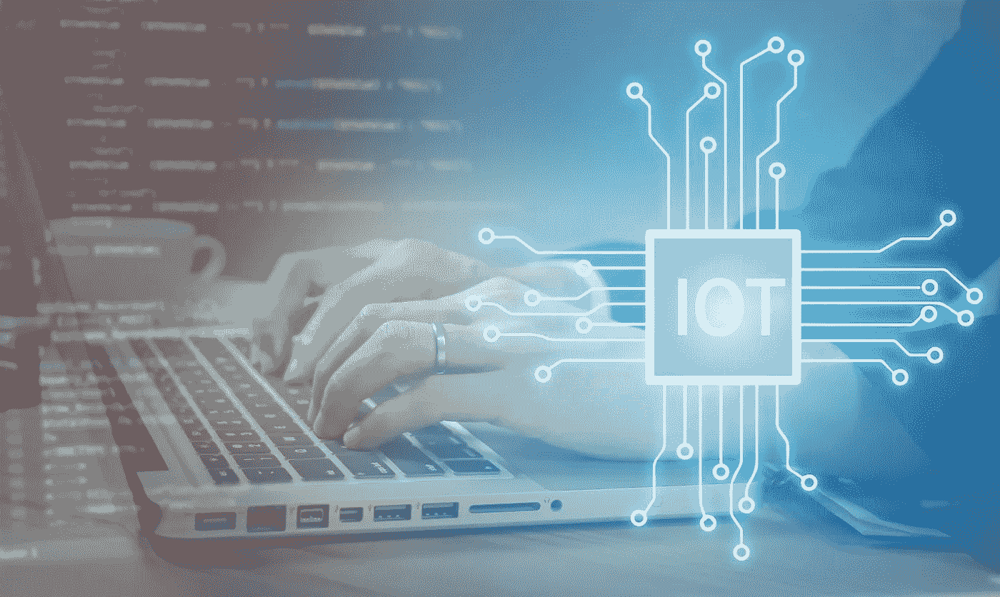
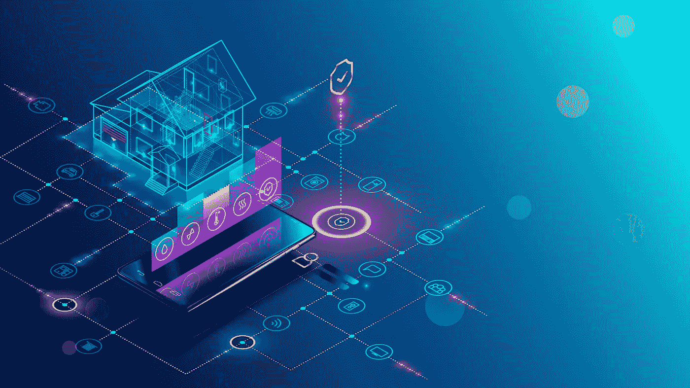

# 物联网架构:什么是物联网架构，它是如何工作的

> 原文：<https://medium.datadriveninvestor.com/iot-architecture-what-is-it-and-how-it-works-441f742bf894?source=collection_archive---------36----------------------->

如果我们想到我们身体的工作方式，有许多部分都是由一个大脑控制的。这个类比可以应用于物联网设备架构，因为就像在人体中一样，所有设备都连接到一个单一的网络，该网络传输数据，分析数据，并找到使某些过程更有效的方法。物联网有许多用途和应用，肯定会对各种行业产生影响，使流程更加高效，降低企业成本和浪费，并将所有这些成本节约传递给最终消费者。

由于物联网正在用户中迅速普及，并简化了许多耗时的任务，因此让我们来看看到底什么是物联网以及物联网是如何工作的。

# 物联网系统

物联网由许多部分组成。首先，它由内置或外置传感器的设备组成，这些传感器可以监控另一台设备周围的区域。它还需要一种通过网关将数据传输到云中进行分析的方法。这一术语指的是数据传输的方法，通过过滤数据并对其进行更好的分类以供进一步分析，这种方法也会对数据质量产生影响。数据收集后，通常存储在数据湖或数据仓库中，这些数据湖或数据仓库可以提供一些更深入的见解，使某些流程和用户命令更加高效。

当深入研究物联网如何工作时，我们会看到机器学习开始发挥作用。有了机器学习，[软件开发](https://skywell.software/)被带到了更高的高度，因为我们可以为控制应用程序创建更精确和高效的模型。这些模型将根据存储在大数据仓库中的历史数据收集按需更新。当新模型被创建时，它们将被测试效率，它们将被控制应用程序投入使用。

# 设备和用户管理

1.  物联网的基础之一是设备和用户管理。不幸的是，我们还不能简单地安装设备，然后什么也不做。物联网需要不断的调整和监控，以防止故障或完全崩溃。这些程序包括:
    设备 ID——这里最重要的是验证你手上有一个正版设备。这将确保它能够以安全的方式传输数据。
2.  控制和配置—安装设备后，可能会有一些额外的参数需要调整或完全写入。物联网概念的一大部分是，物联网将在每个个人用户的生活中发挥独特的作用，将简化特定用户认为耗时或不方便的任务。因此，请务必添加任何额外的参数，并根据具体情况调整设置。
3.  设备监控—确保持续关注所有诊断，以便每个设备和网络本身正常运行。
4.  软件更新—通过确保所有软件都是最新的，您可以确保拥有所有新的功能和能力，而不会出现以前版本中可能存在的所有错误。

在用户管理方面，每个用户都有自己独特的角色和访问权限，这一点很重要。这包括添加新用户或删除当前用户、设置管理以及能够在系统内执行某些功能。

# 实际应用

到目前为止，我们已经了解了什么是物联网以及物联网是如何工作的。它在很多行业都有很多用途和应用。例如，在航空业中，它可以为工程师提供各个维护设备位置的实时更新，从而提高他们的整体效率并降低成本，使他们的流程更加高效，反过来，这种效率又转化为更可靠的航班，减少延误和航班取消。

这只是物联网影响我们日常生活的一种方式。在不久的将来，它将提供巨大的商业价值，据估计，到 2025 年，整体经济价值可能高达 11.1 万亿美元。

*最初发表于*[*sky well . software*](https://skywell.software/blog/iot-architecture-what-is-it-and-how-it-works/)*。*