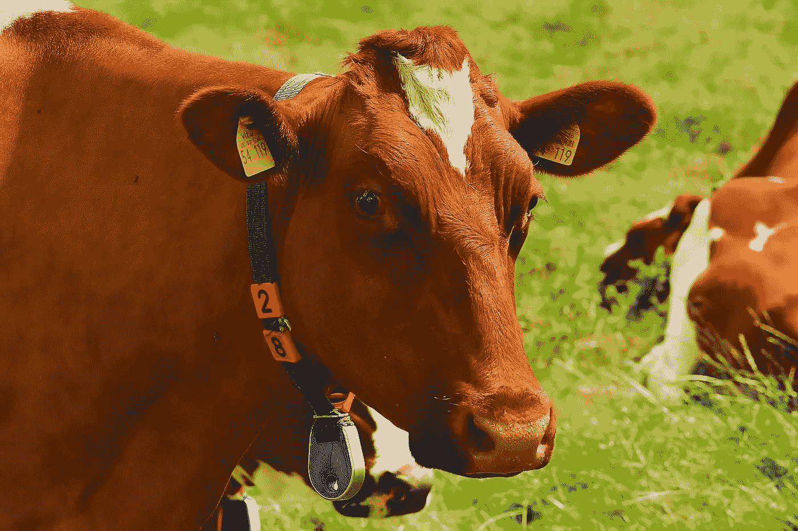

# 物联网从一开始:事物和设备

> 原文：<https://medium.datadriveninvestor.com/iot-from-the-beginning-things-and-devices-c8c2af8f32b2?source=collection_archive---------0----------------------->

Image: Karsten Paulick

## 一开始有些事情。

分析师已经宣布 2019 年是“物联网年”，但大多数公众可能会用一个简单的问题对此做出反应:“什么是物联网？”。今年只剩下不到 10 个月了，如果我们想要实现备受尊敬的分析师们的预测，时间就是在浪费。这篇文章是我的一点小小尝试，目的是让我们在物联网的一些基本概念上达成一致。

## 物联网中的“事物”是什么？

物联网最广为人知的类别可能是“智能家居”，例如智能恒温器和门铃、联网灯泡、智能厨房电器和浴室设备等，不可能列出详尽的清单，因为每天都有新产品添加进来。这一类别中的“事物”最容易理解，因为用户可以与它们互动并观察结果。比方说，当我到家时，我可以用手机上的应用程序打开家庭安全系统——一秒钟后，车库的门就会打开。这个例子说明了许多智能家居产品的典型价值主张:远程控制的便利性。

 [## 物联网危险剪断-数据驱动的投资者

### 物联网危险剪断-数据驱动的投资者

物联网危险剪断——数据驱动的 Investorwww.datadriveninvestor.com](https://www.datadriveninvestor.com/2018/09/26/infographic-dangers-of-the-internet-of-things/iot-dangers-snip/) 

一个更有趣的例子是聪明的奶牛。我知道这听起来很滑稽，但它实际上是一件事(双关语)。任何普通的奶牛都可以通过佩戴传感器来监控奶牛健康的各个方面，如健康，产奶量，产犊等，从而立即变身为智能动物。这种监控为农民提供了新的、更好的饲养牲畜的方式，最终提高了他们的业务底线，为消费者提供了更高质量的产品。但这不全是为了利润——这些人真的关心他们的动物，正如我在我的一个物联网项目中与他们合作时观察到的那样。

现在，我们已经看到了无生命和有生命“事物”的例子，让我们考虑一个纯粹无形的物联网实体的例子:智能城市。这里有一个简单的经验法则:如果你可以将一个城市与你的智能手机配对，那么它就是一个智能城市。但是玩笑归玩笑，你肯定很难理解这种高度抽象的场景。然而，有很好的理由参与这种思维扭曲(除了也是一种很酷的大脑锻炼)，因为智能城市给所有参与者带来了很多好处:居民、企业、地方政府、游客等。

在所有垂直行业中，还有更多“东西”的例子:高层建筑中的智能电梯、建筑工地上的联网工具、大学校园中的智能教室、车队车辆上的智能轮胎、客机上的智能引擎——这样的例子不胜枚举。

## 人能成为‘物’吗？

当我说从聪明的牛到聪明的人的飞跃并没有那么大，至少就所涉及的技术而言，我希望我不会伤害任何人的感情。自然，奶牛不太关心他们的可穿戴设备的时尚方面，但如果你以正确的方式眯着眼睛看，它们有很多相似之处。还有这整个“自由意志”的角度，但让我们不要跑题。所以，是的，人们可以通过物联网来监控他们的幸福。

除了无处不在的 Fitbit，还有其他例子表明物联网技术如何帮助患有糖尿病等疾病的人(这对儿童患者和他们的父母来说至关重要)，或者允许老年人在自己的家里度过晚年(T3)。这种“人的东西”监控通常不会引起任何人的惊讶，因为这是产品的主要目标，因此它是在用户明确同意的情况下进行的。

在其他情况下，收集人员数据可能是监控另一个“事物”的副作用。比方说，你买了一台智能咖啡机。机器制造商使用物联网来监控机器的运行，以改进他们的产品，但在这个过程中，他们也了解了很多关于你个人喝咖啡习惯的信息。用户甚至可能没有意识到这种监控，这使得这有点可疑。

在最有问题的情况下，人可能是主要的监控目标，并且可能在很大程度上没有意识到这一点——这是计算机和智能手机的情况。微软收集了大量用户在 Windows 和 Office 中所做一切的信息。类似地，谷歌收集大量关于安卓用户的信息，就像苹果在它的设备上做的一样。当然，用户会点击描述监控的冗长的 EULA 页面，但大多数人不会阅读这些页面。事实上，一旦你购买了，你就已经做出了承诺，没有 EULA 可以阻挡你和这个闪亮的新设备，对不对？自从 GDPR 生效以来，大玩家已经在短时间内多次陷入困境，所以希望事情会开始好转。然而，GDPR 是一部欧洲法律，目前在美国没有相应的法律。

最后，任何时候你在公共场所，你都可以被安全摄像头监控，这是合法的。然而，它仍然可能引发围绕隐私的激烈争论，就像中国的[社会信用体系](https://en.wikipedia.org/wiki/Social_Credit_System)。

## 什么是物联网设备？

“东西”是我们想要监控和控制的真实世界的实体，而物联网设备只是来回移动数据的电子组件。它们有各种各样的形状和大小，但我们可以将它们分为以下几类:

1.  微控制器，又名 MCU:这些是最简单的物联网设备，它们只能将传感器数据发送到云端，可能还会执行从云端接收的命令。从积极的一面来看，它们消耗的能量更少，因此它们实际上可以靠电池运行。而且它们非常便宜:每个只要几美元。
2.  单板计算机:这类设备的代表是 Raspberry Pi(以免被认为是一种认可)。这一类别的设备能力更强:即使与云断开连接，它们也能表现出智能行为。它们也贵了一个数量级(比如说高达 100 美元)，而且非常耗电。
3.  网关级设备:这些设备通常用于物联网边缘场景，它们代表一组设备提供连接并运行智能，这些设备位于同一边缘站点并通过网关连接。这些可能是全规格的计算机，价格在数千美元或以上，取决于性能:硬件、连接性、加固型外形等。
4.  根据我们对“人类事物”的讨论，你的手机可能会被视为物联网设备，尽管在[物联网](https://en.wikipedia.org/wiki/Internet_of_things)的规范定义中，电脑和智能手机不被视为物联网设备(如果你选择相信维基百科的话)。

## 设备和事物有什么关系？

在某些情况下，物联网设备被集成到“事物”中，而在其他情况下，它们是独立的。让我们考虑几个例子:

*   就拿一辆可能有几年历史的普通汽车来说吧，没有互联网连接。你可以将物联网适配器插入其 OBD 端口，远程监控汽车运行的许多方面。在这种情况下，汽车是一个“东西”，物联网设备是一个单独的附件。
*   相比之下，一些较新的汽车连接到互联网，并配有智能手机应用程序进行远程控制和监控。在这个例子中，物联网功能被直接集成到“东西”中。
*   空气质量传感器可以警告室外的空气污染，并建议关闭窗户，如果智能家居配备了这种功能，甚至可以自动关闭窗户。在这种情况下,“东西”是环境条件，没有办法“将物联网集成到其中”,类似于我们前面的智能牛案例。

我们可以在这些例子中看到一个趋势:每一个可以与物联网功能集成的“东西”不久都会变得“智能”。有些‘东西’是无法与物联网融合的，比如:生物和环境。不过话说回来，谁知道呢——如果埃隆·马斯克如愿以偿，也许在不久的将来，人们会将 Neuralink 设备植入大脑。

## 为什么是 IoT？

我们已经涵盖了许多跨广泛行业的示例物联网场景，它们的实施细节可能会因问题领域的不同而有很大差异。然而，它们在如何为公司和消费者创造新价值方面有一些共同的基本模式。这种在物联网中创造新价值的模式将是我们下一篇文章的重点。

***关于作者*** *: Andre Podnozov 是一名在“物联网”领域工作的云架构师。他帮助各种规模和行业的公司加速其物联网项目的上市。你可以在 LinkedIn 上通过*[*www.linkedin.com/in/andrepodnozov*](http://www.linkedin.com/in/andrepodnozov)*联系到他。*