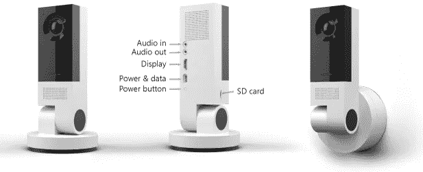
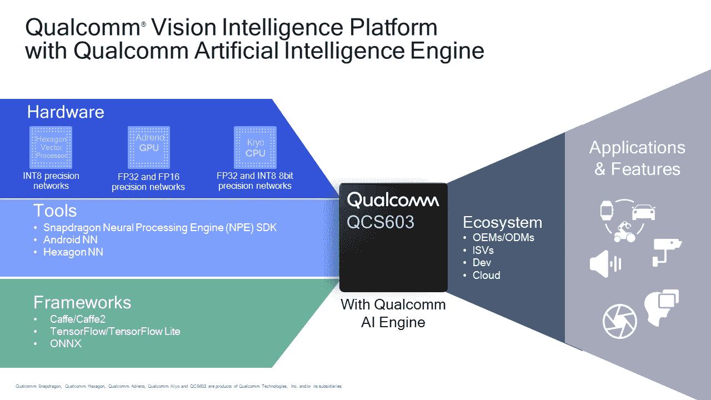
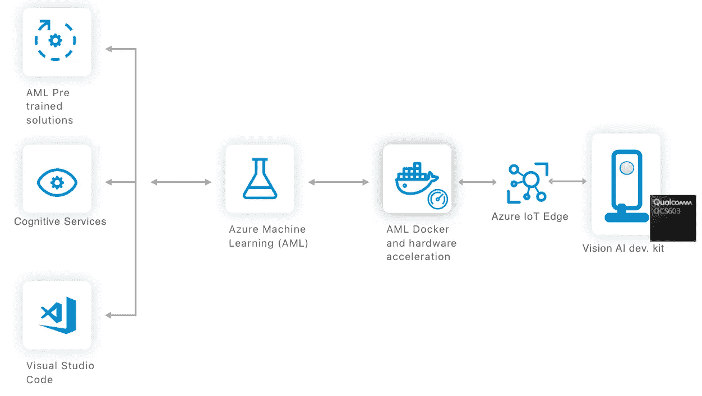
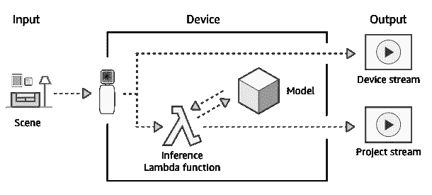
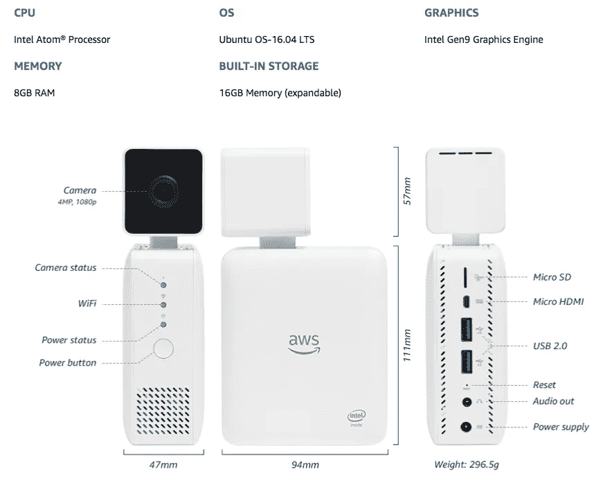
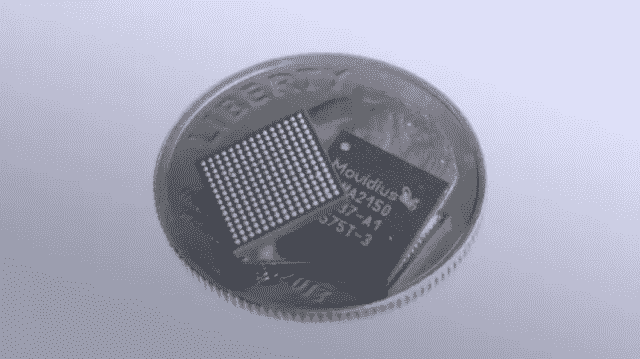
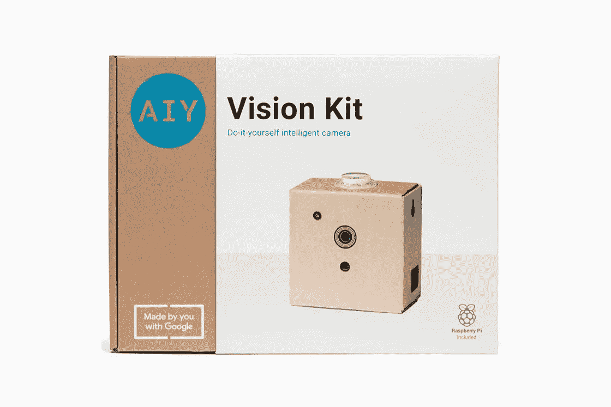
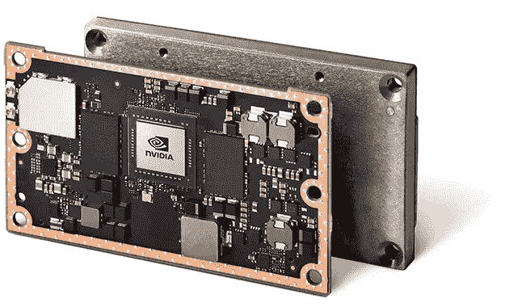
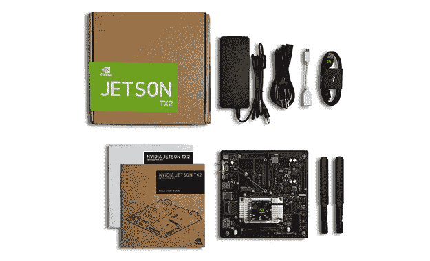
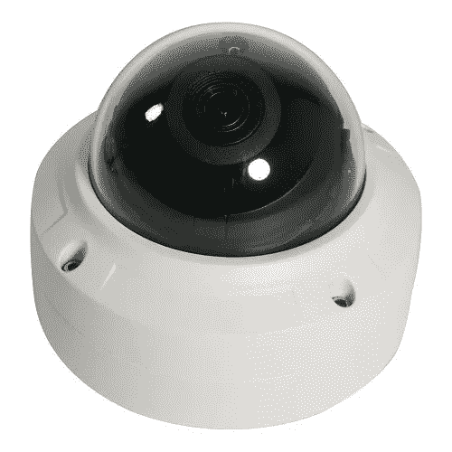

# 物联网智能摄像机前景

> 原文：<https://medium.datadriveninvestor.com/iot-smart-camera-landscape-942442f88c8?source=collection_archive---------1----------------------->

## 高通视觉智能平台+微软 Azure

**Vision AI Developer Kit**

高通刚刚宣布了一款针对开发者的设备，这款设备是与 T2 的微软和 T4 的 Azure 平台合作开发的。**微软**和**高通**即将推出[视觉人工智能开发工具包](https://www.visionaidevkit.com/)，你现在可以注册并了解更多信息。据我所知，他们正在提供基于云的 [Azure 机器学习服务](https://azure.microsoft.com/en-us/overview/machine-learning/)和他们的 [Azure 物联网边缘平台](https://azure.microsoft.com/en-us/services/iot-edge/)，以获取你的云训练的 **AI** 模型，并在跨平台边缘设备上运行它们，如智能相机。所有这一切，以及看起来是在设备上运行的云训练模型的**文档化**部署。

Qualcomm currently powers the NestCam IQ

这一切都由高通的新视觉智能平台和骁龙的神经处理引擎提供动力。自 2015 年以来，他们一直在谈论这些类型的设备。我在互联网上找到的细节有点模糊，不知道 [NestCam IQ](https://www.theverge.com/circuitbreaker/2018/4/11/17218686/qualcomm-smart-camera-chips-vision-intelligence-platform) 是由这些新芯片中的一个驱动，还是由旧芯片驱动，用于在设备上做 **AI** 。无论哪种方式，看到其他芯片组制造商和软件服务提供商参与创新智能设备开发都是一件好事。

Flow diagram provided in the blogpost linked about. Illustrated the pre-canned and cloud trained model support provided by **Microsoft Azure** and **Docker** on the **Qualcomm** powered Smart Camera Device

## 亚马逊的 AWS 深度镜头

The AWS approach to IoT

这是又一个上市的智能相机开发套件，对 GreenThumb IO 来说是个好消息。我很高兴能拿到将于 2018 年 6 月 14 日发布的[亚马逊深度镜头](https://aws.amazon.com/deeplens/)。亚马逊已经与英特尔和他们的 [Atomprocessor](https://www.intel.com/content/www/us/en/products/processors/atom/e-series.html) 合作，他们在这里引用[的话](https://docs.aws.amazon.com/deeplens/latest/dg/what-is-deeplens.html)每秒可以处理 1000 亿次浮点运算(GFLOPS)。虽然它还没有出来，但他们已经在博客上写了。看起来他们在设备上给了你 AWS [Greengrass](https://aws.amazon.com/greengrass/) 和 [Lambda](https://aws.amazon.com/lambda/) 的力量。这将使云动力人工智能解决方案摆脱集中化的链条，走向边缘。

Amazon’s take on a developer friendly smart camera

> 可以肯定地说，[物联网](https://aws.amazon.com/iot/)和[无服务器](https://aws.amazon.com/serverless/)计算已经存在，并且应该出现在您的列表中。—[https://aws.amazon.com/blogs/aws/deeplens/](https://aws.amazon.com/blogs/aws/deeplens/)

## 谷歌的 AIY 视觉套件

The Movidius VPU Chip

我在我的第一篇[博客文章](https://medium.com/p/c878a8416cb5?source=linkShare-5e886beaba05-1526523881)中提到，随着[谷歌 AIY 视觉套件](https://aiyprojects.withgoogle.com/vision)的推出，字母表再次领先于潮流。AIY 视觉套件于 2017 年 11 月 30 日推出，搭载了一个由**臂** **CPU** 驱动的**树莓派**，带有一个视觉罩，配有一个 [Movidius 芯片组](https://www.movidius.com/news/google-launches-aiy-vision-kit-featuring-intel-movidius-vpu)。这个 **VPU** 协处理器用于在设备上执行 TensorFlow 模型，而 **ARM CPU** 用于程序逻辑。令人鼓舞的是，看到如此多的大公司支持开发人员使用这些完全可编程的专有设备和开源软件。

Google’s AIY Vision Kit is the only Camera based AI Vision **developer kit** in [stores now](https://www.target.com/p/-/A-53417081)

看来巨头们正在为智能设备的下一次革命做准备。好像是运营平台和服务的竞争。作为一个有抱负的人，这让我想知道这些公司中的哪一家准备好开始与初创公司合作，以鼓励这一领域的增长。

## NVIDIA 的 Jetson 平台

> 自主万物的嵌入式平台。— [杰特森上的英伟达](https://www.nvidia.com/en-us/autonomous-machines/embedded-systems-dev-kits-modules/)

我在我的[上一篇博客](https://medium.com/p/3a512c75acf2?source=linkShare-5e886beaba05-1526524168)中提到的 NVIDIA 也有自己的**开发者套件**和 [Jetson 平台](https://www.nvidia.com/en-us/autonomous-machines/embedded-systems-dev-kits-modules/)，用于自主一切的嵌入式平台。它由令人敬畏的 **Tegra 4.0** 芯片组驱动，该芯片组拥有强大的 **ARM CPU** 以及 **256 CUDA** 支持的 **GPU** 核心。NVIDIA 一直在推动加密和人工智能宣传，据报道，这给它们的股票带来了负面影响。无论如何，英伟达在 GPU/TPU 和开源软件领域都是明显的领导者。 **CUDA** 为现代深度学习框架铺平了道路，如 **TensorFlow** 、 **Caffe** 、 **Theano** 、 **PyTorch** 等等。

NVIDIA offers a barebones **Developer Kit** which you can plug-n-play a number of camera, audio, and other peripheral devices into. This platform is what I aim to use in the next phase of research & development for GreenThumb IO’s CryptoSmartCamera Platform

> 一旦有了适销对路的智能相机产品，你最终会走向何方？—刚才的我！

Ideally we could deploy our code directly to a standard IP66 Power Over Ethernet security camera!

那么这对那些雄心勃勃的开发者和企业家来说意味着什么呢？我个人认为这很鼓舞人心，但是如果你用这些平台中的任何一个来构建一些很酷的东西，你必须问自己一个问题。一旦有了适销对路的智能相机产品，你最终会走向何方？我已经向 [GreenThumb IO](https://greenthumb.io) 提交了加入 [NVIDIA inception program](https://www.nvidia.com/en-us/deep-learning-ai/startups/) 的申请，你可以在下面阅读我的申请。尽情享受吧！

> GreenThumb IO 正在使用区块链驱动的分散式人工智能为商业大麻种植者开发智能相机平台。
> 
> 利用每英亩 1000 多个摄像头，由 NVIDIA Tegra 平台驱动，我们将在数十万英亩的商业规模上积极监控和学习。我们将使用深度学习技术，不仅增强为分析提供动力的计算机视觉，还培养对关键视觉增长指标的人工智能农艺理解。
> 
> 我们从 TensorFlow 训练的模型开始，这些模型可以以每像素一毫米的分辨率推断和掩盖叶面积、芽面积、压力和可收获性。这些巨大的高分辨率数据集，加上 NVIDIA 的分布式 CUDA 框架和 GreenThumb IO 的分布式 AI 的力量，将创造一个前所未有的超级人类对大麻农学的理解。
> 
> 该系统被设计成将来自计算机视觉模型的度量传输到块。当相机 GPU 不捕捉和分析 FOV 时，它们会参与解块。我们希望在 ARM CPU 上运行 TensorFlow 推理。这是一个实用且可扩展的区块链解决方案，将限制(如果不是实际上消除)云服务器。
> 
> 有了英伟达，GreenThumb IO 将成为最先进的去中心化 AI 智能相机平台。
> 
> 贾斯汀·鲍文，绿拇指 IO