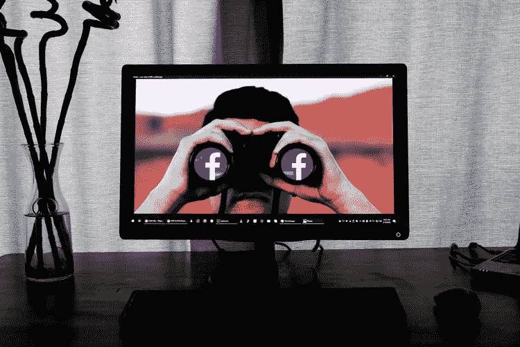

# IOTA，什么事？以及为什么它有一个大的未来。

> 原文：<https://medium.datadriveninvestor.com/iota-what-is-it-and-why-it-has-a-big-future-c673e86de399?source=collection_archive---------13----------------------->

Photo by [Viktor Forgacs](https://unsplash.com/@sonance?utm_source=medium&utm_medium=referral) on [Unsplash](https://unsplash.com?utm_source=medium&utm_medium=referral)

[IOTA](https://www.iota.org/) ，将自己描述为下一代[分布式账本技术](https://searchcio.techtarget.com/definition/distributed-ledger)。

这是一个很大的主张，特别是考虑到 DLT 本身只是一个最近的现象。然而，他们的设计基于“泰戈”,而不是区块链，这是任何其他加密货币的标准基础。

这项技术已经引起了各行各业一些[大腕](https://www.bitguru.co.uk/iota-news/notable-iota-partnerships/)的注意，这些大腕已经提供了合同。[博世](https://www.bosch.com/)、[富士通](http://www.fujitsu.com/global/)、[大众](http://www.vw.com/)和[微软](https://www.microsoft.com/en-us/)都已经向前迈进了这个大胆的项目。

尽管如此，任何真正的应用仍需要数月，甚至数年的时间。这种探索新事物、共同努力提高我们的生活水平和安全感的责任令人兴奋。想到它，我喝的这杯茶变得更加香甜。

我们今天面临的一个大问题是，我们的大部分技术很容易被任何有相当技能的人黑掉。即使是一个孩子也可以在笔记本电脑后面做大事。

然而，被黑客攻击并不是唯一的问题。我们的数据也被卖了，比如最近的[脸书事件。8700 万人的数据在未经他们同意的情况下被第三方访问，这是一个令人不安的事实。这应该保证找到一种更安全的方法来传输和保存我们的数据，最好是没有一个容易被利益所说服的傀儡。](https://money.cnn.com/2018/04/11/technology/facebook-questions-data-privacy/index.html)

因此，转向 DLT 并将其纳入我们当前的操作系统，以获得更高的安全性，同时提供机器和支付系统之间更快的互操作性，特别是那些涉及[微交易](http://www.superrewards.com/micro-transactions)的系统。

在大规模频繁发生的微交易方面，IOTA 比比特币运行得更好。每笔交易从钱包到钱包都是无缝的，费用少得几乎没人注意到。

随着更大的可扩展性，IOTA 已经为进一步的合作和更大的技术发展做好了准备，这只会使我们这些人受益。

我不知道你怎么想，但我欢迎任何能提供安全方法来改善我的生活的东西，除了做大事。

