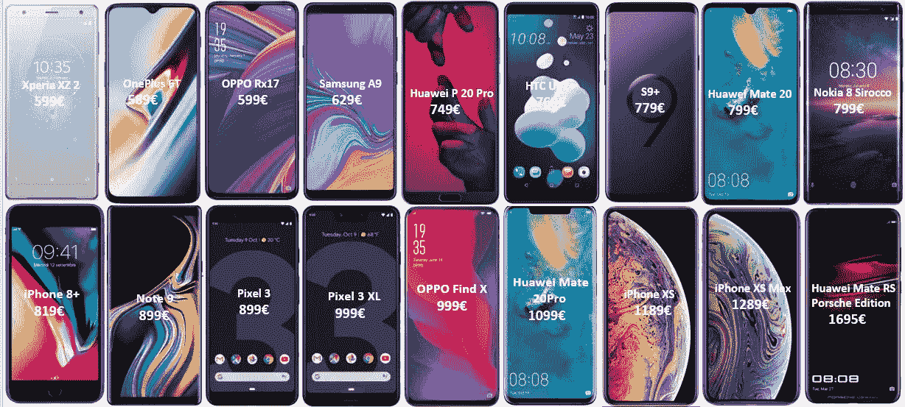
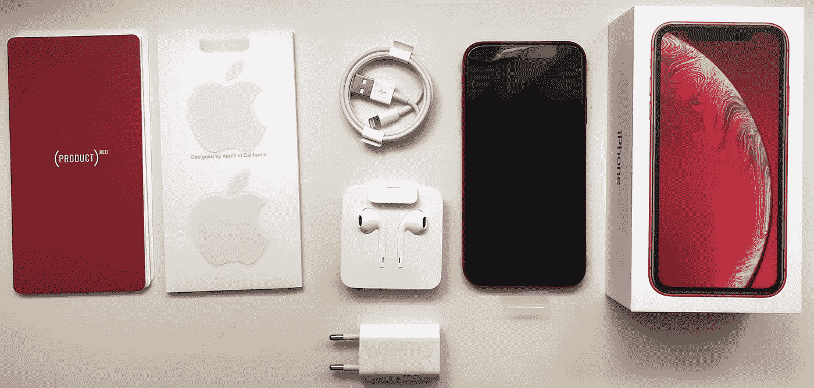
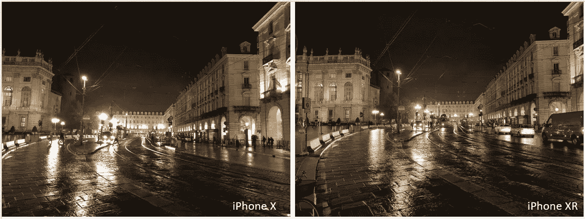
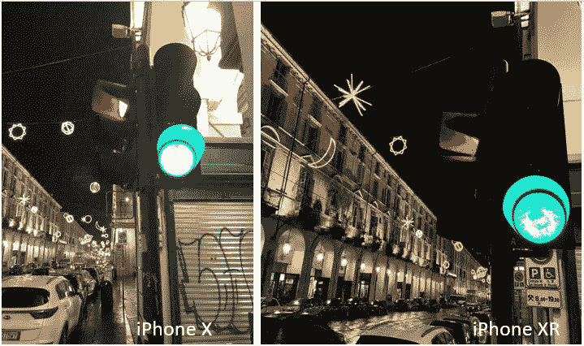

# 购买 iPhone XR 而不是其他任何 Android 旗舰有意义吗？

> 原文：<https://medium.datadriveninvestor.com/iphone-xr-does-apple-strike-the-right-balance-fa9caeb9627e?source=collection_archive---------31----------------------->

## 2018 年 iOS 还能有相关性吗？苹果在 XR 上取得了正确的平衡吗？从长期 Android 用户的角度来看。

让我们直说吧，我一直是 iPhones 的强烈批评者。对我来说，最大的障碍一直是价格。对于像我这样的安卓用户来说，这个价格总是太高了。今天，运行 Android 的旗舰产品除了具有出色的构建质量之外，还拥有出色的显示屏、强大的摄像头和大量的硬件配置可供选择。iPhones 从一开始就非常简单，每年都有固定的硬件配置和几个尺寸和颜色可供选择。而且它们总是被大多数 Android 制造商克隆并作为更便宜的替代品出售。然而，自 iPhone X 问世以来的一年多时间里，情况发生了很大变化。今天，几乎所有主要的智能手机制造商都推出了价格与最新款 iPhone 相当的产品，其硬件选项让 iPhone 相形见绌。这是一个相当强烈的声明。

## **那么，是什么改变了我的想法？**

在此之前，我深入分析了原因，让我们看看下图中主要制造商的各种产品。你会立即注意到这些智能手机的价格，现在已经接近或超过运行 iOS 的旗舰产品。第二件要考虑的事情是，大多数手机要么运动某种缺口或下巴。如果你看看预算段(<500€) then more than 95% of the smartphones sport a notch. Samsung is the only major smartphone manufacturer which has ditched the notch bandwagon. Just to remind you all, the iPhone X was heavily criticized for featuring a notch and now nobody cares when they exist in an Android smartphone.

Major Smartphones launched in the last one year

Now, since the price bracket has been levelled up, it is a bit amusing because Apple has been long been criticized for their insanely high prices. But, do the Android manufacturers justify their asking price. Let’s break it down into the basic blocks — hardware and software.

**软件**

除了苹果，所有主要的智能手机制造商都使用谷歌开发的安卓操作系统。所以，他们不花一分钱开发基础软件。这并不意味着他们什么都不做，但你可以理解从头开发一个操作系统所需的努力和成本。他们所做的是开发相机软件、用户界面、安全功能、附加软件等等。每个制造商都试图通过修改原始用户界面来对软件做出自己的解释。在所有这些不同的解释中，机器人的真正本质丢失了。这导致不同制造商的软件体验不一致。此外，Android 不断受到漏洞的影响，它们变得越来越慢，并且被每个智能手机制造商与大量臃肿的软件捆绑在一起。然后，还有软件更新的问题。这真是安卓手机的噩梦。你必须等上几个月才能让你的制造商发布更新，而且有可能你的机型永远也不会发布更新。需要强调的是，软件更新非常重要，因为它包括补丁、最新的安全更新和其他功能，可以让您的体验更好。如果你需要像谷歌计划的那样定期更新软件的 Android 体验，那么你需要购买一部谷歌的 Pixel 手机或一部运行 Android One 程序的手机。唯一一款能给你带来最大性价比的安卓体验的手机是一加 6T，它拥有超级点击的软件体验，并能持续获得更新。我们稍后再讨论 iOS。

**硬件**

这就是事情有趣的地方。有一些制造商制造自己的处理器(gpu、cpu ),而另一些则使用骁龙和联发科制造的芯片。三星和华为一直在制造芯片，并在 R&D 上投入大量资金，为自己的智能手机提供动力。然而，它们未能与苹果移动处理器的效率和性能相媲美。甚至传言中的骁龙“8150”在 Geekbench 上的初始分数也清楚地表明，它没有机会对抗 A12。华为新的 7nm 麒麟 980 处理器是一个遥远的第三。然而，这需要有所保留，因为我们不知道这是否只是一个较低时钟速度的试运行。这两种处理器都应该与 A13 抗衡，所以考虑到 Android 需要更强的运行能力，它应该更好地与当前的 A12 芯片相媲美。

iPhone XS — A12 bionic; Huawei Mate 20 Pro — Kirin 980; Samsung Galaxy Note 9 — Exynos 9810 ; Google Pixel 3 — Snapdragon 845 (Source — Geekbench)

至此，我已经强调了硬件和软件两个方面。现在让我们看看一加 6T，它在义大利的零售价为 589€。他们使用骁龙制造的芯片、索尼制造的摄像头和谷歌的操作系统。因此，它们节省了大量的开发成本，而且自第一批一加手机上市以来，它们的价格一直在持续上涨。正是在这里，我决定改用今年推出的价格更实惠的 iPhones。XR 在意大利的零售价为 889€，低于或相当于运行安卓系统的旗舰产品的平均价格(800€)。

**盒子里是什么？**

苹果沿用了最初 iPhones 的优雅包装。你可以得到标准的耳机手册和标准的充电模块。XR 有一个小变化，里面的标志和卡片是你选择的 iPhone 颜色。当你看到竞争对手和要价时，苹果没有在盒子里包括快速充电器，这有点可悲和不合理。今年，苹果还决定省略 3.5 闪电连接器，价格为 9 美元/10€(啊！)如果想买的话。苹果应该停止这种不合逻辑的销售伎俩。

iPhone XR Product (RED) Retail Packaging

显示器——有那么糟糕吗！？

不，iPhone XR 上的显示屏是完美的，但当孤立地看时。显示器是一个 326 像素的 LCD，分辨率为 1792 x828 p(HD-1980 x 1080 p)。需要注意的是，它们不是市场上唯一的液晶显示器，新的华为 Mate 20，LG G7 和 V35 thinQ sport 也是如此。色彩表现准确，视角完美。它们没有像 OLEDs 那样更强烈的色彩和更深的黑色，但它们一点也不差。还有一些背光出血。有一个缺口位于顶部，但这里是 Face ID 的设置(稍后会详细介绍)。我喜欢 6.1 英寸的尺寸，它很容易介于 XS (5.8 英寸)和 XS Max (6.5 英寸)之间。iPhone XR 因其像素密度(PPI)和分辨率受到了严厉批评。有些人甚至进一步说，显示屏与 iPhone 5S/SE 完全相似。请不要犯这个错误，PPI 是一样的，但显示质量远远优于。因此，这让我想到了一个问题，

你真的能区分 326 ppi 的屏幕和 450 ppi 的显示器吗？我想大多数人不会注意到，除非他们被告知。与 iPhone X 并排比较，无法区分屏幕的清晰度。IPhone XR 配备了 828p 显示屏，比全高清显示屏低 250p 左右。这并不意味着你不能播放 1080p 的视频。显示器会将其调整到原始分辨率。因此，我在 iPhone X 和 XR 上并排播放了几个 1080p 视频，看看我是否能发现。我的眼睛看不出有什么不同。一切都很脆！然而，这并不意味着苹果有理由为 XR 使用这种显示器。几乎所有这个价位的智能手机都至少有一个全高清显示屏。我的二级智能手机(华为 P8 Lite 2017)也有一个。

All the borrowed iPhones in one shot

XR 还配备了苹果所谓的“True Tone”显示屏。打开时，4 环境传感器会测量光线条件，并调整显示器的白平衡，无论屏幕周围的光线条件如何，都能为您提供相同的观看体验。还有一个叫做“刷新率”的东西——每次屏幕刷新时每秒钟可以显示的帧数。包括 XR 在内的所有 2018 新款 iPhones 的刷新率都是 120 Hz。对于大多数人来说，这可能不算什么，但对于游戏玩家来说，这是一个非常重要的参数。这有助于减少屏幕闪烁，为您带来流畅的游戏体验。当你玩上瘾的 PUBG 时，它会给你优势。

因此，当苹果说它是智能手机中最先进的液晶显示屏时，他们并没有做出任何虚假的声明。我完全满意，并且毫无疑虑地使用它。此外，iPhone XR 的屏幕也得到了 YouTube 主要科技博客作者马克斯·布朗利和乔纳森·莫里森的赞赏。

**操作系统和性能**

作为过去 8 年的 Android 用户，我可以说这是我在智能手机上体验过的最好的软件之一。iOS 让人感觉很受欢迎。一切都布置得很整齐，动画很完美，过渡非常流畅。这么简单却还是讲了一个量。感觉有很多研究已经投入到理解人们如何与他们的手机互动，它显示。我已经使用 XR 大约 3 个星期了，从来没有出现过手机没有反应的情况。该软件是超级点击，应用程序反应灵敏，没有滞后可言。即使是最苛刻的游戏，如沥青 9，黑暗崛起或 PUBG 工程在最大可能的图形水平没有任何问题。无论是白天/晚上/戴眼镜/不戴眼镜/有头发/没有头发/在床上等等，Face ID 都能完美地工作。我对这种工作方式非常满意。是的，我确实想念指纹识别器，我希望苹果在未来能在这方面有所作为。然后，您就不用担心恶意软件或病毒了。Apple 为您提供定期的软件更新和支持，直到产品发布后 5 年。iPhone 5S 现在在 iOS 12 上运行得更好，这是我的个人经验。如果你将它与 Android 相比，那么谷歌最新的像素系列仅提供 3 年的支持。如果你考虑三星或华为，那么你可能会/可能不会获得更新，即使在推出几个月后。app store 比 google store 先进得多，拥有更高质量的应用。你也不会发现应用程序的安全问题。苹果非常重视安全性，并确保立即从 play store 中删除任何可能危及用户安全的应用程序。在这一点上，即使是联邦调查局也无法与苹果公司谈判。

**摄像头**
XR 上的后置摄像头与价格更高的同类产品——XS 和 XS Max 上的主摄像头相同。这是一个全新的镜头，光圈更大。但是，它错过了 duos 提供的长焦镜头。XS 或 max 上的第二个镜头用于光学变焦和景深。后者因此有助于拍摄“散景”照片，这种照片最初是在 iPhone 7 Plus 智能手机上推出的，现在几乎所有智能手机制造商都在效仿。但是，不要错误地认为 XR 不能拍摄散景。苹果已经优化了它的相机软件，帮助你只使用单个相机镜头就能拍出精彩的肖像。唯一的问题是肖像模式只对人类有效。我添加了一些与 iPhone X 的对比照片，供您做出自己的判断。还有一点我想指出的是:iPhones 的视频稳定性远远优于市场上的任何其他智能手机。我用 iPhone 拍了一些我最近去意大利南部旅行的视频，印象非常深刻。你可以点击此链接查看视频—[https://youtu.be/-spMZp3KQqY](https://youtu.be/-spMZp3KQqY)

**电池寿命**

iPhone XR 上的电池是 2942 毫安时。但是，不要认为这很小。大多数人认为，拥有更大的电池可以让你避免长时间插电。电池的能量消耗主要取决于为手机供电的芯片和软件的效率。这也是苹果与安卓的不同之处。所有 2018 款 iPhones 都由苹果新的 7 纳米 A12 仿生处理器驱动，该处理器具有很高的能效。此外，XR 使用 LCD 屏幕而不是有机发光二极管，苹果对其屏幕进行了优化，以降低对电池的要求。iPhone XR 还支持快速和无线充电，但零售包装盒中没有配件。同样，为了拥有这一功能，你需要购买 USB-C 转 lightning 电缆(20 美元/25€)和快速充电器(49 美元/55€)。但是，你可以使用最新的 MacBooks 或 iPad 的充电器，如果你有的话。包装盒中的充电器大约需要 3 个小时才能充满电。就我个人而言，这对我来说不是问题。根据我的经验，我总是能够在一天结束时，剩余大约 25%的电池寿命。此外，有时我几乎有 2.5 天没有充电。另外，我总是在晚上给手机充电，以避免第二天的充电问题。但是，这并不意味着我不需要。当我用 XR 拍摄意大利美丽的城市马泰拉时，电池几乎在晚上 6 点就没电了。因此，如果你打算一整天都用手机拍照、录像和玩游戏，那么你最好配备一个快速充电器或至少一个电池组以备不时之需。

**裁决**
鉴于 iPhone XR 的价格及其竞争，苹果为你提供了物有所值的服务。经过多年的支持，软件体验非常流畅，硬件比竞争对手更胜一筹，相机作为一个指向和拍摄设备非常棒，制作质量也是一流的。你可以挑剔和抱怨屏幕，但如果没有人告诉你里面是液晶面板，你永远无法找到区别。整体体验不仅仅是展示。电池寿命令人满意，我可以明确地说，XR 不需要更大的电池。因此，苹果显然在性能和价格之间取得了恰当的平衡。不多也不少！

**iPhone XR——苹果有史以来最好、最相关的 iPhone。**

请在下面的评论区留下你的问题和观点，我会很乐意回复的。

你已经到达终点了！谢谢你的时间。