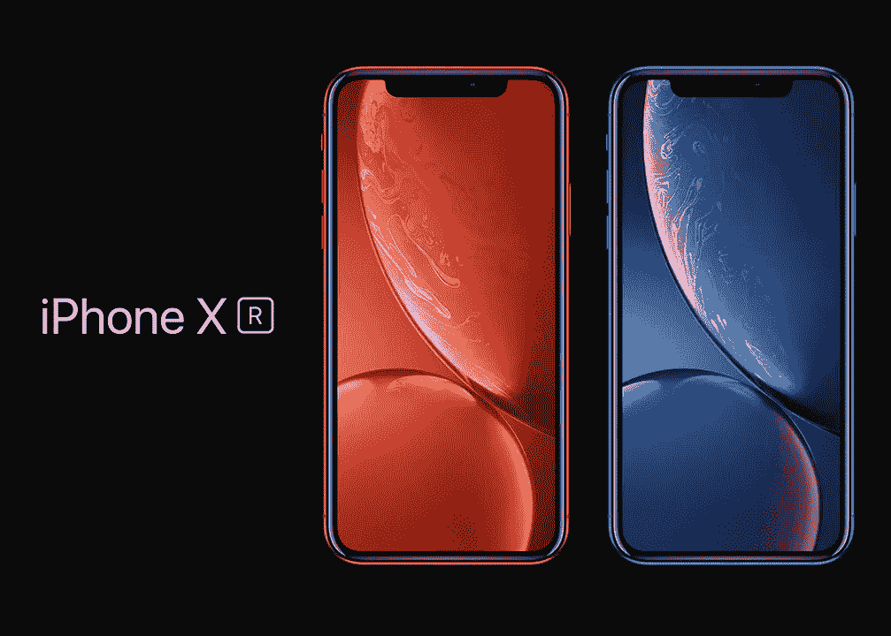
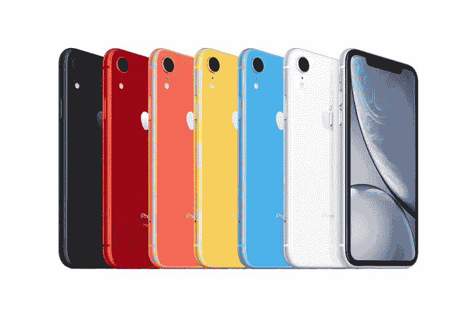
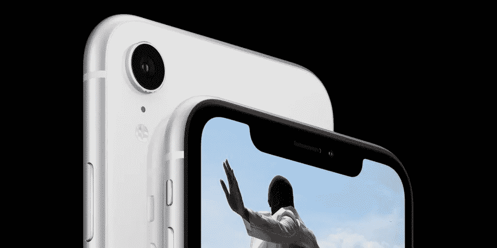

# iPhone XR: R 用来敲竹杠？

> 原文：<https://medium.datadriveninvestor.com/iphone-xr-r-for-ripoff-d4be5d66fc0b?source=collection_archive---------5----------------------->

# iPhone XR 是苹果 iPhone 活动中最激动人心的部分。

当苹果宣布今年的 iPhone 系列时，许多消费者都被 iPhone XR 深深吸引。它保留了 iPhone XS 的最佳功能，但屏幕更大，价格更低。

不过，有一个小细节你可能忽略了…

# 屏幕甚至不是全高清的！

当我发现 iPhone XR 的屏幕无法显示全高清内容时，我感到非常震惊。它的 PPI(每英寸像素)和 2010 年的 iPhone 4 一样(326 PPI)！对我来说，这太疯狂了，如果你的智能手机售价超过 700 英镑，那么全高清显示屏是必备的。

真的没有借口，在移动行业增加一个全高清面板并不昂贵。你可以买到 300 英镑以下的全高清屏幕手机。在我看来，苹果这样做只是为了区分 iPhone XR 和 iPhone XS，让人们有另一个理由在 iPhone XS 上花费更多。

毫无疑问，iPhone XR 的屏幕会看起来模糊，如果你总是在手机上播放全高清(1080p)视频或喜欢看全高清的网飞，你就不能在这部手机上这样做。

这发生在当 OnePlus 5/5T 由于其加密方法而无法以全高清方式播放网飞时，消费者非常愤怒的时候。许多人(包括我在内)观看全高清多媒体，这几乎是一个行业标准。

我发现很难以发行价向任何人推荐 iPhone XR，感觉它似乎在推动人们花更多的钱。

# 它仍然是一部好手机

不过，iPhone XR 仍然是一款很棒的手机，它采用了新的苹果处理器，相同的主摄像头，电池比 iPhone XS 更大。它仍然是 iPhone XS 的一个很好的廉价替代品，但全高清功能的省略是一个大问题。

如果你想留在苹果的生态系统中，你会在获得一部没有全高清的手机和额外花费 250+购买全高清手机之间做出选择。

你真的能证明花 750 多英镑买一部甚至不能播放全高清网飞的手机是合理的吗？

我们不能。