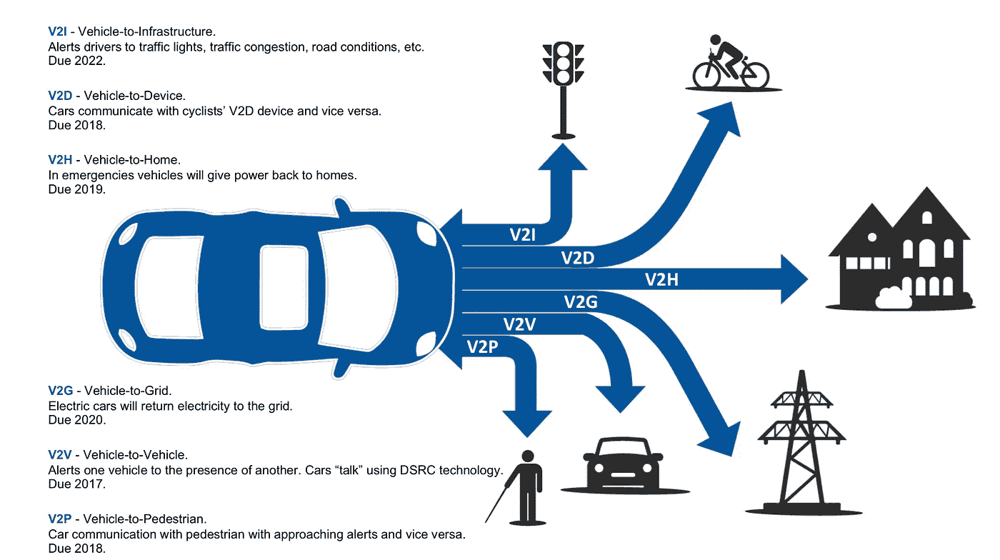
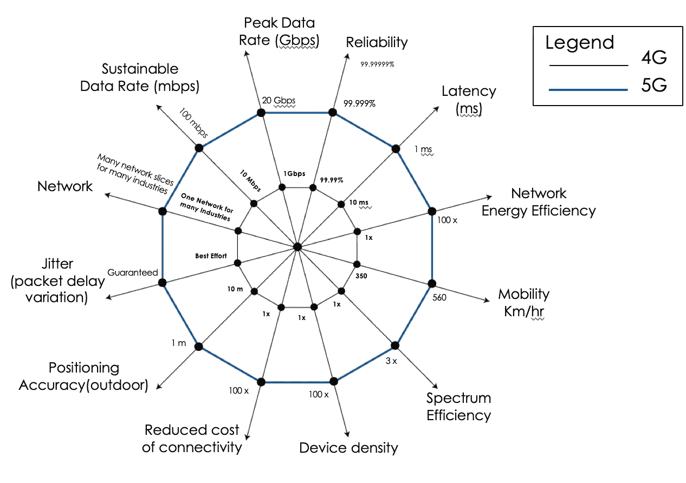
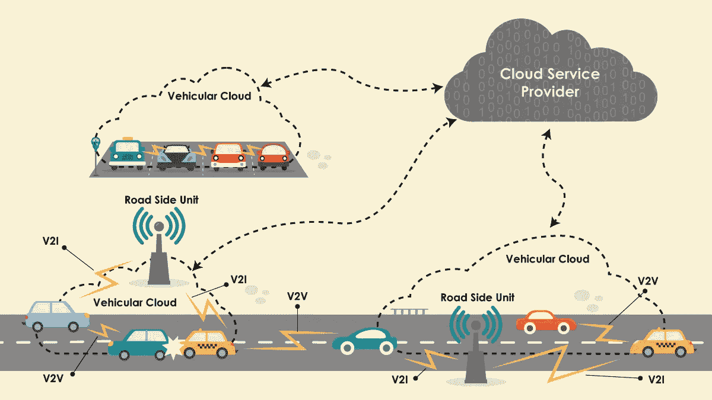

# 5G 是自动驾驶汽车的朋友还是敌人？

> 原文：<https://medium.datadriveninvestor.com/is-5g-friend-or-foe-for-autonomous-vehicle-72ee70800031?source=collection_archive---------2----------------------->

Vehicle-to-X Communication and Use Cases

***5G 设置有哪些方式可以增强高清(HD)映射等？***

5G 的一个关键方面是上行数据速率，即数据从车辆移动到云端。与 4G 相比，5G 显著增加了上行链路和下行链路的可持续带宽。但是这本身还不够好。你如何接近实时决策？这将转化回超低延迟，并保证抖动和交付。

其次，高清(HD)地图需要高速带宽来传输大量数据。HD mapping 还坚持位置精度，以便了解对象之间的相对位置。第三个必要元素是支持每个小区站点的高车辆密度。使许多车辆能够彼此靠近，同时访问高的可持续数据速率是非常重要的。

5G 首次提供了亚毫秒级的延迟。今天，如果我们看看 4G LTE，我们有 10-30 毫秒的往返通信时间，但对于 5G 来说，它将低于 1 毫秒，这几乎是实时的。时间可以进一步减少。下行链路的峰值带宽约为 20 Gbps，而下行链路的可持续带宽为 1 Gbps。但是可持续的上行链路也在 10 Mbps 的数量级。峰值带宽可以达到 100 Mbps 的数量级。拥有 10 Mbps 的可持续上行链路和 1 Gbps 的可持续下载是一件大事。与 4G 相比，5G 将使车辆密度提高 100 倍，即 5G 将使可以使用实时数据流的设备/车辆的密度提高 100 倍。

最后但同样重要的是，5G 网络对行业/市场的逻辑分离。与今天的 4G 网络不同，在今天的 4G 网络中，从公用事业、遥测和计量到观看电影和发送电子邮件，所有应用都使用一个单一的 4G/LTE 网络。5G 具有网络分离能力。因此，可以包含互联驾驶功能的逻辑网络可以专门用于自动驾驶。这意味着只有车辆将使用该特定的逻辑网络，因此网络性能、业务建模、定价等也是如此。可以专注于车辆的需求。因为只有特定种类的流量，所以也可以管理延迟。目前，存在一种混合模式，这使得 5G 运营商很难理解哪里需要优化。5G 将在云中实现高清制图，然后以接近实时的方式发回信息，从而创造卓越的用户体验。

Vehicle-to-Vehicle (V2V) and Vehicle-to-Infrastructure (V2I) Communication with Cloud Service Provider

**更适合 V2X？**

V2X 不是一项技术，有车对车(V2V)、车对基础设施(V2I)、车对行人(V2P)、车对 X(X 可以是任何东西)等用例。，就看我们用什么技术了。今天，当人们谈论 V2X 时，他们指的是专用短程通信(DSRC)，也称为 IEEE 802.11 p。5G 来自 2G，3G，4G 和 WiFi 等蜂窝技术的演进。值得考虑的是 DSRC 和 5G 蜂窝技术对于车辆用例的差异。两者都适用于 V2X，但是哪个更适合呢？从安全性和覆盖范围的角度来看，V2X 的两个主要组件是 V2V 和 V2I。基于 DSRC 的 V2V 不需要基础设施，这意味着信标从车辆发出，可以检测附近的其他车辆。同样的事情可以通过 5G Direct 甚至 4G LTE Direct 来实现。这种通信还支持设备到设备(D2D)通信。

5G 将拥有类似于 DSRC V2V 通信公司的 D2D 通信能力。从这个角度来看，DSRC 专注于通信和证书的安全性。这也可以用于 5G，只是 5G 也具有无线电链路级别的安全性，因为 USIM(通用用户识别模块)或 eUICC(嵌入式通用集成电路卡)技术具有固有的安全性。虽然我们获得了移动安全的优势，但我们可能仍然会在 DSRC 甚至 5G 中取消一系列车辆证书，这超出了通信级别。安全性在通信层面，5G 将提供更好的安全性，因为它是从 3G/4G 安全性发展而来的，并且具有内在的通信安全性。DSRC 本身没有相同级别的通信安全，因此我们必须添加更高的安全层。但是，如果我们考虑证书、基础设施或 X509 证书，它们可以同时存在，因为它们不在通信级别，而是在更高的身份验证和授权级别。

如果我们看看网络安全，它包括硅到通信到认证/授权，5G 的定义要好得多，并支持 V2V 通信，其中人们有不同的变化，没有标准。看看更适合不同战略和服务的覆盖范围，5G 的一个关键特征是，我们第一次可以进行无基础设施的通信。这不仅仅是关于页面速度和低延迟。那是什么意思？这意味着 5G 现在有能力拥有融合技术——它可以从一辆车跳到另一辆车，以创建一个车辆之间相互通信的 ad-hoc 网络。DSRC 在某种程度上也是这样做的；它不需要 V2V 的基础设施，所以它创建了自己的网络。5G 可以提供与 DSRC 相同的服务。关于战略，如果我们从 WiFi 的角度来看，那么我们寄希望于 DSRC。如果我们从蜂窝的角度来看，那么我们希望扩展蜂窝的能力，以支持网状网络和自组织通信。蜂窝 V2V 方法较新，而 DSRC 已经存在多年，人们已经在进行试验和 POC。

**什么最重要**

蜂窝 V2V 和 DSRC 可以互为补充，但它们肯定也可以相互竞争。如果我们将 DSRC 用于 V2X，我们必须花费数十亿美元来建立 V2I 的基础设施。必须构建新的基础设施、运营支出和未来增强的路线图，以证明投资回报和该项目的所有权，这可能会由政府承担。为了利用 V2I，需要大量的基础设施投资，而 5G 具有蜂窝技术和有兴趣推出不同用例的运营商的优势。在这种情况下，运营商承担基础设施的费用。运营商可以从逻辑上分离出移动互联网、智能电网、互联设备、自动驾驶汽车等的基础设施。这样，他们可以通过不同的方式将技术货币化，而基础架构仍然是共享的基础架构。从这个角度来看，5G 比 DSRC 更有优势，因为蜂窝塔和房地产等。都可以被利用。运营商不仅可以从一个垂直领域，还可以从许多不同的垂直用例中实现投资货币化:工业、零售、最终用户、联网汽车、自动驾驶、公用事业等。更大的垂直市场增加了获得良好投资回报的机会。考虑到这一点，5G 更适合。我们从 DSRC V2V 和 V2I 用例中学到的东西可以用于 5G，因为它只是底层技术。你使用 5G 还是 DSRC 并不重要，真正重要的是我们如何使用构建在其上的应用。

**准备走向全国**

由于之前的商业案例说明，5G 基础设施已准备好覆盖全国。运营商的商业案例已经得到了很好的证明，他们希望推出 5G 不仅是因为容量的增加，而且他们将首次有能力货币化，并为垂直行业提供专用网络，并以不同的方式收费，这是他们以前在宽带互联网服务中无法做到的。航母绝对准备好了。但 DSRC 绝对不是。没有一个国家有数十亿美元来铺设这种专用于车辆安全的基础设施。另一件需要理解的事情是必须进入车辆的硅。5G 的优势在于为智能手机大规模生产硅。因此，他们建造硅芯片的成本以及他们从数十亿人使用的 3G/4G 网络中获得的健壮性，在 DSRC 中仍然是未经证实的。DSRC 甚至缺少十万人规模的用例。DSRC 将面临许多新的挑战，因为它不具备 3G/4G 蜂窝技术固有的安全性。当然，5G 将有自己的挑战，但与 DSRC 将面临的挑战相比，它们将相形见绌。V2I 的蜂窝方法也将扩展到 V2V，因为每辆汽车都需要连接。它也将适用于 V2P，信标将从人身上释放，汽车将检测到它，以避免事故。蜂窝技术最大的优势在于其广泛的适用性——在智能手机、汽车和手持设备中。适用性如此广泛，你可以真正拥有 V2X，而不仅仅是 V2V 或 V2I。这可以进一步扩展到设备到设备，自行车和摩托车将能够避免致命事故。智能手机的大量生产将比任何其他技术更快地降低成本。

**结论**

DSRC 实施并取得成功的机会越来越小。随着 5G 的到来，DSRC 没有这样的容量，它不是强制性的，也不在汽车中，他们正在失去这一优势。一旦 5G 进入发射塔和手机，那么引入新技术和获得仅针对车辆的投资将变得更加困难。

文章首次发表于[http://ee catalog . com/automotive/2018/10/09/the-impact-of-5g 对自动驾驶汽车的影响/](http://eecatalog.com/automotive/2018/10/09/the-impact-of-5g-on-autonomous-vehicles/)

[Automotive & Connected Car](http://eecatalog.com/automotive/2018/10/09/the-impact-of-5g-on-autonomous-vehicles/)