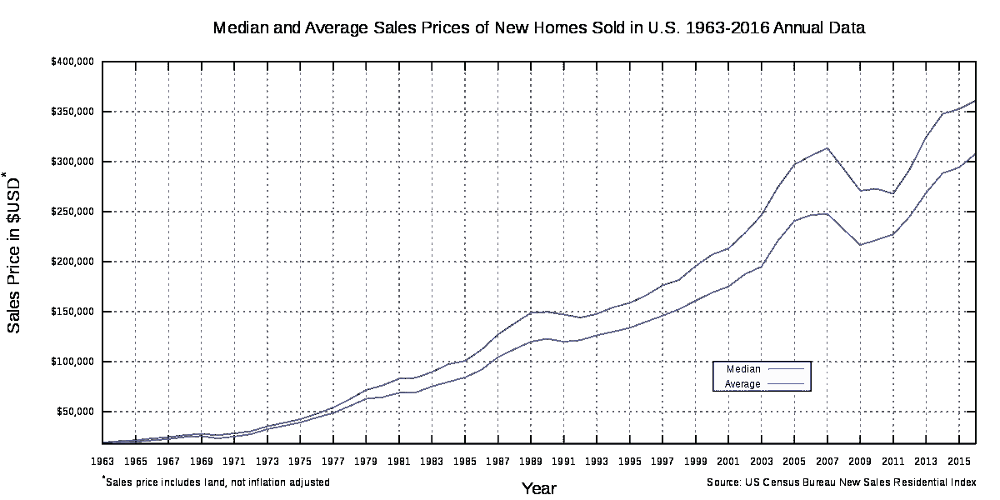

# 30 年的房贷值得吗？

> 原文：<https://medium.datadriveninvestor.com/is-a-30-year-mortgage-worth-it-f9db9e84afc1?source=collection_archive---------0----------------------->

Photo by [JOSHUA COLEMAN](https://unsplash.com/@joshstyle?utm_source=medium&utm_medium=referral) on [Unsplash](https://unsplash.com?utm_source=medium&utm_medium=referral)

拥有自己的房子是美国梦的一部分。美国的资本主义驱动力让我们寻找创新的方法，把东西做得更大更贵；也许最好的例子是美国抵押贷款市场。

很难相信，但是 100 年前抵押贷款没有被广泛使用。今天，家庭可以获得 30 年的抵押贷款，首付 20%或更少。这些抵押贷款说服美国人购买更大、设施更好的房子，但抵押贷款将许多家庭锁定在 30 年的合同上，使他们的房子成为他们的主要储蓄工具。

 [## 数据驱动投资的兴起|数据驱动投资者

### 当 JCPenney 报告其 2015 年 2Q 的财务结果时，市场感到非常震惊。美国零售巨头…

www.datadriveninvestor.com](https://www.datadriveninvestor.com/2019/02/28/the-rise-of-data-driven-investing/) 

抵押贷款增加了房屋的价值，而且由于房屋付款延长到 30 年，人们觉得他们可以负担更多。房屋可负担性的提高导致房屋卖家和房地产经纪人提高价格，因为贷款更容易获得。房价的大幅上涨提高了所有的生活成本，甚至是出租单元的价格。这并不是说房子不是一个明智的投资，但对许多人来说，最好是租一个或从一个小房子开始。

**抵押历史**

美国的抵押贷款在上世纪 30 年代站稳了脚跟，以刺激美国人购房。然而，这些抵押贷款看起来不太像现代抵押贷款。30 年代的抵押贷款要求你首付 50 %,并在 3 到 5 年内还清。在接下来的 40 年里变化不大。20 世纪 60 年代，一套住房的平均成本刚刚超过 11，900 美元，平均家庭收入为 6，000 美元。考虑到通货膨胀因素，今天的房价是 10 万美元，家庭平均年收入是 5 万美元。相反，如今美国的平均房价是 37 万美元，美国家庭的平均收入是 5.1 万美元。

Cost of a single family home over the past 50 years.

为什么工资几乎没变，但平均房价却几乎翻了两番？很多都与抵押贷款有关。20 世纪 70 年代和 80 年代，抵押贷款开始发生变化。根据贷款类型的不同，家庭必须首付的金额开始下降到房屋的 20%或更少。不需要在 5 到 10 年内还清贷款，而是创造了 30 年抵押贷款。政府在银行和房地产行业的要求下，提出了这些新的贷款条款，以刺激房地产市场，让更多的美国人购买房屋。然而，这也使得房地产行业开始建造更大更贵的房子。仅仅几年前还是豪宅的房子现在中产阶级家庭也能入住了。多亏了二级市场，这些巨大的房屋和长期抵押贷款最终获得了超低利率，在二级市场上，银行将抵押贷款打包出售给其他银行。过度投机导致这个市场在 2000 年代末崩溃，引发了大萧条。

一个平均收入为 51，000 美元的美国家庭试图用 30 年期抵押贷款购买平均收入为 370，000 美元的住房，首付为 20%，最终将在贷款期限内支付几乎相当于房屋成本的利息。假设首付 70，000 美元，目前的利率为 4.3%，在 30 年的抵押贷款中，这个家庭将支付 250，000 美元的利息。事实上，如果没有银行和建筑商(以及消费者)推动更大的房屋和 30 年期抵押贷款，7 万美元的首付更接近房屋的成本。这一计算使用了当今创纪录的低利率。虽然 4.3%高于过去十年的水平，但仍远低于 70 年代、80 年代和 90 年代近 10%的利率。

**租金成本**

在过去的 40 年里，美国的租金也经历了类似的增长。这似乎表明抵押贷款不是直接原因，但 30 年期抵押贷款也可能是这一增长的部分原因。随着房价大幅上涨，越来越少的人(有工人阶级工作、高额学生贷款或儿童保育费用)能够买得起房子，这增加了对出租单元的需求。随着越来越多的人寻求租房，公寓业主已经能够增加他们的成本。经通货膨胀调整后，家庭收入在过去 50 年中基本持平，但全国平均月租金从每月 250 美元增加到今天的每月近 650 美元，增长了近两倍。

**房屋作为投资**

如果有什么个人建议的话，那就是尽量限制你的巨额抵押贷款敞口，这将使你无法将你的钱用于其他方面。从历史上看，房子一直是积累家庭财富的一个好方法，但这也部分是因为 30 年期抵押贷款增加了房子的价值。展望未来，很难说与他们的父母相比，现在这一代人的房子是否是一项好的长期投资。最好的办法是不要买超出你需要的房子。如果你打算在一个地方呆上 3 到 5 年，买房可能是个好主意。只要确保你没有把所有的积蓄都投入到巨额抵押贷款中。租房并把你的储蓄用于投资也是一个快速积累财富的好方法。房屋的增值每年不会超过 5-7%。如果你每年支付 4%的贷款利息，你每年只能获得 1-3%的房屋回报。更明智的做法可能是租房，并将更多的收入用于投资。