# 阿迪达斯 LDN 是零售业的未来吗？

> 原文：<https://medium.datadriveninvestor.com/is-adidas-ldn-the-future-of-retail-2381c385ddac?source=collection_archive---------2----------------------->

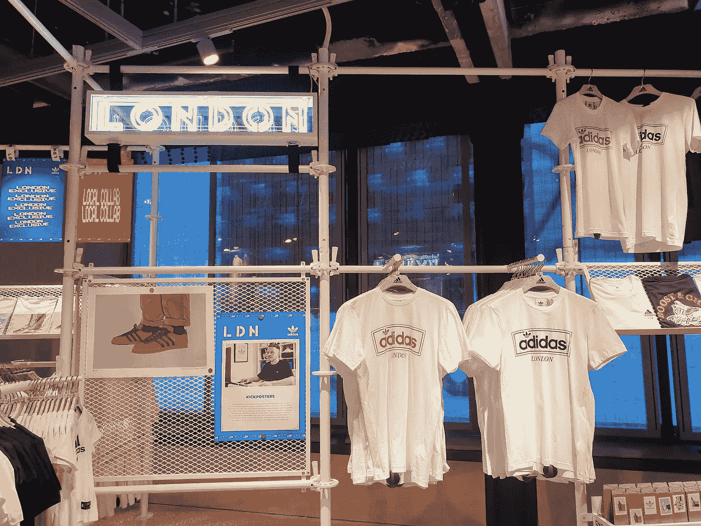

adidas flagship store, Oxford Street, London

## 这是一个大商店，好吧。但是这有什么好处吗？

周三晚上，我以新闻业的名义秘密行动。

瞧，阿迪达斯在伦敦牛津街新开了一家旗舰店，据说这是他们迄今为止“最数字化”的商店。

这种声明对这位作者来说是一种诱惑，但我不想受到特殊待遇，因为我是记者。关于这家新商店已经有足够多的吹捧文章，称赞它的“100 多个数字接触点”，它的应用程序，它丰富的屏幕。

 [## 2019 年值得关注的 20 种数字营销趋势和技术|数据驱动的投资者

### Faisal 在加拿大工作，拥有金融/经济和计算机方面的背景。他一直积极从事外汇交易…

www.datadriveninvestor.com](https://www.datadriveninvestor.com/2019/02/04/20-digital-marketing-trends-techniques-to-watch-out-for-in-2019/) 

这必须是对购物者体验的真实描述。

以下是我的发现的摘要。

**我会这样分组:**

*   关键的事实和数据。
*   核心主题和亮点。
*   介绍“sneakeasy ”,这是一家不可拆卸的运动鞋商店。
*   这是零售业的未来吗？

# ***商店里有什么？***

几周前，阿迪达斯(从未资本化，仅供参考)在牛津街新开了一家大型商店。它有 27，000 平方英尺大，有四层基于服装的娱乐场所。

它在这个空间里装了很多东西，有专门的足球、阿迪达斯原创、Y-3 和斯特拉·麦卡特尼系列。

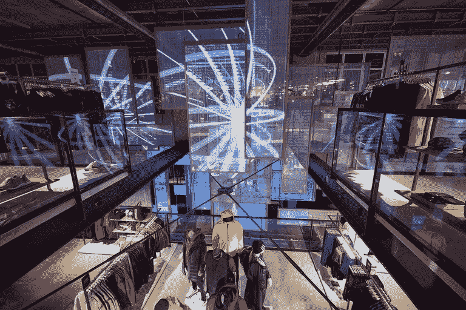

其中穿插着“定制站”,购物者可以在这里设计自己的 t 恤，在足球(soccer！)衬衫，并在运动鞋上贴上贴纸。

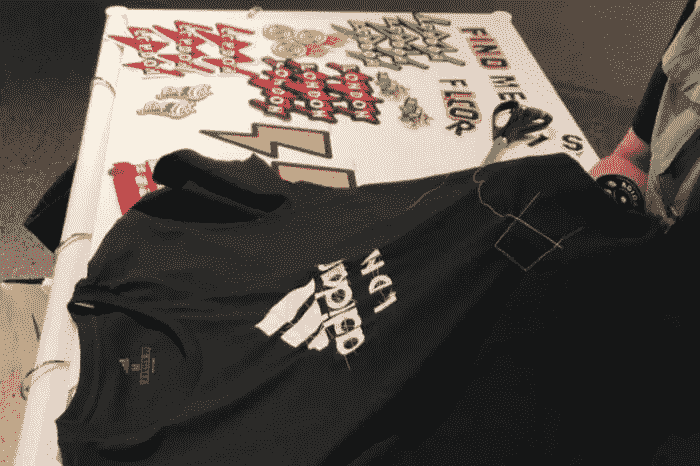

有胸罩试衣服务(没试过)，检查新球鞋的跑步机(没试过)，还有可以按下按钮的互动镜子(绝对试过)。

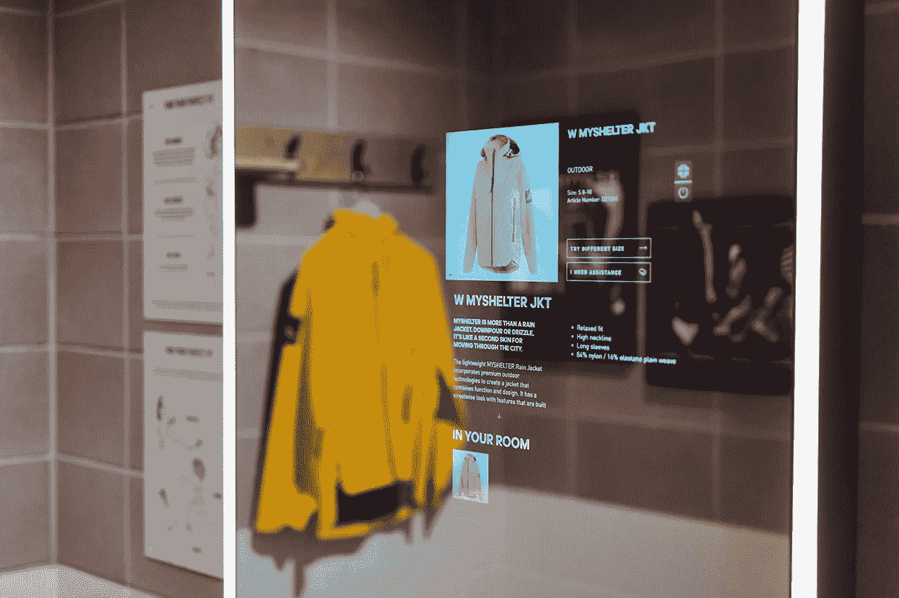

一些核心主题会在第一次参观时跃然而出:

*   伦敦:如果你发现自己在牛津街上，尽管有红色的公共汽车、纪念品商店和毛毛雨，你还是不知道自己在哪里，那就去阿迪达斯商店，答案会迅速出现在你的脑海里:啊，是的，我在伦敦。或者，LDN，他们喜欢叫它在这里，只有在这里。有点像我们几周前讨论过的耐克(**)，阿迪达斯在几个城市推的是当地的角度。太用力了吗？也许吧。**
*   **可持续发展:我和一位友好的店员聊起了这个新地方，他很想宣传他们的环保证书。他们在屋顶上有巨大的太阳能电池板，商店里的 100 多个“数字接触点”由产生的能量供电。平均每双阿迪达斯运动鞋中有 11 个回收塑料瓶。我问这个数字是否波动很大，他说，“取决于鞋子有多大，伙计。更大的鞋子，更多的瓶子。”我不能否认这一点。**
*   ****定制:**我们可以用任何东西来描述这个主题，从定制到[个性化](https://www.cadeera.com/five-ecommerce-personalisation-trends-for-2022/)甚至是协作。这个想法是让顾客参与到他们自己产品的创造中，重点是触觉互动。想要自己的 t 恤？去抓住一个，添加一些徽章，然后按下它(与援助)。我想，一旦你到了那个地步，就很难不买了。在电子商务如此好地迎合购物的纯粹交易方面的时候，这是对物理空间的明智使用。像这样的商店需要强调让购物感觉像一个场合的元素，阿迪达斯显然已经接受了这一点。**
*   ****科技:**阿迪达斯旗舰店对科技的运用是有思想的，总的来说。优质产品经过精心挑选，像博物馆文物一样陈列；购物者可以使用手机上的应用程序或商店里的触摸屏来请求试穿一双。实物的展示方式，基于欲望和羡慕，在自身和顾客之间制造了一种概念上的距离；技术弥合了这一差距，使目标变得可实现和真实。啊，我想要……哦！我可以让它充满活力。**
*   ****多样性:**展出的人体模特在尺寸和形状上有着健康的多样性，尽管这并不是本次审查的重点。阿迪达斯当然希望这是一个包容性的空间——可能不是出于利他主义的原因，但我们会根据这些事情的影响而不是意图来判断它们。数字屏幕上有许多照片和视频，颂扬各种各样的运动员和先驱，但主要是保罗·博格巴。他无处不在。除了最近在足球场上。**
*   ****独占性:**对，这家店既包容又独占性。告诉过你它很大。楼下区域是为“潮流”运动鞋系列和活动预留的，未来几个月计划举办一系列基于音乐的晚会。当你步入 Y-3 区时，气温会下降一点，那里有 2000 年的单身公寓和微风砌块墙。**

**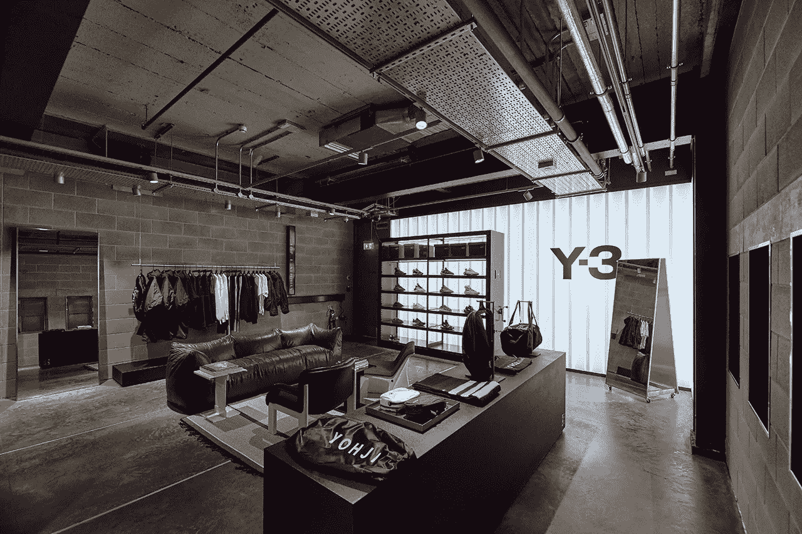**

**当然，这里被设计成一个闲逛的地方，让自己沉浸在“品牌体验”中。它也是精心制作的，引导人们进行一两次购买。**

**有大量的开放空间，尤其是在入口处。这可以让顾客温柔地走进商店，而柔和的曲线会将你引向商店的中心。**

**这不是一个你仅仅为了拿一双袜子就离开的地方。这是那种你去的目的是买一顶便宜的羊毛帽子的地方，但最终却是一套印有“克拉克在伦敦#2019”的高尔夫球杆——而且没有帽子。**

**不同的区域有机地交织在一起，所以你会无缝地、无意地从橄榄球衫走到运动鞋清洗站。**

**有人认为这将有助于向顾客介绍他们原本不会考虑的产品。**

**到处都有带着平板电脑和耳机的员工，他们嬉戏玩耍，营造出阿迪达斯想要的氛围。**

**他们让这个初露头角的时事通讯记者对自己的卧底任务有了自我意识，以至于这是我拍的最好的自拍:**

**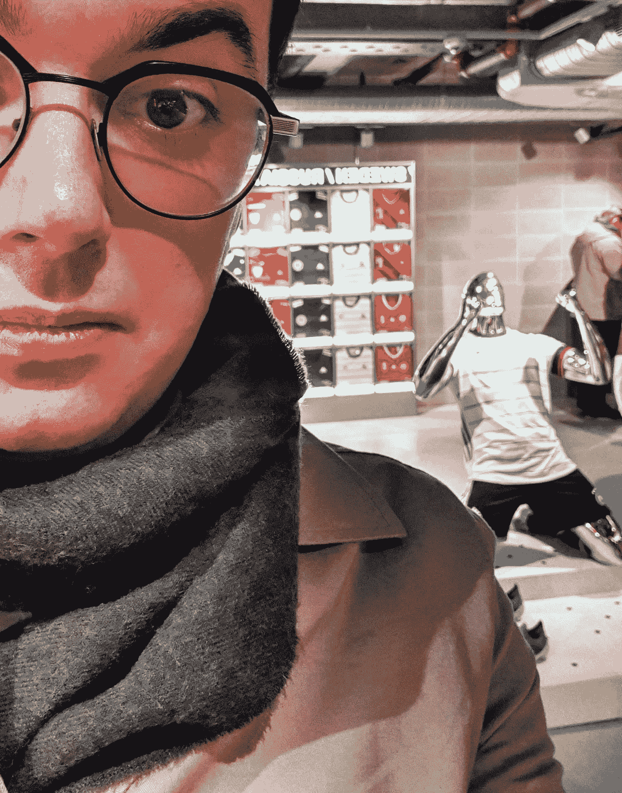**

**也许风衣吸引了额外的注意力。经典间谍装。**

**不管怎样，穿着新德国队球衣的人体模特真的很享受他想象中的目标。**

**其中一些感觉像是创建原型最佳实践 2019 零售体验的打勾。毫无疑问，阿迪达斯也受到了伦敦附近的耐克专卖店的影响。**

**然而，它确实打破了一些规则。**

**商店设计行业有一个老生常谈的事实(据我所知)，90%的商店访客在进入时向右转。**

**因此，许多商店把他们最重要的产品放在入口的右边，所以我们能看到它们。**

**当你进入这家商店时向右转，你会看到一条鲸鱼游过一个巨大的屏幕，旁边是一个关于泰晤士河中塑料数量的故事。**

**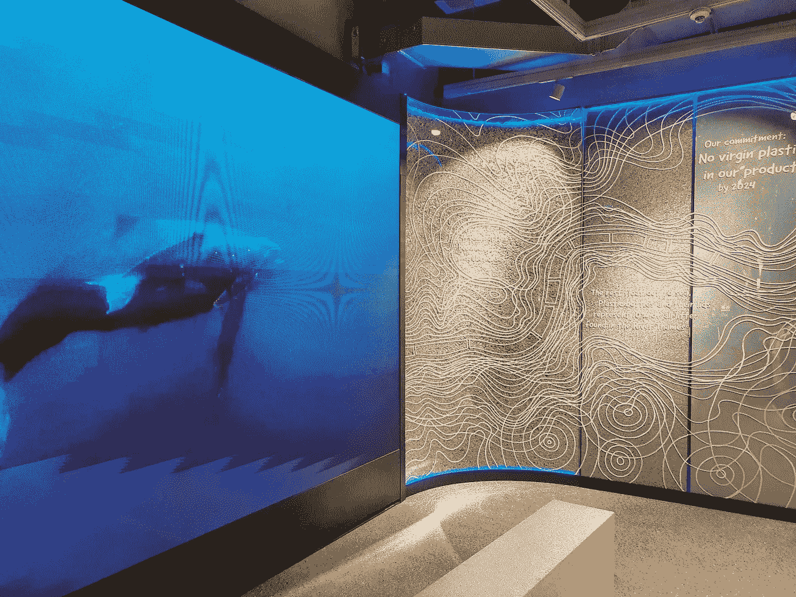**

**这让我想到了其他几个被打破的规则。耐心听我说——我们很快就会回到有趣的话题上来。**

# *****安 SEO 插曲*****

**现在，我不想把 SEO 带进来。我很少想把 SEO 带入任何东西，但这很重要。**

**我找不到商店。**

**我大脑中的导航部分在很多个月前就已经放弃了，将全部责任交给了谷歌地图。**

**像一个优秀的千禧一代一样，当我准备出门时，我谷歌了一下“阿迪达斯商店牛津街”。我戴着围巾，什么都戴上了；谷歌不会让我失望。**

**等等，它…永久关闭了？！**

**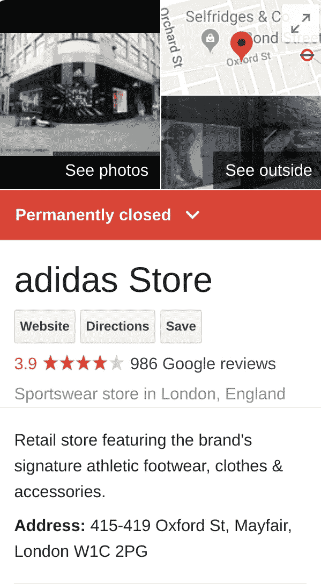**

**基本上，他们没有更新他们的谷歌列表，对于这样一个昂贵和高科技的努力来说，这似乎是一个巨大的疏忽。**

**也许这家新店太酷了，以至于没有招牌。一个简单的运动鞋，如果你愿意的话——地下运动鞋商店。**

**在我的收件箱被自作聪明的人爆满之前，“嗯，我刚刚在我的笔记本电脑上谷歌了一下，看起来不错🤨🤨🤨“，我很感激他们会解决这个问题。新店和老店在不同的地址(不可否认，就在它旁边)，这给我带来了另一个问题。**

**在宣传 bumpf 中，阿迪达斯高管说了这样的话:**

**“新的阿迪达斯 LDN 店不仅仅是该品牌的零售体验，它将成为我们在这座城市的灯塔。”**

**嗯哼。还有一个:**

**“LDN 是伦敦人的伦敦商店。商店的大部分都是与伦敦当地艺术家和设计师合作建造的，我们将继续与当地人才合作，为世界上最伟大的城市之一提供独特的阿迪达斯体验。”**

**伦敦。但实际上，LDN。**

**这个没有元音的流线型替代词，豆奶代替了基于牛奶的原词，具有挑战性的原因不仅仅是它纯粹的不可发音。**

**我读了这篇文章，心想，啊，如果我想找到地址，我需要搜索“阿迪达斯 LDN”。**

**如果阿迪达斯还没有一款名为 LDN 运动鞋的产品，那会有所帮助。**

**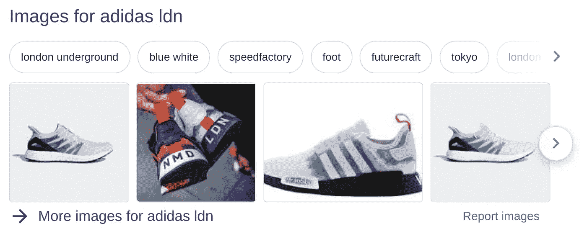**

**随着时间的推移，新的品牌将会扎根。过去一周，如果你搜索“阿迪达斯 LDN”，谷歌地图上会显示这家新店的列表。**

**不过，这真的是值得考虑的事情——尤其是在这里没有人会说“LDN”。NYC 有道理；LDN 可能会在机场工作，但除此之外没有任何意义。**

**阿迪达斯最近表示**他们在数字广告上“过度投资”，很高兴看到一家公司对在线广告如何有助于购买决策持更开明的观点。****

****通常，效果营销广告强行出现在高意向客户面前，然后从销售中获利。通常，如果没有他们的干预，他们会为可能发生的销售买单。****

****这些“性能”方法肯定不会产生新的需求，也不会“取悦”客户。我不知道你，但我从来没有付费搜索的经历，我想告诉我的朋友。****

****业内很少有人考虑到区分“选择效应”和“广告效应”的洞穴。****

****在 [**这篇精湛的文章**](https://thecorrespondent.com/100/the-new-dot-com-bubble-is-here-its-called-online-advertising/13228924500-22d5fd24) 中，选择效应被定义为“人们看到了你的广告，但已经打算点击、购买、注册或下载”。****

****这与广告效果截然不同:“人们看到你的广告，这就是他们开始点击、购买、注册、下载的原因。”****

****作为一个前雅虎！一位广告业高管在文章中说，“通过向人们展示他们不想看的图片和电影，很难改变人们的行为。”****

****阿迪达斯开始意识到这一点，我相信许多其他零售商也会效仿。数字广告当然没有它的信徒想让你相信的那么复杂。****

****尽管如此，数字广告在一些事情上做得很好。你知道，就像把地址弄出来一样。除非他们走的是“sneak easy”(TM)路线，否则我会说他们的 SEO 人员应该马上“解决”这个问题。****

****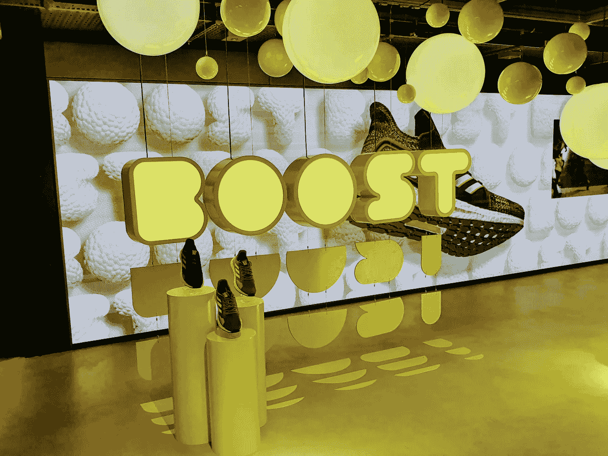****

# *******现在，回到商店。这是零售业的未来吗？*******

****新的阿迪达斯“LDN”店有很多令人喜欢的地方。****

****它提供了足够的新奇感来吸引临时购物者，也提供了足够的多样性来吸引他们。这对一个相当大的零售物业很重要；我们需要一个访问的理由，用我们的腿和脚，走路，而不是点击我们手机上的几个按钮。****

****在耐克宣布退出亚马逊直销的那一周，我们看到阿迪达斯也想确认自己的身份，并控制客户关系。****

****购物者可以使用阿迪达斯的应用程序请求试穿产品，商店助理可以在商店的任何地方将产品交付给他们。这对那些清楚自己想要什么、只想购买的人来说很有用。****

****在整个商店中，有互动的挑战，镜子显示观众在著名的体育场馆，和丰富的定制站。****

********

****购物者也可以试穿产品，例如在跑步实验室，它可以提供运动鞋是否合适的反馈。****

****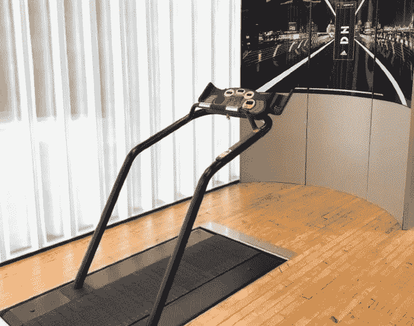****

****这项技术无处不在，商店没有它是不可想象的，尽管它避开了“为技术而技术”的陷阱。****

****零售店也可以被视为该品牌的巨大广告。从这个意义上来说，它就像一个四层楼高的广告牌，展示了阿迪达斯最近的动向。****

****阿迪达斯表示，这家商店纯粹是“我们品牌的表达”，但它也像是表达了该行业的现状。****

****毫无疑问，将这样一个空间用于新型零售是经过深思熟虑的。购物者可以使用应用程序控制互动，而物理空间有助于吸引他们。与一些产品的触觉互动是明智的，而对于其他产品(昂贵的产品)来说，展示有一种渴望的空气。****

****尽管我戴着批判的帽子在那里，但当地/可持续/独家的主题被放得相当厚。****

****总的来说，阿迪达斯已经成功抑制了地标性商店不可避免的夸夸其谈，尽管这不是零售业未来的蓝图，但这是我们前进方向的一个明确标志。****

******得分:** 🛒🛒🛒🛒 *(满分为五个购物车。)*****