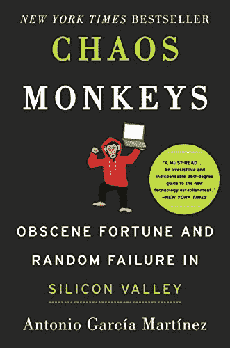

# 广告与现代市场相关吗？

> 原文：<https://medium.datadriveninvestor.com/is-advertising-relevant-in-the-modern-marketplace-ddc03c861da0?source=collection_archive---------11----------------------->

定向广告的业务是什么？

脸书和谷歌如何利用你的活动为你定制广告？

电子广告如何像华尔街？

 [## 睁大眼睛冲破多样性壁垒——数据驱动的投资者

### “科技女性”是蒂芙尼·霍兰的激情之一，最初她在 Twitter 上主持“科技女性”聊天。她也是一个…

www.datadriveninvestor.com](https://www.datadriveninvestor.com/2019/03/20/hurtle-diversity-barriers-with-eyes-wide-open/) 

现代广告有效吗？

这是安东尼奥·马丁内斯在 2016 年出版的《混沌猴子》一书中提出的问题。

故事始于 2005 年的华尔街，当时安东尼奥加入高盛，成为一名量化分析师。他被公司信贷交易部门聘用，通过对金融数据应用概率模型来分析价格。具体来说，他的工作是分析金融衍生品。衍生品是华尔街的数学引擎，使银行能够在任何时候估计任何业务的价值，通过信用违约互换(CDS)，机构可以押注于他们甚至不拥有的资产的未来价值。有了信用违约掉期，银行可以确保一家公司的股票价值，然后押注这家公司会倒闭。用金融术语来说，这就像一个小偷给你的车投保，然后偷走它。即使有这么多的筹码和奖金，钱对安东尼奥来说也像一个令人窒息的项圈。

一晃四年过去了，一名来自 Adchemy 的招聘人员来找安东尼奥。他们需要他的专业知识来分析他们不断增长的实时竞价(RTB)网络。在广告业，RTB 网络是在任何给定时间评估广告价值的常用工具。想象一下，每当你打开一个网站，就会有一场吸引你注意力的竞价游戏开始。RTB 的工作是计算广告像素出现在你屏幕上的瞬间价值，并跟踪你的参与度。Adchemy 的工作是管理他们客户的广告，就像华尔街的谷歌广告交易经纪人一样。

但到了 2010 年，显而易见的是，Adchemy 是一个没有回头客的失败者。马丁内斯决心做得更好，他招募了马修·麦凯琴和阿吉里斯来创建阿德格罗克。Antonio 将领导 AdGrok 担任首席执行官，团队努力提高小企业对 Google 广告交易的访问。使用 AdGrok 应用程序，用户可以从一个方便的浏览器工具栏上下载他们的谷歌广告性能的近实时统计数据。但在他们梦想推出产品之前，他们首先需要经历与广告和融资的痛苦分离。

在硅谷，人们普遍认为，任何新的创业公司都会经历一系列价值不断增加的融资轮。为了启动这些投资，创始人有必要与投资者和潜在客户建立联系。在 AdGrok 的案例中，Antonio 向 Y Combination 寻求启动公司的资金。后来，他的团队与脸书和 Twitter 的领导层一起进行产品演示。这些会议后来变得至关重要，因为阿德格罗克是一个死胡同。一年后，团队解散，安东尼奥加入脸书，担任产品经理。McEachen 和 Argyris 作为工程师加入了 Twitter。

进入脸书。八年前，扎克伯格的广告网络一片混乱。虽然他们的消费者确实参与了他们的广告，但总的来说，广告是随机的，无效的。脸书赚钱的唯一原因是他们数十亿消费者的全部力量。扎克伯格的网络也是独一无二的。谷歌总是知道你在搜索什么样的关键词，他们已经建立了一个盈利的广告交易平台来实时跟踪每个词的价值。这些文字转化成像素，成为网络的虚拟广告牌。就脸书的实质而言，形势不容乐观。说你👍你朋友新枪的照片。该算法可以将此解释为你有兴趣购买，并向你发送广告。或者第二天你的朋友发布了一则关于校园枪击的悲惨新闻。你们👍帖子和算法假设你想买枪。不是很酷。语境就是一切！在脸书，产品经理的任务是解决这个问题，他说这是一场政治风暴，哄骗员工为他的想法工作。

他们终于找到了解决办法吗？它是不完美的，最后用几种不同的方法实现了。拿出你的智能手机，因为它是关键。你的设备 ID 是你不可改变的互联网身份和你真正的脸书 ID。每次你在脸书上看到[龙乳](https://newhollandbrew.com/beer/dragons-milk/)啤酒的广告印象，它都知道。脸书知道你在工作时看到了他们对龙牛奶啤酒的印象，但在上次事件后，你无法打开它。脸书知道，当你下班回家，在你的台式电脑上又看到了这个印象。他们总是知道你在哪里。然后，如果你决定晚上去酒店买酒，他们会知道的。这最后也是最重要的一步是广告中最令人费解的一步。它假设零售商在用脸书做广告，并且你用信用卡之类的可识别 ID 购买了啤酒。直到那时，脸书才被认为是这次销售的功臣。

但是，脸书真的能证明是广告印象让你在当天晚些时候购买了龙牛奶啤酒吗？

尤金·施瓦茨曾经说过:“让我们直入问题的核心。使广告成功的力量、力量和压倒一切的拥有欲望来自市场本身，而不是来自文案。文案不能产生对产品的欲望。它只能把已经存在于数百万人心中的**希望、梦想、恐惧和欲望集中到一个特定的产品上。这是文案作者的任务:不是创造这种大众欲望，而是引导和指引它。实际上，对于任何广告商来说，花足够的钱来创造这种大众欲望都是不可能的。他只能利用它。当他试图反抗时，他就死了。”**

***剧透***

*雪莉·桑德伯格终止了安东尼奥管理的广告项目后，脸书解雇了他。*