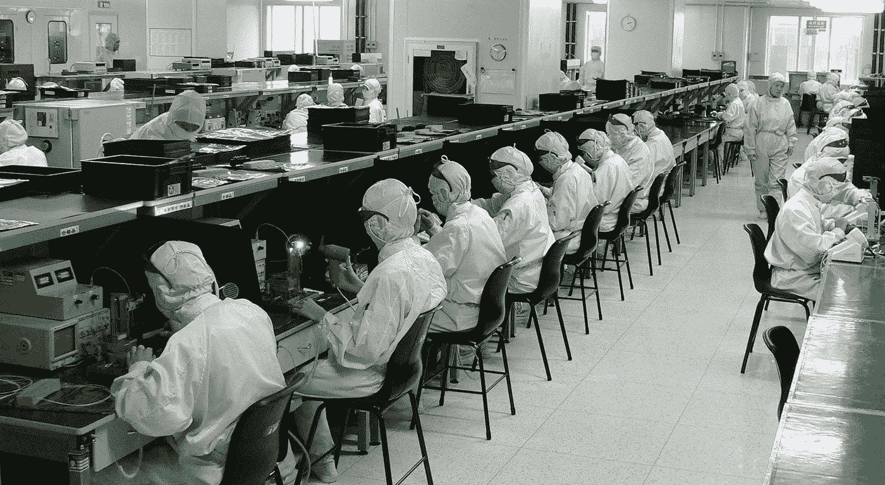

# AI 是否在放大贫富差距？

> 原文：<https://medium.datadriveninvestor.com/is-ai-amplifying-the-gap-between-rich-and-poor-252373c8641b?source=collection_archive---------38----------------------->

“看不见东西是多么神秘啊！”盖伊·德·莫泊桑著名故事《霍拉》中的叙述者如是说。这是关于一种寄生意识，它导致叙述者虐待他的仆人，并把自己的房子付之一炬。

我们正处于这样一个阶段，我们已经开始看到池塘里的大鱼吞噬了数万亿美元，而一半的不发达国家和发展中国家正面临前所未有的金融压力。毫无疑问，这里有因果关系。虽然对欠发达国家的猜测较少，但发展中国家肯定是在错误的轨道上。发表在《彭博观点》杂志上的一篇令人惊讶的文章描述了发展中国家是如何开始遭受人工智能可能带来的最糟糕的情况。它谈到了近几十年来印度和中国如何向世界展示了两种不同的增长模式——完全不同的金融生态系统，前者是由 It 支持推动的，后者是由大规模劳动力推动的。

在过去的十年里，我们已经看到对技术的需求大幅增长，越来越多的人愿意排长队购买最新款 iPhone。看到亚马逊和苹果突破万亿美元大关并不奇怪。伴随着这一壮观的明星之舞，出现了对工艺和蓝领 IT 支持的大量需求。对于像我这样在 IT 行业工作的人来说，这种需求既不健康，也不能自给自足；这需要人们愿意抛开他们的创造性思维，以低于平均水平的工资粘在他们的屏幕上。

更糟糕的是，同样的劳动力正在无意识地努力创造会吃掉他们自己工作的系统。老实说，这应该敲响了警钟——现代唯物主义社会不正试图解决它所制造的问题吗？

外包减轻了大公司的许多财务压力。这会对美国的就业市场造成一点伤害，但同时有助于缩小贫富差距——通过促进发展中国家的增长。这并不是说企业外包是因为他们关心 it。但是 AI 更进一步。它停在硅谷，默默地注视着中国工厂里的 2.7747 亿工人，他们每月的工资只有可怜的 300 美元。支持者可能会说，这个庞大的劳动力可以用来做更好的事情——也许是更先进的人工智能。但他们没有意识到的是，在这个游戏结束时，这种不稳定的情况是很容易发生的。在资本主义社会，财政平等不仅不可能，而且不稳定。AI 加剧了这一点，因为它使发展中国家真正的高知识分子(其创造者)和非技术工人(甚至更不幸的工人)甚至无法共存。

大多数印度的大学毕业生最终都在这些 IT 支持岗位上工作，并进入了这个系统，同时每月只能获得微薄的 300 美元的大学学位，并背负着学生贷款。这个关于一个典型的印度大学毕业生的非常特别的故事是一个很好的穿针引线，并且与平等主义社会的理念大相径庭。

相反，当人工智能的回报看起来如此诱人时——从治愈疾病、太空探索等等——停止研究人工智能实际上是不合理的。但要公开接受它的发展，我们真的需要考虑它可能会导致一个非常不稳定的社会。我们的政府现在比以往任何时候都更需要进行石蕊测试，以评估采用人工智能的道德依据，并对在商业领域使用人工智能削减成本实施硬性限制。在我们开始认识到“霍拉”是一个集体人类之前，必须对此进行适当的思考。