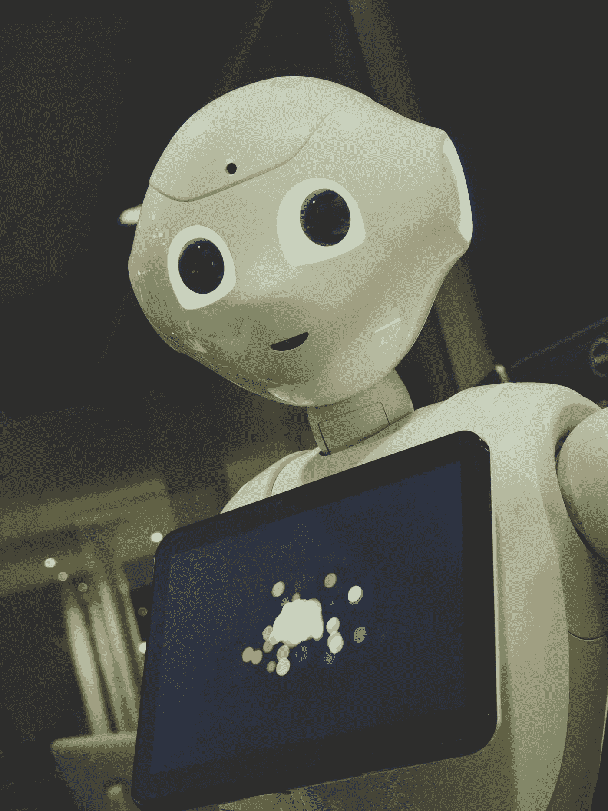

# AI 会把人才留在桌面上吗？

> 原文：<https://medium.datadriveninvestor.com/is-ai-leaving-talent-on-the-table-2c20ea6cfe6a?source=collection_archive---------26----------------------->

Can job seekers and employers happily hand over to AI technologies and sit back?

毫无疑问，技术已经动摇了招聘行业，我们喜欢它。无论是使用社交媒体来判断某人的文化契合度，陶醉于 LinkedIn 的“开放机会功能”，还是直接从你的 ATS 给候选人发电子邮件，技术都在让招聘人员的生活变得更轻松，并且会一直存在下去。这也是在你的工作之后——最新的颠覆性平台威胁要彻底消除招聘人员，使用人工智能自动将求职者与雇主匹配起来。但是终结者会来抢你的饭碗吗？而求职者和用人单位能高高兴兴地交给 AI 技术而高枕无忧吗？

**两种工作匹配平台**

我们已经和一些工作匹配平台的员工和社区经理聊过了。似乎有两种主要类型——机器人和装扮成机器人的人，只是假装是人工智能。后面这些平台看起来像人工智能一样“酷”,但工作人员向我承认，他们在后台手动匹配人员。实际上，这些公司是招聘机构，最有可能的是搜索关键技能和职位来进行初步筛选，然后手动审查个人资料以找到最佳匹配。这些平台中的一些还与自由职业者或机构合作，积极寻找人才并吸引他们到平台上来，一些则全部在内部完成。

然后是人工智能，科幻电影警告我们的那种人工智能将变得比人类更聪明，并最终接管世界。这些平台的工作人员向我保证，他们完全依靠算法来匹配候选人和工作，系统会随着时间的推移学习如何更有效地匹配人。这些平台有时也会与招聘人员合作来吸引人才，但这里的区别在于，没有人会审查个人资料，以努力将他们与工作匹配起来——这一切都取决于算法有多聪明。一旦匹配成功，就由雇主来审核简历，看看他们想面试哪些人。这种平台基本上筛选任何符合标准的候选人，并推荐尽可能多的合适候选人。这就把入围工作扔给了公司。在这一步，招聘人员会更深入，面试一次或多次，探索候选人是否适合公司文化，进行背景调查，利用他们的专业知识将范围缩小到两三个最佳人选。

因此，关注“真正的”人工智能，这些平台的表现如何？有趣的是，我们有一些雇主向我们表示，他们迄今为止对结果并不满意。但是我们几乎没有进行广泛的调查(尽管我们很想这样做)。然而，我们自己在候选人如何撰写简历以及雇主如何撰写职位描述方面的经验，让我对这些平台的运行效果产生了一个关键的疑问。

这种怀疑存在于创建这些平台的思维模式中。在 UX，心智模型是我们描述模式和假设的一种方式，这些模式和假设告知人们如何处理环境或问题。在以客户为中心的方法中，设计师在头脑中与最终用户的心理模型一起工作，以尽可能地减少学习曲线，并使设计内在地直观。我们不知道职位匹配人工智能使用什么算法，但我们知道许多自动测试系统使用关键词为主的方法进行初步筛选，通常只能处理简单的格式。尤其是在 UX 这个行业，作品集在展示设计技巧中扮演着如此重要的角色，这似乎是错误的思维模式。

现在，我们有文章出现，教求职者如何“击败”苯丙胺类兴奋剂。我们应该做的是确保 ATS 和工作匹配 ai 了解求职者是如何思考的，以及他们如何在纸上展示自己的技能。

> 因为让我们面对现实吧，很多人都不擅长写简历。此外，许多求职者并不知道 ATS 正在筛选他们的简历。

我们最近采访了一位在金融科技行业拥有多年经验的 UX 设计师。“金融科技”这个词在他的简历中没有出现过。聊过之后，我们委婉地告诉他，热门域名和流行语一定要清楚地列出来。这就是招聘人员能为你做的。确保你的简历反映了受欢迎的技能，作品集展示了相关的工作，ATS 为你选择了正确的关键词。

一个工作匹配平台假设你的表现和你写的简历一样好。但是我们真的只想雇佣那些已经学会如何向一台能识别他们的机器推销自己的人吗？如果他们在理论上有相同的经验和训练年限，我们真的能造出能从普通人中识别出杰出设计师的机器吗？

虽然工作匹配平台可能会为他们的付费客户提供一些服务，但从我们目前看到的情况来看，工作描述通常几乎完全来自公司自己的职业页面，几乎没有什么变化。一家公司的吸引力取决于它的职位描述。通常，招聘人员是真正推销公司的人，他们会填补有关福利和职业发展的空白，并找出他们知道会吸引特定候选人的因素。

这种人情味——这种更深入地了解职位和候选人，并在精确匹配上敷衍了事的行为——似乎是人工智能尚未准备好接管的一种行为。

H *无论是作为求职者还是作为雇主，你在工作匹配平台上有过好的经历吗？让我们知道你对最新一波人工智能的看法。*

> Erin O ' loughlin-Elevate Placements 的高级人才招聘专家。

[Elevate Placements](https://elevateplacements.com/) 是一家专注于柏林动态创业行业及其他领域的精品人才招聘机构。我们专注于将初创企业和公司与最好的 UX/UI 设计师和研究人员、内容提供商和通信专家联系起来。

connect@elevateplacements.com