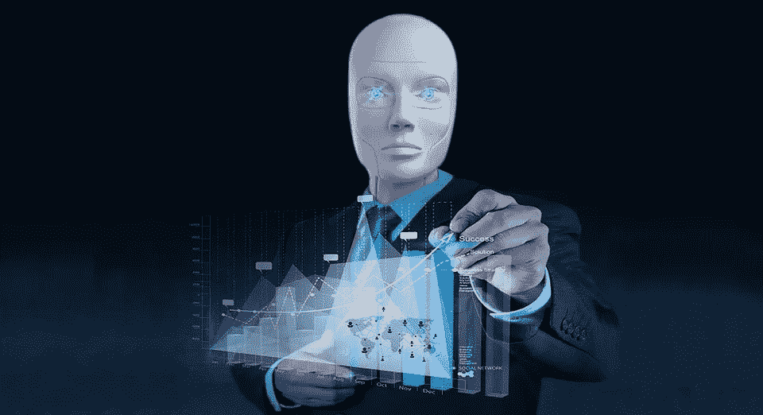

# 人工智能真的能解决我们所有的问题吗？

> 原文：<https://medium.datadriveninvestor.com/is-ai-real-solution-to-all-our-problems-f68c2162f454?source=collection_archive---------38----------------------->

最近关于亚马逊放弃其基于人工智能的招聘工具，以审查工作申请的新闻显示了机器学习复杂的一面。据路透社报道，用于实验性招聘工具的人工智能软件对女性求职者产生了偏见，并降低了她们的等级。话虽如此，它还报道说，这可能不是报废的唯一原因。

> 随着机器学习或人工智能被视为人类努力做的一切的解决方案，它也暗示了它所面临的问题。不幸的是，这些问题并不容易解决。人工智能肯定是一项技术福利，但肯定不是一根魔杖。

*人工智能的优势在于通过历史数据进行机器学习，这最终也是它的弱点之一*。如果历史数据已经有偏差，人工智能会巩固这种偏差的未来持久性。与 IT/技术世界的情况一样，该行业的女性人数历来较少，但在过去 10 年里，该数据集有更多男性向亚马逊提交的申请。的确，历史招聘数据显示，女性求职者的成功率较低，因此不适合进入候选名单。

人工智能在招聘审查中首先用于消除工作申请选择中的人为偏见，不幸的是，历史招聘数据模式确保了同样的情况继续下去。它最终与自己的基本目的相矛盾。不仅如此，由于很难意识到任何这种内置数据和程序失真，问题变得更加严重。等到检测出来的时候，已经晚了。此外，也不能保证机器不会设计出其他可能再次对候选人进行歧视性分类的方法。

招聘人员希望通过人工智能机器人从数千份申请中选出最好的 5-10 份申请。但是，虽然这样做可以节省他们的时间和精力，但他们在这个过程中失去了拒绝可能更好的申请的可见性。他们仍然不知道是人工智能编码不足还是工作申请不合适，或者是他们固有的历史数据的偏见拒绝了工作申请。

> 不幸的是，招聘过程是组织内部的事情，求职者从来不知道。另一方面，人工智能的编码是如此内在，以至于招聘人员都不容易了解它。

*我从未暗示我不支持人工智能，但这个案例研究阐明了人类在使用人工智能时必须更加明智，无论是在企业的特定功能还是在行业本身。他们必须有更好的人工智能软件编码，以纠正历史数据失真，并密切监督人工智能交付。*

人工智能肯定是一个不太明显的过程和相对封闭的系统，在这个系统中不太容易发现故障和管理变化。

[回购](https://www.linkedin.com/pulse/ai-real-solution-all-our-problems-parthasarathi-jha-1f/#)