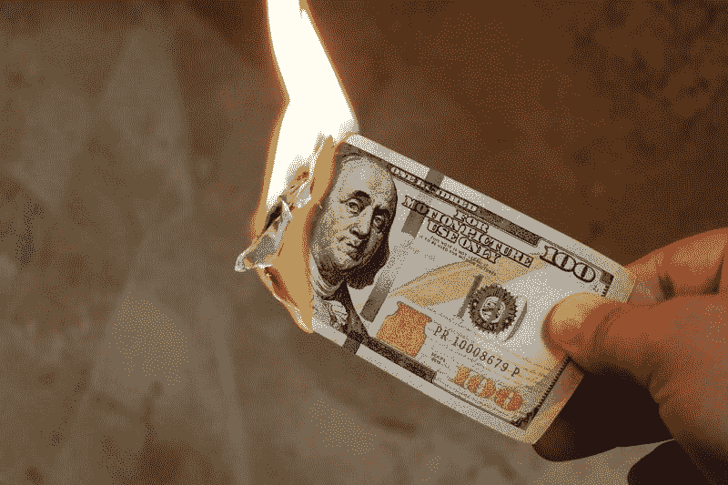
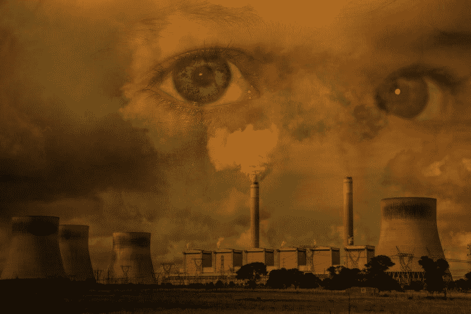
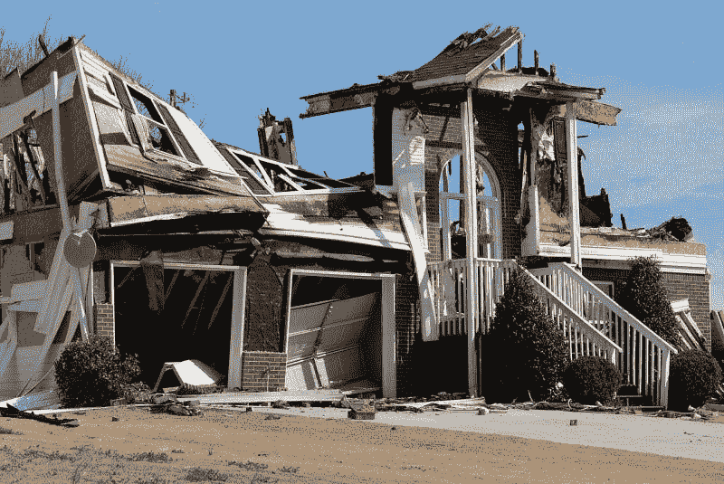

# AIG 赚钱了吗？—市场疯人院

> 原文：<https://medium.datadriveninvestor.com/is-aig-making-money-market-mad-house-91c7e15604bb?source=collection_archive---------13----------------------->

美国国际集团；或称 AIG，成为 2007-2008 年金融危机的代表。该公司幸存下来，但美国国际集团今天赚钱了吗？

目前， **AIG(纽约证券交易所代码:AIG)** 正在从其保险和金融业务中赚钱。例如，AIG 报告截至 2019 年 6 月 30 日的季度毛利为 57.92 亿美元，营业收入为 22.43 亿美元，净收入为 11.09 亿美元。

 [## 气候变化、ESG 和对更好数据的追求|数据驱动的投资者

### 在地球上许多地方经历了另一个令人难以置信的炎热夏季后，来自 S&P 的最新发现…

www.datadriveninvestor.com](https://www.datadriveninvestor.com/2018/08/24/climate-change-esg-and-the-quest-for-better-data/) 

AIG 的收入为 125.91 亿美元。此外，Stockrow 估计这些收入在最后一个季度以 7.92%的速度增长。值得注意的是，AIG 的收入从 2019 年 3 月 31 日的 125.39 亿美元增长到三个月后的 125.91 亿美元。

# AIG 有多少钱？

目前，AIG 在赚钱，但在烧钱。为了解释这一点，AIG 在 2019 年 6 月 30 日报告了-2.96 亿美元的负自由现金流和-2.96 亿美元的运营现金流。

很明显，AIG 在 2019 年 6 月 30 日的融资现金流为 52.18 亿美元。我认为融资现金流表明 AIG 可以借钱为其运营融资。这让人想起了 2007 年至 2008 年，当时美国国际集团因投资问题抵押债券而破产。

负现金流可能表明 AIG 的赔付支出超过了保费收入。理想情况下，当保费超过赔付金额时，保险公司会赚钱。

# 气候变化如何威胁美国国际集团

AIG 的索赔额可能超过保费的一个原因是气候变化。科学家认为像 T2 五级飓风 T3 和 T4 灾难性野火 T5 这样的气候变化灾难正在增加。

AIG 对气候变化有很大的敞口，因为它是美国第十大财产和意外保险公司，2017 年保费收入为 141.89 亿美元，*再保险新闻* [估计](https://www.reinsurancene.ws/top-100-u-s-property-casualty-insurance-companies/)。例如，AIG 可以为受到野火威胁的房屋和企业购买火灾保险。

此外，AIG 资源有限。Stockrow 报告称，截至 2019 年 6 月 30 日，AIG 拥有 31.67 亿美元的现金和等价物。此外，截至 2019 年 3 月 31 日，AIG 有 138.1 亿美元的短期投资。

# AIG 能挺过气候变化吗？

有趣的是，AIG 在 2019 年 6 月 30 日的总资产为 5222.69 亿美元。然而，这些资产中有许多是受气候变化影响的保险单。

目前，气候变化正在增加破坏性极端天气事件的数量，如飓风、风暴、洪水和干旱；环境保护基金声称，这会增加野火发生的可能性。此外，气候变化会引发更高的风暴潮和更多的洪水，从而使极端天气变得更糟。

因此，气候变化的另一个灾难性影响可能是金融危机。具体来说，保险公司可能会花光所有的钱来支付索赔，急需现金。因此，保险公司可能会进行高风险投资，以获得更多现金来支付索赔。

# 气候变化会引发金融危机吗？

记住，正是对[债务抵押债券](https://www.investopedia.com/terms/c/cdo.asp)(CDO)的高风险投资导致了 AIG 在 2007 年和 2008 年的崩溃。AIG 在 CDO 上损失惨重，联邦政府不得不出手救助。

因此，气候变化可能会迫使政府对金融业实施更多的救助，从而威胁到纳税人。此外，气候变化可能威胁到退休投资，因为许多退休账户投资于股票和保险产品。

因此，如果你住在远离海边或沙漠的地方，气候变化会威胁到你的钱。特别是，气候变化威胁着保险业和一些热门投资。

例如，**伯克希尔哈撒韦公司(纽约证券交易所代码:BRK。B)** 是美国第二大财产因果保险公司，2017 年保费收入 460.07 亿美元。具体来说，**伯克希尔哈撒韦公司(纽约证券交易所代码:BRK。A)** 拥有美国最受欢迎的汽车保险公司之一；GEICO。美国人依赖的其他大型财产保险公司包括**好事达保险公司**、**进步保险公司(纽约证券交易所:PGR)** 、自由互助保险公司和旅行者保险公司。

# 保险还是价值投资吗？

怀疑论者会怀疑，在气候变化的时代，保险是否还是一种价值投资。澄清一下，气候变化灾难造成的损失可能会让财产和意外保险公司无法盈利。

相反，市场先生提供了一些证据，证明保险仍然是一种价值投资。具体来说，AIG 股票在 2019 年 9 月 12 日的交易价格为 55.76 美元，所以它们很便宜。然而，美国国际集团于 2019 年 6 月 13 日支付了 32₵季度股息。然而，Dividend.com 指出，AIG 最近没有公布任何股息增长。

2019 年 9 月 12 日，美国国际集团向投资者提供的股息收益率为 2.26%，年化股息为 1.28 美元，派息率为 28.1%。然而，我不认为股息能够弥补 AIG 面临的潜在风险。

# 投资者需要关注气候变化

投资者需要关注气候变化，因为它可能会极大地扰乱市场。事实上，我认为气候变化会威胁到一些以前安全的价值投资，比如保险公司。

因此，我建议想做空股票的投资者看看有关气候变化的新闻和科学。我认为精明的投资者可以从气候变化中赚钱。然而，许多投资者将因气候变化而蒙受损失。

和其他人一样，投资者需要学会害怕气候变化。气候变化可能会扰乱一切，包括市场。因此，投资者需要对 AIG 这样的保险公司保持警惕。

*原载于 2019 年 9 月 12 日*[*【https://marketmadhouse.com】*](https://marketmadhouse.com/is-aig-making-money/)*。*