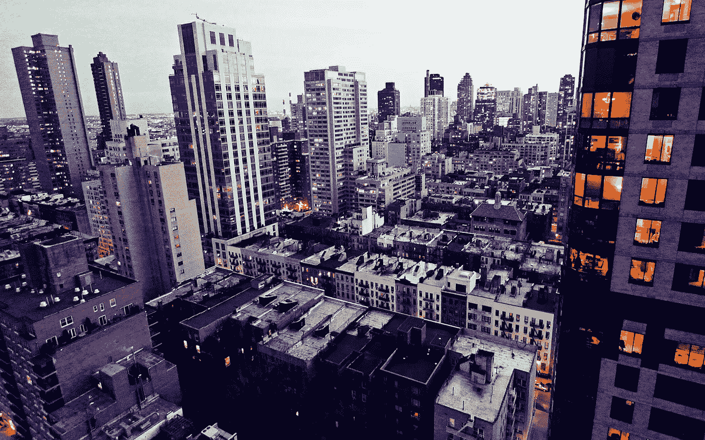
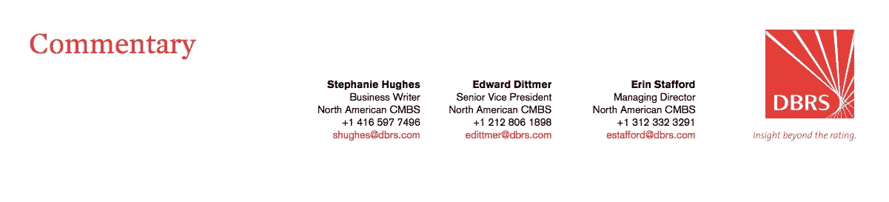
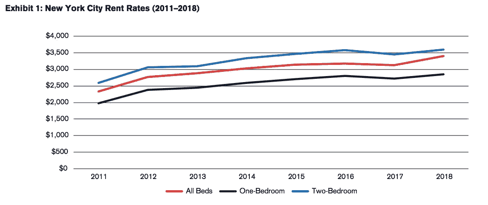
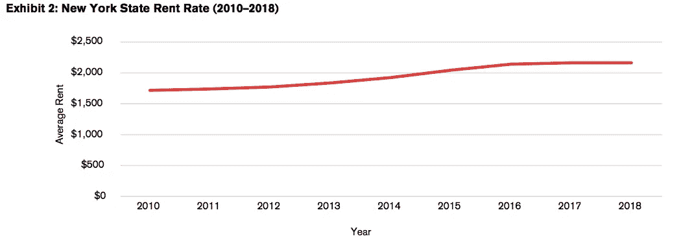
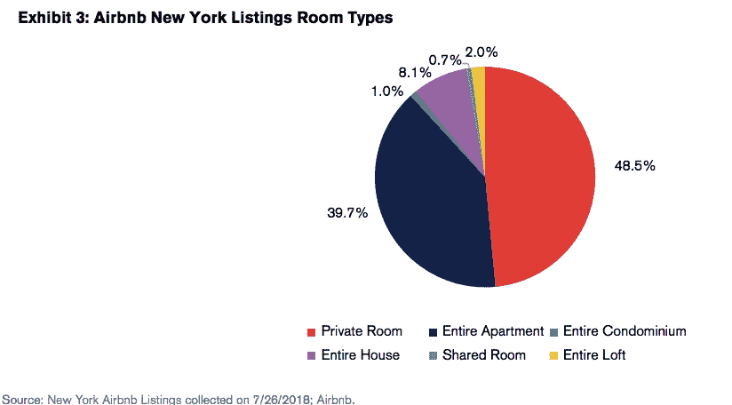
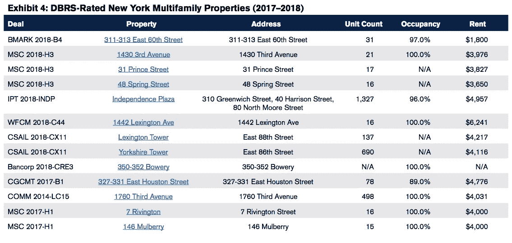

# Airbnb 正在扼杀纽约的多家庭市场吗？

> 原文：<https://medium.datadriveninvestor.com/is-airbnb-choking-out-new-yorks-multifamily-market-24344064f0ea?source=collection_archive---------11----------------------->

The housing issue in New York City has never been more dire than it is in 2018 with an average rent rate of $3,653 (according to Reis) — are short-term rentals making the issue worse?

纽约市的住房问题从未比 2018 年更严峻，根据纽约市租金指导委员会 [2018 年住房供应报告](https://www1.nyc.gov/assets/rentguidelinesboard/pdf/18HSR.pdf)，空置率为 3.6%。Reis 的租赁列表分析显示，截至 2018 年 Q2 奥运会，纽约公寓的平均要价为 3653 美元。该市目前的租金远高于全国平均水平(约为 1064 美元，由一居室和两居室的平均租金得出)，这是由多种因素造成的，包括单位供应与人口的比率。然而，经济适用房的倡导者将矛头指向了像 [Airbnb](https://www.airbnb.ca/?locale=en) 这样的短期租赁公司。

纽约市议会和 Airbnb 陷入司法冲突已经有一段时间了。目前，纽约市禁止出租租期为 30 天的物业，如果该物业是分区公寓，且租户不在。7 月初，该委员会通过了一项法案，要求该公司披露其所有城市主机的名称和地址，以防止非法上市，这些非法上市进一步推高了租金，因为它们将本地公民的永久租赁单元从市场上拿走。这项立法可能会将 Airbnb 在纽约市的预订总数减少一半，并严重影响该公司的底线，这是熟悉财务影响的匿名消息人士在文章中做出的估计。该政策遵循了 2011 年的一系列法律，这些法律赋予了该市打击非法单位的更多权力，以及 2016 年的一项法律，该法律将针对非法上市的罚款提高到最高 7500 美元。基于这些数字，政策的改变是明智的。

麦吉尔大学(McGill University)今年 1 月发布的《纽约市短期租赁的高成本》(The High Cost in New York City)等报告可能为该决定提供了信息，因为它陈述了该公司对租金的影响，发现 Airbnb 的商业模式已经从纽约的长期租赁市场上移除了 7000 至 13500 个单元。该研究还报告称，住房供应的减少导致租金在三年期间(2014 年至 2017 年)上涨了 1.4%(或全纽约 380 美元)。2011 年至 2018 年间，所有房间类型的租金稳步上涨(参见附件 1 ),平均涨幅约为 5.4%。这一增长比该州其他地区经历的趋势要积极得多(2011 年至 2018 年间为 3.2%；参考附件 2)。租赁市场唯一的安慰是，房东在 2018 年提供了更多优惠，以创造更多负担得起的租赁单位。

Source: [Rent trend data in New York, New York; Rent Jungle.](https://www.rentjungle.com/average-rent-in-new-york-rent-trends/)

Source: [Data table from New York Rentals; Zillow.](https://www.zillow.com/ny/home-values/)

这些经济适用房倡导者之一是 Airbnb 内部一个名为[的数据驱动在线资源，这是一个数据分析小组，一直在跟踪世界各大城市的 Airbnb 房源。根据 2018 年 7 月 26 日收集的数据，Airbnb 内部收集的](http://insideairbnb.com/index.html)[关于纽约房源的数据](http://insideairbnb.com/new-york-city/)报告称，目前有 47542 个活跃房源以平均每天 146 美元的价格出租。在这些房源中，23，870 个包括整个住宅和公寓(占 Airbnb 所有活跃房源的 50.2%)，22，546 个是私人房间(47.4%)，1，126 个是共享房源(2.4%)。一些私人房间列表可以是持有 Airbnb 上列出的其他私人房间的公寓的一部分。当 DBRS 的分析师在 2018 年 7 月 25 日查看可用的 Airbnb 房源时，他们发现有 295 个不重复的房源，平均每个房源有两个床位，平均每日价格约为 82.90 美元。在分析房间类型时，DBRS 的发现与 Airbnb 内部的发现基本一致，发现整个住宅/公寓/共管公寓/阁楼房源以及私人房间房源构成了房间类型细分的大部分，分别为 50.8%和 48.5%(参见图表 3)。7 月份的报告还解释说，这些房源平均每年被预订 110 晚。该网站发现，一些房主正在创造某种微垄断，27.3%的股票是多重上市。Airbnb state 内部的分析师认为，这种情况的问题在于，“拥有多套房源的房东更有可能是在无照经营、不纳税，如果他们出租了整栋房屋或公寓，并且不在场，那么他们这样做很可能是非法的。”这座城市[最近起诉了一对房地产投资夫妇](https://therealdeal.com/2018/04/03/city-wins-1m-judgment-against-illegal-hotel-operators/)的非法 Airbnb 单元。

Source: [New York Airbnb Listings](https://www.airbnb.ca/s/New-York--NY/homes?allow_override%5B%5D=&locale=en&map_toggle=true&refinement_paths%5B%5D=%2Fhomes&s_tag=64YXRF-m) collected on 7/26/2018; [Airbnb.](https://www.airbnb.ca/?locale=en&logo=1)

纽约市 DBRS 评级的多户房产也经历了更高的入住率和租金，所有房产的平均入住率约为 98.1%，所有房型的平均租金为 4，150 美元(参见图表 4)。所有房产的平均单元数约为 239 个单元。

Source: [Viewpoint](https://viewpoint.dbrs.com/#!/explore)

虽然纽约州的租金一直保持稳定的上升趋势，但 Airbnb 对纽约的可用住房数量产生了严重影响，加剧了原本就存在的负担能力危机。然而，它对市场的伤害在于房东利用 Airbnb 作为平台，将租金稳定的住房单元转化为非法酒店。虽然一些中等收入者在不占用这些房产的情况下，依靠临时出租他们的公寓和住宅来实现收支平衡，但研究表明，其他房主正在利用该平台创建小酒店的微观垄断。