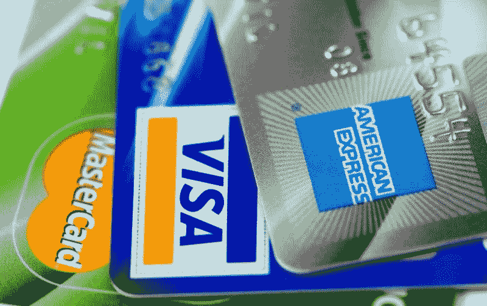
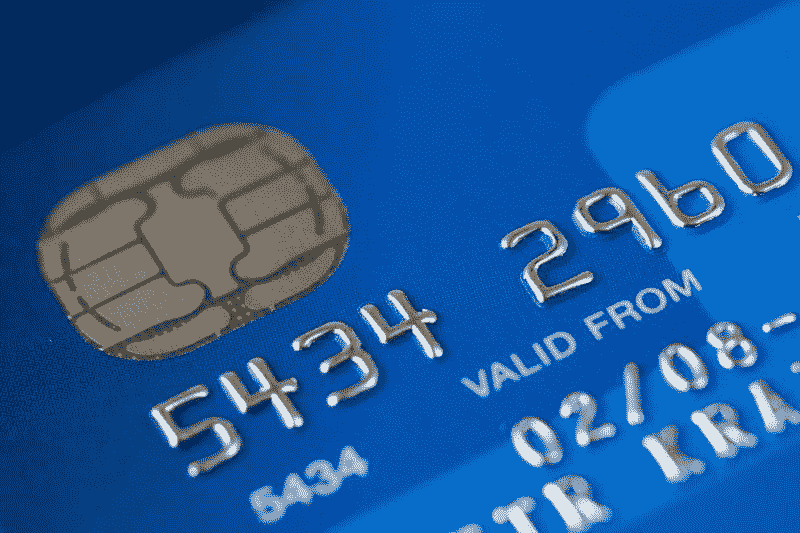

# 美国运通定价过高吗？—市场疯人院

> 原文：<https://medium.datadriveninvestor.com/is-american-express-overpriced-market-mad-house-7862362ac4c5?source=collection_archive---------9----------------------->

观察人士问，美国运通的股价是否过高，因为其股票在 2019 年 8 月 8 日的交易价格为每股 125.29 美元。

但是 **Visa(纽约证券交易所代码:V)** 和 **MasterCard(纽约证券交易所代码:MA)** 都比**美国运通(纽约证券交易所代码:AXP)** 贵。例如，2019 年 8 月 8 日，Visa 的交易价格为 179.90 美元。与此同时，万事达卡的股价在同一天为 278.04 美元。

因此，市场先生低估了美国运通。我认为美国运通的股价低是因为该公司正在经历令人印象深刻的收入增长。

# 美国运通正在经历令人印象深刻的收入增长

令人印象深刻的是，截至 2019 年 6 月 30 日的季度，美国运通的收入增长率为 8.49%。

相比之下，同一季度，Visa 的收入增长率为 11.45%，MasterCard 的收入增长率为 12.22%。因此，美国运通的收入增长落后于其大型竞争对手。

然而，美国运通仍然从信用卡中赚了很多钱。美国运通报告 2019 年 6 月 30 日的收入和毛利为 99.77 亿美元。这一数字高于 2019 年 3 月 31 日的 95.55 亿美元。

# 美国运通赚了多少钱？

美国运通的营业收入为 22.19 亿美元，净收入为 17.61 亿美元。因此，美国运通的信用卡业务仍然有利可图。

事实上，截至 2019 年 6 月 30 日，美国运通报告的运营现金流为 29.3 亿美元，自由现金流为 24.38 亿美元。因此，美国运通仍然是提款机，沃伦·巴菲特认为它是。因此，**伯克希尔哈撒韦公司(纽约证券交易所代码:BRK。B)** 在 2018 年拥有价值 9.97 亿美元的美国运通股票，巴菲特的 [2018 年致股东信](https://www.berkshirehathaway.com/letters/letters.html)透露。

因此，美国运通在 2019 年 6 月 30 日拥有 268.69 亿美元的现金和等价物。然而，Stockrow 并没有报告美国运通在该日的短期投资价值。截至 2019 年 3 月 31 日，美国运通拥有价值 3.08 亿美元的短期投资。

# 巴菲特为什么喜欢美国运通

沃伦·巴菲特喜欢美国运通，因为该公司从其 5800 万持卡人身上产生浮存金。

解释一下，浮存金是公司从定期支付中获得的现金流。当人们每月支付他们的信用卡账单时，美国运通收到浮动。此外，管理层可以将浮存金用于任何目的，包括支付股息或扩张。

Cardrates.com 估计，美国运通产生浮存金是因为它是美国第四大信用卡公司，在 130 个国家拥有 5800 万持卡人。此外，美国运通的平台每年处理 60 亿笔交易。

巴菲特喜欢美国运通的另一个原因是其增加收入的能力。在美国运通，更多的收入意味着更多的现金。

# 美国运通是一种很好的分红股票

上市让 AXP 能够支付一些可观的股息。例如，美国运通将于 2019 年 8 月 9 日支付 39₵股息。

此外，Dividend.com 认为美国运通的股息增长持续了七年。具体来说，AXP 股息在 2018 年由 4₵增长，从 2018 年 11 月 9 日的 35₵上升到 2019 年 2 月 8 日的 39₵。因此，美国运通股票在 2019 年 8 月 8 日提供的年化股息为 1.56 美元，股息收益率为 1.25%，派息率为 21.5%。

我认为派息历史和产生现金的能力使美国运通成为一只很好的收益股。重要的是，美国运通是一只更安全的收益股，因为它有能力增加收入。

# 亚马逊是美国运通的未来

我喜欢美国运通，因为科技为它提供了大量收入增长的机会。

例如，美国运通在 2019 年亚马逊优惠日为其持卡人提供 50 美元的折扣。这是一个明智的举动，因为据 RetailDive [报道](https://www.retaildive.com/news/what-5-stats-say-about-prime-day-2019/558750/)，Coresight 估计**亚马逊(纳斯达克代码:AMZN)** 2019 年 Prime Day 销售额为 58 亿美元。令人印象深刻的 Prime Day 销售额从 2018 年的 39 亿美元增长。

此外，eMarketeer 声称，6500 万或 51.3%的美国家庭拥有亚马逊 Prime 会员资格。值得注意的是，eMarketeer 预计 56%的 Prime 会员会在 Prime Day 购买电子产品。因此，这些 Prime 会员更有可能在 Prime Day 使用他们的信用卡。

精明的是，他们提供了一张[亚马逊商务美国运通卡](https://www.amazon.com/Amazon-Business-American-Express-Card/dp/B07984JN3L)和一张商务优惠卡。重要的是，名片提供 3%的返现和亚马逊业务、亚马逊网络服务(AWS)和全食超市购买的 60 天期限。此外，Prime 卡在相同的零售商处提供 5%的返现和 90 天的期限。

# 美国运通的光明未来

我认为亚马逊和其他在线零售商正在推动美国运通的发展。特别是，亚马逊现在是美国最受欢迎的零售商；你需要一张信用卡或借记卡来购物。

此外，亚马逊只是对美国人当前生活方式至关重要的众多数字平台之一。其他鼓励使用信用卡、借记卡和预付卡的流行数字平台包括:**网飞(纳斯达克:NFLX)** ， [STEAM](https://store.steampowered.com/) 视频游戏，Hulu，**优步(纳斯达克:优步)**， **GrubHub(纽交所:GRUB)** ，以及 **Lyft(纽交所:LYFT)** 。

值得注意的是，*综艺* [号称](https://variety.com/2019/gaming/news/steam-one-billion-accounts-1203201159/)的电子游戏平台 STEAM 或 STEAM Store，在 2019 年 4 月拥有 10 亿个账户和 9000 万用户。令人印象深刻的是，STEAM Store 的客户数量在 2018 年 4 月至 2019 年 4 月期间增长了 2300 万。

在这种情况下，美国运通的未来是光明的，因为大量的人正在使用需要信用卡、礼品卡、借记卡或加密货币才能使用的数字服务。可以预见的是，STEAM 有像 Epic Games Store 和[深渊](https://marketmadhouse.com/will-the-abyss-make-money-with-fortnite/)这样的竞争对手在运营。

像 STEAM 一样，Epic Games Store 和 Abyss 鼓励年轻人在玩他们最喜欢的大型多人在线游戏(MMOGs)时使用信用卡支付。我的预测是，很多 MMOG 玩家会在想玩的时候掏出他们的运通卡。

如果你正在寻找 21 世纪的增长、收入和股息股票，研究一下**美国运通(纽约证券交易所:AXP)** 。我认为，在未来十年，数字市场将推动这个历史悠久的信用卡品牌大幅增长。

*原载于 2019 年 8 月 8 日*[*https://marketmadhouse.com*](https://marketmadhouse.com/is-american-express-overpriced/)*。*