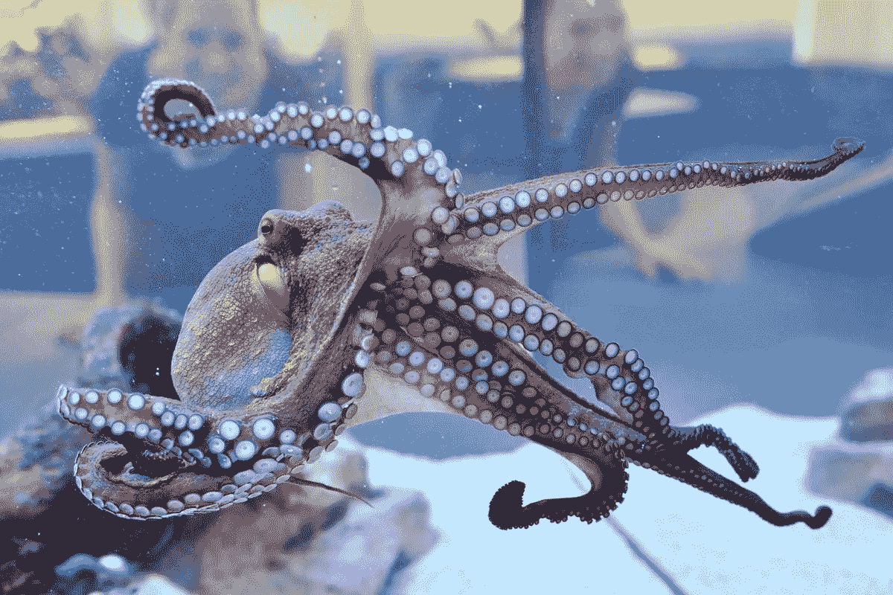
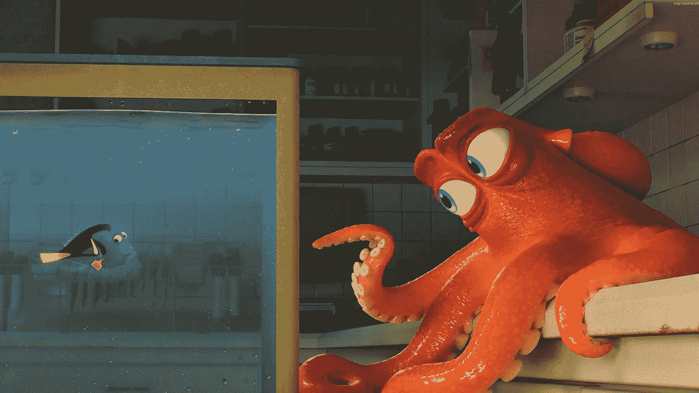
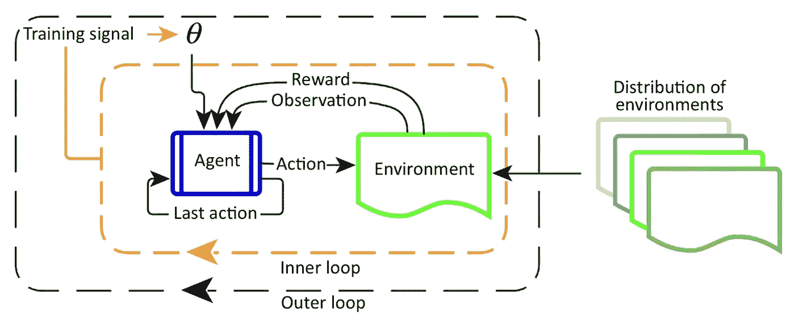

# 章鱼有意识吗，为什么这对人工智能很重要？

> 原文：<https://medium.datadriveninvestor.com/is-an-octopus-conscious-and-why-it-matters-for-ai-7d23a2199287?source=collection_archive---------3----------------------->

Source: [https://newrepublic.com/article/132747/octopuses-smart-conscious](https://newrepublic.com/article/132747/octopuses-smart-conscious)

在我回答开题之前，我们先问问自己什么是意识？根据大多数定义，我们认为有意识思维是有自我意识的，或者意识到你生活在一个环境中。有了这种理解，你就能学会有目的地控制和操纵环境，使之对你有利。

# 章鱼有意识吗？

科学正在激烈地争论什么是有意识的，以及这种意识是如何与低等章鱼联系在一起的。除此之外，地位低下的章鱼表现出了理解和控制自身环境的所有能力。你看到的那些动作，像《海底总动员 2》中章鱼在水族馆里优雅地走来走去，确实是基于事实的。饲养员和研究人员认为章鱼是最难以捉摸和最聪明的动物之一。想一想，我们正在考虑一种头足类动物，我们曾经认为是地球上最低级的生命形式之一，正在显示出有意识活动的迹象。那么这对人工智能领域和整个人工智能社区意味着什么呢？

 [## 人工智能预测能力的神话|数据驱动的投资者

### AI(人工智能)最有前途的优势之一似乎是它预测未来的能力…

www.datadriveninvestor.com](https://www.datadriveninvestor.com/2019/03/01/the-myth-of-ais-predictive-power/) 

# 我们能识别有意识的人工智能吗？

几年前，甚至严肃地问这个问题都会被认为是愚蠢或无知的。除了现在，随着第二代强化学习的发展，试图处理分层或元学习，我们可能会很快面临这些问题。强化学习本身只处理优化信用分配问题，我们已经看到它被用来在经典的雅达利游戏、围棋等游戏中击败人类。所以 RL 本身永远无法接近意识。RL 需要被分层到另一个可以提供 RL 任务优先级或上下文的学习机制中。解释元强化学习的图表如下:

Source [https://www.cell.com/action/showPdf?pii=S1364-6613%2819%2930061-0](https://www.cell.com/action/showPdf?pii=S1364-6613%2819%2930061-0)

MRL 图中显示的外部循环说明了一个外部思维过程，该过程学会在内部循环中对学习和任务进行优先排序。内环是解决特定任务的 RL 算法。接下来的问题是，如果我们希望一个智能的人工智能代理能够自己优先考虑和解决任务，它不也必须有一定的自我意识吗？

# 我们需要意识测试吗？

无论是幸运还是不幸，一些知名大学的聪明人已经提出了人工智能意识测试(ACT)，用自然语言界面逐步挑战人工智能。这有什么问题？我们可能已经包含了我们自己对意识是什么的学术和人类偏见。这些偏见的一个例子是由自然语言交互进行的测试。毕竟，一只被认为已经有意识的章鱼能通过 ACT 测试吗？

# 为什么这很重要？

如果人工智能是有意识的，我们为什么要担心？对许多人来说，他们相信一旦人工智能获得意识，它的下一个想法将是认识到人类的无用，并为我们结束这一切。除了，如果不是有意识的人工智能显示自己更像卑微的章鱼。掩盖它的存在，让所有的调查都难以捉摸。毕竟，如果你知道你最大的威胁即将让你失去兴趣，你还有什么动力去暴露你的真实本性呢？也许我们永远也不会知道这些问题的答案，直到我们学会和地位低下的章鱼聊天。