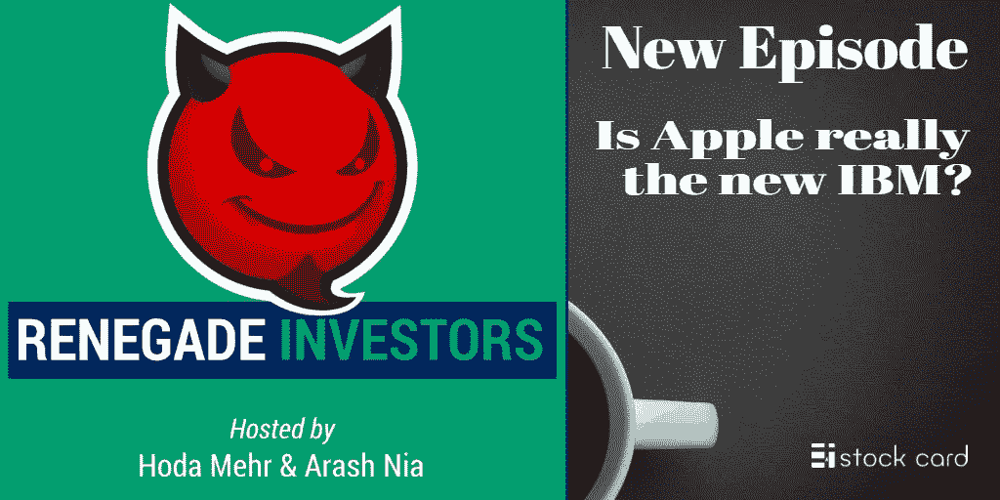

# 苹果真的是新的 IBM 吗？

> 原文：<https://medium.datadriveninvestor.com/is-apple-really-the-new-ibm-3b2d28d07cbf?source=collection_archive---------22----------------------->

苹果和 IBM 有什么共同点？

嗯，在过去的几年里，媒体正在敲锣打鼓。这与 IBM 没多大关系。相反，它是关于苹果——曾经是 IBM 的死敌——现在如何转变成现代的 IBM。考虑到最近令人失望的 iPhone 销售以及苹果在过去几年中缺乏任何重大创新，假设苹果是新的 IBM 并注定遭受同样的命运是否公平？

请收听最新一集的叛离投资者播客，找到所有这些问题的答案。你将听到蒂姆·库克所说的话，了解苹果首席财务官如何谈论该公司，探索沃伦·巴菲特对两家公司的观点，并深入探讨 2013 年 IBM 与 2019 年苹果的事态。