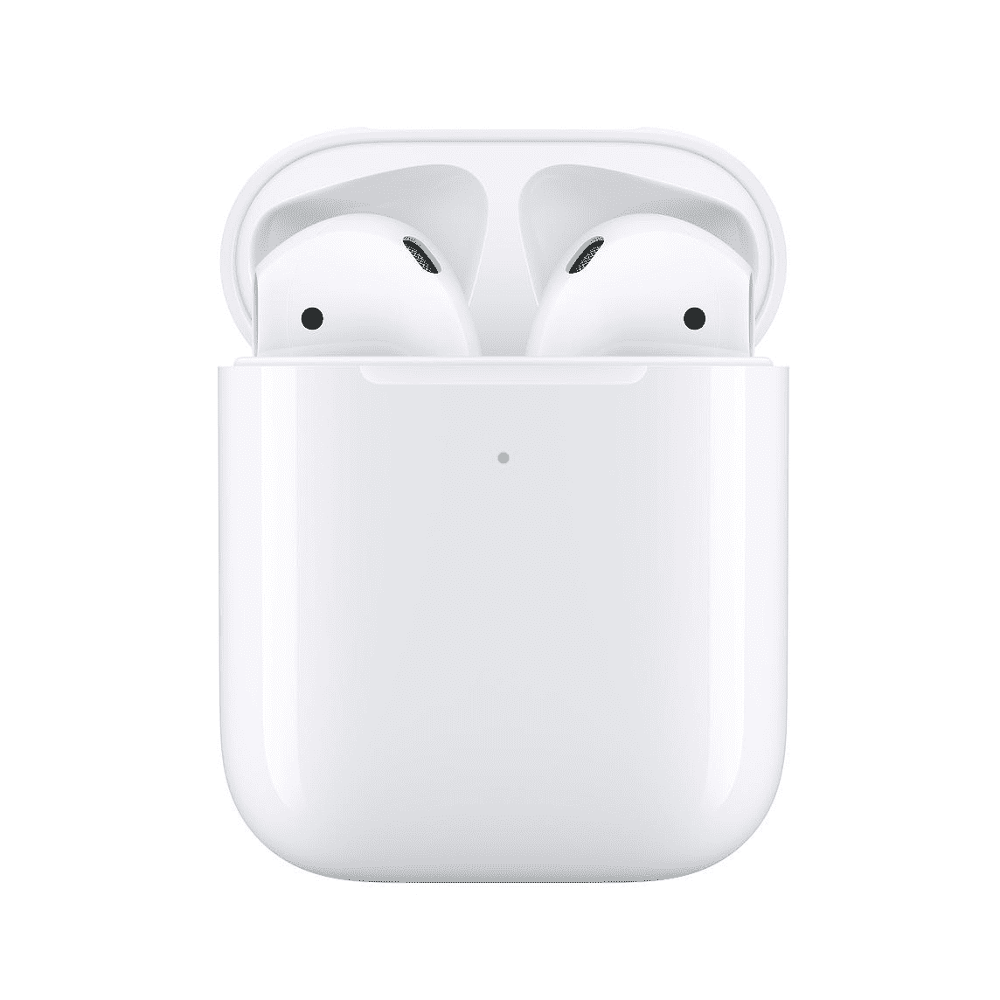
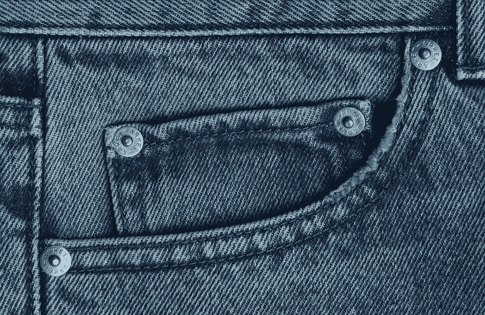

# 苹果的 Airpods 值不值？

> 原文：<https://medium.datadriveninvestor.com/is-apples-airpods-worth-it-edd42144ab7a?source=collection_archive---------17----------------------->

苹果的 Airpods 是迄今为止市场上最受欢迎的无线耳机之一。我们看到人们带着 Airpods 在上班的路上走来走去，在星巴克喝咖啡，在工作的时候。

那么，是什么让 Airpods 的设计如此吸引人呢？对苹果消费者来说是这样，因为这东西很好用。

 [## 苹果会成为新的网飞吗？数据驱动的投资者

### 有可能。然而，该公司肯定会与大公司竞争。许多人不得不看到这一天的到来…

www.datadriveninvestor.com](https://www.datadriveninvestor.com/2019/02/15/will-apple-be-the-new-netflix/) 

## 无缝集成

我有一部 iPhone 和一部 MacBook Pro。当我在 Macbook Pro 中使用我的 Marshall 蓝牙耳机，但我想切换到我的 iPhone 时，我需要做的是重置耳机和 Macbook 之间的配对，然后将耳机连接到我的 iPhone。多痛苦啊。

但当我使用我的 Airpods 时，我可以在我的 Macbook Pro 和我的 iPhone 之间无缝切换，而无需将我的 Airpods 与另一台设备配对。

## 惊人的电池寿命

纸上的 Airpods 本身一次充电可以持续 5 个小时。对一些人来说，这似乎不算多，但对我来说已经足够了。该外壳还可以充当 Airpods 的电源库。所以一旦你把它们放回盒子里，它们就会被充电，这样当你再次拿起它们时，它们就会被充电，为我们再次做好准备。

## 良好的音质

Airpods 听起来不错。发烧友可能不同意我的观点，但让我在这里表达一下我的想法。他们听起来不错。它们无法与内置 DAC 的高品质入耳式监听器相提并论，但它们提供了足够好的音乐质量和通话质量，您可以每天使用，而且正好放在我们的口袋里。我的意思是，你可以把 Airpods 和外壳放在一起，放在牛仔裤的硬币口袋里。你不能用你的高品质入耳式监听系统和 12 个多余的驱动器做到这一点。

Coin Pocket

# 那么坏处是什么呢？

## 简单。就是这个价格。

如果你使用苹果产品，你不会被误认为拿一个带回家。但是，如果这个东西的价格真的字符串我，因为我认为苹果公司可以在这个字符串的定价做得更好。我只是认为，如果我们考虑到声音还可以，而且它最大的特点是可以与其他苹果产品无缝集成，那么这个价格就有点太高了。

那么，我会向任何苹果产品用户推荐其中一款吗？我的答案是肯定的。但是如果你真的想要一个，当你在收银台的时候闭上你的眼睛，然后说:“赶紧搞定它。刷我的信用卡。”玩笑归玩笑，如果你想要一个或者你正在考虑购买一个，首先确保它适合你的耳朵，因为你不想在使用它时它变松，因为它们很贵，你不想失去它。