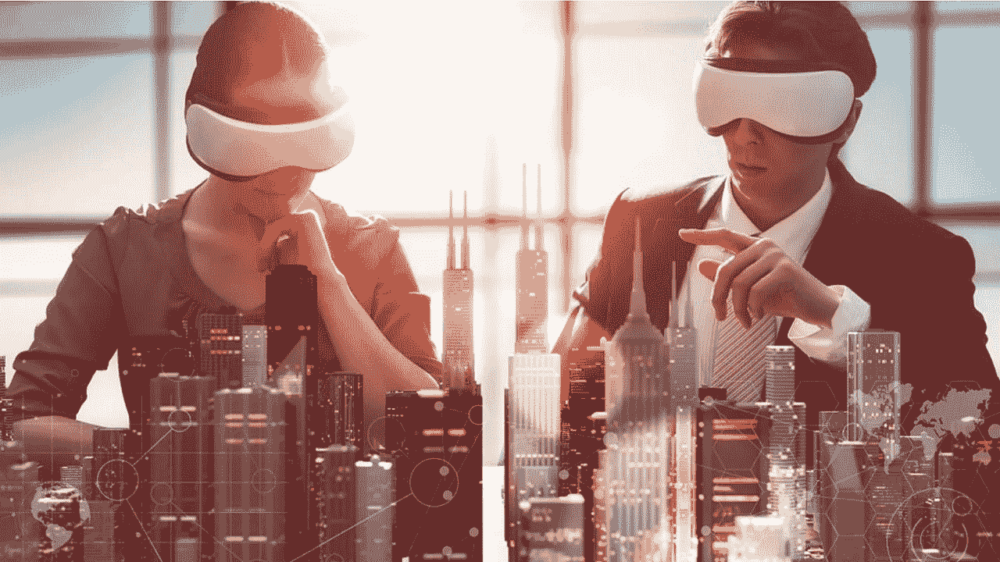
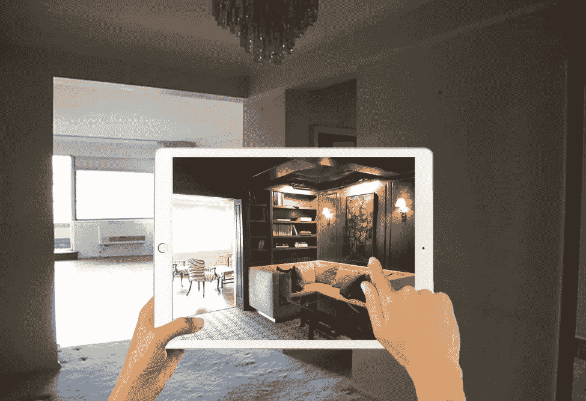

# AR 和 VR 会改变房地产行业的游戏规则吗？

> 原文：<https://medium.datadriveninvestor.com/is-ar-and-vr-a-game-changer-for-the-real-estate-industry-285361f9182b?source=collection_archive---------2----------------------->

“待售”的牌子挂在我上班路上路过的房子上已经有四个多星期了。这栋房子位于大多伦多地区(GTA)西部一个著名的郊区，过去这里的房产销售速度相当快。它的价格与当前市场价格持平，没有任何缺陷或设计缺陷。那么为什么还没有卖出去呢？

当然，有迹象表明加拿大房地产市场出现了降温趋势，但这还不足以令人担忧。这让我思考，除了“衰退”，是否还有其他因素在起作用。房地产的地位是独特的，因为尽管它是由消费者驱动的，但它却是一项至关重要的、非常昂贵的、改变生活的交易。然而，[消费者趋势](https://perspectives.mobilelive.ca/blog/who-is-reshaping-customer-experience)的范式转变——放弃实体零售，转而支持网上购物——可能也揭示了一种日益增长的期望，即不仅能方便快捷地获得丰富的[个性化信息](https://perspectives.mobilelive.ca/blog/how-can-we-ensure-success-in-personalized-experiences),还能获得比过去“更好的交易”。

最终，房地产的数字化转型能否帮助当前的专业人士和组织在变革时代的竞争中脱颖而出？

 [## 人工智能和虚拟现实的融合-你能期待什么-数据驱动的投资者

### 在技术领域，融合是合乎逻辑的一步。就在几十年前，你可能需要一个专门的…

www.datadriveninvestor.com](https://www.datadriveninvestor.com/2018/08/30/the-convergence-of-ai-rv-what-you-can-expect/) 

# 为什么房地产需要数字化转型？

据分析师称，一处房产的畅销程度很大程度上取决于其上市天数(T4)指数。一些因素——如季节变化、房产状况、是否准备出售、买家是否有时间看房，以及卖家允许亲自展示的准备时间——会对 DOM 产生重大影响。

增强和虚拟现实(AR/VR)等沉浸式技术可以通过为买家、代理商和卖家等提供便利和增强的体验来大幅提高这一指数。AR/VR 不仅可以为潜在的租赁者或购买者节省大量的时间和支出，还可以在潜在的低迷时期为卖方和房地产经纪人节省大量的时间和支出，此时买方对卖方和买方对代理的比率显著下降。由于沉浸式技术，潜在买家很快就可以在未来的住所或办公室中虚拟地自由移动，只需戴上 VR 耳机或在智能手机或平板电脑上观看 AR 演示。或许这正是在当今高度动荡的环境下，在房地产市场上取得立竿见影的成功的关键。

# 什么是沉浸式技术？

自从劳伦斯·曼宁(Laurence Manning)在他 1930 年代后期的科幻小说故事中提出虚拟现实以来，虚拟现实(及其近亲 AR)直到最近才获得了巨大的人气。技术进步已经允许沉浸式用户体验的改善(UX)和成本的降低，从而有利于它们的民主化——但 AR 和 VR 的 UX 可能会有很大不同。

虚拟现实是一个三维的、计算机生成的环境，可以被用户探索和交互。可以使用一系列设备(例如耳机)来刺激视觉、听觉和触觉，以便创建使用计算机创建的现实的幻觉。另一方面，AR 是现实的增强版本，可以在捕获的图像或视频上添加数字信息。AR 通常在移动应用程序中可用，这些应用程序使用智能手机摄像头捕捉现实世界的视频，然后在其上叠加一层信息，包括文本、图像和虚拟 3D 对象。但是最近的进步已经能够将 VR 和 AR 的特性结合起来，以产生身临其境的混合现实(MR)体验，如那些可能通过[微软 Hololens](https://www.microsoft.com/en-ca/hololens) 实现的体验。

VR 或 AR 如何具体融入住宅或商业房地产的销售或租赁过程？想要参观房产的潜在客户的体验可能有两种:远程(通过访问房地产经纪人的网站)或现场(有或没有房地产专业人士指导这些虚拟参观)。为了简化参观过程，参观开发人员可以利用 AR 和 VR 体验，捕捉所提供的房产的 [3600 个视频](http://www.samsung.com/global/galaxy/gear-360/)，并以物理搭建和整修的一小部分成本创建其虚拟模型。这种模型化的空间可以导入到 2D 媒体上进行 AR 体验，或者使用虚拟耳机作为 VR 内容呈现。

# 通过虚拟参观和筹备增强客户体验

[如今，90%的家庭开始在互联网上搜索房地产，超过 50%的搜索是在移动设备上进行的。为了增强房地产经纪人网站上的用户体验，房产的虚拟存在可以突出兴趣点(poi ),使潜在买家更好地了解房产。然而，尽管 poi 很有吸引力，但如果买家无法将他们“想象”的财产与现实生活中的真实情况联系起来，那么非生产性的实地访问可能会导致销售成本的增加。](http://news.buzzbuzzhome.com/2013/01/homebuyers-searched-online-new-home.html)

虽然这些技术不能保证销售，但它们无疑可以让客户改进他们的搜索。这减少了无效访问的数量，有利于产生和跟踪房地产经纪人更重要的线索。客户还可以使用创造身临其境体验的技术，从房地产经纪人网站做出更明智的选择，因为它们提供了比单纯的照片或视频更丰富的空间体验。潜在买家可以更容易地决定特定的房产是否“值得一游”。

[分析显示](https://www.inman.com/2015/07/30/nyc-real-estate-agents-are-pulling-off-showings-on-demand/)大约 50%的潜在买家可以在“买方市场”中请求点播(或当天)查看房产。虽然如今一些移动应用程序已经实现了房地产专业人士的按需可用性，但房产的实际查看可用性可能会极大地影响潜在的销售。通过利用沉浸式技术，房地产经纪人至少可以通过提供即时虚拟现实体验而不需要立即实际接触房产来产生延期访问的兴趣。这也有利于房地产专业人士，他们将不再需要组织访问只是为了产生兴趣的财产。相反，他们可以为潜在买家提供身临其境的虚拟房产参观体验。

此外，[过去五年中某些地区的市场趋势](https://hopedesigns.ca/much-home-staging-cost-toronto/)表明，1%到 3%的分期付款投资可以带来住宅物业销售价格 8%到 10%的增长。这意味着，对于价值 800，000 加元的典型房产(例如，加拿大多伦多郊区的住宅)，在某些情况下可能会产生高达 24，000 加元的前期分期成本。并且存在与买家的期望或品味不一致的固有风险。这种前期成本可以消除(或减少到一部分)，通过使用虚拟改造和分期给定的财产，直到买方的利益可以评估。潜在的节省也可以传递给买家，在那里很少或根本不需要实物分期，这可能会刺激他们刚刚够完成交易。

事实上，建筑商和房地产经纪人将需要开始利用讲故事的技术，在虚拟和亲自展示这些技术的过程中交流“可能的艺术”。讲故事可以让经验丰富的舞台演员或平面艺术家与房地产经纪人远程合作，根据潜在客户的实时反馈，虚拟地“上演”一处房产，这可能进一步有助于销售。

例如，潜在的买家寻找一个“固定器上”可能希望看到适当的装修的财产。那些希望根据建筑商的设计购买新房子的人可能希望通过 3D 沉浸式体验来可视化完工的房子。那些对房产的特定外观固执己见的人——例如，想要橡木饰面的木地板，而不是目前“基础模型”提供的瓷砖——可以获得足够的信心，通过升级进行购买。类似的体验可以使用虚拟舞台对象来提供，例如窗帘、家具和照明，以便于从合作的硬件和室内装潢提供商处购买。

# 更好的分析推动决策支持

[分析](https://mashable.com/2014/07/09/big-data-real-estate/#Cg7B5kZJ3gqL)也是使用沉浸式技术的一个重要方面，因为它们允许房地产经纪人评估客户对房产的兴趣以及个性化体验。流行的分析提供商能够提供一些与网页相关的 KPI，如浏览量、会话和退出。然而，这些技术和经验可以为房地产经纪人提供潜在买家所要求的特定方面或特征的更深入的见解。例如，客户要求查看客厅的枫木硬木地板和天花板上的皇冠造型，可以通过数字方式捕捉，并为预测和下一步最佳行动提供有用的数据。

来自 VR 和 AR 环境的分析也可以直接洞察细微的买家行为。例如，购买者在虚拟旅游中花更多的时间去看某个特定的房产，这一事实可以表明他们对这个和类似的房产感兴趣。在特定虚拟区域内花费的时间可以指示需要解决的资产的潜在问题，以便进行销售。然而，这些数据不仅可以在人口统计层面进行细分，还可以从地理、季节和行为角度进行细分，以更好地推动决策。

# 把它放在一起

VR 和 AR 技术可以帮助房地产经纪人给购房者和卖家留下出色的第一印象。这些技术可以解决潜在客户常见的沟通和时间安排难题。他们可以帮助房地产经纪人和支持专业人员有效和高效地利用他们的时间，提供有针对性和个性化的体验。他们还可以大大减少不必要的筹备和安排支出，以及由于非生产性放映而产生的机会成本，这些成本可以直接传递给消费者，从而刺激他们关闭。通过帮助客户想象可能发生的事情，消除非生产性的观看，并降低准备出售房产的总成本，房地产行业拥有了利用沉浸式技术振兴自身的真正机会。

虽然一些软件公司已经开始探索这个市场，但采用他们的解决方案和产品还不是主流。然而，我们相信在未来的 3-7 年里，AR 和 VR 体验将会改变我们的生活，就像网络在过去 30 年里所做的一样。现在是房地产利益相关者认真考虑这些技术的时候了。为了从竞争中脱颖而出，更好地满足买家的期望，当前的市场参与者将不得不快速适应。因此，对采用 3D 建模、VR 演示和 AR 分期工具的投资对于建筑商、房地产代理和卖家都具有巨大的价值。然而，最终的奖项可能会授予那些迈出第一步，并通过转变他们的数字参与和体验而脱颖而出的人。

[如果您在制定战略和发展 ARVR 经验方面需要帮助，请联系](https://perspectives.mobilelive.ca/cs/c/?cta_guid=94d20281-f7d5-4ef5-862c-8f1a044ad6e4&placement_guid=c9f3dd30-c4c1-43b7-b1b4-4729fe6faf09&portal_id=1644951&canon=https%3A%2F%2Fperspectives.mobilelive.ca%2Fblog%2Far-vr-in-real-estate&redirect_url=APefjpHC5t7CWCDUqidMvbx7JDqXj9fWhR4pG4AqODr-FftG2ogyOz-5LVaUH8_RoYkBjfQsCp4wppylMwI79ab9BKibh-Pa24qK-F3neZ0To-y10N6lD63Lq2CksjnxdbWT4vdZRuI9A_i6EAIfOYqQZQcjrwrAOVZly4BfMaYaxE97Um0e_GLCvNPV9wCG0l13DK3lfb-kswY8mL6RMjepLHo2jS3A5pbw8pqTyVhyKL61nEN_laU&click=04a12bdc-86db-4940-a63e-39dc7020838d&hsutk=ac5b8267f924ee5a2d0912a8946064dc&pageId=5602172815&__hstc=85135174.ac5b8267f924ee5a2d0912a8946064dc.1543892554193.1553617861209.1553781389491.117&__hssc=85135174.1.1553781389491&__hsfp=2998348656)

*最初发布:*[*https://perspectives . mobile live . ca/blog/ar-VR-in-real-estate*](https://perspectives.mobilelive.ca/blog/ar-vr-in-real-estate)