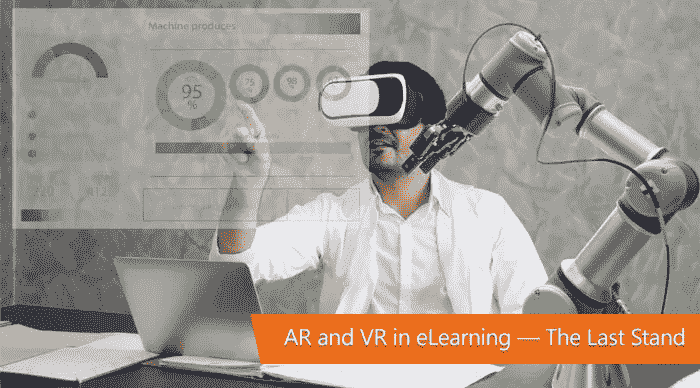
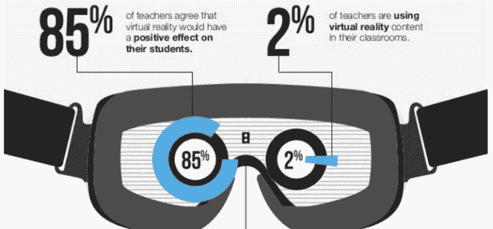
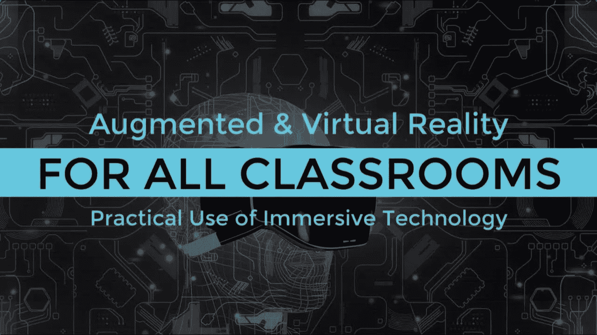

# AR & VR 是现代电子学习应用的答案吗？

> 原文：<https://medium.datadriveninvestor.com/is-ar-vr-an-answer-to-modern-age-e-learning-apps-8d9012cd3fbd?source=collection_archive---------5----------------------->

教育行业的规模一直在增长。教育部门一直在尝试最新的改进技术，以构建新时代的交互式教育应用程序。

然而，我们目前的技术空间正在实验空间中前进，以在实时场景中采用和适应 AR 和 VR。有一些 edTech 初创公司愿意为他们现有的和即将推出的教育应用程序尝试 AR 和 VR。

 [## 人工智能和虚拟现实的融合-你能期待什么|数据驱动的投资者

### 在技术领域，融合是合乎逻辑的一步。就在几十年前，你可能需要一个专门的…

www.datadriveninvestor.com](https://www.datadriveninvestor.com/2018/08/30/the-convergence-of-ai-rv-what-you-can-expect/) 

> **根据 Statista 的数据，到 2021 年，增强现实和虚拟现实的市场份额预计将达到 2150 亿美元。**

这些数据足以证明 AR 和 VR 在现在和未来教育领域的前景。

**在这篇博客中，我将讨论 AR & VR 驱动技术的重要性、影响和未来。**

# 增强现实和虚拟现实对学习和发展的影响

在线教育开创了教育技术领域的先河。电子学习应用已经迎合了从学生、职业人士等广泛的受众。对电子学习应用程序的需求一直在增长，这种应用程序提供了一种交互式学习体验，可以通过优质教育更好地吸引学生。

将 AR 和 VR 集成到电子学习应用程序中不需要大量投资或重型设备，学生或工作专业人员只需要有一个可用的移动设备来访问来自世界任何地方的学习材料。

有了虚拟现实(VR)，你可以在虚拟的三维空间中探索你正在学习的地方。这不仅会带来额外的优势，还会通过历史遗迹、科学仪器等的 3D 建模使学习变得有趣和有吸引力。

***例如:***

> 对于建筑专业的学生来说，虚拟现实将打开互动学习的大门，同时可视化 3D 设计，看看它们在现实中是否工作良好。

**虚拟现实强化了“边做边学”的方法**。它允许学生在真实的环境中获得实践经验并进行练习，也没有任何伤害的危险。

> 通过增强现实，您可以实时悬停在图像上，或者探索动画视频版本，以进行交互式课程学习。

从务实的角度来谈 AR 和 VR，不难说 AR 价格更低，目前在教育领域占据更强的地位，而 VR 在学习中更具沉浸感，在不久的将来很难实现。

像**谷歌、Snap、微软、Niantic(他们制作了 Pokemon GO)和 NVIDIA** 这样的公司正在稳步研究 AR 和 VR 技术，使它们比以前更便宜、更容易、更好。

# **AR/VR 技术为电子学习应用带来的好处**

## **让电子学习过程引人入胜、激动人心**

AR 和 VR 对于您的电子学习应用程序的主要优势是参与性、兴奋性和创新性，使您的内容更具消费性和趣味性。在电子学习环境中吸引在线学习者是许多 edTech 初创公司或公司在当前学习场景中面临的一个主要漏洞。

增强和虚拟现实有一种跳出思维框框的方法，它打破了传统的学习方法，通过活动而不是传统的读写学习方法来吸引学习者。这将使学习者沉浸在一个既有趣又令人兴奋的学习环境中。

1.  ***创造现实生活中不可能创造的电子学习场景***

增强和虚拟现实技术为电子学习过程增加了一个额外的维度。在线学习者出现在真实世界的实验环境中，没有任何风险。这些技术使组织能够整合学习环境，而在现实环境中创建学习环境的成本太高。

这些类型的学习场景不仅会降低成本，还会提高愿意通过虚拟和增强现实了解实时场景含义的员工、专业人员或学生的安全级别。

***例如:***

> 付钱让员工去其他工作地点，或者制造一个好莱坞式的场景来把事情放到背景中，这些都是你可以通过内容创造背景的方法。

**2。*灵活的学习方法***

AR 和 VR 在电子学习应用程序中的参与，在学习方法方面带来了更大的灵活性。基于 AR 和 VR 的电子学习应用程序已经出现了'**随时随地学习'**的概念，以探索和学习新概念。

这确实是通过 AR 和 VR 应用取代 pdf、学习论文、实物模型的最佳方式。

您可以在家中舒适地探索和学习，同时还可以全天候访问学习资料。

***3。减少对一套额外工具*** 的需求

这些智能技术已经减少了对教师或教授用来在离线学习环境中说明概念的一套额外工具和道具的需求。

在当前的学习场景中，几乎 90%的学生和职场人士更喜欢通过智能手机、笔记本电脑和平板电脑进行在线学习。在线学习模式不仅有助于以更快的速度学习内容，也有助于在课堂上做笔记。

***4。混合现实是学习的新支点***

在过去几年里，教育科技初创公司和教育机构已经从理论知识转向实践知识的概念，这在教育领域已经成为一种规范。

是时候通过在线学习应用程序中 AR 和 VR 的融合，转向实用的学习方法和方式了。为了改善电子学习的整体情况，大学、学校和教育技术公司一直在利用先进的头戴式设备，以最令人愉快的方式提供数字元素。

***例如***

> 学生和研究人员可以在完全数字化的环境中探索天文学、人体解剖学、物理学等学科，并从不同的视角进行学习。

# 增强现实和虚拟现实在电子学习中的实际应用

1.  ***VR 实地考察***

现在你可以通过虚拟现实了解现实世界的真实。你可以通过**探索 VR** 研究动物，了解不同的文化，或者通过 [**大道参观顶尖的建筑博物馆。**](http://blvrd.com/) 还有 [**谷歌探险**](https://edu.google.com/products/vr-ar/expeditions/?modal_active=none) 可以把你的课堂变成互动直观的现实。

这些是现实世界现实中 ar 和 VR 实现的一些流行例子。

**2。军队训练**

美国陆军长期以来一直试图放大 [**游戏化**](https://www.livescience.com/10022-military-video-games.html) 。陆军、海军和空军已经在战场上使用 AR 和 VR 进行飞行模拟、战斗训练、虚拟新兵训练营、武器装备甚至医疗训练。

目前，微软已经获得了一份价值**4.8 亿美元的合同，为美国陆军提供 10 万套 HoloLens 耳机。**

*****3。数字外科*****

**医疗保健行业一直在为手术规划和培训实施 AR/VR 应用程序。基于 VR 案例的学习显示出精确和简洁的结果，有时甚至优于传统的学习和学习方法。**

*****例如:*****

> **[**沉浸**](https://www.immersivetouch.com/) 一直在搭建搭建虚拟现实手术计划与培训的网络学习平台。**

**增强智能和现实技术已经设计出 [**BodyMap**](https://www.mai.ai/bodymap/) ，这是一款 VR 人体解剖学习解决方案，为医学生和专业人士提供了逼真的交互体验。**

*****4 .宇航员培训*****

**NASA 一直是 AR、VR 和混合现实的主要培训用户。他们的 [**虚拟现实训练实验室**](https://spacecenter.org/how-nasa-uses-virtual-reality-to-train-astronauts/) 设施提供各种实时图形和运动模拟器。这些模拟有助于训练宇航员，教他们操作类人机器人和漫游者。**

****T21【5】。身临其境驾驶****

**虚拟现实帮助人们更好地驾驶。2015 年，丰田推出了名为“分心驾驶模拟器”的青少年驾驶 365。该项目旨在训练年轻司机在安全的环境下应对各种干扰(包括短信、乘客吵闹和交通噪音)。**

## **最后说明**

**最后，我想总结一下，在电子学习中使用虚拟现实和增强现实技术可能不是常规做法，但它通过提高学生参与度、个性化和安全性带来了回报。**

**这就是为什么尽管成本高昂，许多 edTech 公司一直期待 AR 和 VR 为其企业培训计划的电子学习解决方案。**

**随着 AR 和 VR 的出现，网络学习领域的模式发生了转变。在线学习解决方案已得到改进，同时提高了学习者的参与度。**

**因此，如果您期待为您的下一个应用提供电子学习解决方案，请咨询电子学习公司以获得更快上市的经济高效的解决方案。我在 [Syncrasy Tech](https://syncrasytech.com/) 的团队提供世界级的 AR/VR 网络开发服务。请[点击这里](https://syncrasytech.com/contact-us)联系我们了解更多信息。**