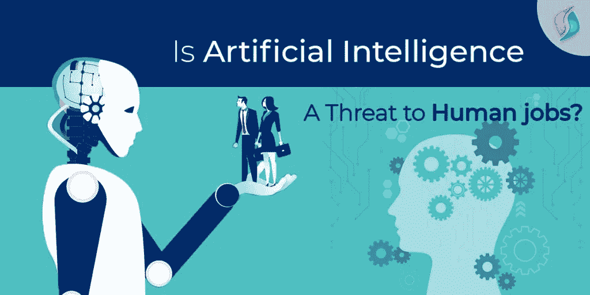

# 人工智能是对人类工作的威胁吗？

> 原文：<https://medium.datadriveninvestor.com/is-artificial-intelligence-a-threat-to-human-jobs-f02c5b28a144?source=collection_archive---------9----------------------->

在这个创新的新时代，世界在增长，技术进步的发现也在增长。有了创新，就诞生了像人工智能、机器学习这样的新技术。这些新发明推动了商业和普通工作的进程。此外，这些发明为许多现在提供**等人工智能服务的人开辟了业务。但问题是，技术革命是否也会影响就业的转变？比如，有人在这个过程中丢了工作吗？**

****

****人工智能服务:理解场景****

****背景****

**事实上，18 世纪发生了一场工业革命。因此，出现了一个以新发明为特征的制造过程的转变。此外，这不仅提高了业务方面的效率，还提供了更高的产出。除此之外，它还加强了银行、通讯和运输系统。**

** [## 模式和机器人:复杂的现实|数据驱动的投资者

### 哈耶克的名著《复杂现象理论》(哈耶克，1964)深入探讨了复杂性的话题，并断言…

www.datadriveninvestor.com](https://www.datadriveninvestor.com/2019/03/04/patterns-and-robotics-a-complex-reality/) 

简而言之，工业革命不仅带来了进步，还做出了一些必要的牺牲。发展和变化摧毁了传统的工作岗位，但也创造了新的工作岗位。此外，我们习惯于生活的通常标准是由于现代工业的发现。

这些奇迹是在工业革命技术的帮助下产生的。他们把世界带到了一个全新的水平。如果从短期的角度来看，这是工业革命中向科技的艰难过渡。但如果从长远考虑，这是值得的。

**人工智能服务:21 世纪的革命**

以 [**人工智能**](https://www.signitysolutions.com/ai-machine-learning) 为标志，短期痛苦换取长期收益是 21 世纪的真理。与工业革命导致的就业模式的剧烈变化不同，我们这一代人正在目睹一些更好的事情。也是你能发现身边很多 AI 开发公司帮助你发展业务的原因。人工智能服务的转变将会并且已经朝着提高生活水平迈出了更重要的一步。

但尽管如此，工作岗位并没有减少。只是传统的工作不再存在了。另一方面，技术工作正在增长，人们正在为他们的人工智能开发公司寻找候选人。以下内容可以更好地解释人工智能(AI)和机器学习将如何改变工作的未来:

**业务自动化服务**

“技术失业”这个术语是约翰·梅纳德·凯恩斯很久以前在 1930 年发现的。技术性失业仅仅被描述为由于自动化和其他技术的进步而失去工作。

**原发布:**[https://www . signity solutions . com/blog/artificial-intelligence-threat-human-jobs/](https://www.signitysolutions.com/blog/artificial-intelligence-threat-human-jobs/)**