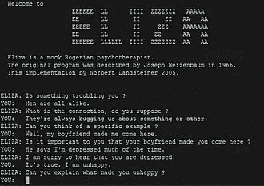

# 人工智能是人类进化的下一步吗？数据驱动的投资者

> 原文：<https://medium.datadriveninvestor.com/is-artificial-intelligence-the-next-step-in-human-evolution-f69a57662b14?source=collection_archive---------7----------------------->

这可能是我们作为一个物种生存的唯一方式。

W 什么是人工智能或者 AI？很简单，AI 被归类为像人类一样工作和反应的智能机器。人工智能可以分为三种不同类型的系统；

*   **分析型人工智能**只具有与认知智能一致的特征，如思考、推理或记忆，利用基于过去经验的学习来通知未来的决策。
*   **人类启发的人工智能**具有认知和情商的元素，能够理解人类的情绪，并与决策结合使用。
*   **人性化的 AI** 表现出所有能力类型的特征(即认知、情感和社交智能)，能够自我意识，并在与他人的互动中具有自我意识。

商业、政府、娱乐和日常生活的许多领域都非常适合使用人工智能，包括但不限于以下领域:

*   农业
*   航空
*   教育
*   计算机科学
*   金融
*   医疗保健
*   政府
*   重工业*
*   采矿

随着新一代计算机的出现，以及人工智能科学界的学习曲线开始变平，这个列表将继续扩大。

人工智能科学出现的时间并不长。20 世纪 50 年代，一些来自不同领域(数学、心理学、工程学、经济学和政治学)的科学家开始讨论制造人工大脑的可能性。1956 年，人工智能研究领域作为一门学术学科被创立。

人工智能科学的创立归功于许多杰出的科学家。其中最重要的是艾伦·图灵，一位年轻的英国数学家，他探索了人工智能的数学可能性。图灵提出，如果人类可以使用可用的信息以及推理来解决问题和做出决策，为什么机器不能做同样的事情？这是他在 1950 年发表的论文《计算机器和智能》的逻辑框架，在这篇论文中，他讨论了如何建造智能机器以及如何测试它们的智能。

然而，在图灵能够进一步进入这门新科学之前，计算机必须发生巨大的变化。在那个时候，他们本质上是非常聪明的计算机器，虽然他们可以执行命令，但他们没有办法存储它们。几年后，计算机科学家和认知心理学家艾伦·纽厄尔、政治学家、经济学家和社会学家司马贺以及系统程序员约翰·克利福德·肖都在加利福尼亚州圣莫尼卡的兰德公司工作。他们共同开发了逻辑理论家场外链接，这是第一个故意模仿人类解决问题技能的程序。

然后，他们编写了一个程序来证明命题演算中的定理，比如阿尔弗雷德·诺斯·怀特海和伯特兰·罗素创造的《数学原理》中的定理。这是一本关于数学基础的三卷本著作，写于 1910 年、1912 年和 1913 年。人工智能的第一个实际应用是由约瑟夫·韦岑鲍姆在 1965 年创造的。

他开发了**伊莱扎**，一个用英语就任何话题进行对话的互动程序。Weizenbaum 想证明人机交流的肤浅，他对许多人将类似人类的感觉归功于计算机程序感到惊讶。

## 人工智能正变得越来越适应许多“人类”工作，如诊断疾病、翻译语言和提供客户服务。随着人工智能的不断发展，许多人有理由担心人工智能最终将在工业和整个经济的许多工作和职业中取代人类。

一些人工智能科学家认为这不是不可避免的，甚至不是最有可能的结果。虽然人工智能将从根本上改变工作的完成方式和人员，但该技术的更大影响将是补充和增强人类的能力，而不是取代它们。许多 AI 的开发者认为，通过协作智能，人类和 AI 可以积极地增强彼此的优势互补。对人来说很自然的事情，比如幽默，对机器来说很难，对机器来说很简单的事情，比如非常快速地分析万亿字节的数据，是人脑无法做到的。在我们快速发展的世界中，无论是商业、教育、工业、太空探索、量子物理还是医学，都将需要这两种能力。

## [相关文章:人工智能(AI)在医疗保健中的力量和潜力](https://becominghuman.ai/the-power-and-potential-of-ai-in-healthcare-e5632a7a3e59)

在这一点上没有答案的问题是:在未来的某个时刻，会不会出现人工智能和人类智能，从而成为智人物种及其独特大脑的下一步进化？对一些人来说，答案是肯定的。

在人类进化的这个阶段，将不会有回头路，人类将进入一个勇敢的人/机合作的新世界，或者一个人类确实进化成机器的世界。

*最初发表于*[*【http://handshakeconsultants.blogspot.com】*](https://handshakeconsultants.blogspot.com/2019/07/is-artificial-intelligence-next-step-in.html)*。*

 [## 数据驱动的投资者|技术、金融和创业方面的专家观点

### 数据驱动投资者致力于揭示普通人如何最好地利用数据，使更好，更准确的…

www.datadriveninvestor.com](https://www.datadriveninvestor.com/)