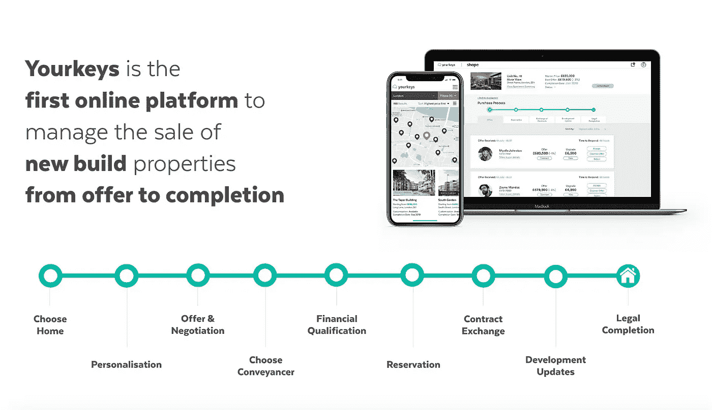

# 自动化是房地产代理的未来吗？

> 原文：<https://medium.datadriveninvestor.com/is-automation-the-future-of-the-estate-agent-7b83c321a2cf?source=collection_archive---------46----------------------->

房地产经纪人的角色是出售财产…或者是吗？虽然传统上房地产经纪人的主要职责是帮助卖家为他们的房子找到合适的买家，但我们现在应该问的一个重要问题是:“房地产经纪人在直销活动上到底花了多少时间？”随着购买过程变得越来越复杂，房地产经纪人的传统角色现在更侧重于通过复杂和分散的法律程序与现有买家进行沟通(第一太平戴维斯声称他们的谈判人员 70%的时间都花在这上面)，这无助于行业的增长和效率，这并不奇怪。

**房地产经纪人角色的转变**

购买房产可能是一个复杂而漫长的过程，这个过程无疑有其缺陷。最值得注意的是，购买过程有多个阶段，每个阶段通常由不同的专业人员监督。从房地产经纪人到抵押贷款顾问，从测量员到律师；这是一个非常分散和脱节的过程，充满了行业术语，买家很难驾驭。对于首次购房者来说尤其如此，因为他们以前从未经历过这一过程。房地产经纪人的角色正在从销售型角色转变为更多的看管角色。房地产经纪人负责指导买家从一个阶段进入下一个阶段，并作为整个过程中所有阶段工作人员的单一联系点。不足为奇的是，这自然会导致产生新线索和积极销售的时间减少。

这个问题的一个潜在解决方案是 proptech 更具体地说，proptech 行业中可用的自动化工具。自动化有可能接管许多这样的看护职责；具有很大可预见性的职责。这可能会让房地产经纪人有更多的时间从事替代活动，即销售，这通常更不可预测，需要人工管理。这种自动化所涉及的具体内容会有所不同，但是，预计以下内容将在未来的房地产通信中占据突出地位

预计将在许多机构中实施预定的电子邮件和自动跟进/回复，以消除手动获取信息的需要。在对新客户的营销方面，可以安排在一天中潜在买家/卖家最容易看到的时间发布预定的社交媒体帖子，并使用自动细分来按群体定制沟通。

**房产匹配**

自动资产匹配可以消除买方注册过程的缓慢和初始阶段。人工智能(AI)可以用来从买家的在线行为和行动中“学习”他们，使房地产经纪人能够轻松识别并向他们提供最有吸引力的选择。这可以增加找到“匹配”的机会，并提高整体客户保留率。

**流程指导**

通信和状态更新的自动跟踪——买家完全可以访问——将最大限度地减少买家在购买过程的后期阶段对其房地产代理的严重依赖。直接获得重要信息的可能性可以“省去中间人”，有可能使房产购买过程不仅更快，而且更有效，更简单。

**展望未来**

在 Yourkeys，我们是销售自动化进程的先锋。使用我们的“运营中心”，代理商、开发商、买家和产权转让人可以有效地沟通，平台通知用户谁负责下一个难题。这使得每一个利益相关者从报价到完成的整个过程完全监督和透明。这减轻了买家对未知事物的压力和焦虑，阻止多方追逐产权转让人，并利用自动化及时推进每笔交易。

