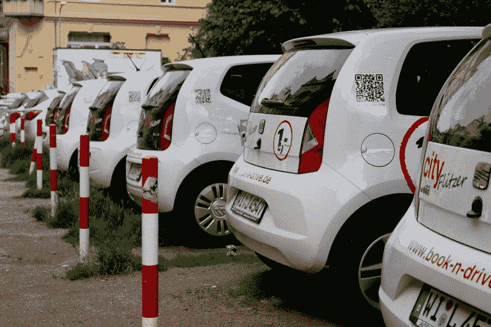
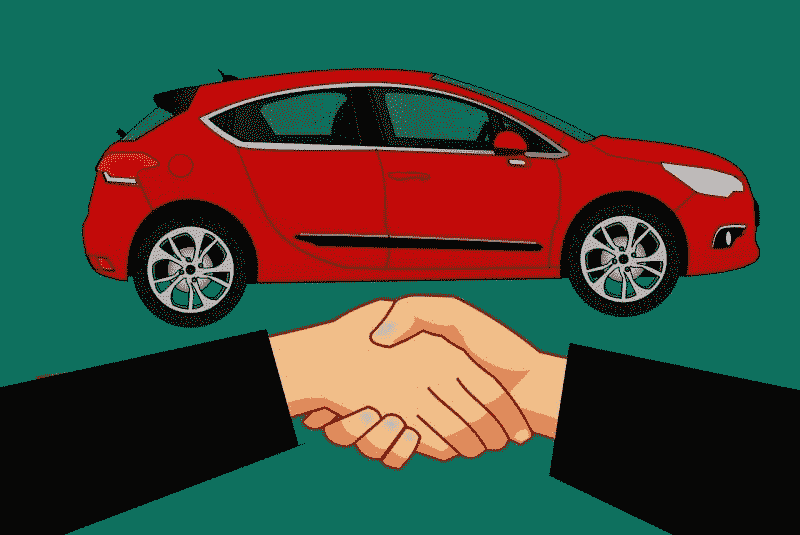

# 安飞士预算是汽车的未来吗？—市场疯人院

> 原文：<https://medium.datadriveninvestor.com/is-avis-budget-the-future-of-automobiles-market-mad-house-62327162906?source=collection_archive---------6----------------------->

我问的是安飞士预算汽车的未来，因为有人猜测汽车拥有量将在一二十年内崩溃。

流行的理论是，公司拥有的联网自动驾驶汽车将成为许多人的首选交通方式。具体来说，一家公司将拥有自动驾驶汽车，并在每次使用的基础上将其出租给司机。

 [## 在自动驾驶汽车发生事故的情况下，谁应该承担法律责任？数据驱动的投资者

### 我仍然认为自动驾驶汽车是一种奢侈品，而不是必需品…

www.datadriveninvestor.com](https://www.datadriveninvestor.com/2018/11/02/who-is-legally-accountable-in-the-case-of-an-autonomous-vehicle-accident/) 

举例来说，如果你每周购物只需要一辆车，那就是你能支付的全部费用。详细说明当你需要一辆车时，你将使用一个应用程序来召唤一辆车。这辆车会把你拖到目的地，在你不再需要它的时候开走。

# 拥有汽车没什么意义

从经济上来说，这种模式比个人拥有汽车更有意义，因为它更便宜，效率更高。事实上，研究人员约翰·贝茨和大卫·莱布林[估计，在英国，司机平均 96%的时间都在停车。](https://www.racfoundation.org/research/mobility/spaced-out-perspectives-on-parking)

因此，人们将大量的资源和金钱投入到他们很少使用的东西上。此外，城市可以通过结束个人拥有汽车来减少交通拥堵。相反，一辆自动驾驶汽车可以比几辆汽车更有效地为几个人服务。

例如，没有理由建车库或许多停车场。此外，许多人可以避免维护，汽油，每月汽车和保险付款的麻烦。

因此，从政策或经济角度来看，拥有汽车没有什么意义。尖锐地说，大多数对拥有汽车的辩护都是诉诸情感，而不是确凿的事实。因此，我们需要问私家车何时会消失。

# 汽车所有权的终结对 Avis-Budget 集团来说是一个机会

卡拉·斯威舍的《T4》、《纽约时报》的《T5》、《T6》、专栏版《T7》等对私人汽车消亡的预测对安飞士预算集团(NASDAQ: CAR)来说是一个机会。

斯威舍预测，普通人“实际购买、维护、保险和保养汽车”的概念将会终结。然而，对于无车时代何时到来，人们意见不一。

例如，麦肯锡公司[预测](https://www.mckinsey.com/industries/automotive-and-assembly/our-insights/disruptive-trends-that-will-transform-the-auto-industry)2030 年 10%的汽车将是共享汽车。此外，到 2030 年，共享汽车可能成为 1.5 万亿美元的产业。对于一直提供共享车辆的 Avis Budget 来说，这是一个机会；出租汽车和卡车，几十年来。

esri.com[观察到](https://www.esri.com/about/newsroom/publications/wherenext/twilight-of-car-ownership/)，RethinkX 不切实际地声称，到 2030 年，美国的汽车数量将下降 80%。注意；我认为这种说法很荒谬，但我相信麦肯锡的估计听起来是可行的。

值得注意的是，汽车共享服务正在快速增长。esri.com 指出，加州大学伯克利分校估计，2018 年自动共享服务有 190 万会员。

然而，汽车共享导致的汽车拥有量下降很小。加州大学伯克利分校的交通可持续研究中心估计，2016 年，只有 2%至 5%的 Car2Go 会员因为参与这项服务而出售了车辆。然而，7%到 10%的 Car2Go 用户没有车辆。

# Avis 预算会主导汽车共享吗？

自 2013 年以来，Avis Budget Group 一直拥有美国最著名的汽车共享服务 [Zipcar](https://www.zipcar.com/?&gclid=Cj0KCQjwpavpBRDQARIsAPfTwiyIn0U8y1mNrH2Y5dTdJ2ESPCybaJTyZwFQ9sLDotAzAU3sljLCBkYaApKoEALw_wcB) 。

值得注意的是，Avis [声称](https://avisbudgetgroup.com/) Zipcar 已经在全球拥有 100 万会员。因此，Avis 在汽车共享和将共享汽车带给大众方面已经有了丰富的经验。

Zipcar 给会员一张卡，让他们可以使用停在公共场所的车辆。会员按小时或日付费驾驶车辆。Zipcar 每月向会员收取车辆使用费。

Zipcar 的网站显示，像波士顿这样的一些城市现在有数百辆 Zipcar 停在城市各处。Zipcar 的成功证明了共享汽车是有市场的，而且这个市场正在增长。

# 自动驾驶汽车和汽车共享

Avis Budget 对自动驾驶汽车感兴趣，因为它们可以降低成本。

当 Zipcar 在街上停车时，必须有人照看它，确保它的安全和维护。例如，Zipcar 需要派员工出去取回车辆进行维护，有时还需要将它们放回正确的停车位。

理论上，Avis Budget 可以将自动驾驶 Zipcars 设在一个中央车库。当会员打电话时，自动 Zipcar 会开到她所在的位置，而不是待在街上或停车场。Zipcar 在不使用时，或者需要燃料或电力时，会开回车库。

因此，Avis Budget 正在参加 **Alphabet 在凤凰城的** Waymo 自动驾驶汽车实验。Waymo 正在测试自动克莱斯勒 Pacifica 小型货车作为拼车车辆的使用。据 *TechCrunch* [报道](https://techcrunch.com/2018/07/25/waymo-partners-with-walmart-avis-autonation-and-others-to-expand-access-to-self-driving-cars/)，Avis Budget 正在维护 Waymo 的一些车辆，并向租车用户提供 Waymo One rideshare 服务。

Avis 与 Waymo 合作是因为自动驾驶汽车可以扩大 Zipcar 的覆盖范围。例如，自动 Zipcars 可以服务于郊区、小城镇、农村地区和边远地区。此外，租车者可以使用自动 Zipcars 进行长途或越野旅行。

# 无车未来有多现实？

在通往无车未来的道路上，有许多严重的障碍需要克服。

首先，我们需要开发全自动驾驶(FSD)车辆。解释一下，消防车辆是完全自主的，能够在没有驾驶员的情况下安全运行。市场上没有消防车辆，但有几家公司；包括 [**福特**](https://techcrunch.com/2019/03/13/ford-is-expanding-its-self-driving-vehicle-program-to-austin/) **(NYSE: F)** 和 [**特斯拉汽车**](https://marketmadhouse.com/can-self-driving-cars-save-tesla/)**(NASDAQ:TSLA)**，声称他们可以在 2021 年前拥有完全自动驾驶的汽车上路。

第二，政治反弹可能会让消防车辆无法上路。上升的总统候选人杨安泽(纽约州民主党人)已经对无人驾驶卡车发出了警告。至少一个受欢迎的媒体人物；健谈的也附和了杨的担忧。

因此，我们不知道自动驾驶汽车的广泛使用在技术、社会或政治上是否可行。然而，公众似乎接受了 Zipcars 在波士顿等地的广泛存在。

# Avis Budget 能主宰汽车共享的未来吗

我认为 Avis Budget 是一项不错的投资，因为它已经为汽车共享的未来提供了很多基础设施。

Avis [声称](https://avisbudgetgroup.com/)将在 180 个国家的 11，000 个地点提供 600，000 辆租赁车辆。此外，Avis 已经提供了超过 100，000 辆 Wi-Fi 联网车辆。此外，Avis 拥有 30，000 名员工来支持这些车辆。此外，Avis Budget 还与拼车领导者 **Lyft(纽约证券交易所代码:LYFT)** 和 Waymo 合作。

Avis 的子公司包括 Zipcar、Payless、Budget、预算卡车租赁、Maggiore、France Cars、Apex、AmicoBlue 和 [MoriniRent](https://www.morinirent.com/it/) 。因此，我认为 Avis 在汽车共享的未来中处于最有利的位置。然而，价值狂热分子会理所当然地问，安飞士赚钱了吗？

# 安飞士预算赚钱吗？

目前，答案是否定的。事实上，Avis Budget 报告了 2019 年 3 月 31 日的季度运营亏损-9400 万美元，季度净亏损-9100 万美元。

然而，Avis Budget 在同一天公布的收入为 19.2 亿美元，毛利润为 2.83 亿美元。然而，Avis Budget 报告称，上一季度其收入增长率下降了 2.44%。此外，营收从 2018 年 12 月 31 日的 20.5 亿美元降至三个月后的 19.2 亿美元。

# Avis Budget 缺乏汽车共享资源

我不认为 Avis Budget 有资源或预算来采用和部署像 FSD 车辆这样激进的新技术，因为它缺乏资金。

例如，截至 2019 年 3 月 31 日，安飞士的自由现金流为负-9.1 亿美元，投资现金流为-14.34 亿美元，运营现金流为 4.4 亿美元。最后，截至 2019 年 3 月 31 日，Avis Budget 仅有 5.4 亿美元现金和短期等价物。

在这种情况下，我认为 Avis Budget 将不得不寻找一个现金充裕的合作伙伴来部署自动驾驶汽车。值得注意的是，Avis 可能有这样一个合作伙伴，其形式为 **Alphabet(纳斯达克股票代码:GOOG)** 。截至 2019 年 3 月 31 日，Alphabet 拥有 943.4 亿美元的短期投资和 191.48 亿美元的现金及等价物。

# Avis Budget 是收购目标吗？

Avis 的其他潜在合作伙伴包括汽车制造商。例如，福特在 2019 年 3 月 31 日拥有 208.48 亿美元的现金和等价物，以及 168.82 亿美元的短期投资。与此同时，丰田汽车公司在同一天拥有 427.37 亿美元的现金和等价物，以及 102.47 亿美元的短期投资。

因此，Avis 可以从合作伙伴那里为汽车共享找到资金。此外，像福特、丰田和 Alphabet 这样的公司如果愿意，也有能力收购 Avis-Budget。Avis 拥有现有的业务和基础设施，将成为比 Lyft 更好的自动驾驶汽车部署平台；或者**优步(纽约证券交易所股票代码:优步)，和**这些都只不过是应用程序。

在这种情况下，我认为实现自动汽车共享的资金是存在的。所需要的只是政治意愿，以及致力于实施政治意愿的管理层。

# 安飞士预算是价值投资吗？

鉴于汽车共享的潜力，我认为对于那些不需要股息收入的人来说，Avis Budget 是一个良好的长期增长和物有所值的投资。事实上，我认为市场先生在 2019 年 7 月 15 日低估了 Avis Budget 36.36 美元的价格。

不幸的是，Avis Budget 不支付股息，但它有着悠久的历史。因此，Avis Budget 是一项有趣的汽车共享价值投资。

然而，Avis 预算是一个有风险的提议，因为汽车共享是一个新的业务。因此，自动驾驶汽车和汽车共享可能需要几年甚至几十年才能赚钱。

归根结底，**Avis Budget Group(NASDAQ:CAR)**、汽车共享、自动驾驶汽车只面向长期成长型投资者。[福特](https://marketmadhouse.com/ford-and-the-future-where-the-legacy-automaker-stands-in-the-race-for-a-driverless-car/)将更好地服务于大多数投资者，因为与 Avis Budget 不同，它[赚钱](https://marketmadhouse.com/will-ford-motor-f-make-money-from-self-driving-cars/)并支付股息。

*原载于 2019 年 7 月 15 日*[*https://marketmadhouse.com*](https://marketmadhouse.com/is-avis-budget-the-future-of-automobiles/)*。*