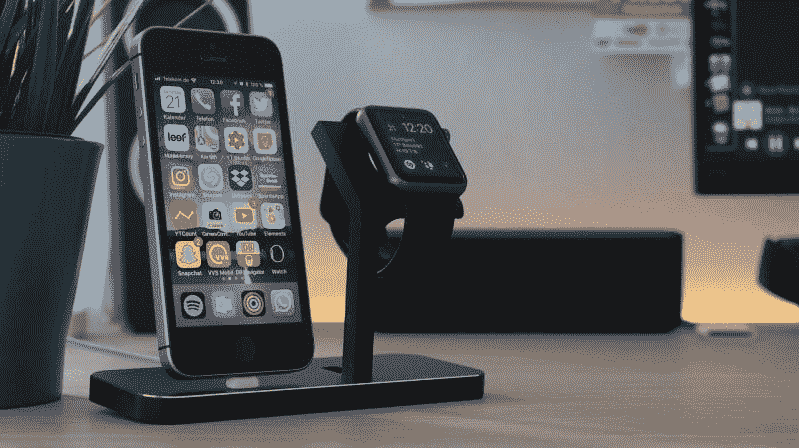

# 美国银行是科技公司吗？—市场疯人院

> 原文：<https://medium.datadriveninvestor.com/is-bank-of-america-a-technology-company-market-mad-house-820061456c1c?source=collection_archive---------6----------------------->

金融科技(Fintech)和银行之间的界限越来越模糊。比如**美国银行(NYSE:BAC)**；或者叫 BOA，正在吹嘘它的应用程序。

令人惊讶的是，公司客户可以通过美国银行的 CashPro 应用程序转移高达 16 亿美元，彭博[声称](https://www.bloomberg.com/news/articles/2019-11-08/need-to-move-1-6-billion-bank-of-america-has-an-app-for-that)。美国银行声称，一家身份不明的电子公司在 2019 年夏天使用 CashPro 转移了 16 亿美元。

“你可以通过我们的 [CashPro](https://marketmadhouse.com/is-bank-of-america-a-technology-company/#/signin) 系统在苹果手表上支付 5 亿美元，”美国银行首席执行官布莱恩·莫尼汉吹嘘道。彭博报道称，莫伊尼汉是在 2019 年 11 月 5 日的投资者会议上提出这一主张的。

# 一个应用程序就能解决洗钱和逃税问题

如果莫伊尼汉是对的，洗钱和逃税就变得容易多了。为了解释这一点，莫伊尼汉承认，你可以利用现代银行系统在国家之间快速转移数十亿美元。

因此，如果国会通过美国参议员利兹·沃伦(纽约州民主党)的财富税提案，美国亿万富翁可以在几秒钟内将所有现金转移到美国境外。因此，莫伊尼汉揭示了为什么普通人如此憎恨和害怕大型银行。

我预测 CashPro 将成为一个政治问题，因为据报道它的存在和工作。彭博声称，在 2018 年 9 月至 2019 年 9 月期间，50 万用户用 CashPro 支付了 1440 亿美元。

有趣的是，CashPro 可能是最大的移动支付应用之一，如果 Moynihan 和彭博的说法是真的。据 Statista [估计](https://marketmadhouse.com/paypal-grows-and-grows-and-grows/)，Venmo， **PayPal(纳斯达克股票代码:PYPL)，**广受欢迎的 P2P 应用在 2019 年第二季度的净支付额为 240 亿美元。

 [## 分散金融的出现|数据驱动的投资者

### 当前的全球金融体系为拥有资源、知识和财富的人创造了巨大的财富

www.datadriveninvestor.com](https://www.datadriveninvestor.com/2019/03/14/the-emergence-of-decentralized-finance/) 

# 美国银行用 CashPro 会赚钱吗？

此外，Statista [估计](https://www.statista.com/statistics/218493/paypals-total-active-registered-accounts-from-2010/) PayPal 在 2019 年第一季度为其生态系统增加了 900 万个账户。因此，我认为 CashPro 可以推动美国银行的大幅增长。

宝儿；不过，从 CashPro 上赚不到什么钱。Statista [估计](https://www.statista.com/statistics/226530/mobile-payment-transaction-volume-forecast/)2019 年全球移动支付市场的总收入为 10.8 亿美元。因此，来自 CashPro 的收入可能很少，尽管它转移了数十亿美元。

很能说明问题的是，美国银行的季度收入和毛利从 2019 年 6 月 30 日的 230.4 亿美元降至 2019 年 9 月 30 日的 228.07 亿美元。此外，Stockrow 估计美国银行上个季度的收入增长率为 0.37%。

# 金融科技悖论:效率越高，收入越少

我认为，美国银行的收入指向了金融科技领域一个有趣的悖论；金融科技越快、越高效，赚的钱就越少。数字金融技术让银行更快、更高效，但它们赚的钱却更少。

我认为，对这一悖论的一种解释是银行业的性质。传统上，银行通过在流程中增加步骤来赚钱，这让它们有机会收取费用并赚钱。

例如，你需要现金，所以你去自动取款机支付费用。同时，你需要支付你的抵押贷款，所以你开了一张支票。银行向你收取支票和支票账户的费用。如果抵押支票被退回，银行会向你收取更高的费用。

然而，有了数字技术，你可以用借记卡或手机支付，这样你就不必去自动取款机取钱了。此外，您不需要写支票，因为您可以通过您的银行应用程序使用在线账单支付或账单支付。

由于账单支付是数字化的，而且通常是即时的，所以银行不太可能会对拒付支票收取费用。此外，银行不能向您收取支票或处理支票的“服务”费用。

# 美国银行能从数字支付中获利吗？

你从数字支付过程中受益，但美国银行赚的钱更少。但是，BOA 的开支会更低，因为它可以用更小的基础架构做更多的事情。

因此，美国银行正在关闭全国各地的分行。例如，据 WIBW 电视台[报道](https://www.wibw.com/content/news/Bank-of-Americas-closing-its-Topeka-branches-510081961.html)，美国银行关闭了在堪萨斯州托皮卡的所有分行。此外，美国银行于 2019 年 7 月关闭了北卡罗来纳州夏洛特的 16 家分行，*Crain ' s Chicago Business*[报道](https://www.chicagobusiness.com/finance-banking/bank-america-giveth-and-bank-america-taketh-away)。

美国银行的行为显示了金融科技悖论令人不安的一面。技术让银行对富人和大公司更有用，但对普通人没那么有用。

杰夫·贝索斯可以通过他的应用程序向瑞士转移 10 亿美元，但你将很难在你的邻居那里兑现支票。对我来说，这听起来肯定会引发贴现和民粹主义者对大银行的愤怒。

# 为什么人们对大型金融科技越来越失望

可以预见的是，一些民意调查认为银行评论家、美国参议员利兹·沃伦(马萨诸塞州民主党)在民主党总统初选中领先。此外，2020 年共和党总统候选人可能是美国总统唐纳德·特朗普(纽约州共和党人)，他是另一位银行批评者。

在美国，对大型金融科技公司的不满正在加剧，原因显而易见。面向普通人的基本金融服务消失了，而面向富人的服务却在增长。

银行收缩和金融科技增长将使美国日益扩大的代沟变得更糟。解释一下，更年轻的人；千禧一代(35 岁以下)和 X 一代(35-54 岁)不会注意到银行关门，因为他们所有的金融交易都是数字化的。

依靠支票簿和现金的老年人，主要是婴儿潮时期出生的人(年龄在 54-74 岁之间),陷入困境。例如，工作的千禧一代不关心他的邻居美国银行分行何时关门。然而，一个退休的秘书可能要坐很长时间的公交车去兑现支票。

# 大型金融科技有什么好处和坏处

相反，大型金融科技和数字支付也有一些好处。不幸的是，尚不清楚银行数字化的收益是否大于损失。

从积极的一面来看，美国银行的员工可以赚更多的钱。美国国家公共电台[报道](https://www.npr.org/2019/04/09/711388419/bank-of-america-raising-its-minimum-wage-to-20-an-hour)，英航声称计划将最低工资提高到每小时 20 美元。如果美国银行的工资声明属实，其员工的入门级工资将达到每年 38，400 美元。

有趣的是，美国银行的薪酬仍将低于美国平均时薪。贸易经济[估计【2019 年 10 月美国平均时薪为 23.70 美元。](https://tradingeconomics.com/united-states/wages)

不利的一面是，美国银行支付了更高的工资，因为它雇佣了更少的员工。在去年的一次投资者会议上，莫伊尼汉甚至吹嘘自己在九年内裁员 84，000 人。我估计美国银行的员工人数从 2010 年的 28.8 万人下降到 2018 年 10 月的 20.4 万人。

# 在美国银行杀死金融科技

美国银行雇用很少的人，因为数字平台和自动柜员机(ATM)做的工作。例如，当你使用自动柜员机时，不需要出纳员来兑现支票或接受存款。

此外，当你使用美国银行的应用程序支付电话账单时，它不需要员工打开信封或处理支票。相反，你可以从美国银行的数字平台向**威瑞森(纽约证券交易所代码:VZ)** 的平台发送数字支付。

遗憾的是，莫伊尼汉并没有对所有前美国银行员工说什么；大多是中下阶层的女性，会为了工作而工作。就我个人而言，我不认为再培训是一个选择。例如，我无法想象一个 54 岁、患有糖尿病、有高中文凭的前银行出纳员会回到学校学习网站设计。

银行业工作岗位的消失将给社区带来压力。特别是，像女服务员、零售助理和收银员这样的服务性工作将会有更多的竞争。这将意味着许多妇女的社会地位下降，这种情况将导致社会和政治动荡。

预计，随着总统候选人如[杨安泽](https://www.youtube.com/watch?v=cTsEzmFamZ8)(纽约州民主党)吸引人们的注意力，工作扼杀金融科技的作用将成为一个大问题。扼杀就业技术的危险和基本收入是杨的标志性竞选议题。

# 美国银行赚了多少钱？

**美国银行(纽约证券交易所代码:BAC)** 押注金融科技承担了很大的风险，但这家怪兽银行赚了多少钱？

答案是很多。例如，2019 年 9 月 30 日，美国银行报告季度营业收入为 76.38 亿美元，季度净收入为 57.77 亿美元。然而，这些数字低于 2019 年 6 月 30 日的 98.16 亿美元和 71.09 亿美元。

引人注目的是，2019 年 9 月 30 日，美国银行报告的“经营现金流”为负 57.02 亿美元，“自由现金流”为负 57.02 亿美元。令人印象深刻的是，美国银行在 2019 年 9 月 30 日报告了 228.28 亿美元的融资现金流。

因此，美国银行从其核心业务中赚了很多钱，但在基础设施上损失了大量资金。因此，我认为莫伊尼汉在削减基础设施的同时投资技术的策略对美国银行来说是明智的。

# 宝儿能靠平台即服务赚钱吗？

莫伊尼汉专注的核心业务是数字支付、贷款、投资和商业银行。我认为这些操作主要是金融科技。因此，美国银行正在转型为一家金融科技公司。

例如，美国银行和 IBM(纽约证券交易所代码:IBM) 正在合作开发金融服务云，*美国银行家* [报道](https://www.americanbanker.com/news/bank-of-america-ibm-collaborating-on-a-financial-services-cloud)。具体来说，金融服务云可以包括超过 190 个 API(应用编程接口)驱动的云原生平台即服务产品，以创建新的和增强的云原生应用。

美国银行声称其削减了 29%的信息技术预算；或者每年 21 亿美元。*美国银行家*估计美国银行 it 部门将其 IT 基础设施从 60 个数据中心和 200，000 台服务器削减至 70，000 台服务器。

如果这些说法是真的，我认为美国银行可以成为银行金融科技、云计算和平台即服务产品的领导者。这会给美国银行增加很多价值。例如，你可以使用 Apple Pay 和 Google Pay 这样的数字钱包从美国银行的自动取款机上取钱。

Google Pay、PayPal、Venmo 和 CashPro 等数字钱包都是平台即服务产品。因此，平台即服务可以将业务和客户推向 BOA。

# 美国银行有多少现金？

我喜欢美国银行，因为它有大量的现金。2019 年 9 月 30 日，美国银行报告了 4362.46 亿美元的现金和等价物。令人印象深刻的是，这一数字从 2019 年 6 月 30 日的 4，281.23 亿美元增长而来。

因此，平台即服务为美国银行带来了更多的现金。这对美国银行的股东来说是个好消息，因为这意味着股息将会继续。

请注意，**美国银行(NYSE: BAC)** 将于 2019 年 12 月 5 日支付 18₵季度股息。3₵在 2019 年增加了股息；从六月的 15₵上升到九月的 18₵。相比之下，PayPal 不支付股息。

Dividend.com 称赞美国银行连续五年的股息增长。2019 年 11 月 13 日，美国银行股东获得 2.18%的股息收益率，72₵的年化派息，派息率为 26.55%。

归根结底，我喜欢美国银行，因为它便宜，现金充裕，股息丰厚，而且由于 Fintech 和平台即服务，它有很大的增长潜力。我认为美国银行在 2019 年 11 月 13 日报道的 32.77 美元的股价是一个便宜货。

如果你想廉价投资金融科技；而云，你需要调查**美国银行(NYSE: BOA)** 。

[*最初发表于 2019 年 11 月 13 日 https://marketmadhouse.com。*](https://marketmadhouse.com/is-bank-of-america-a-technology-company/)