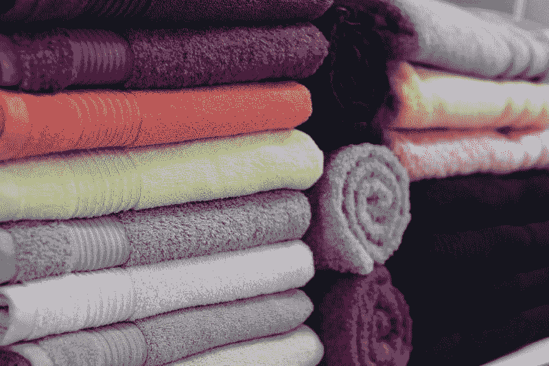
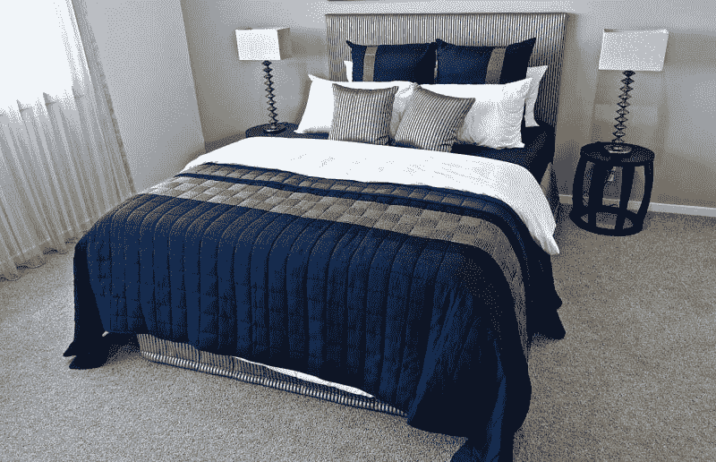
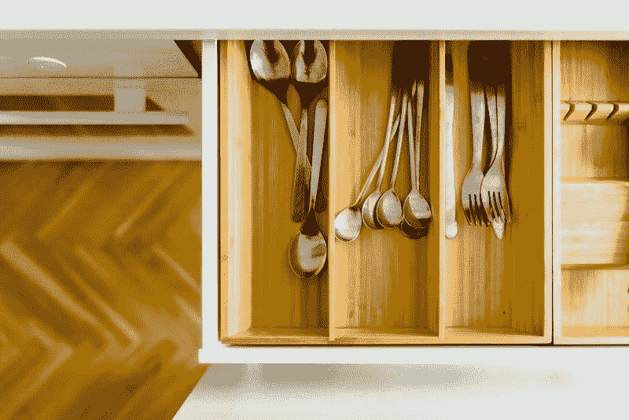
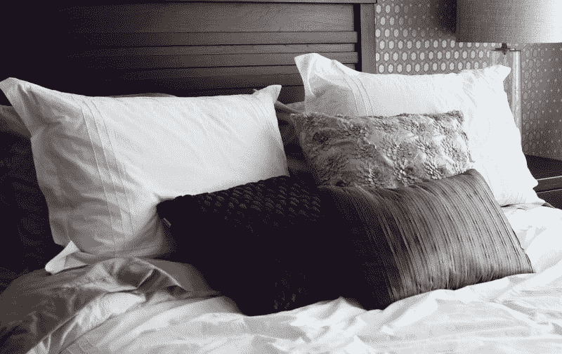

# 贝德柏士比昂公司要死了吗？—市场疯人院

> 原文：<https://medium.datadriveninvestor.com/is-bed-bath-beyond-dying-market-mad-house-b1cd9a632866?source=collection_archive---------7----------------------->

奇怪的是，贝德柏士比昂公司正在走向死亡，因为这家人类家具折扣店在北美经营着 1024 家店铺。

然而， **Bed Bath & Beyond(纳斯达克股票代码:BBBY)** 股票从 2019 年 3 月 30 日的每股 76.80 美元跌至 2019 年 6 月 25 日的 11.35 美元。因此，Bed Bath & Beyond 在 2019 年 6 月 25 日的市值为 14.99 亿美元。

 [## 数据驱动投资的兴起——数据驱动投资者

### 当 JCPenney 报告其 2015 年 2Q 的财务结果时，市场感到非常震惊。美国零售巨头…

www.datadriveninvestor.com](https://www.datadriveninvestor.com/2019/02/28/the-rise-of-data-driven-investing/) 

奇怪的是，自 2015 年以来，贝德柏士比昂公司的收入仅略有下降。例如，2015 年 2 月 28 日，贝德柏士比昂公司报告年收入为 118.81 亿美元。与此同时，该公司 2019 年 3 月 2 日的年收入为 120.29 亿美元。

因此，贝德柏士比昂公司的销量似乎保持不变。然而，截至 2019 年 3 月 2 日止年度，年度收入增长下降 2.6%。

# 贝德柏士比昂公司赚钱了吗？

贝德柏士比昂公司比 2015 年赚的钱少了，股票行数据[显示](https://stockrow.com/BBBY/financials/income/annual)。例如，这家零售商报告 2015 年 2 月的年净收入为 15.04 亿美元。

然而，贝德柏士比昂公司于 2019 年 3 月 2 日报告净亏损-1.3722 亿美元。此外，年营业收入从 2015 年 2 月的 15.04 亿美元下降到四年前的 4.2277 亿美元。

相反，贝德柏士比昂公司的年度运营现金流从 2015 年 3 月的 17.78 亿美元降至 2019 年 3 月的 9.1828 亿美元。此外，同期自由现金流从 8.4785 亿美元降至 6.041 亿美元。

相反，贝德柏士比昂公司的年度运营现金流从 2015 年 3 月的 17.78 亿美元降至 2019 年 3 月的 9.1828 亿美元。此外，同期自由现金流从 8.4785 亿美元降至 6.041 亿美元。

因此，贝德柏士比昂公司赚的钱和产生的现金越来越少，但收入却很稳定。我认为这些数字表明贝德柏士比昂公司通过打折来维持销售。因此，销售额保持不变，但贝德柏士比昂公司赚的钱少了，因为费用在上升。

# 贝德柏士比昂公司离零售死亡螺旋有多近？

另一方面，我认为贝德柏士比昂公司远未陷入零售业死亡螺旋。澄清一下，当零售商的销售不再产生足够的现金来支付其费用时，死亡螺旋就发生了。

幸运的是，贝德柏士比昂公司远离螺旋。为了解释这一点，贝德柏士比昂公司在 2019 年 3 月 2 日报告了 5.0897 亿美元的现金和等价物以及 4.858 亿美元的短期投资。因此，贝德柏士比昂公司当日银行存款为 9.9477 亿美元。

因此，我认为贝德柏士比昂公司有足够的现金在可预见的未来生存。然而，该公司将需要进行大刀阔斧的改革，以避免死亡螺旋。

# 贝德柏士比昂公司出了什么问题？

我们可以用三个词来概括贝德柏士比昂公司的困境:**亚马逊(NASDAQ: AMZN)** 、 **Wayfair (NYSE: W)** 、**沃尔玛(NYSE: WMT)** 。

解释一下，亚马逊是美国最大的在线零售商，2018 年销售额为 622.58 亿美元，沃尔玛是第二大零售商，2018 年销售额为 146.68 亿美元。与此同时，Wayfair 是美国第六大在线零售商，2018 年销售额为 48.3 亿美元。

我认为 Wayfair 是 Bed Bath & Beyond 的最大威胁，因为它专注于家居装饰。值得注意的是，根据 Statista [的计算](https://www.statista.com/statistics/646030/top-online-stores-united-states-revenues/)，Wayfair 的销售额现在已经超过了 Target.com、Macys.com 和 Costco.com。为了详细说明，Statista 估计 Target 2018 年的在线销售额为 48.23 亿美元，Costco 2018 年的在线销售额为 39.83 亿美元，梅西百货 2018 年的在线销售额为 48 亿美元。

因此，Wayfair 证明了电脑和智能手机现在是美国人最喜欢购买家居用品的地方。显然，这威胁到贝德柏士比昂公司的生存。

# 在线零售是如何杀死贝德柏士比昂公司的

毫不奇怪，美国商务部[估计](https://www.digitalcommerce360.com/article/top-1000-online-retailers/)2018 年美国在线零售额增长 14.2%。然而，北美最大的电子零售商如 Wayfair 的销售额在 2018 年增长了 17.6%。

我认为网上零售增长很快，因为它提供了更好的价格、更多的选择和更方便的购物方式。例如，一个足球妈妈不必错过女儿的比赛去 Wayfair 购物。与此同时，新千年女性无需中断游戏从 Walmart.com 订购床单。

因此，贝德柏士比昂公司不仅仅是在与其他零售商竞争。相反，贝德柏士比昂公司现在不得不与客户生活中的所有其他活动竞争。这包括狂看电视节目、爱好、家庭、孩子、浪漫、性、工作、崇拜、阅读、教育、电子游戏、政治、志愿服务、运动、露营等等。

# 实体店购物正在消亡吗？

显然，普通人可以很容易地说服自己去做一些有趣或有益的事情，而不是去购物。而且，亚马逊、Wayfair、沃尔玛等。可以将您的购物之旅缩短为几分钟的搜索和点击时间。

在这种情况下，我不禁要问，除了老年人、购物狂、无知者和技术恐惧者，贝德柏士比昂公司还会如何吸引其他人进入它的商店。毕竟，哪个理智的人会选择在贝德柏士比昂公司购物，而不是和她的孩子在一起。

因此，实体购物可能会和贝德柏士比昂公司一起消亡。我认为有两代甚至可能三代美国人认为在商店购物是一件令人厌烦的琐事，要不惜一切代价避免。

因此，Statista [计算](https://www.statista.com/statistics/546894/number-of-amazon-prime-paying-members/)显示，亚马逊 Prime 在 2018 年 12 月拥有 1.01 亿美国用户。值得注意的是，这一数字高于 2018 年 6 月的 9500 万用户。Worldometers 估计，2019 年 6 月美国人口为 3.29 亿。

因此，近三分之一的美国人可能属于亚马逊 Prime。此外，Statista [计算出](https://www.statista.com/statistics/304938/amazon-prime-and-non-prime-members-average-sales-spend/)2018 年，普通顾客在亚马逊的平均消费为 1400 美元。相比之下，Statista 估计，2018 年非 Prime 客户在亚马逊的平均消费为 600 美元。

# 贝德柏士比昂公司是价值投资吗？

因此，我相信那些认为网上购物会消失，顾客会回到贝德柏士比昂公司的人是生活在一个梦想的世界里。

然而，贝德柏士比昂公司仍为投资者提供了一点价值。例如，BBBY 股份将于 2019 年 7 月 16 日支付 17₵股息。此外，股息仍在增长。2018 年，从 16₵到 17₵，股息都在增长。

与此同时，Dividend.com[计算](https://www.dividend.com/dividend-stocks/consumer-goods/home-furnishings-and-fixtures/bbby-bed-bath-and-beyond-inc/)bed bath&beyond 在 2019 年 6 月 25 日提供了 6.09%的股息收益率，68₵ a 股的年化派息率和 33.8%的派息率。因此，Bed Bath & Beyond 即使在股价暴跌时仍在提供收入，这使得该股对价值投资者具有吸引力。

然而，我不认为 Bed Bath**Beyond&(纳斯达克代码:BBBY)** 是一项价值投资，因为我看不出这家零售商如何能与亚马逊、沃尔玛和 Wayfair 等咄咄逼人的电子零售商竞争。相反，我认为 Bed Bath & Beyond management 将最终出售给对冲基金，就像 Barnes & Noble(纽约证券交易所:BKS) leaders 所做的那样**。**

# 为什么贝德柏士比昂公司管理层会出卖自己

为了解释这一点，Elliot Advisors 于 2019 年 6 月 7 日以 6.38 亿美元收购了 Barnes & Noble，《纽约时报》 [报道](https://www.nytimes.com/2019/06/07/books/barnes-noble-sale.html)。我认为 Barnes & Noble 的管理层出售股份是因为低股价威胁到公司的未来。

巴诺的市值为 4.92276 亿美元，2019 年 6 月 25 日的股价为 6.74 美元。如此低的数字限制了公司借钱和生存的能力。然而，像 Elliot Advisors 这样的对冲基金可以提供大量信贷，而无需向投资者屈服。

我的预测是，贝德柏士比昂公司管理层将不得不效仿巴诺，在某个时候出售股份。只有历史才能证明贝德柏士比昂公司的买家是另一家零售商还是对冲基金。然而，BBBY 股票的持有者可以通过向买家出售他们的股票赚一点钱。

*原载于 2019 年 6 月 25 日*[*https://marketmadhouse.com*](https://marketmadhouse.com/is-bed-bath-beyond-dying/)*。*