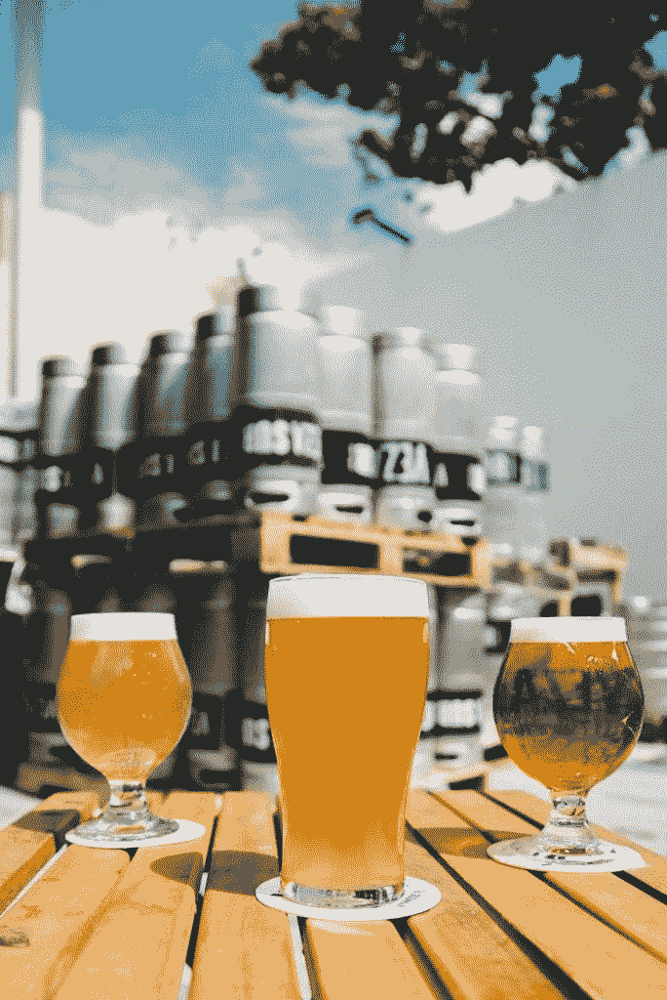
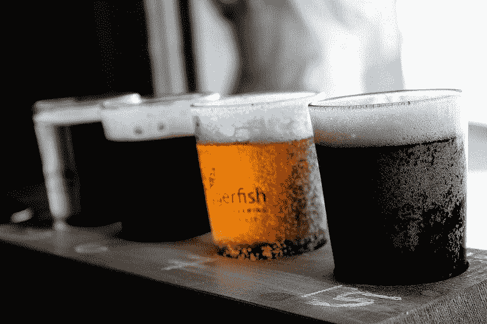
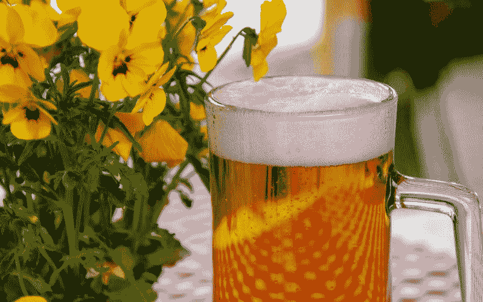
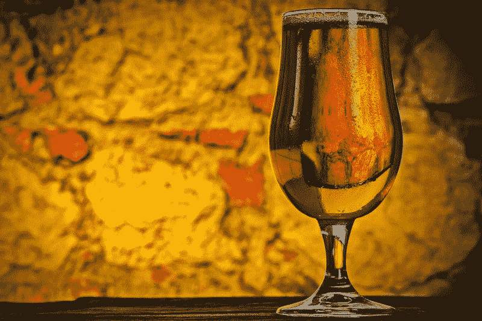

# 大啤酒在莫尔森库尔斯赚钱吗？—市场疯人院

> 原文：<https://medium.datadriveninvestor.com/is-big-beer-making-money-at-molson-coors-market-mad-house-705f6b71d91a?source=collection_archive---------9----------------------->

习惯和购买模式的改变提出了一个有趣的问题:大啤酒在赚钱吗？毕竟，现在有数百家啤酒厂和啤酒品牌。

对普通酒类商店的访问；或超市啤酒过道，展示几十或几百种你从未听说过的啤酒。今天的啤酒选择包括:微新闻，进口，旧的最爱，传统的企业啤酒，还有很多我不确定的奇怪的东西。

 [## 算法交易的机器学习-数据驱动的投资者

### 当你的一个朋友在脸书上传你的新海滩照，平台建议给你的脸加上标签，这是…

www.datadriveninvestor.com](https://www.datadriveninvestor.com/2019/01/30/machine-learning-for-stock-market-investing/) 

因此，我要问的是**莫尔森库尔斯(纽约证券交易所代码:TAP)** 赚钱吗？为了澄清这一点，莫尔森库尔斯将北美两个最古老的酿酒帝国与数十种其他品牌的啤酒结合在一起。目前，[莫尔森库尔斯](https://en.wikipedia.org/wiki/Molson_Coors_Brewing_Company)是美国最大的啤酒酿造商，世界第七大啤酒酿造商。

# 莫尔森库尔斯赚钱了吗？

Molson Coors 正在赚钱，但其收入和收益正在萎缩。例如，该啤酒商的收入从 2018 年 12 月的 24.18 亿美元降至 2019 年 3 月的 23.03 亿美元。

此外，Molson Coors 的收入从 2018 年 3 月的 23.32 亿美元降至一年后的 23.03 亿美元。然而，Molson Coors 的毛利在 2018 年 3 月至 2019 年 3 月期间从 7.958 亿美元增长到 8.903 亿美元。

然而，Molson Coors 的营业收入从 2018 年 3 月的 4.295 亿美元下降到一年后的 2.221 亿美元。此外，净收入从 2018 年 3 月的 2.781 亿美元降至 2019 年 3 月 31 日的 1.514 亿美元。

重要的是，Molson Coors 的运营现金流从 2018 年 3 月的 3.152 亿美元降至一年后的-9850 万美元。此外，Molson Coors 的自由现金流从 2018 年 3 月的 1.085 亿美元降至一年后的-2.941 亿美元。

因此，莫尔森库尔斯公布了负现金流。我不得不怀疑该公司是否会很快公布亏损。

# 莫尔森·库尔斯有麻烦了吗？

我认为问题可能即将出现，因为该公司在 2019 年 3 月 31 日只有 2.343 亿美元的现金和短期投资。

相反，这一数字比 2018 年的 1.979 亿美元略有上升。但低于 2018 年 12 月的 10.58 亿美元。

Stockrow 数据显示 Molson Coors 的财务资源有限。这将威胁到任何在资本密集型制造业运营的公司。总之，酿造就是制造。

事实上，酿造需要庞大的基础设施、大量的原材料和不断提高的技术水平。然而竞争越来越激烈，而酿酒商的控制力却越来越弱。

# 大零售如何慢慢摧毁大啤酒

此外，Molson Coors 正在慢慢失去对大零售商的分销控制。

解释一下，大多数美国人在杂货店买啤酒。然而，一些大型零售商主宰着美国的食品杂货业。

例如，美国最大的“杂货商”是**沃尔玛(纽约证券交易所:WMT)** ，它在 2018 年拥有 21.4%的杂货市场， *MarketMadHouse* [报道](https://marketmadhouse.com/cvs-health-is-one-of-americas-biggest-grocers/)。与此同时，最大的独立杂货商是克罗格(纽约证券交易所代码:KR) ，它控制着 10.2%的杂货市场。

因此，两家公司可以控制美国食品杂货市场的 31.6%。这种情况对莫尔森库尔斯不利，因为沃尔玛和克罗格是深度折扣店。解释一下，克罗格和沃尔玛通过以尽可能低的价格销售大量商品来赚钱。

# 沃尔玛和克罗格如何威胁大啤酒

巨大的销量和低廉的价格给了克罗格和沃尔玛巨大的市场份额。此外，巨大的市场份额使沃尔玛和克罗格有能力迫使莫尔森库尔斯这样的公司降低价格，推动更大的折扣。

如此大幅度的折扣通过将较小的零售商(酒类商店)挤出市场而伤害了莫尔森库尔斯。这迫使人们以最低的价格购买啤酒。

此外，以最低的实际价格提供尽可能多的啤酒选择也符合沃尔玛和克罗格的利益。选择面广，有助于沃尔玛或克罗格降低品牌忠诚度。此外，它迫使莫尔森库尔斯保持低价，因为货架上总有更便宜的东西。

与此同时，Molson Coors 必须以 Kroger 或沃尔玛的价格出售，如果它希望沃尔玛和 Kroger 的啤酒冷却器中有 Coors、Blue Moon 和 Molson 的话。最糟糕的是，当啤酒价格下跌时，杂货商的需求可能会迫使 Molson Coors 增加产量。这有助于克罗格和沃尔玛以莫尔森库尔斯为代价赚更多的钱。

# 深度折扣会杀死莫尔森库尔斯吗？

对于超市来说，形势正在恶化，因为几家积极进取的杂货店正在吞噬市场份额。

例如，药店 **CVS Health (NYSE: CVS)** 现在拥有美国杂货市场的 3.9%，*《卫报》* [声称](https://www.businessinsider.com/where-americans-are-buying-their-groceries-2017-6)。与此同时，据瑞银估计，艾伯森公司拥有美国食品杂货市场的 5.2%，好市多批发公司拥有美国食品杂货销售额的 4.2%。

据商业内幕 [报道](https://www.businessinsider.com/aldi-will-expand-to-2500-stores-2017-6)，总部位于德国的优步折扣店 Aldi 现在拥有美国杂货市场 1.1%的份额，并吹嘘自己成为美国第三大杂货商。阿尔迪目前[在美国经营](https://marketmadhouse.com/why-aldi-is-americas-most-disruptive-grocer/)约 1600 家门店，但计划到 2022 年增加 2500 家。

# 莫尔森库尔斯能活下来吗？

因此，莫尔森库尔斯经营的啤酒市场是由只关心低价的零售巨头主导的。在这种情况下，莫尔森库尔斯唯一能进入大众市场的是迎合大零售的需求。

不幸的是，这种变化发生在美国啤酒总销量略有下降的时候。事实上，酿酒商协会[估计](https://www.brewersassociation.org/statistics/national-beer-sales-production-data/)2018 年美国啤酒销量小幅下降-0.8%。

我的猜测是，像莫尔森库尔斯这样的传统酿酒商能够生存的唯一方法是通过餐馆和酒吧专注于销售。只有时间才能证明酒吧销售能否弥补零售利润的减少。

# 莫尔森库尔斯是价值投资吗？

鉴于不断变化的行业状况，观察人士会怀疑 **Molson Coors(纽约证券交易所代码:TAP)** 是否是一项价值投资。

我说不，因为酿酒商的现金流有限。然而，Molson Coors 很便宜，2019 年 6 月 28 日的交易价为 56 美元。此外，TAP 于 2019 年 6 月 14 日支付 41₵股息。然而，自 2015 年从 37₵到 41₵.以来，股息一直没有增长

结果，莫尔森库尔斯提供了 2.93%的股息率；年化派息 1.64 美元，派息率 34%，但 2019 年 6 月 25 日无股息增长历史。

我的建议是投资者远离莫尔森库尔斯，因为它是一个处于急剧变化的行业中的弱势公司。事实上，我建议投资者远离像 Molson Coors 这样的历史消费品牌，直到我们看到北美杂货战争如何结束。

*原载于 2019 年 6 月 28 日*[*https://marketmadhouse.com*](https://marketmadhouse.com/is-big-beer-making-money-at-molson-coors/)*。*

*免责声明:文章所表达的观点和看法仅属于作者，不一定反映 DDI 的立场。这篇文章无意成为投资建议。*