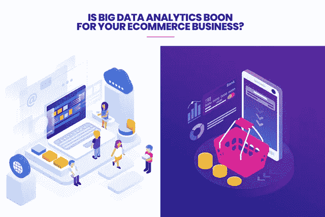

# 大数据分析对您的电子商务业务有益吗？

> 原文：<https://medium.datadriveninvestor.com/is-big-data-analytics-boon-for-your-ecommerce-business-b97c73f449fd?source=collection_archive---------2----------------------->

电子商务行业正以前所未有的速度增长。在其增长过程中，它正在快速创建大量数据，如果不处理这些关键数据，这些数据将毫无用处。但是一旦你驯服了它，你就获得了对电子商务行业所有关键过程的无价的理解和洞察力。大数据是最有价值的工具之一，可以解决这个价值数十亿美元的行业的多个问题，并带来一系列优势。但是，

> 大数据有什么弊端吗？
> 
> 大数据分析在电商行业有什么作用？
> 
> 如何在电子商务网站中实施大数据？

**让我们来看看吧！**

在过去的 4 年里，通过互联网销售的*商品的总收入几乎翻了一番。相比之下，2017 年亚马逊上的活跃用户超过 3 亿。*[***仅 2018 年就有 1.83 亿人访问亚马逊***](https://www.statista.com/statistics/271450/monthly-unique-visitors-to-us-retail-websites/) ***！*** 此外，2018 年同期，有 8700 万人访问了沃尔玛，8600 万人访问了易贝平台。**

> **2018 年第三季度，最受信任的支付网关之一 PayPal 计算出全球注册用户总数约为 2 亿。**

**这些活跃的用户创造了大量的重要信息。更多的用户创造更多的数据。除此之外，在这里你必须做出选择，要么你忽略这些数据并使用盲目的试错法，要么你使用这些信息来推进你的业务方法。由你来决定。但是，如果你选择第二个选项，你就有机会解决一系列与电子商务行业相关的问题。**

** [## 为什么数据将改变投资管理|数据驱动的投资者

### 有人称之为“新石油”虽然它与黑金没有什么相似之处，但它的不断商品化…

www.datadriveninvestor.com](https://www.datadriveninvestor.com/2019/01/25/why-data-will-transform-investment-management/) 

# **2020 年大数据和分析将改变电子商务面貌的 5 种方式**

大分析数据允许电子商务公司执行高性能文本挖掘、数据挖掘、预测分析和各种其他方式来驱动信息，以做出更好的业务决策。这包括将大数据缩小到与您的业务领域最相关的信息，并使用它来做出更重要和更明智的决策。

大数据分析使这成为一种积极主动的方法，改变了业务流程，因为它为您公司的决策者提供了利用实时可用的想法和知识做出决策的能力。借助有效的大数据分析，组织可以增强其现有产品线，创造客户群真正想要的产品，提高客户保留率，并获得超越竞争对手的优势。

除此之外，大数据分析有助于所有领域的公司考虑重要的客户变化，及时响应市场变化以及影响其业务的各种其他指标。使用大数据的公司。

# **大数据和分析将在 2020 年以 5 种方式改变电子商务的面貌:**

## **增强型购物模式分析**

大数据分析是理解客户购物行为和预测模式的最佳方式之一，有助于为您的企业制定更好的战略。客户偏好，或者人们搜索的最受欢迎的产品或品牌，人们多次看到但你没有看到的任何产品，或者订单的增加，在一年中的任何时候客户购物更多，等等。，可以通过大数据分析进行评估。

## **有效的客户服务**

电子商务的成功依赖于有效的客户服务。根据德勤进行的一项调查，72%的公司认为他们可以使用分析报告来改善客户体验。因此，大数据分析将有助于识别和解决关键问题，并增强他们的运营，以便客户享受在线业务，因此您肯定会感受到客户的喜悦，这将是他们成长的一大福音。这是促使企业为其大数据项目雇佣软件开发公司的最重要原因之一。

## **预测未来运营计划**

大数据分析让您更深入地了解公司的整体运营情况。使用电子商务数据有助于库存、管理、供应链、更好的定价策略、预测需求和销售策略。电子商务还有一个额外的优势，就是可以灵活地评估不同平台之间的最佳运营效率。通过许多大数据电子商务案例研究，这方面可能还有学习的空间。

增加对微小时刻的关注——“微小时刻”将是电子商务的最新趋势，也是 2019 年的热门话题。顾客通常希望快速行动——我想知道，我想去，我想买，等等。他们希望智能地在手机上获取他们想要的东西。电子商务零售商利用这些微小的时刻来预测客户趋势和商业模式。智能手机技术在很大程度上有助于分析大数据。

## **网上支付的便捷性**

> 根据一些电子商务分析报告，大约 70%的客户更喜欢移动网络应用而不是跨设备移动应用，50%的电子商务销售是通过移动应用平台进行的。

这只是意味着网上支付对消费者来说应该是安全的。大数据分析有助于识别欺诈相关活动及其运营面临的任何威胁。大数据帮助您在一个中央平台中获得不同的支付选项，方便客户并简化支付。

## **大数据在电子商务中的采用障碍**

一切看起来都很乐观。但是，不要认为大数据是一根魔杖。完全变得完美需要更多的时间。现在，它有一堆可以卡住的障碍。在开始在电子商务中使用大数据分析之前，请确保您知道如何应对这些障碍。以下是当今大数据方法遵循的最重要线索的列表。

## **高期望**

与采用大数据分析相关的第一个问题不是技术问题，而是心理问题。这个系统不会解决你公司的所有问题。它只是给你重要的信息。你应该明智地使用它们。

## **缺乏具体知识**

您应该学习如何使用大数据应用程序以及它们为您提供的信息。首先，你需要知道如何提出正确的问题。其次，你将不得不处理来自大数据分析的数据。设备没有指定变量，都是类似的。在某些情况下，你得到的分析结果看起来像谵妄。例如，一项分析显示，在多纳蒂因穿越地球而有罪的时期，番茄的销量较高。这并不意味着下次你接近这颗彗星时，你应该储存西红柿。

## **安全问题**

这可能是采用大数据的最大障碍。由于大数据了解每个人的一切，它对所有使用互联网的人来说是一个巨大的威胁。大量的个人数据、凭证、私人信息和重要信息都可能被用来对付这些客户。

> 当您决定采用一种方法时，首先需要考虑的是如何保护您的用户及其信息。

## **低估分析**

许多尝试采用大数据分析方法的企业家认为，数据收集是最关键的阶段。他们错了。最重要的是你在处理所有收集的数据和信息后得到的结果。这就是为什么你必须投资更多的分析工具，而不是收集它们。

## **工具差&设备差**

它是关于软件和硬件系统的。这些大量的信息必须存储在某个地方，并以其他方式进行处理。那里的所有行动都需要相当大的能力。幸运的是，现代大数据供应商提供广泛的服务，包括存储、数据收集、处理和分析。

# ***电子商务行业一些著名的大数据软件解决方案***

没有太多流行的软件可以用来为电子商务行业采用大数据。下面，我在这篇文章中列出了五个最受欢迎的大数据软件解决方案。这些软件解决方案中有些非常适合专业人士，有些则适合新手。

## **邓达斯毕**

这是一个完全可定制的基于网络的仪表板，用于电子商务网站的大数据分析。它可以与各种其他工具链接或集成。这个软件提供了一个灵活的定价策略，并为开发者提供了一个 API。

## **Pentaho**

这是一个专业的大数据分析平台，可以根据您的需求进行个性化。它为用户提供免费试用期的软件。

## **甲骨文**

这是一家数据分析领域的知名公司。他们为客户提供现成的大数据解决方案。

## **Cloudera**

这是一个复杂的系统，需要有技术背景才能使用。它是在 Apache 许可下提供给用户的开源软件。

## **Vertica**

这是一个可扩展的简单平台，具有相当好的性能。这种软件解决方案有很多版本:云中的 Vertica 和 Vertica Enterprise。第一个是支持亚马逊 Web 服务和微软 Azure 的云分析平台，第二个是分析数据库。

# **让我们总结一下:**

我希望在这篇博客的帮助下，我能够简要介绍大数据在电子商务行业中的作用。毫无疑问，大数据简化了在线商店管理的许多关键任务，并通过精确跟踪不同国家的用户行为提高了企业的整体利润。

如果你也在寻找一家拥有自己定制的大数据解决方案的电子商务开发公司，你可以从印度各种知名公司雇佣电子商务开发人员。这些公司在开发人员的帮助下，在为其用户创建功能丰富、以结果为导向的大数据解决方案方面拥有丰富的领域专业知识。**