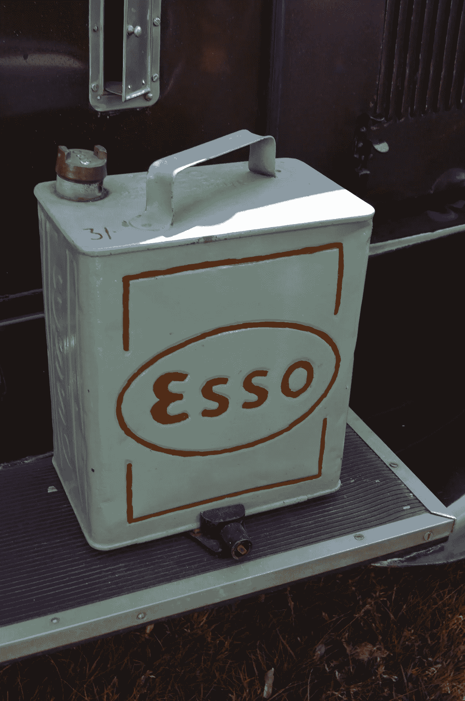
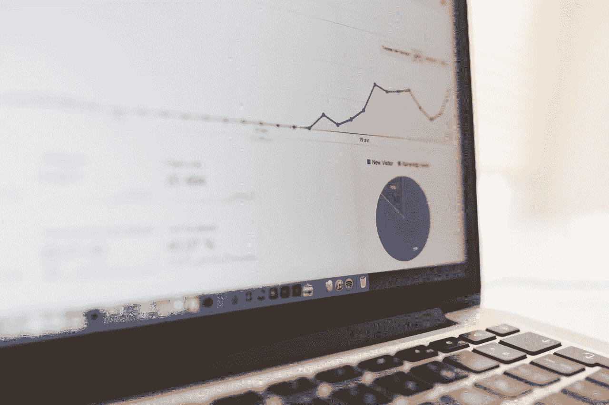
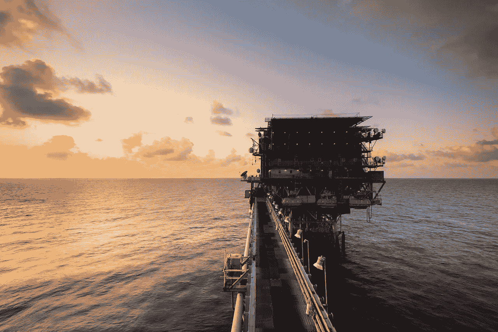

# 大型石油公司正在埃克森美孚死去吗？

> 原文：<https://medium.datadriveninvestor.com/is-big-oil-dying-at-exxon-mobil-58d6b9a30b15?source=collection_archive---------3----------------------->

那些问“大型石油公司正在走向死亡”的人，最近没有检查过埃克森美孚公司(纽约证券交易所代码:XOM)的财务数据。重要的是，尽管有各种大石油公司死亡的谣言，埃克森-美孚公司还是赚了很多钱。

例如，埃克森美孚报告称，2018 年第四季度的总利润为 272.76 亿美元，收入为 718.95 亿美元。相反，埃克森美孚报告 2018 年收入为 2902.17 亿美元，毛利为 1013.77 亿美元。

 [## 为什么数据将改变投资管理——数据驱动的投资者

### 有人称之为“新石油”虽然它与黑金没有什么相似之处，但它的不断商品化…

www.datadriveninvestor.com](https://www.datadriveninvestor.com/2019/01/25/why-data-will-transform-investment-management/) 

因此，埃克森美孚报告 2019 年第四季度净收入为 208.4 亿美元，营业收入为 317.19 亿美元。因此，大石油公司活得好好的，赚了很多钱。

# **大型石油公司在埃克森-美孚公司赚了很多钱**

例如，埃克森美孚报告 2018 年第四季度的运营现金流为 86.07 亿美元，自由现金流为 25.13 亿美元。

然而，埃克森美孚很难保留所有这些钱。例如，埃克森美孚在 2018 年 12 月 31 日的银行存款为 30.42 亿美元。然而，该公司 2018 年的运营费用为 696.58 亿美元。此外，埃克森美孚报告收入成本为 1888.35 亿美元。

因此，石油生意既昂贵又有利可图。值得注意的是，埃克森美孚在提取能源方面的运营成本很高。因此，这种高成本可能是埃克森美孚最大的威胁。

解释一下，开采能源的成本如此之高，埃克森-美孚很难从美元中赚到几分钱。因此，一个很好的例子是，像 **Alphabet(纳斯达克股票代码:GOOG)** 这样的基于数据的公司比埃克森美孚更值得投资。

# 数据真的是 21 世纪的石油吗？

“谁拥有数据，谁就拥有未来”——尤瓦尔·诺亚·哈拉伊。参见 [*21 世纪的教训*](https://www.amazon.com/Lessons-21st-Century-Yuval-Harari/dp/0525512179) 第三章对这一理论的详细解释。

值得注意的是，包括《连线》杂志作家乔里斯·图恩德斯在内的许多观察家宣称“数据是新经济的润滑油。”与此同时，经济学家 [声称](https://www.economist.com/leaders/2017/05/06/the-worlds-most-valuable-resource-is-no-longer-oil-but-data)“世界上最有价值的资源不再是石油，而是数据。”

要澄清的是，数据是我们的文明运作所需要的基本资源。因此，数据对于 21 世纪就像石油对于 20 世纪一样。

# **数据是新的石油吗？**

有趣的是，金融数据表明，其中一些说法比许多人认为的更准确。特别是， **Alphabet(纳斯达克代码:GOOGL)** 的一些数据并不能证明“数据是新的石油”然而，他们显示 Alphabet 正在赚大钱。

例如，Alphabet 2018 年第四季度的收入为 392.8 亿美元，远低于埃克森美孚。然而，谷歌 2018 年第四季度 21.358 美元的毛利虽高，但仍低于埃克森美孚的 272.76 亿美元。

而且，字母表；该公司前身为谷歌，2018 年的毛利为 772.70 亿美元。此外，Alphabet 年的年收入为 1368.198 亿美元。

# **大数据比大石油赚钱多吗？**

另一方面，Alphabet 产生的现金比埃克森美孚更多。例如，Alphabet 记录了 2018 年 194 亿美元的年度自由现金流。

与此同时，埃克森美孚报告 2018 年的年度自由现金流为 164.4 亿美元。相比之下，Alphabet 年的年度运营现金流为 307.2 亿美元。而埃克森美孚公司公布的同一年营业现金流为 360.14 亿美元。

因此，埃克森-美孚通过其钱柜管理更多的现金，但 Alphabet 持有的现金要多得多。具体来说，Alphabet 在 2019 年 12 月 31 日拥有 1091.4 亿美元的现金和短期投资。相反，埃克森美孚在同一天有 30.42 亿美元的现金和短期投资。

因此，Alphabet 远比埃克森-美孚更能赚钱。因此，Alphabet 表示，数据可能是比石油更好的资金来源。

# **数据比石油好吗？**

Alphabet 通过从各种来源收集大量数据来赚钱。

这些来源包括谷歌搜索引擎、广告、YouTube、Waymo 自动驾驶汽车、谷歌快递、谷歌 Play、安卓和谷歌地球等等。Alphabet 通过研发、新产品、广告和基础设施建设将数据货币化。

相比之下，埃克森美孚从几种化石燃料中赚钱；石油和天然气。然而，埃克森美孚需要一个复杂的过程来获取这些燃料。例如，这一过程包括石油和天然气勘探、钻探、基础设施(管道和油轮)、提炼和营销。因此，埃克森-美孚需要花费几美元来制造一美元。

另一方面，数据对 Alphabet 来说是免费或廉价的。例如，Alphabet 从其销售的广告中获取数据。此外，人们付费使用 Waymo One，并从 Google Play 购买应用程序。

因此，Alphabet 为它可以反复使用的资源支付很少或没有支付任何费用。然而，埃克森-美孚公司付费获取它只能使用一次的资源:石油或天然气。

# **Alphabet 的商业模式是否优于埃克森-美孚**

相比之下，Alphabet 可以从搜索结果这样的数据中赚钱几十倍。例如，搜索结果可以出售给广告商、学者、研究人员、制造商、银行家、政府和金融分析师。

此外，Alphabet 的研究人员可以利用这些搜索结果来开发产品和服务。那么 Alphabet 可以通过销售那些产品和服务来赚钱。

比如[way mo](https://marketmadhouse.com/will-waymo-boost-fiat-chrysler-automobiles-fcau/)；前谷歌汽车，收集有关驾驶和汽车运营的数据。Waymo 利用这些数据开发自动驾驶汽车操作系统，并出售给汽车制造商。此外，Waymo 可以开发新的服务，如 [Waymo One](https://medium.com/waymo/waymo-one-the-next-step-on-our-self-driving-journey-6d0c075b0e9b) 拼车计划。

因此，当你对 Alphabet 的某些价值特征进行评估时，它的商业模式要优于埃克森美孚。然而，Alphabet 在一些价值特征上有所欠缺。

# **埃克森美孚(XOM)和 Alphabet 是价值投资吗？**

具体而言，市场先生在 2019 年 4 月 22 日将 Alphabet 的股价大幅高估至每股 1，253.76 美元。

我认为这个价格是不合理的，因为 Alphabet 不支付股息。另一方面，我认为 Alphabet 的股价应该达到 400 或 500 美元，因为它产生了大量现金。

然而，我相信市场先生在同一天正确地将埃克森美孚公司**(纽约证券交易所代码:XOM)** 定价为 81.13 美元。特别是，我认为埃克森美孚的股价是公平的，因为石油巨头无法保留现金。

然而，埃克森美孚有一些吸引人的价值特征。首先，它是在一个不受欢迎的，有争议的，不流行的商业石油。第二，埃克森-美孚生产人人都用的石油产品。第三，埃克森美孚支付股息。

# **埃克森-美孚是好的分红股票吗？**

埃克森美孚公司(纽约证券交易所代码:XOM)支付可观的股息。例如，XOM 所有者于 2019 年 3 月 11 日获得 82₵股息。

此外，根据 Dividend.com 的数据，埃克森美孚的股息已经增长了 36 年。例如，埃克森美孚的股息从 2018 年 3 月的 77₵增长到 2018 年 6 月的 82₵。此外，2019 年 4 月 22 日，埃克森股东的股息收益率为 4.04%，年化股息为 3.28 美元，派息率为 71.3%。

因此，埃克森-美孚是一个很好的股息和收益股。然而，气候变化的现实引发了对石油公司的严重道德担忧。毕竟，有可信的指控称，埃克森公司 40 年前就知道气候变化，但却隐瞒了这一事实。

# 埃克森美孚是一家道德公司吗？

特别是，这些指控表明埃克森美孚的一些高管高度不诚实。然而，埃克森-美孚公司目前的管理层[掌握了](https://corporate.exxonmobil.com/en/Energy-and-environment/Environmental-protection/Climate-change)气候变化的现实，甚至正在游说[征收碳税](https://www.afcd.org/)。

相反，埃克森-美孚公司的碳税提案中有许多自私自利的犬儒主义。*Vox*T8 透露，埃克森-美孚公司希望在未来的气候变化诉讼中获得豁免权，以支持这项税收。注意:这对 XOM 投资者来说是明智之举，因为它保护了埃克森的利润免受未来诉讼的影响。

此外，我认为碳税可以通过增加对石油和天然气的需求来发展埃克森美孚的业务。解释一下，碳税是对化石燃料征收的一种税，从理论上来说，它会阻碍化石燃料的使用。

然而，政府将从碳税中赚更多的钱。因此，碳税将给予政府鼓励或保护化石燃料燃烧的强大动力。因此，碳税可以扩大埃克森美孚的市场。

# **Alphabet 是一家道德公司吗？**

另一方面，在气候变化问题上，大数据的手很不干净。为了解释，他们制造 Alphabet 的产品；数据，来自电。我们通过燃烧化石燃料来发电。

值得注意的是，美国国家医学实验室估计，美国 62.7%的电力来自化石燃料。此外，美国 30.1%的电力来自煤炭。

然而，Alphabet 声称其运行谷歌云的大部分数据来自“可持续来源”，服务器专家 Paul Johnston & Annie Currie [报道](https://docs.google.com/document/d/1eCCb3rgqtQxcRwLdTr0P_hCK_drIZrm1Dpb4dlPeG6M/edit)。不幸的是，Alphabet 使用了“offsets”这意味着如果清洁能源不可用，谷歌云将转而使用脏电。

另一方面，大数据对全球变暖的贡献很小。约翰斯顿[估计](https://medium.com/@PaulDJohnston/what-do-climate-change-data-centres-and-cloud-have-to-do-with-each-other-9b908887c610)数据中心和云基础设施仅占全球温室气体排放量的 2%。因此，大数据在全球变暖中扮演的角色很小。

归根结底，埃克森美孚和 Alphabet 都是有严重道德问题的好公司。然而，我预测 Alphabet 很快会比埃克森-美孚赚得更多，因为我认为数据是 21 世纪的石油。