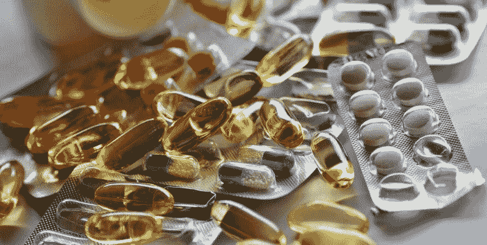
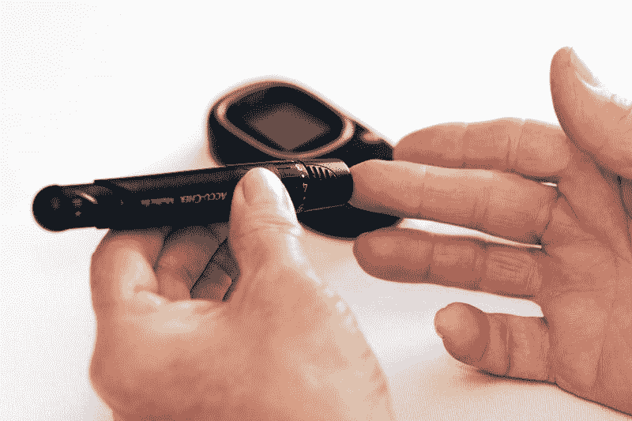
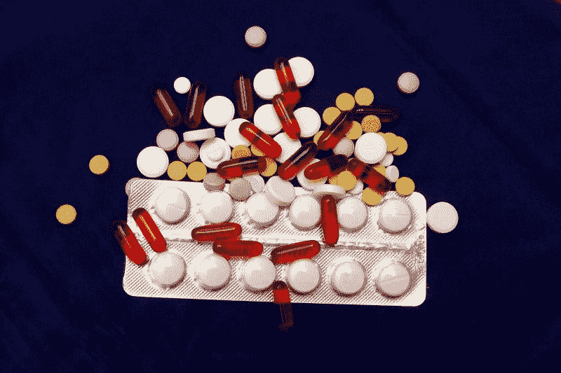
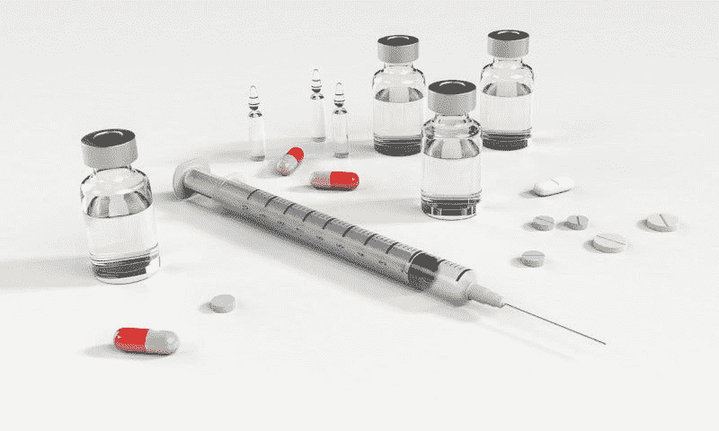
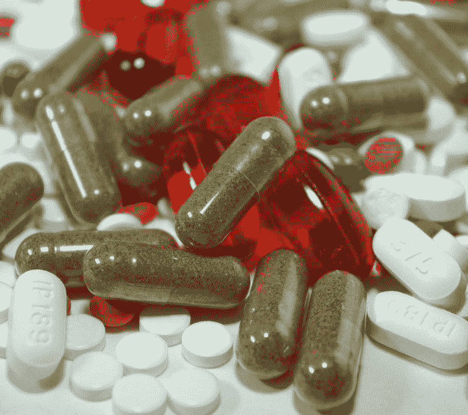
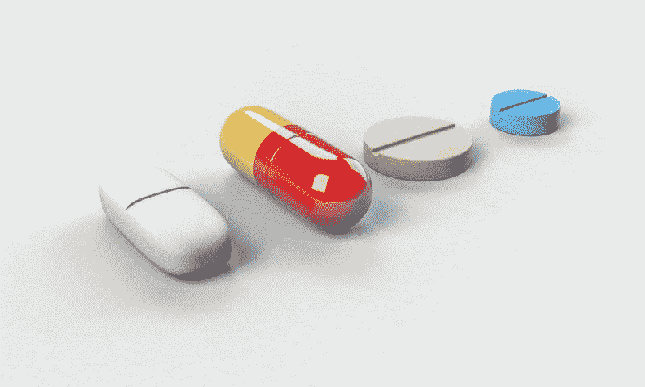

# 大型制药公司在辉瑞赚钱吗？—市场疯人院

> 原文：<https://medium.datadriveninvestor.com/is-big-pharma-making-money-at-pfizer-market-mad-house-5e62ff8917f9?source=collection_archive---------10----------------------->

每当我们看到处方收据时，许多人都会问大型制药公司是否在赚钱。奇怪的是，市场先生不太相信大型制药公司的赚钱能力。

例如，2019 年 8 月 21 日，辉瑞公司(纽约证券交易所:PFE) 的股票交易价格仅为每股 34.96 美元。然而，辉瑞公司从其药品销售中赚了很多钱。

 [## 大笔资金和尖端技术:人工智能/人工智能投资将如何革新医疗保健…

### 在过去几年人工智能(AI)和机器学习(ML)的显著发展中…

www.datadriveninvestor.com](https://www.datadriveninvestor.com/2018/03/22/big-money-and-cutting-edge-technology-how-investment-in-ai-ml-will-revolutionize-the-healthcare-industry/) 

例如，辉瑞公司报告称，2019 年 6 月 30 日的收入为 132.64 亿美元，毛利为 106.88 亿美元。与此同时，辉瑞从这些药物销售中获得了 41.4 亿美元的营业收入和 50.46 亿美元的净收入。

# 辉瑞公司从药品中赚了很多钱

相比之下，辉瑞报告截至 2019 年 6 月 30 日的季度运营现金流为 26.11 亿美元，自由现金流为 20.23 亿美元。此外，辉瑞公司在 2019 年 6 月 30 日报告了 129.12 亿美元的现金和短期投资。

因此，辉瑞公司从它的药物中赚了很多钱。值得注意的是，辉瑞在 2019 年 6 月 30 日报告了 111.28 亿美元的短期投资和 17.84 亿美元的现金及等价物。

因此，辉瑞是一家现金充裕的公司，由于其股价较低，许多人会将其视为价值投资。大型制药公司在美国令人难以置信的不受欢迎只会增加辉瑞的价值。

澄清一下，经典价值投资者寻找不受欢迎和不流行的现金充裕的公司。作为 2019 年的药企，**辉瑞公司(纽约证券交易所代码:PFE)** 两者兼而有之。

# 辉瑞减少业务，召回药品

有趣的是，辉瑞正在经历一段艰难时期，该公司将其消费者健康业务出售给了**葛兰素史克公司**，*凶猛制药* [报道](https://www.fiercepharma.com/pharma/pfizer-s-gsk-consumer-deal-closed-and-upjohn-next-will-its-cash-flow-recover)。此外，辉瑞计划将其 Upjohn 专利药物业务与迈兰公司(纳斯达克股票代码:MYL)合并。

此外，由于可能的微生物和细菌污染，辉瑞公司正在召回 40 毫克(mg)的 RELPAX(氢溴酸依来曲普坦)片剂，新闻稿[称](https://www.fda.gov/safety/recalls-market-withdrawals-safety-alerts/pfizer-inc-issues-voluntary-nationwide-recall-2-lots-relpaxr-eletriptan-hydrobromide-40-mg-tablets)。具体来说，偏头痛治疗药物 RELPAX 的批次 AR5407 和 CD4565 正在被召回。

然而，辉瑞公司仍然是世界上最大的制药商，2018 年占全球药品市场的 5.6%，*制药技术* [估计](https://www.pharmaceutical-technology.com/features/top-pharmaceutical-companies/)。然而，辉瑞是美国第二大制药商，仅次于**强生&强生(纽约证券交易所:JNJ)** 、*市场研究报告*、[预估](https://www.marketresearchreports.com/blog/2019/03/11/us-top-10-pharmaceutical-companies-market-turnover)。

因此，尽管存在种种问题，辉瑞仍是一项价值投资，拥有市场主导地位。辉瑞的市场份额可能会缩水；然而，随着最近的出售和合并。

# 辉瑞是好的分红股吗？

我认为辉瑞是一只很好的分红股票，因为管理层计划在 2019 年 9 月 3 日派发 36₵股息。此外，2₵在 2019 年的股息增长高于 2019 年 12 月的 34₵。

Dividend.com 报告称，辉瑞还向股息投资者提供了 9 年的股息增长，股息收益率为 4.16%，年化股息为 1.44 美元，股息支付率为 48.2%。因此，我认为辉瑞公司为 2019 年 8 月 21 日的低股价 34.94 美元支付了高股息。

辉瑞可能会遇到一点小麻烦，因为在截至 2019 年 6 月的季度，收入增长萎缩了 1.5%。相反，我不认为收入减少会威胁到股息。

# 投资者应该远离大型制药公司吗？

另一方面，在当今的政治环境下，投资者需要对大型制药公司保持警惕。事实上，两党的政治家都在抨击制药商。

值得注意的是，美国联邦政府将要求制药商在未来的电视广告中披露超过 35 美元的药品价格，*纽约时报* [报道](https://www.nytimes.com/2019/05/08/us/politics/drug-prices-tv-advertisements.html)。值得注意的是，这项政策仅涵盖由 Medicare & Medicaid(针对老年人和穷人的联邦健康保险)资助的药物。

单位美国卫生与公众服务部部长亚历克斯·m·阿扎尔二世希望曝光价格标签将迫使公司削减处方药的成本。澄清一下，阿扎尔和他的老板；唐纳德·j·特朗普(R-New York)总统可能认为，揭露高价可以减少对毒品的需求。这种风险对价格几乎没有影响，因为某种形式的健康保险覆盖了大多数美国人。

# 药价高会毁掉辉瑞吗？

高得离谱的药价可能会威胁到辉瑞，因为关于天价处方药的宣传加剧了药品监管的政治压力。

据《纽约时报》 [报道](https://www.nytimes.com/2013/03/19/business/questions-for-public-private-pact-that-led-to-xeljanz.html?module=inline)，辉瑞公司生产的风湿性关节炎和银屑病关节炎药物 Xeljanz(托法替尼)每月售价高达 4840 美元。然而，[的 GoodRx 给 Xeljanz 开出了每月 2200 到 2300 美元的价格，并附有制造商优惠券。](https://www.goodrx.com/xeljanz)

Xeljanz 是有争议的，因为美国政府机构国家卫生研究院(NIH)用税收资助了它的开发。因此，辉瑞将面临更多的政治压力和监管。

# 全民医保对辉瑞来说是威胁还是机遇？

药品价格也会增加全民医保的压力；单一付款人健康保险，在美国。值得注意的是，2019 年 7 月 29 日爱默生民意调查[估计](http://emersonpolling.com/2019/07/29/july-national-poll-biden-extends-support-while-bernie-bounces-back/)，49%的可能民主党初选选民支持声称支持全民医保的总统候选人。

具体来说，20%的民主党人支持美国参议员伯尼·桑德斯(佛蒙特州)，14%的民主党人支持美国参议员利兹·沃伦(马萨诸塞州)，11%的民主党人希望美国参议员卡玛拉·哈里斯(加利福尼亚州)，2%的民主党人支持杨安泽(纽约州)，1%的民主党人支持美国众议员杜尔西·加巴德(夏威夷州)。所有这些候选人都表示支持单一支付者。

此外，2019 年 7 月 *NPR/PBS 新闻一小时/Marist 民意调查* [估计](https://www.npr.org/2019/07/22/743516166/npr-newshour-marist-poll-americans-not-sold-on-trump-or-democrats) 70%的美国人支持全民医保。在这种情况下，我认为努力实施全民医保是可能的，因为它很受欢迎。

不幸的是，全民医保的现实是未知的，所以我们不知道全民医保对辉瑞来说是威胁还是机遇。从积极的一面来看，全民医疗保险计划可以为 3.29093 亿美国人提供医疗保险，从而扩大辉瑞产品的市场。WorldoMeters [估计](https://www.worldometers.info/world-population/us-population/)2019 年美国人口为 3.29093 亿。

从负面来看，全民医保可能会通过降低药品价格来降低辉瑞的利润。因此，辉瑞可能拥有更大的市场，但赚的钱却更少。

归根结底，我认为辉瑞是一只价值和股息都不错的股票，但也伴随着一些严重的风险。因此，我建议长期投资者对辉瑞公司保持警惕。

*原载于 2019 年 8 月 21 日*[*【https://marketmadhouse.com】*](https://marketmadhouse.com/is-big-pharma-making-money-at-pfizer/)*。*