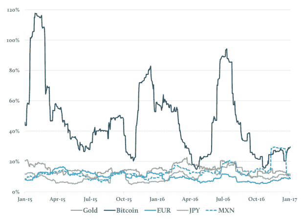

# 比特币是黄金的有效替代品吗？

> 原文：<https://medium.datadriveninvestor.com/is-bitcoin-an-effective-substitute-for-gold-55fb85bb151b?source=collection_archive---------1----------------------->

今年 3 月的第一周，发生了一件大事——比特币的单价首次超过了金价。

尽管这在很大程度上是一个随意发生的事件，因为一个比特币与一金衡盎司黄金没有任何有意义的关系，但它仍然标志着这种新的、备受争议的数字货币在其多事之秋的八年左右的时间里已经走了多远。

当然，自那以后，比特币的价值已经翻了三倍，目前正处于历史高点。越来越多的分析师现在一致预测，这可能只是一轮壮观牛市的开始。与此同时，在过去几年里，黄金的前景要稳定得多。尽管 2017 年迄今为止，这种贵金属的价格上涨了 10%，但比特币的涨幅高达 250%！

鉴于价格路径的明显差异，你可能会从一开始就倾向于认为这两种资产没有什么共同点。

然而，仔细观察，黄金和比特币都有一套独特的属性。事实上，比特币的运作方式与黄金和金本位并无太大不同，这一事实赋予了它对一些加密货币最大支持者的独特吸引力。事实上，他们的相似程度可以通过一些人认为比特币正迅速成为黄金的首选替代品来衡量。虽然一些投资者可能曾经出于特定原因决定投资黄金，但他们现在出于同样的原因选择了比特币。

**那么他们有多像呢？**

首先，它们的供应都是有限的，这意味着与其他资产不同，黄金和比特币都不可能凭空产生。

沃伦·巴菲特曾经说过一句著名的话,即世界上已经埋藏在地下的黄金总量可以装进一个边长只有 67 英尺的立方体。鉴于比特币是一种完全数字化的资产，其全球总量所占空间甚至更小:零！

两者都以自己的方式“开采”——黄金是从地球上开采的，比特币是通过数字手段开采的。

两者都是独立的价值储存手段——也就是说，它们不依赖中央银行或政府来决定它们的价值，不像法定货币可以随意印刷。

因此，黄金和比特币都是极少数分散的货币价值交换方式中的两种，它们都不能简单地被“印刷”。这种独立性使得黄金和比特币都不受通货膨胀的影响。尽管印钞侵蚀了法定货币的价值，但黄金和比特币的供应都无法以同样的方式增加，这使得两种资产都可以无限期地保持其价值。

此外，对这两种资产的巨大需求，似乎是由高度的不确定感所激发的，这种不确定感近来弥漫于整个传统金融市场。这解释了为什么黄金经常被描述为**“安全港”**——与股票和债券等其他资产不相关或负相关。在市场动荡时，当其他资产崩溃时，黄金可能会保持其价值或变得更有价值。

以全球金融危机为例——在 2007 年 6 月至 2009 年 3 月期间，道琼斯指数下跌了近 50%，全球许多其他股票市场也是如此。与此同时，黄金在此期间上涨了约 40%。

或者是英国退出欧盟——去年的公投结果在随后的 24 小时内引发了很多恐慌。英国富时 100 指数下跌 12.5%，标准普尔 500 下跌 3.6%，摩根士丹利资本国际世界指数下跌 4.9%。但黄金是当天为数不多的赢家之一，上涨了约 5%。

同样并非巧合的是，在英国退出欧盟和唐纳德·特朗普当选后市场不确定性充斥的同一年，对黄金支持的 ETF 的需求达到了[有记录以来的第二高年度金额](http://www.gold.org/research/gold-demand-trends/gold-demand-trends-full-year-2016)。

同样，黄金作为避风港的适用性是由其有限的供应量支撑的——它既不能印刷(不像法定货币)也不容易销毁，这使得它的可用性在一定程度上是可靠的——而且它的价值很难降低。因此，在不确定时期，黄金倾向于保值和防范潜在的未来风险。

比特币表面上为投资者提供了同样的保护。虽然没有太多的经验数据来坚定地支持比特币作为避险资产的观点，但其稀缺性使其非常适合这一目的。总共只会挖掘出 2100 万个比特币；之后就不会再有了。事实上，一旦达到这个门槛，比特币将变得比黄金更稀有，因为越来越多的黄色金属将继续从地下提取出来。

**但有区别**

今年早些时候，贵金属托管和投资公司 Goldmoney 比较了两年期内这两种资产以及一些货币的波动性。结果非常清楚:

每日回报的年化标准差，30 天滚动(来源: [Goldmoney](https://www.goldmoney.com/images/media/Files/Insights/Research--BTC-AU-1.pdf) )

比特币的波动性比黄金大几个数量级，其他资产类别也是如此。

比特币经常剧烈的价格波动使其非常不适合作为一种稳定的货币形式。这也使得“价值储存”的论点实际上是多余的。当然，在高风险时期将资金投入比特币可能会保护它免受通货膨胀的影响。但如果比特币本身的价值如此过度不稳定，那又有什么用呢？

此外，这种波动很大程度上可以归因于比特币在其短暂的生命周期中所经历的“考验和磨难”。它已经受到了许多负面新闻的困扰，这些负面新闻支撑了它迄今为止经历的一些繁荣-萧条周期。

在其早期存在期间，它吸引了大量的黑市活动，特别是臭名昭著的以比特币为动力的地下市场*丝绸之路*，该市场不得不在 2013 年 10 月关闭。然后，当时世界上最大的比特币交易所 Mt. Gox 在被黑客入侵价值 4.6 亿美元的数字货币后申请破产并关闭。

这种曲折的历史继续对比特币作为合法投资产品的稳定性和声誉提出重大质疑。虽然它拥有区块链的优势，在交易进行时提供安全保障，但世界上一些最大的交易所[仍然容易受到黑客攻击。](http://www.businessinsider.my/south-korean-bitcoin-exchange-bithumb-hacked-ethereum-2017-7/?r=UK&IR=T)

也就是说，波动性仍然是金融市场的生命线——它使投资者能够在短时间内获得超常的回报。这使得比特币，实际上是大多数其他加密货币，成为如此有吸引力的投资机会。这是支持比特币的关键论点——作为一种有利可图的投资，在过去几年中，比特币的表现明显超过了黄金。事实上，欧元在 2015 年和 2016 年都是全球表现最好的货币(击败了所有流通中的法定货币)，今年也有望成为赢家。

随着我们释放区块链的潜力，情况似乎只会变得更好——一旦这项技术被更多的人、更多的公司、更多的央行和更多的政府发现，对加密货币的需求可能会大幅增长。

然而，黄金很少被证明是一种能在一段时间内带来高回报的投资。最近的一项分析显示，在过去的 40 年里，这种贵金属仅 6 次荣登美国普通资产年度表现榜首。这使其落后于商业房地产(REITs，11 倍)，外国股票市场(9 倍)和美国股票(7 倍)。此外，它至少 9 次表现最差，比任何其他主要资产类别都差。

这强化了一种观点，即很少有投资者选择黄金是希望获得巨额收益；相反，在市场动荡时期，出于安全目的，它受到追捧。另一方面，比特币可以提供理想避险资产*的所有特征，而且*本身就可以被选为一种有吸引力的投资。尽管只有时间能证明一切，但如果这种假设成立，那么投资者从黄金转向比特币的一致行动很可能会发生。

比特币的数字特性也使其相对于黄金成为有利的*。比特币的所有权可以在各方之间直接转移，几乎不需要付出努力和成本。比特币交易是一个简单的过程，只需要交易对手的“地址”和支付微不足道的交易费用。然而，转让黄金所有权需要支付管理费，尤其是在购买黄金支持的交易所交易基金时；而购买实物黄金还需要交付、存放在金库或保险箱中，在许多情况下还需要保险，所有这些都会产生相当大的费用。*

**补充而非替代？**

比特币最近几个月的天文数字上涨是以黄金的*损失*为代价的吗？

有些人认为是这样的。“加密货币正在蚕食黄金需求，”Fundstrat Global Advisors 的[断言](http://www.businessinsider.my/bitcoin-price-ethereum-cannibalizing-gold-2017-7/?r=US&IR=T)。Fundstrat 预计，到 2022 年，比特币价格将飙升至 20，000 美元以上，在最乐观的测试情景下，同期比特币价格可能高达 55，000 美元。显然，如果这种预测是真的，这将使加密货币成为比黄金更有吸引力的前景。想象一下，如果央行很快开始购买比特币，就像他们目前积累黄金储备的方式一样。这肯定会改变游戏规则。

但黄金在投资者的投资组合中还有一席之地吗？绝对的。黄金几乎肯定会在 100 年后出现。这种金属的持久性反映在它在现实世界中的可触摸性上。作为一种货币，它已经存在了 5000 年，而且可能还会继续存在很多年。比特币就不一样了，它在过去 8 年里引发的争议比黄金在过去 50 年里引发的争议还多。

即使在今天的市场上，黄金仍然对市场的不确定性做出反应——例如，特朗普最近关于可能对朝鲜采取军事行动的*【火与怒】*威胁，促使人们大量购买黄金。虽然黄金仍然被认为是不稳定的，但与比特币相比，它的*缺乏*的波动性，这将继续成为那些只想以屡试不爽的方式保持资金价值的人非常追捧的功能。

最终，这归结为投资者的偏好。虽然比特币和黄金确实有很多共同点，但也有明显的差异，这使得一种比另一种更有吸引力。如果你正在寻找一个长期投资的地方，[黄金仍然是一个被证明安全的避风港，其他贵金属如银、铂和钯](https://papers.ssrn.com/sol3/papers.cfm?abstract_id=2906707)也是如此。但如果你的投资视野更为短期，并且/或者你不那么厌恶波动风险，那么比特币或其他一些加密货币很可能是答案。

因此，与其说是替代，也许更准确的描述这种关系的方式是*互补*。由于比特币正在推进大众意识，投资者现在有更广泛的资产可供选择。未来可能会有更多的选择；例如，英国皇家铸币局将很快推出黄金支持的加密货币——一种可交易的数字令牌，代表公司金库中实物黄金的所有权。这种产品将是一种混合解决方案，结合了加密货币*和*黄金的一些最佳特性。我们将不得不等待，看看这在现实世界中会如何发展。

*原载于 2017 年 8 月 23 日 www.datadriveninvestor.com***。**