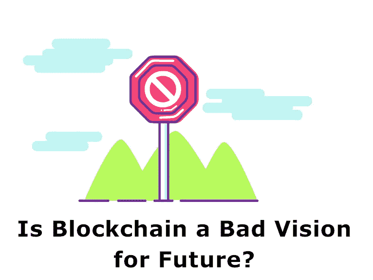

# 区块链是一个糟糕的未来愿景吗？

> 原文：<https://medium.datadriveninvestor.com/is-blockchain-a-bad-vision-for-future-e6bca17ad944?source=collection_archive---------13----------------------->

Blockchain Expert

区块链不仅仅是一个糟糕的创新，而是对未来的可怕愿景。迄今为止，它无法完成选择的原因是，基于信任、标准和机构的框架不可剥夺地优于任何一种不要求受信任方的框架。这是永恒的:无论区块链如何改进，它仍然偏离了轨道。

在场没有一个人有他们需要解决的问题，发现一个容易接近的区块链安排是解决它的最理想的方法，并以这种方式转变成一个区块链奉献者。

 [## 5 行业转型区块链应用|数据驱动投资者

### 除非你一直生活在岩石下，否则我相信你现在已经听说过区块链了。而区块链…

www.datadriveninvestor.com](https://www.datadriveninvestor.com/2019/02/13/5-real-world-blockchain-applications/) 

容忍数字货币作为一种分期付款方式的零售商数量正在减少，其最大的企业支持者如 IBM、纳斯达克、富达、Swift 和沃尔玛已经在媒体上宣传了很长时间，但缺乏真正的推广。事实上，即使是最明白无误的区块链组织，Ripple，也没有在其项目中使用区块链。你没看错:Ripple 组织选择了一种最理想的方法，那就是不利用 Ripple 来跨越宇宙边缘转移现金。

## 区块链是精确的创新，而不是插图

个人对区块链的最终命运提出了各种不可思议的案例——比如，你应该把它用于人工智能，而不是像谷歌和 facebook 那样的行为。这取决于对什么是区块链的误解。区块链不是人类已知的可以“放入”东西的虚无缥缈的东西，它是一种特殊的信息结构:直接交换日志，通常由个人电脑复制，其所有者(称为挖掘者)因记录新的交换而获得报酬。

概括地说，这就是区块链的创新:“我们做一个特别长的小记录分组，每个记录都包含过去文件的散列、一些新信息和对一个棘手数学问题的回答，每个小时在准备好为我们确保并在他们的电脑上存储这些记录的人之间分配一些现金，怎么样？”

## 基于区块链的可靠性逐渐自毁

个人视区块链为“高级体面权杖”——在这个问题上挥一挥区块链，突然间你的信息就合法了。几乎所有个人需要充实的东西，区块链都被认为是一个答案。

事实证明，改变区块链上的信息是很难的，然而，区块链是一个体面的方法来制作有尊严的信息是假的。

事实证明，篡改放在区块链上的信息是很难的，但区块链是一种体面的方法来制作值得信赖的信息是虚假的。

为了理解为什么会出现这种情况，我们从可行的到假设的工作如何。例如，我们来考虑一个广泛提出的区块链用例如何:购买一个有“精彩”合同的电子书。区块链的目标是，你不信任数字书商，他们也不信任你(因为你们只是网上的两个人)，在任何情况下，因为它在区块链，你可以选择信任交易所。

在传统框架中，当你付钱时，你相信你会得到这本书，然而一旦卖家得到你的现金，他们就没有任何动力去传达。你指望 Visa 或亚马逊或政府来让事情变得合理——这是一个多么愚蠢的公式啊！有趣的是，在区块链框架下，通过在精心设计的没有人认领的档案中执行交换作为记录，现金和计算机化项目的交换是编程的、核心的和直接的，没有代理人预期来裁判交换、指导条款并在传输中获取丰厚的利润。这样不是对大家都好吗？

嗯。也许你在编写程序方面特别有天赋，或者拥有实现区块链技术的知识，可以做一名区块链顾问。当作者提出 keen 协议时，你需要一两个小时来确保协议将收回相当于商定成本的现金，并且这本书——而不是其他文件，或者无论如何什么都没有——将真正出现。

数字图书顾问

评估编程很难！历史上最严格审查的精明合同有一个没人发现的小错误——也就是说，直到有人注意到它，并利用它拿走了五千万美元。如果组装 1.5 亿美元风险融资的加密货币粉丝不能恰当地评论该产品，你对自己的数字书评有多大把握？也许你更愿意撰写自己的还价编程合同，以防这个数字图书作者在他们的变体中隐藏了一个递归错误，耗尽你的以太坊钱包中的全部生命储备资金？

这是一种混乱的买书方法！这不是不信任，你信任的是产品(以及你在产品驱动的世界中保护自己的能力)，而不是信任别人。

区块链框架不会神秘地使其中的信息准确或输入信息的个人可靠，它们只会让你有权审查它是否被篡改过。一个在芒果上喷洒杀虫剂的人现在可以进入一个区块链框架，即芒果是天然的。一个堕落的政府可以制定一个区块链框架来统计选票，然后简单地分配额外的一百万份给他们的伙伴。一家风险投资公司的合同是用编程写的，它现在甚至可以错误地分配储备。