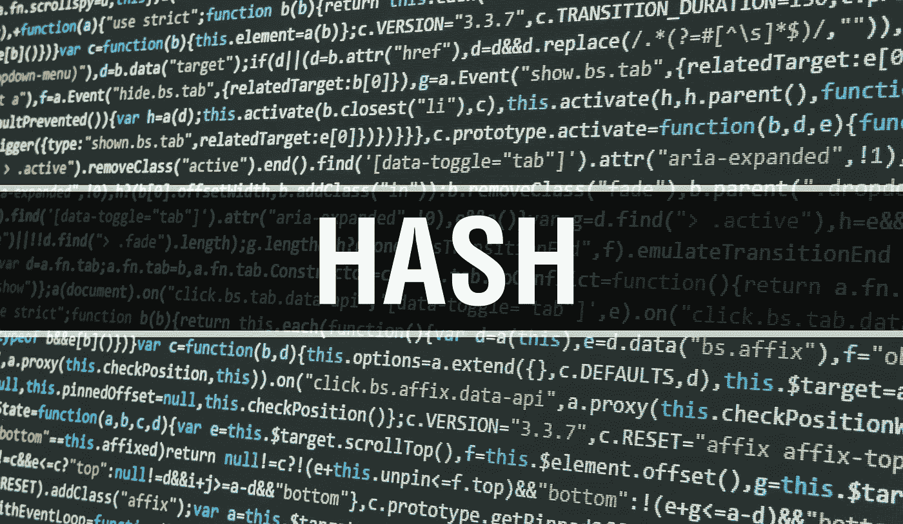
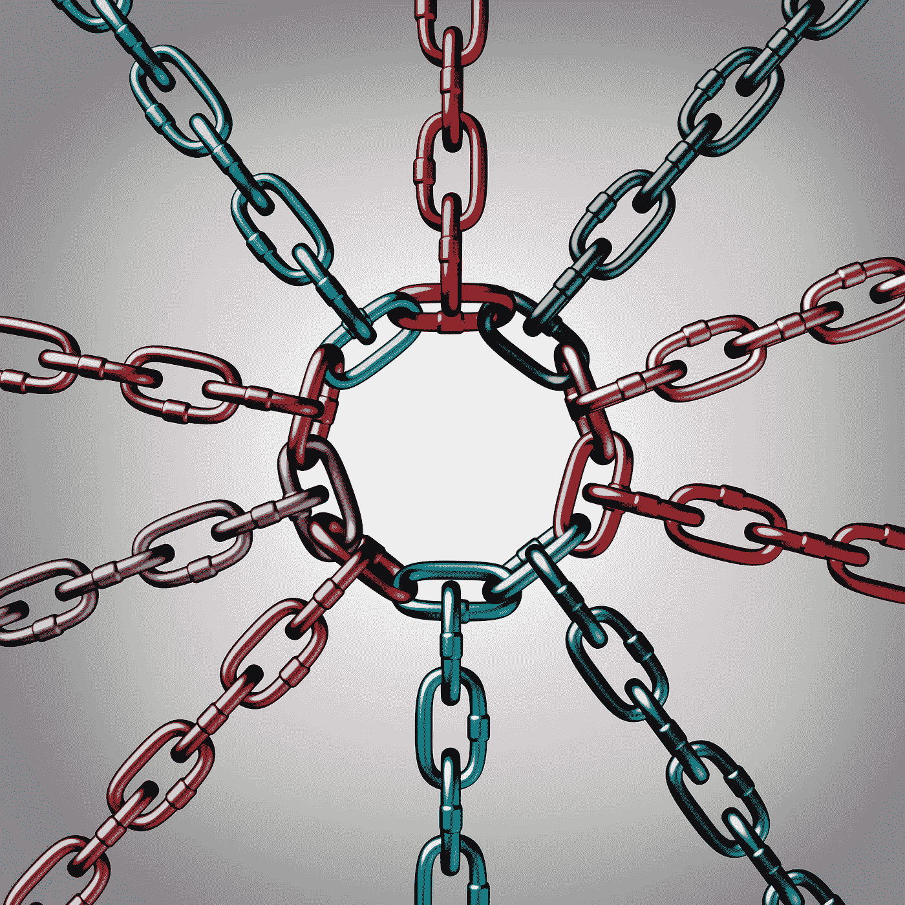

# 区块链复杂吗？区块链是黑魔法吗？

> 原文：<https://medium.datadriveninvestor.com/is-blockchain-complicated-is-blockchain-black-magic-3ad35bc6058e?source=collection_archive---------5----------------------->

Is Blockchain Complicated? Is Blockchain Black Magic?

克拉克第一定律:**任何足够先进的技术**都**与魔法**无法区分。

这是你的答案，区块链不是黑魔法，在区块链基础水平，它没有那么复杂。在基层，区块链是一种新的记录方式。记录被捆绑成块，一个接一个地添加到链中。

At the base level Blockchain is a new way to keep records.

像这样

1.  记录，可以是任何数据集。交易的记录，一些天意的记录，也许是某一特定日期发生的事情的历史。
2.  块是以精确的方式组织在一起的一束记录。
3.  该链是以特定方式链接在一起的所有块。

 [## 2019 年十大区块链课程|数据驱动的投资者

### 渴望在区块链发展吗？你想知道区块链是如何工作的，但不知道在哪里？或者就是太多了…

www.datadriveninvestor.com](https://www.datadriveninvestor.com/2019/03/08/top-10-blockchain-courses/) 

它是这样工作的:

第一步，记录交易。例如，假设戴夫以 100 美元的价格向比尔出售他的两枚硬币。该记录列出了详细信息，包括戴夫和比尔的数字元数据(签名)。

A transaction is recorded.

第二步网络中称为“节点”的计算机检查交易的数字元数据，以确保它是有效的。

The computers in the network called ‘nodes,’ check the digital metadata of the transaction to make sure it is valid.

第三步，将网络接受的记录添加到一个块中。每个块包含一个唯一的代码，称为哈希。它还包括链中前一个块的哈希。

The records that the network accepted are added to a block

第四步将区块添加到区块链中。哈希代码以特定的顺序连接各个块。

The block is added to the Blockchain

简单吧？

哈希码保证记录的安全。

Hash codes keep records safe.

哈希代码是由一个数学函数创建的，该函数获取数字信息并从中生成一串字母和数字。
不管原始文件有多大，哈希函数总是会生成相同长度的代码。对原始输入的任何更改都会生成新的散列。因此，如果有人决定从托尔斯泰 587，287 字的杰作中删除一个逗号，它就会显示出来，因为哈希会发生变化。

例如:

这是一个 SHA-512 散列的测试，一个散列将以句号结尾，一个不会

哈希是

b 802 c 30 ca 4704 a 3a 688 ff 3d aed 359 f 424905 c 356137 bea 8 defae 3 af 550893353714 DD 275 EBA 85537 ce 47 B4 a 134d 90 EB 02293943 BC 2d ACC 2 f 61 EC 20d 857 e 4299d

而对于另一个例子

这是一个 SHA-512 散列的测试，一个散列将以句号结尾，一个不会。

2 BDB 00 F3 BF 390774 BAC ff 6 F3 f 23 BFA 630 C5 EB 0 DAE 3d 543 CB 9246 a 06d 197469 DC E5 BF 2 fc 4 B4 f1 e 81 f 758 a 756 a 58 BC 282 F3 B3 d 1414 a 65783d 0105 f 70 E4 df 6 f 02 b

所以在区块链中，哈希是链接在一起的，所以黑客会发现链中的下一个区块仍然有旧的哈希。因此，要恢复这个链，黑客必须重新计算这个链，然后是下一个链，以此类推。重新计算所有这些散列将需要巨大的计算能力。

hashes are linked together

所以，在区块链中，任何改变的哈希都会打破链，并使链的那个副本无效，这使得链中的数据无法改变。

任何人都可以花费数小时、数天、数天、数月甚至数年来谈论、写作、思考这个新的记录系统是如何工作的。同样，我们可以花几年时间来讨论飞机引擎如何提供影响机翼表面升力的推力。推力通过机翼表面提供升力，这就是我们从凤凰城飞往芝加哥所需要知道的一切。

在区块链基层，这并不复杂。区块链是一种新的记录方式。但它如何工作，并不一定是它是什么。

这种新的记录方式的优点是:

首先，从未有过如此安全的记录保存。记录管理中的安全威胁来自各个方面，从恶意软件和数据泄露到盗窃、火灾或洪水。区块链就不是这样了。

第二，以前从未有过在可见性方面提供选择的记录保存。区块链记录保存有分享这些数据或谁可以看到什么的选项。在理论和实践上，
任何人都可以连接他们的用户界面，访问存储在区块链上的数据；然而，如果数据被加密，只有密钥持有者才能理解数据的内容。

区块链是计算机网络中共享的数据库。

网络不断进行检查，以确保数据库的所有副本都是相同的。

一旦记录添加到链中，就很难改变。

区块链一直被用来支撑比特币等网络货币，但许多其他可能的用途正在出现。

Blockchains have been used to underpin cyber-currencies like bitcoin, but many other possible uses are emerging.

现在真正的问题是，你的组织打算用区块链做什么？

迈克尔·诺埃尔·CBP 认证区块链专家

Michael @ block chain consultants . io