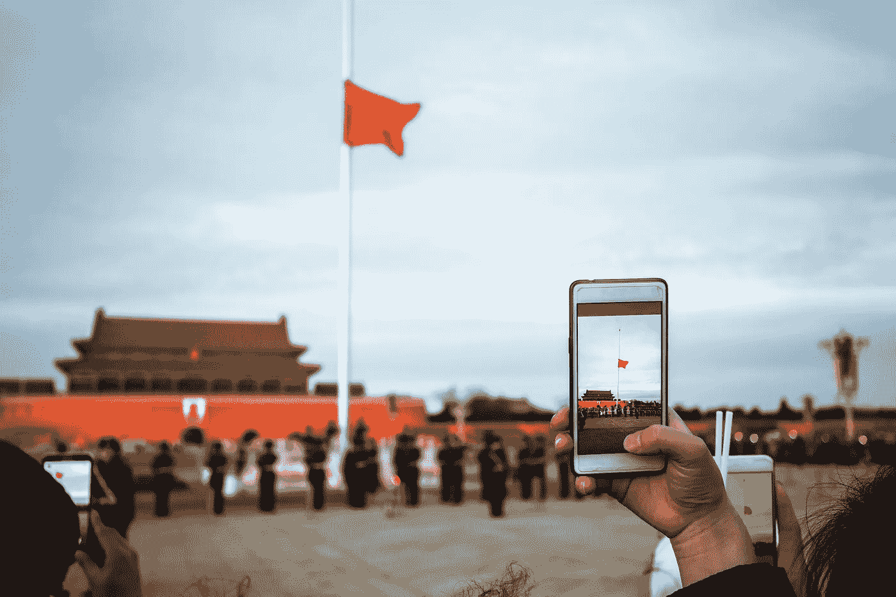

# 中国社会信用体系的区块链替代方案

> 原文：<https://medium.datadriveninvestor.com/is-blockchain-the-secret-to-securing-tomorrows-workforce-e0e33ef69198?source=collection_archive---------1----------------------->

Image: Getty / Social Credit Scoring In Subway

*作者:* [*安德鲁·b·劳普*](https://medium.com/u/d8c8d333927a?source=post_page-----e0e33ef69198--------------------------------)*/*[*@ stem CEO*](https://twitter.com/stemceo)

从不平等到基础设施，利用技术系统可以帮助我们找到解决方案，并与维系我们所有人的资源建立更紧密的联系。然而，一些先进技术的应用可能会产生比它们解决的问题更多的问题。

随着世界开始尝试数字创新，一个这样的计划，[中国的社会信用体系](https://www.businessinsider.com/china-social-credit-system-punishments-and-rewards-explained-2018-4)为其他国家提供了一个警示，告诉他们如何不利用信息来对付其公民。

那么，这种方法是什么，其他国家如何避免这种策略，同时仍然确定一种适当的方法来衡量某人对我们共同社会的潜在贡献？

# 做一个模范公民的压力

可穿戴设备和[物联网](https://www.recode.net/2015/1/15/11557782/a-beginners-guide-to-understanding-the-internet-of-things)技术的创新意味着各种信息源可以更容易地连接和评分。

这使得中国政府能够描绘出一个人在社会中总体可信度的全貌。

Image: Getty / Technological Surveillance System

这项技术利用了一系列难以想象的数据点，正如《对话》[报道的那样,](https://theconversation.com/chinas-social-credit-system-puts-its-people-under-pressure-to-be-model-citizens-89963)市民可能会发现自己因为一些小的违规行为而受到处罚，包括取消餐馆预订和乱穿马路。

该系统将个人和企业被视为社会冒犯的违规行为制成表格，并进行数字化惩罚，因此支持者将社会信用体系视为迫使企业提高透明度以及个人承担更大责任的一种手段。

然而，这种方法可能显得过于惩罚性，更令人担忧的是，由于全球化、大数据的兴起和监控的加强，这在西方世界似乎是可能的。

像这样的系统提供了一些好处，但缺点——侵犯隐私、公开羞辱和黑名单——应该在一个真正自由的社会中引起警惕。

Image: Getty / Photographing Tiananmen Square

# **如何恰当地使用技术来创造一种积极成就的文化**

鼓励公民渴望成为承担责任并表现出共同尊重的支持性社区成员，这在本质上并不是一个邪恶的意图。

那么，其他国家如何在促进进步和前瞻性思维的共享文化的同时避免侵略性的惩罚性行动呢？

**1。将学术和专业成就与信用评分和背景调查分开**

虽然雇主、银行、房东和潜在的商业伙伴当然希望了解包括非法活动或未偿债务在内的整体情况，但这些担忧不应自动掩盖合法的学术和/或专业成就。

将这些不同类别的“成功”和个人责任分开，可以根据需要更有针对性地评估技能或其他领域的可信度。

**2。专注于熟练程度**

通过庆祝成就和成果，我们可以建立一个更强大的努力工作和创新的文化，并开辟进步的渠道。

如果一个有着传统上可被弹劾背景的人——或一个有参与此类活动风险的人——有机会学习和展示他们的先天技能，如果他们觉得自己有权力并有机会这样做，他们就不太可能冒犯或再次冒犯。

此外，更多地关注熟练程度而非欠缺程度，可以让各行各业的雇主在招聘和评估过程中变得更加清晰。

**3。使用区块链微型认证来评估绩效和工作准备情况**

在美国，4400 万人背负着高达 1.4 万亿美元的学生贷款债务。

他们中的许多人用这种持续的经济负担换取了什么？太多时候，对未来复杂的、技术驱动的工作准备不足。

Image: Getty/ Online Credentialing

一种解决方案是为区块链安全的微型证书提供一致、简化的流程，这些微型证书可以存储在个人数字文件夹中，理想情况下可以通过移动设备访问和集成。

接受者可以向雇主出示这些经过验证的、获得的、可持续识别的凭证。

与默认遵循高等教育或职业学校的传统道路相反，学生可以参加更短、更有影响力的课程，为一系列行业和领域传授具体的、可操作的技能。

**4。通过正面强化来游戏化/激励成就**

虽然这一建议可能会让那些认为千禧一代劳动力需要认可的人大跌眼镜，但现实是，建立一种积极强化的文化意味着对底线和工作场所文化都有一系列好处。

为员工提供激励和额外的动力来培养他们的技能也可能有助于避免可怕的工作场所倦怠，这种倦怠会导致经济萧条，压力过大的员工会停滞不前。

公民可以通过获得现有技能的学分以及追求额外的资格来保持在现代劳动力中的竞争力。

例如，语言素养可以作为一个[徽章](https://blog.mozilla.org/blog/2011/09/15/openbadges/)以及高级技术技能来获得，比如网络开发和编码。

通过提供高度具体的区块链担保的微观证书分数(以及可能的通用评分系统)，它可以帮助雇主更恰当地评估绩效，并将人与他们擅长的工作或角色相匹配。

# 前进的道路——一切都是为了平衡和可及性

Image: Getty / Hong Kong Businesswoman Silhouette

虽然中国提出的对公民和企业进行评级的系统可能看起来像是从流行系列 [*黑镜*](https://www.netflix.com/title/70264888) 中直接出来的东西，但监控和收集我们最隐私信息的技术比以往任何时候都更容易获得。

我们不应该被政府和资本对我们个人信息的不断侵犯所分裂，我们应该采取积极的方法来利用技术解决问题，让我们能够交流我们的优势，而不是因为微不足道的缺点而受到惩罚。

增加积极的透明度将带来更大的连通性，我们分享信息的能力是让我们在现代社会中进步到目前地步的原因。

然而，如果没有关心和深谋远虑，我们可能会发现自己被困在一个技术先进、不民主的系统中，这个系统为个人或职业发展提供的空间很小。

如果西方世界要采用一种更专业的体系来“评定”公民，可行的方法将是将上述解决方案与一种手段结合起来，这种手段更加关注社会所有成员的福祉、公民自由/个人自由、受教育机会和发展。

在我们能够建立一个记分牌之前，我们必须尽最大努力用最新的去中心化技术来保护它，授权给那些“闯红灯”的人，并决定追求传统学术轨道和先入为主的社会秩序之外的其他手段。

Image: Getty / Man Crossing The Street With A Red Smartphone

*“区块链是保护未来劳动力的秘密吗？”* [*于 2018 年 3 月 6 日在爱尔兰硅共和国首次亮相*](https://www.siliconrepublic.com/careers/blockchain-workforce-china) *&于 2018 年 11 月 26 日为 Medium 的数据驱动投资者更新。”*

[安德鲁·b·劳普](https://medium.com/u/d8c8d333927a?source=post_page-----e0e33ef69198--------------------------------)是创始人/执行董事 [@stemdotorg](https://twitter.com/stemdotorg) 。*“通过健全的政策&实践使科学、技术、工程和数学(STEM)教育民主化……”*